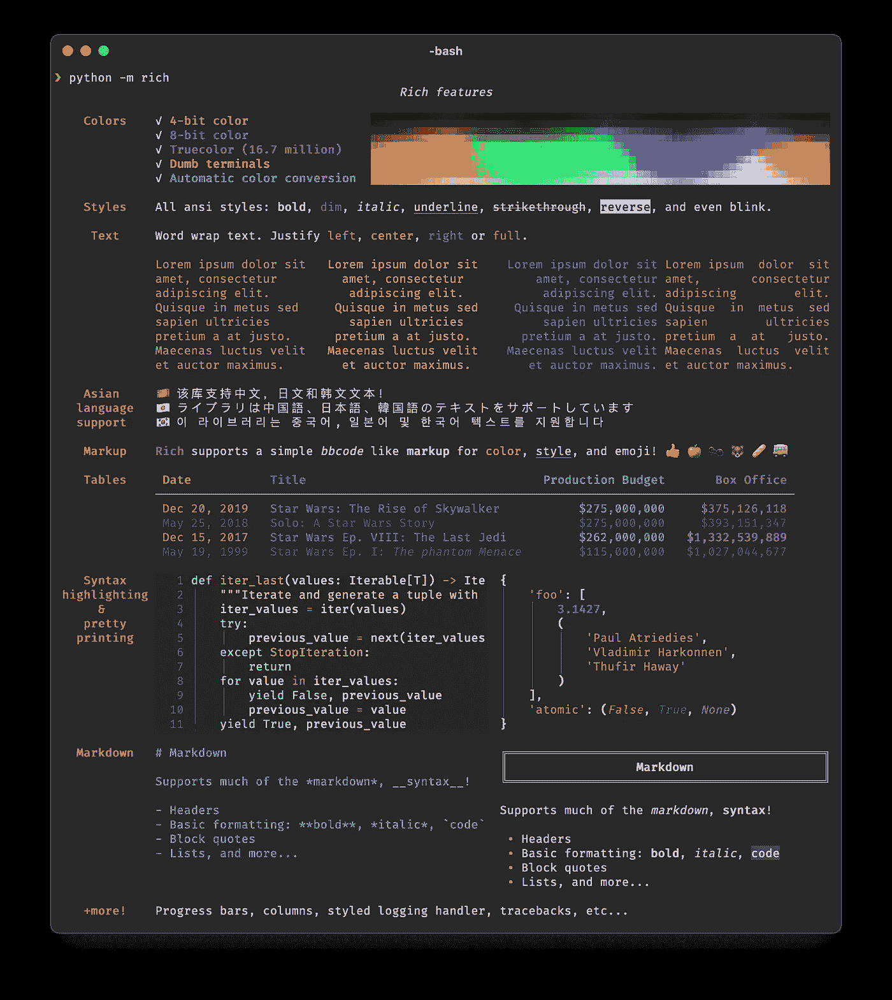

# [CheckThisOut] Python 丰富的终端文本格式化库

> 原文：<https://medium.datadriveninvestor.com/checkthisout-pythons-rich-library-for-terminal-text-formatting-e4da97a0beda?source=collection_archive---------11----------------------->

## Rich 是一个 Python 库，用于终端中丰富的文本和漂亮的格式。

> [丰富的 API](https://rich.readthedocs.io/en/latest/) 使得为终端输出添加颜色和样式变得容易。Rich 还可以呈现漂亮的表格、进度条、降价、语法高亮源代码、回溯等等——开箱即用。
> -富库的 [Github 页面](https://github.com/willmcgugan/rich)

相当光滑！有时候，从你的应用程序后退一步，关注它们的**风格**是很有用的。丰富的库看起来是一个很好的方法。

No more boring terminal log text! [[source](https://github.com/willmcgugan/rich)]

最重要的是，他们在 readthedocs 文档页面中创建了大量的细节。任何你想做的事情，你都可以通过这几页看看是否可行。

# 保持最新状态

用 [LifeWithData](https://lifewithdata.org/) 博客、[机器学习最新时事通讯](https://www.lifewithdata.org/newsletter)、媒体上的[文章](https://medium.com/@anthonyagnone)和 [Twitter](https://twitter.com/@anthonyagnone) 让自己保持更新。

# 不断学习

 [## 使用 Python |数据驱动投资者的名称匹配技术

### 我们确实面临很多情况，我们必须匹配一个有很多变体的单词。这可能是因为错别字…

www.datadriveninvestor.com](https://www.datadriveninvestor.com/2020/12/07/name-matching-techniques-with-python/)  [## 在远程优先的数据工作人员中生存和发展的技巧

### 提示:它不仅仅是 Zoom 和 Github

towardsdatascience.com](https://towardsdatascience.com/tips-to-survive-and-thrive-in-the-remote-first-data-workforce-34944abddd29)  [## 亚马逊想让你免费成为一名人工智能从业者

### 这家科技巨头计划通过公开其长期的内部材料来提高 ML 的熟练度

towardsdatascience.com](https://towardsdatascience.com/amazon-wants-to-make-you-an-ml-practitioner-for-free-552c46cea9ba)  [## 用 fast.ai 和 Deepnote 打击旧金山犯罪

### 有了正确的 ML 框架和笔记本平台，您就在快车道上了

towardsdatascience.com](https://towardsdatascience.com/fight-san-francisco-crime-with-fast-ai-and-deepnote-6db2b96d2a83) 

**获取专家观点—** [**订阅 DDI 英特尔**](https://datadriveninvestor.com/ddi-intel)