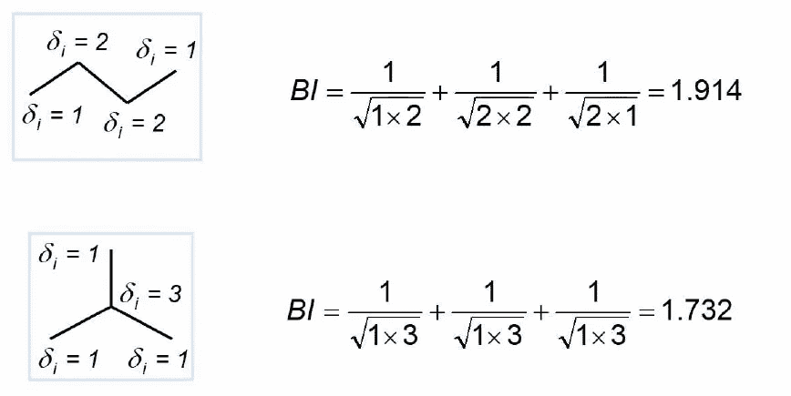

# 化学:描述符和基于描述符的相似性

> 原文：<https://medium.datadriveninvestor.com/chem-descriptors-and-descriptor-based-similarity-5a0c39c11c7f?source=collection_archive---------17----------------------->

如果你想作为一名数据科学家处理化学物质，你必须知道什么是描述符。数据科学家熟悉数值和向量空间，因为他们有很多方法来解决数据科学领域的各种问题。我们能把化学物质转化成数值并进行计算吗？是的，我们可以。这就是为什么我们需要描述符。

# 描述符

定义:分子描述符是应用于表征分子性质的分子表示的数学函数。有三种类型的描述符，1D，2D 和三维。1D 是基于组成公式。2D 是基于分子图的。3D 是基于 3D 构象的。它们给出了一个数值。

1D 描述符可以解释重原子的数量和碳原子的数量，但它不能解释 2D 或 3D 相关的信息，例如，芳香环的数量，双键的数量和分子表面积。如果我们有 C7H12 作为组成公式，那么 1D 描述符将是碳数或分子量，7 和 96。

3D 描述符解释了多种 3D 构型。它可以从实验或算法中推导出来。计算起来比较贵。例如，表面或体积表示、药效基因键和 3D 片段筛选。

2D 描述符是最流行的描述符，因为它具有中等计算复杂度的大量信息。它包含简单计数、物理化学性质、拓扑指数和形状指数。2D 描述符在化学信息学中非常重要。因此，我将详细阐述这一点。

## 简单计数

我在这里只列出常用的简单计数:

*   氢键供体的数量
*   氢键受体的数量
*   可旋转债券的数量
*   芳香环的数量

## 物理化学性质

疏水性是这一类中最常见的。可以用实验和算法计算。可以用分配系数来表示。

**实验**

我们将正辛醇和水与化合物 M 混合，找到平衡并计算每层 M 的浓度。

**算法估算**

我们可以用算法计算分配系数。你可以用基于碎片的计算来计算，它必须有实验结果或基于原子的估计，它计算单个原子的贡献。基于其环境，原子对分配系数有不同的贡献。我们还需要单个原子的不同杂化状态和环境。

 [## 一瞬间学会数据科学！？数据驱动的投资者

### 在我之前的职业生涯中，我是一名训练有素的古典钢琴家。还记得那些声称你可以…

www.datadriveninvestor.com](https://www.datadriveninvestor.com/2020/07/23/learn-data-science-in-a-flash/) 

## 拓扑指数

它用一个数值概括了 2D 图的表示。它可以表示大小、分支程度和整体形状。在这篇文章中，我将介绍三个例子，维纳指数，分支指数和卡帕形状指数。

**维纳指数**

它计算原子之间的每一个距离，并将其相加。这是什么意思？意思是，如果你有链形状，那么它会给出一个大的数字，如果你有一个复杂的形状，那么它会给出一个小的数字。

**分枝指数**

它计算节点的度数，并基于该度数计算结合连接性值。举个例子，

它类似于维纳指数。它赋予链状化合物更高的价值。

**卡帕形状指数**

它是最流行的拓扑指数。它使用极端情况来计算指数。

举个例子，

意思是化合物的密度。如果化合物是稠密的，那么它给出一个大的值。它使用分子的密度，而不是复杂性。

# 数字分子表示

现在，我们计算了每个化合物的描述符，我们可以构建描述符空间来投影我们的化合物。我们可以根据分子在描述符空间中的位置，对它们进行比较。

## 描述符值分布分析

价值观的传播和其他空间一样非常重要。因此，我们需要以某种方式来计算传播的程度。我们可以使用统计值、平均值、方差和标准差。

我们可以用一个值，变异系数，来总结化合物的扩散程度。

如果标准差大，那么 CV 也给出大值。意味着化合物扩散了。我们用描述符的平均值来划分它，以标准化该值。

下面一个是比较扩散的，看 CV 的绝对值差异就很容易注意到。但是，单位各不相同。因此，我们无法注意到图形本身的差异。当我们试图使用机器学习工具或统计工具时，它会产生一个贡献问题。我们需要通过单位方差标度来标准化这些值。

这是一个典型的例子来说明标准化的重要性。左边的由描述符 2 支配，但是右边的分布良好。

## 相关分析

这是一个线性代数问题。如果你有一个依赖的基础，它导致一个问题计算逆矩阵或其他方法。因此，我们需要避免描述符的相关性，因为信息是重叠的。

**这篇文章发表于 2020 年 9 月 30 日**

## 访问专家视图— [订阅 DDI 英特尔](https://datadriveninvestor.com/ddi-intel)