# 化学:基于分子图的相似性

> 原文：<https://medium.datadriveninvestor.com/chem-molecular-graph-based-similarity-fc37572fc81?source=collection_archive---------7----------------------->

这篇文章将解释如何计算基于分子图的相似性来寻找子图/子结构。有许多算法可以达到这个目的，但我们将通过 3 个算法。

# 子图/子结构搜索

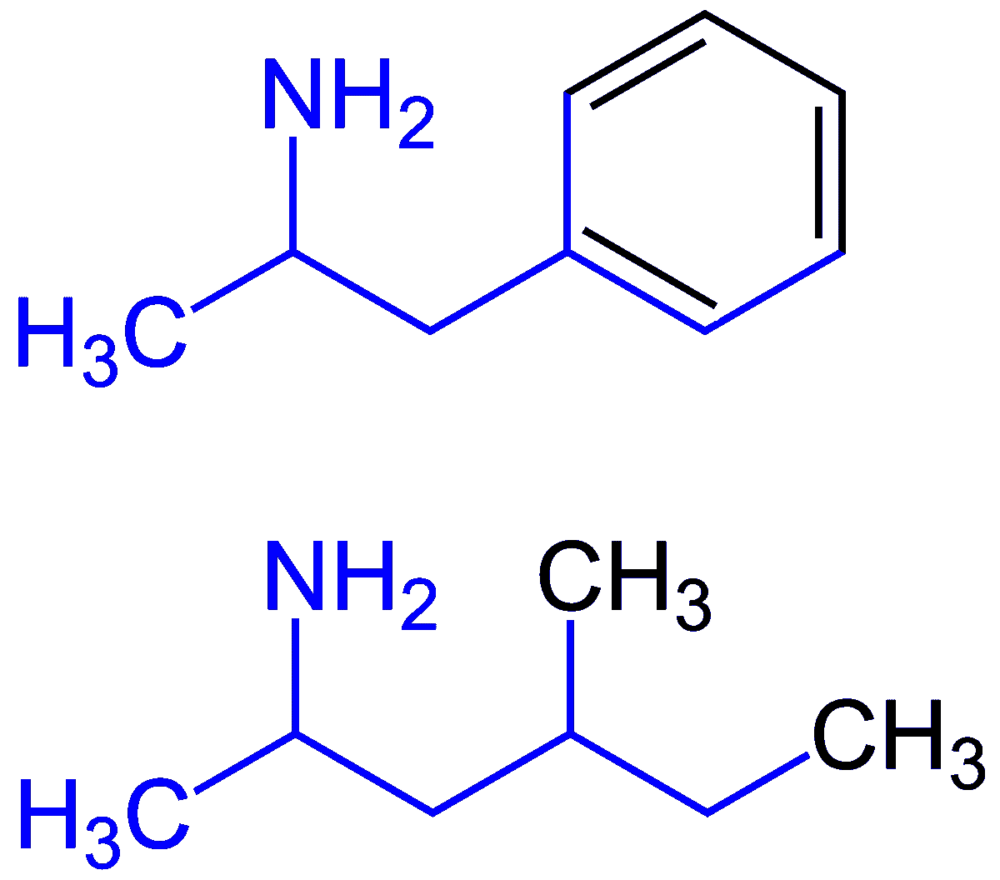

我们需要定义什么是子图，什么是子图搜索。首先，子图是化学结构的一部分。可以用上图查一下。我们想寻找每一种具有完全相同结构的化学物质。我们有一个复合数据库和一个小的查询片段(子结构)。

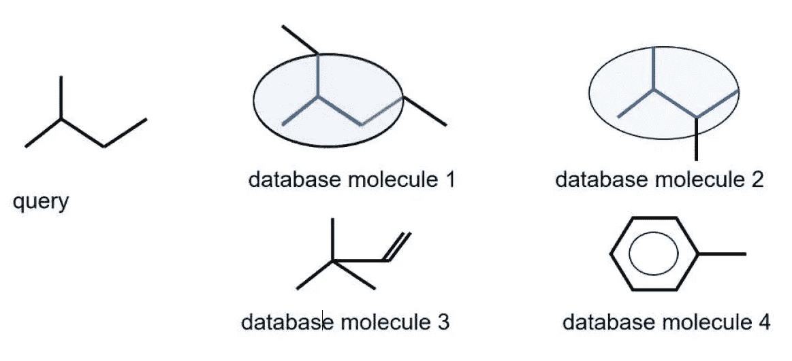

这是一个查询示例。我们对算法进行查询，算法通过数据库找到具有完全相同子结构的化学物质。

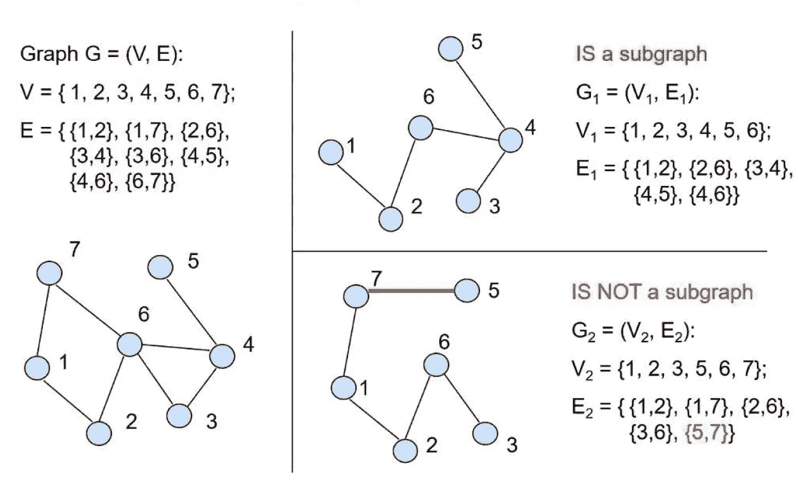

这是一个子图的例子。如果子图有不同的边，它就不再是子图了。每个节点和边都必须在图中。

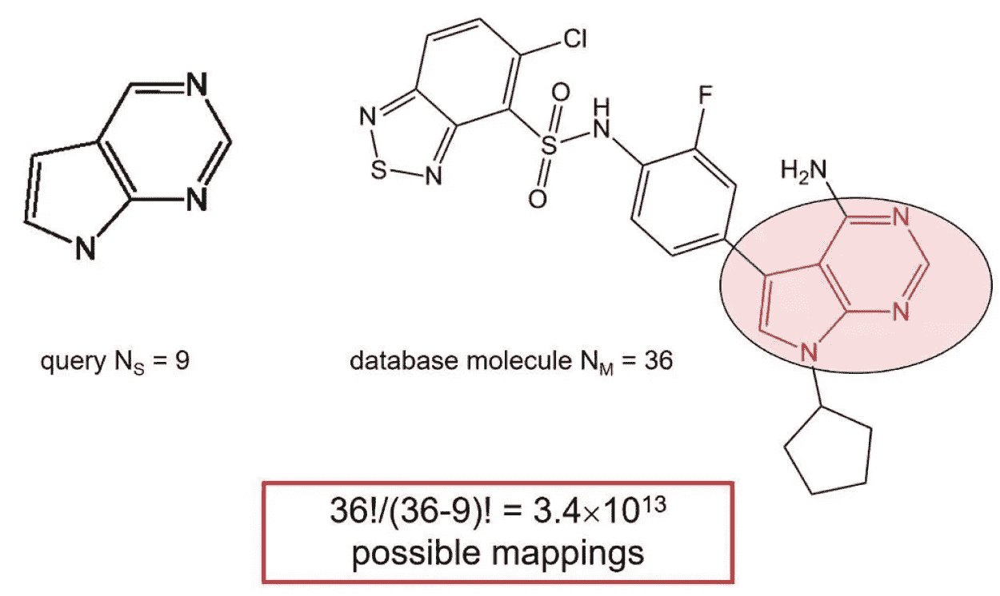

Brute Force Approach

不幸的是，子图搜索是一个 NP 完全问题，因为它随着图节点数的增加而导致时间呈指数增长。因此，我们应该使用效率更高的启发式方法。

 [## 算法是如何将个人和社区置于危险之中的？数据驱动的投资者

### 尽管数学方程看起来遥远而冷漠，但它们通常也与可靠的硬科学联系在一起…

www.datadriveninvestor.com](https://www.datadriveninvestor.com/2020/05/18/how-could-algorithms-put-individuals-and-communities-in-harms-way/) 

## 回溯法

它基于一个连接表，我们需要为一个查询结构和数据库分子准备好每个连接表。启发式算法是回溯法，它缩小了子图同构问题的搜索空间。

1.  **初始化**

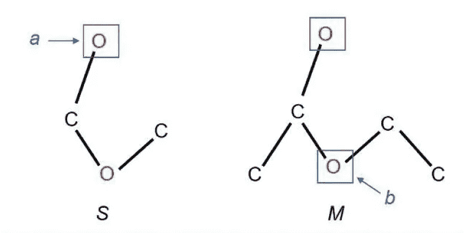

我们在查询中任意选择起始原子，通常选择杂原子，因为它出现的频率比碳低。然后，我们将选择的原子与数据库化合物进行匹配。

**2。递归/回溯**

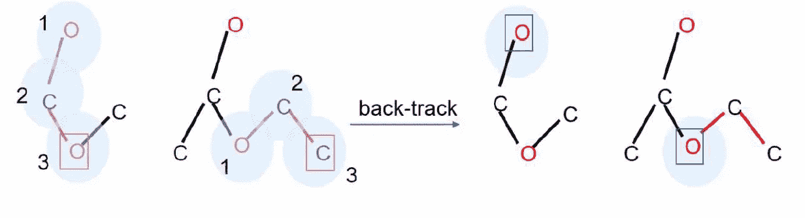

我们通过连接表搜索邻近的原子。如果我们在搜索过程中遇到不同的原子，它使用回溯试探法，返回到上一步并搜索其他分支。如果没有选择，那么我们改变起点。综上所述，原子 A 和原子 b 被认为是匹配的，当且仅当对于分子 A 中的每个元素，在分子 b 中存在匹配，如果条件不匹配，那么它使用回溯。

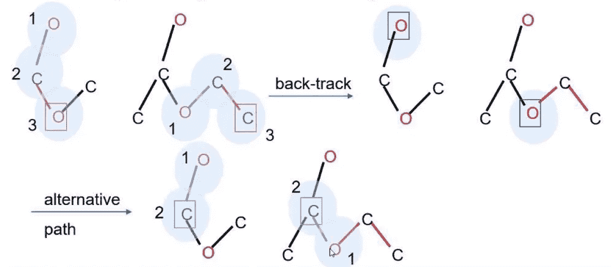

这是一个完整的算法。

**3。终止**

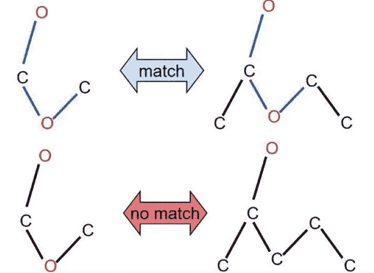

它以完全匹配或失败报告终止算法。

## 乌尔曼算法

这种算法是基于邻接矩阵的，我们需要每个化合物都有邻接矩阵。该算法通过构造匹配矩阵来搜索子结构。它从匹配矩阵中识别查询结构到数据库复合的映射。

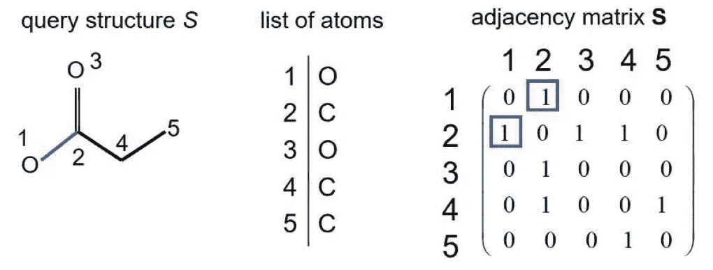

Adjacency Matrix

这是邻接矩阵。行和列对应于原子。如果它们彼此相连，那么矩阵中的相应位置被设置为 1 否则为 0。因此，邻接矩阵总是对称的。

它建立匹配矩阵，这是邻接矩阵。它的行和列将分别是查询复合节点和数据库复合节点。因此，我们可以搜索子结构。目标匹配矩阵是每行恰好有一个“1”，每列最多有一个“1”。当满足此条件时，数据库组合完全包含查询组合。

它也使用试探法。它考虑本地信息。查询中的原子不允许与数据库复合中的原子匹配，除非每个邻居也匹配。这是邻接矩阵中回溯的新版本。

1.  **初始化**

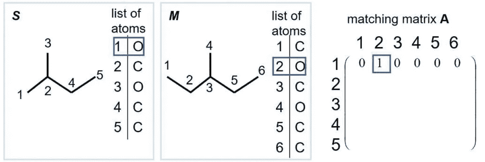

第一个原子对应于查询复合中的第一行。它在数据库化合物中找到第一个可能的匹配。我们将相应的匹配矩阵位置更改为 1。

**2。启发式/细化**

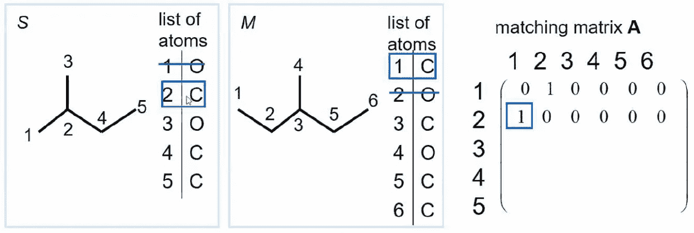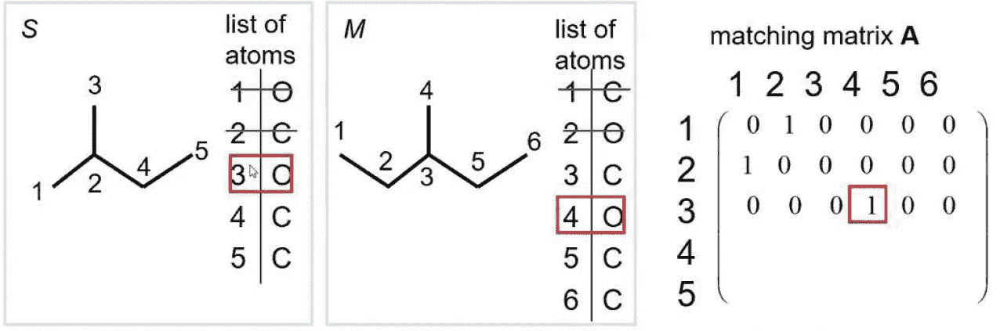

它显示了过程和回溯。查询组合中的 3 个位置与数据库组合中的 3 个位置不匹配。因此，它回到另一个分支。但是，我们不能匹配这个，因为 S 中 3 的邻居是 2，M 中 4 的邻居是 3。因此，我们需要匹配 S 中的 2 和 M 中的 3，但事实并非如此。我们进一步追溯。

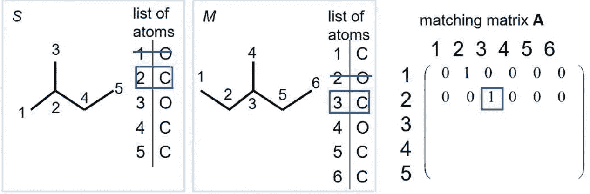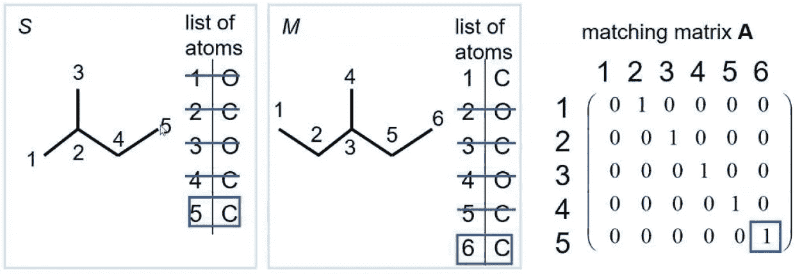

我们在 S 中选择 2，在 M 中选择 1，然后我们返回，在 S 中选择 2，在 M 中选择 3，我们可以用新路径完成算法。

**3。终止**

它循环进行，直到找到完全匹配或者所有可能的匹配矩阵都被测试失败。

## 计算机科学硕士

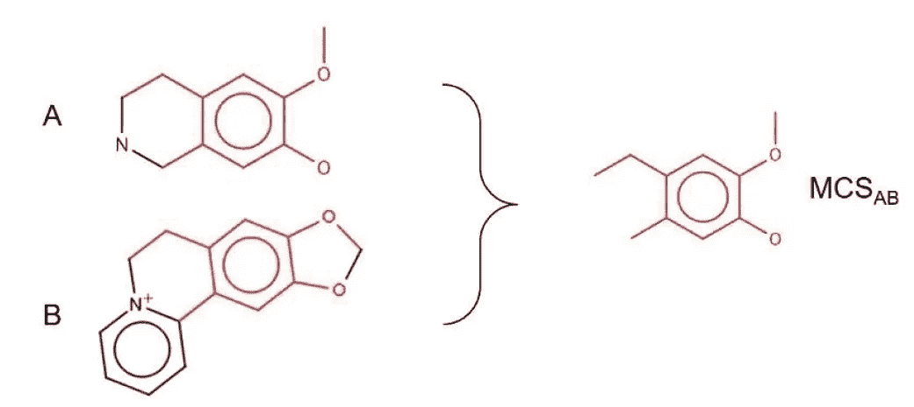

我们要做的是找到包含查询复合的复合。现在，我们将查询改为查找两个化合物之间的 MCS。MCS 是由两种结构共享的最大的一组原子。

这也是一个 NP 完全问题。因此，我们需要启发式来解决这个问题。

## 麦格雷戈算法

1.  **初始化**

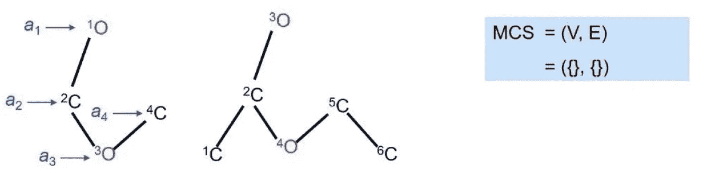

我们构建 MCS 图，如果它找到比前一个更大的，我们就更新 MCS 图。起点可以在任何地方。

**2。递归/回溯**

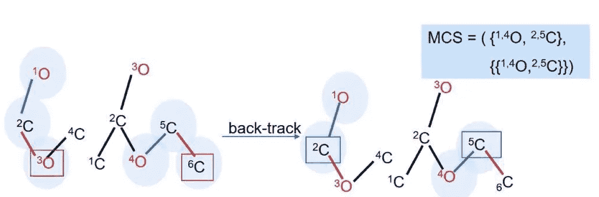

递归部分与回溯方法相同。

**3。终止**

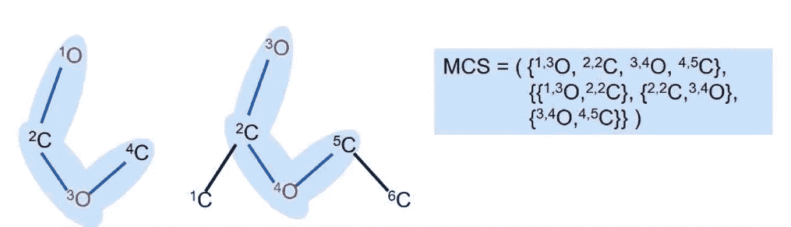

当一个给定的结构完全包含在另一个结构中，并且探索了所有回溯路径时，它终止。它返回当前存储的 MCS。

**这篇文章发表于 2020 年 9 月 29 日**

## 访问专家视图— [订阅 DDI 英特尔](https://datadriveninvestor.com/ddi-intel)