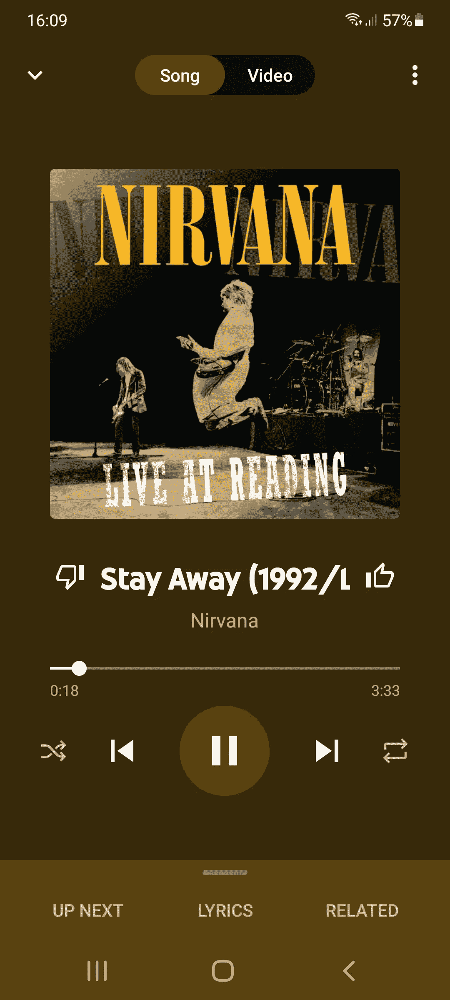
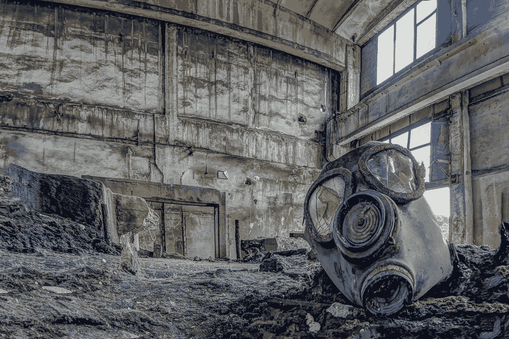
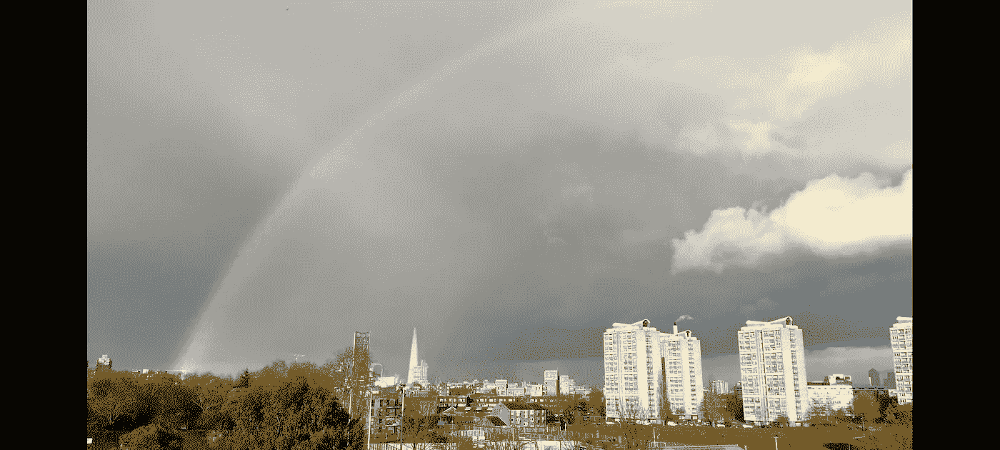

# 化学物质让你快乐，但是你做错了

> 原文：<https://medium.datadriveninvestor.com/chemicals-make-you-happy-but-youre-doing-it-wrong-333d826e5ce?source=collection_archive---------28----------------------->

## 为什么你完美的生活会让你感到空虚

Photograph by Nasar Karim

## 宁死不酷？

90 年代初，我的青少年生活开始蓬勃发展，一切似乎都很完美。我的日子就像一个永恒的、乌托邦式的夏天，尽管经常下雨。几十年后，天气变冷了，我是门的忠实粉丝。我听的音乐都不酷，所以我一直在磨损涅槃乐队前两张专辑《漂白剂》和《别管它》的磁带。华盛顿精英们新生的、无节制的愤怒和冷漠尚未积聚起足够的势头，让创始成员柯特·科本和克里斯特·诺沃塞克，以及他们的鼓手大卫·格鲁，成为这个星球上最大的另类艺术家，以及“杀死摇滚”的三重奏那时候，他们还不酷。

几年后，柯特·科本去世了。像吉姆·莫里森和其他几位艺术家一样，他加入了 27 俱乐部。科本的自杀可能是由他的歌词预测的，在歌曲《远离》中唱着“我宁愿死也不要酷，我不知道为什么”。更有可能的是，看似有先见之明的诗句可能只是一个方便的押韵。不管怎样，当他开枪自杀的时候，科本可能是世界上最酷的音乐家了。对于歌曲《风信子之家》，莫里森的歌词似乎也与他即将到来的死亡有关；“我看到浴室没人，我觉得有人在附近，我确定有人在跟踪我。”在《门》的最后一张专辑《在一起》发行几个月后，莫里森死在了他的浴缸里。

莫里森的死亡没有被记录为自杀，但他猖獗的药物滥用和酗酒几乎肯定对他的早期死亡起到了一定的作用。在接受《卫报》采访时，乐队的鼓手约翰·丹斯莫尔承认他生活在对这位歌手的恐惧中。登斯莫尔把莫里森描述成一个疯子和精神病患者。当被问及是否恨他时，登斯摩尔回答道:“不，我恨他的自我毁灭。他是一名神风敢死队员，27 岁就出道了。我能说什么呢？”

科本和莫里森拥有一切；名誉、财富和巨大的成功，但两者都非常不快乐。他们拥有许多人所谓的完美生活，但他们的内心生活空虚而痛苦。莫里森的乐队成员想知道他对酒精和毒品的渴望多久会导致他的死亡，而科本则在与海洛因成瘾和抑郁症作斗争。过去 50 年中最伟大的两位艺术家，都死于追逐另一次高潮或另一次昏迷的快感。他们用大剂量的化学物质缓和了自我毁灭的道路。他们的例子可以说明这样一个事实:拥有一切，拥有所谓的“完美生活”，会让我们非常非常不快乐。怎么会这样呢？这一切都与化学物质有关，特别是我们大脑中的化学物质。

## 你头脑中的化学战

Photo by [hp koch](https://unsplash.com/@iggii?utm_source=medium&utm_medium=referral) on [Unsplash](https://unsplash.com?utm_source=medium&utm_medium=referral)

要理解幸福，我们也必须理解快乐。许多人认为幸福和快乐是一回事，幸福的生活是充满快乐的生活。但是神经科学告诉我们，那些人是错的。幸福和快乐会在大脑中释放非常不同的化学物质。快乐导致血清素的释放，愉悦导致多巴胺的释放。记住这一点的一个简便方法是听到“毒品”这个词，并把它与“快乐”联系起来。这很合适，因为很多人从吸毒中找到乐趣，也因为多巴胺的反复释放会导致成瘾。关于这整个解释，真正重要的是多巴胺和血清素是对立的，它们真的一点也不和谐。

快乐，被定义为多巴胺的释放，比以往任何时候都更容易实现。快乐是短暂的，往往是瞬间的。用药物改变你的状态，做爱，购物，吃饭，当你得到另一个喜欢的时候听到你的手机震动；所有这些都会带来快乐。对于那些“成功”的人来说，他们完美、著名、富有的生活充满了快乐，他们一定在多巴胺中畅游。

快乐的问题在于它会直接攻击你快乐的能力。如果你获得了足够的快乐，你可能会造成严重的伤害，并有可能以抑郁告终，这与快乐截然相反。再加上挥之不去的上瘾前景，你会开始看到滑坡。当我们了解多巴胺的作用时，我们就可以开始理解为什么像科本和莫里森这样的人会如此痛苦地不快乐(无论他们的现代同行是谁)。

多巴胺和血清素都是由大脑产生的，用于脑细胞之间的交流。它们是神经递质。多巴胺能刺激脑细胞，无疑对强化确保我们物种延续的行为至关重要，比如进食和生育。然而，我们现在是地球上的主导物种，多巴胺释放得太频繁了。当脑细胞过于频繁和过度兴奋时，它们就开始死亡。为了保护自己，过度兴奋的脑细胞会减少可供刺激的受体数量。因此，下次你想体验同样程度的快乐时，你需要更大剂量的多巴胺。用毒品术语来说，同样的兴奋需要更大的打击。你的大脑告诉你，你越来越需要它。当一个大的打击不再产生一个高，你已经达到了容忍的水平。下一个阶段是上瘾，这时脑细胞开始死亡。

人们可能会对快乐上瘾(想想性瘾、毒瘾、酒瘾、购物瘾等)，脑细胞减少神经递质受体的过程被称为下调。这种机制解释了为什么极度的快乐都会导致上瘾。这也解释了为什么所有免费获得的快乐最终会失去作用，让你感到不满足和空虚。

血清素的作用与多巴胺相反。“快乐神经递质”不会刺激神经元，而是抑制它们，产生一种满足感。唯一能导致大脑下调血清素受体的是多巴胺。这意味着你体验的快乐越多，你能感受到的快乐就越少。

## **追逐错误的彩虹**

Photograph by Nasar Karim

神经科学告诉我们，幸福只有一个确定的指标；神经递质血清素。引发血清素的因素是多种多样的，而且通常是特殊的。它们可能包括与他人的联系、精神、目标、成就、学习和信仰。如果你的大脑充满了多巴胺，无论什么让你快乐的事情都不会再发生了。你仍然可以产生血清素，但你不会感觉到它。

在很大程度上占优势的资本主义范式让我们都在追逐错误的彩虹。广告向我们尖叫；“多了就幸福了！”更多的钱，更多的东西，更多的聚会，更多的毒品，更多的性！资本哲学的成长过程对幸福的化学基础一无所知。在盲目追逐资本的过程中，它反而把我们引上了痛苦和上瘾的道路。

一旦你理解了过量多巴胺的危害，你就可以解放你的大脑去享受快乐的化学物质。通过积累和花钱获得的即时满足不会给你带来幸福。资本主义搞错了。系统让我们追逐错误的彩虹。彩虹之上的某个地方，充满了绝望、自我毁灭，很少有快乐。