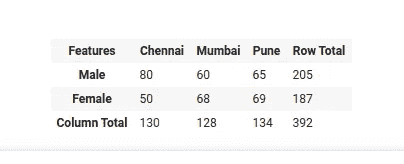
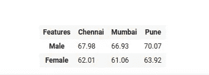
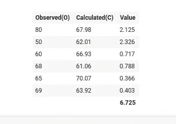

# 卡方检验

> 原文：<https://medium.datadriveninvestor.com/chi-square-test-d1387ee13543?source=collection_archive---------6----------------------->

在统计学中，有两类变量:**分类变量**和**连续变量**。为了找出变量之间的相关性，使用卡方检验。

**卡方**统计假设是分类变量之间独立性的一个例子。独立性检验通过比较细胞的观察值和期望值来评估 2 个分类变量之间的关联。计算卡方值后，将其与卡方分布表中的临界值进行比较，以检查变量之间是否存在显著差异。

## 相依表

这是一个用于汇总分类变量的不同值的实例计数的表。例如，数据集中有两个要素性别和位置。性别在数据集中只能取 2 个不同的值，即**男性**和**女性，**和**地点可以取 3 个不同的值**钦奈**、**孟买、**和**普纳。**这是一个列联表，显示了属于不同地点的人员。**

**Contingency Table**

此表显示了这两列的不同值的每个实例的计数。

卡方检验是一种统计假设检验，具有以下假设

**Null** :表示分类变量之间没有关系。
**备选项**:表示两个分类变量之间存在显著差异。

## 工作:

步骤 1:-制作分类变量的列联表。

步骤 2:-使用下面的公式，找到列联表中每个单元格的计算值。

> **(行合计*列合计)/总计**

步骤 3:-使用上述公式后，新表格如下:-

Calculated Value Of Contingency Table

步骤 4:-将观察值和计算值之差的平方和除以计算值。

**chi-square Static value**

步骤 5:-计算自由度(dof)，其计算如下

> dof =(行数-1) *(列数-1)
> DOF =(2–1)*(3–1)= 2

第六步:-借助**自由度**和**α**值找到**临界值**。

> 第七步:-
> 如果**卡方(静态)值** <临界值
> == >未能拒绝零假设，意味着特征独立
> 
> 如果 **p 值**<**α值**
> == >拒绝零假设，则意味着依赖特性

卡方检验用于确定分类特征之间的关系。该测试可用于特征选择，从而改进机器学习算法。

如果你喜欢并欣赏这本书，👏👏拍手分享。

你可以在这里找到代码 [**。
你可以在**](https://github.com/pranavkriya/statistics/blob/main/chi_square_Test.ipynb) **[**Linkedin**](https://www.linkedin.com/in/pranavgarg1506/) 上联系我**