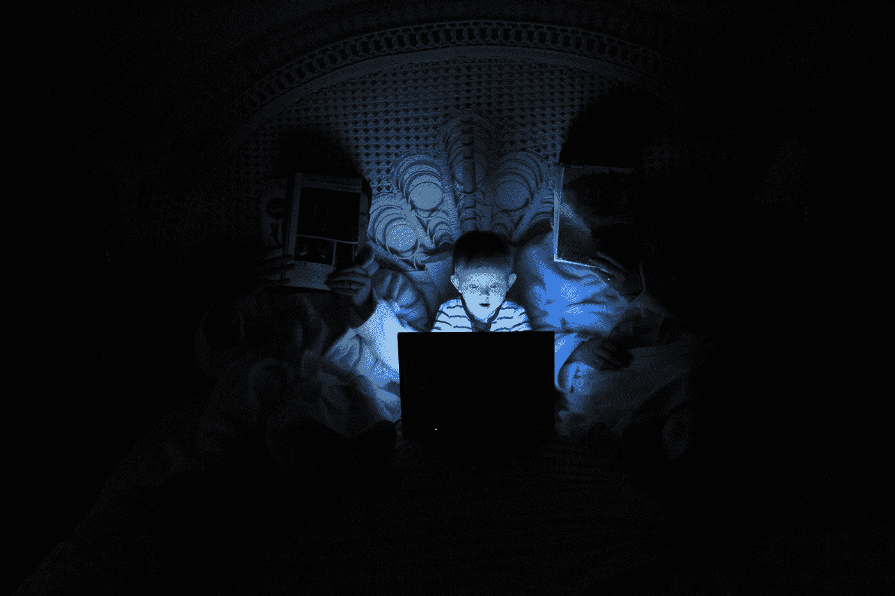

# 陷入网中的儿童

> 原文：<https://medium.datadriveninvestor.com/children-caught-in-the-web-ca2f00820d48?source=collection_archive---------2----------------------->

## 让我们的孩子远离网络危险的七种方法！

Photo by [engin akyurt](https://unsplash.com/@enginakyurt?utm_source=medium&utm_medium=referral) on [Unsplash](https://unsplash.com?utm_source=medium&utm_medium=referral)

没有父母会把自己的孩子留在危险的地方。然而，我们中的许多人甚至没有意识到这一点。有多少孩子在很小的时候就能接触到移动设备、笔记本电脑或电脑，并通过它们访问互联网？很可能是绝对多数。

有些人没有意识到，虽然互联网可以成为一个令人难以置信的学习工具，但它也有其黑暗的一面。网最暗的部分被称为“暗网”。这就像互联网的西部荒野，那里没有法律，法律强制斗争，罪犯自由支配。毒品、武器甚至人类都在网络的这一部分进行交易。对我们来说幸运的是，要访问这个区域，需要一个特定的浏览器，所以我们的孩子很难接触到。

 [## 大数据给教育行业带来的 5 大变化|数据驱动的投资者

### 如果利用得当，大数据将对教育行业产生巨大影响。它可以提供众多新的…

www.datadriveninvestor.com](https://www.datadriveninvestor.com/2020/02/18/5-changes-to-the-education-sector-caused-by-big-data/) 

然而，这并不意味着我们的网络世界是安全的。以下是一些在网上发现的最常见的危险的例子。

Photo by [Andre Tan](https://unsplash.com/@andredantan19?utm_source=medium&utm_medium=referral) on [Unsplash](https://unsplash.com?utm_source=medium&utm_medium=referral)

1.  网上掠食者在网上自由地漫游，并且总是在寻找年轻的猎物。他们耐心地研究目标，然后采取行动。为了确保他们成功，他们中的一些人窃取了类似于狼装扮成羊的在线身份。

**解决方案:**教育我们的孩子不要和陌生人说话，如果有疑问，请寻求成年人的帮助。不应在网上分享个人信息。无关痛痒的细节，比如宠物的名字，可以作为开始谈话的诱饵。如果掠夺者计划从一个家庭中偷窃，他会开始谈话以引出诸如习惯、时间表等信息。在某些情况下，儿童会被迫在现实生活中与他们的捕食者见面，这种行为的后果有时是悲剧性的。

Photo by [Dayne Topkin](https://unsplash.com/@dtopkin1?utm_source=medium&utm_medium=referral) on [Unsplash](https://unsplash.com?utm_source=medium&utm_medium=referral)

**2。私密不一定代表安全。**我们见过很多这样的情况，人们在私人聊天中分享个人照片或视频，然后这些照片或视频最终出现在互联网上。孩子要记住，隐私等于控制。如果一个人放弃了它，他也放弃了控制。一旦它在那里，它是不可能恢复甚至删除它。

**解决方案:**在张贴任何东西之前，孩子们应该问自己，他们将要分享的东西是否可以在学校的广告牌上分享。如果不是，那么分享它可能不是一个好主意。

Photo by [Ludovic Toinel](https://unsplash.com/@ltoinel?utm_source=medium&utm_medium=referral) on [Unsplash](https://unsplash.com?utm_source=medium&utm_medium=referral)

**3。社交媒体往往会对孩子产生不良影响。**这些网站通过设计让人上瘾。所使用的颜色、布局和内容都经过了优化，可以让你再次访问该网站。这种上瘾可能会干扰孩子的学业，并最终影响他的成绩。它们也成为走出去和进行现实生活互动的障碍。最后，一些内容可能是不适当的，这会导致焦虑、抑郁和疲劳。

**解决方法:**父母应该尽可能延迟社交媒体的访问。当孩子们被允许访问它时，父母应该保留一份所有社交媒体密码的副本，以便他们可以监控在线发生的事情，并相应地指导他们的孩子。

Photo by [Tim Gouw](https://unsplash.com/@punttim?utm_source=medium&utm_medium=referral) on [Unsplash](https://unsplash.com?utm_source=medium&utm_medium=referral)

**4。过度使用技术是不健康的。一些孩子一直在使用他们的手机、游戏机和其他设备。他们发现很难停下来，大声抱怨，避免社交接触。**

解决方案:为了抵消这一点，父母应该提醒他们的孩子，屏幕时间不是孩子的权利，而是一种特权。可以制定一些简单的规则，比如:a .家里应该有每个人都尊重的科技自由区。b .用餐时间不欢迎打电话。
c .在一天中的特定时间和就寝时间前后，应该有一次技术封锁。

Photo by [Greg Bulla](https://unsplash.com/@gregbulla?utm_source=medium&utm_medium=referral) on [Unsplash](https://unsplash.com?utm_source=medium&utm_medium=referral)

**5。在网上关注你的孩子并不意味着你知道他在做什么。现在的孩子非常狡猾。他们中的一些人创建假的个人资料与他们的父母分享，另一些人创建假的账户与他们的朋友分享。**

**解决方案:**当然，监控孩子也不容易。最好的解决办法是与孩子们有一个开放的沟通渠道。讨论什么是可接受的，什么是不可接受的。此外，对他们正在做的事情表现出兴趣也很重要。这样做，更容易获得他们的信任，如果他们有问题，他们也会愿意向你求助。无论我们做什么，做多少努力，孩子们都会犯判断错误。在这种情况下，千万不要在网上责备孩子，而是用文明的对话与孩子讨论情况。记住，每一次跌倒都是一次站起来并从中学习的机会。

Photo by [Markus Winkler](https://unsplash.com/@markuswinkler?utm_source=medium&utm_medium=referral) on [Unsplash](https://unsplash.com?utm_source=medium&utm_medium=referral)

**6。假新闻、虚假营销泛滥。网络上充满了可疑的内容，人们每天都会接触到这些内容。正因为如此，我们必须非常小心地选择该相信什么。检查信息来源总是一个好主意，不管它是否可靠，如果必要的话，根据多个来源仔细检查事实。**

**解决方案:**帮助孩子最好的方法就是教育他们，讲解如何识破假帖。建议他们永远不要点击或填写任何表格，如果他们需要，他们应该先问一个成年人。他们手机上的 GPS(定位)应该关闭，以防止他们获得有针对性的广告。

Photo by [Morgan Basham](https://unsplash.com/@mpbasham?utm_source=medium&utm_medium=referral) on [Unsplash](https://unsplash.com?utm_source=medium&utm_medium=referral)

**7。网络欺凌是巨大的，可能会产生一些严重的后果，如自残甚至自杀。**在线滥用相当容易，人们可以从任何设备上进行。另一方面，孩子的认同感和自尊心是非常脆弱的。

**解决方案:**解决这个问题的最佳方式是与孩子交谈，并监控他们行为的任何变化。向他们解释，他们必须报告任何不适当的内容，并且你会全程支持他们。

当然，不可能监控他们在网上做的所有事情。但是，让孩子的屏幕时间完全不受监控是一个灾难的处方。父母的角色是保护他们的孩子，网络世界也不例外。他们不得不搀扶着他们的孩子，直到他们准备好自己处理社交媒体。技术是父母不应该让他们的孩子滥用的特权，如果他们这样做，他们可以确保有一天，他们的孩子将成为网络世界中负责任的成年人。

请在下面留下你的想法。如果你喜欢这篇文章，并想与我联系，请这样做🐦[推特](https://twitter.com/alexieidingli)，🔗 [LinkedIn](https://www.linkedin.com/in/alexieidingli/) ，📷 [Instagram](https://www.instagram.com/alexieidingli/) 或者😊[脸书](https://www.facebook.com/alexieidingli/)

 [## 140 个网站，帮助您的孩子学习几乎任何东西！

### 优质教育可以是免费的，网络上充满了免费资源。

medium.com](https://medium.com/@alexieidingli/140-websites-to-help-your-child-learn-almost-anything-55474d54a420)  [## 教育已死，教育人工智能万岁！

### 作为我工作的一部分，我去了相当多的学校，宣传令人兴奋的科学世界，传播福音…

medium.com](https://medium.com/datadriveninvestor/education-is-dead-long-live-education-artificial-intelligence-2552cfdd1ed)  [## 向孩子们解释人工智能

### 如何让我们的年轻一代为明天的挑战做好准备！

towardsdatascience.com](https://towardsdatascience.com/explaining-ai-to-children-c9b2ecab1ffc) 

[**阿列克谢·丁力教授**](http://www.dingli.org/) 是马耳他[大学](https://www.um.edu.mt/)的 AI 教授。二十多年来，他一直在人工智能领域进行研究和工作，协助不同的公司实施人工智能解决方案。他的工作被国际专家评为世界级，并赢得了几个当地和国际奖项(如欧洲航天局、世界知识产权组织和联合国等)。他已经出版了几本同行评审的出版物，并成为马耳他[的一员。由马耳他政府成立的人工智能工作组，旨在使马耳他成为世界上人工智能水平最高的国家之一。](https://malta.ai/)

**访问专家视图—** [**订阅 DDI 英特尔**](https://datadriveninvestor.com/ddi-intel)