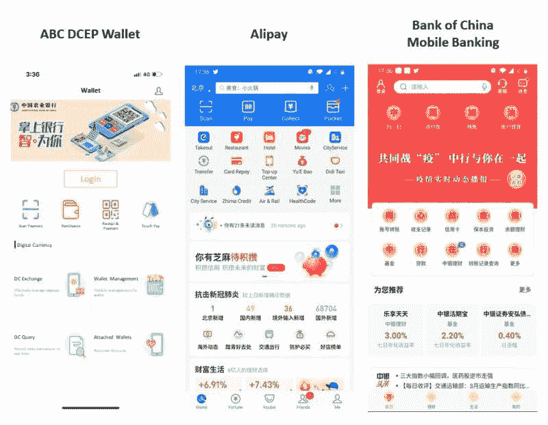
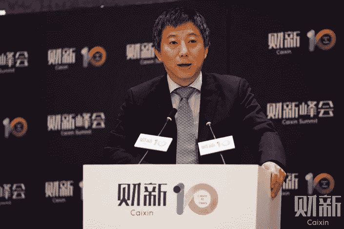

# China goes on the offensive with the Digital Yuan, and here’s what it means for you.

> 原文：<https://medium.datadriveninvestor.com/china-goes-on-the-offensive-with-the-digital-yuan-and-heres-what-it-means-for-you-389894463dfc?source=collection_archive---------17----------------------->

China is an extremely competitive country, the way it reacts to the pulse of technology is impressive. China has always been a top player in the Blockchain industry despite its relatively conservative regulations on Cryptocurrency. Today we will talk about BSN’s ChinaChain and the Digital Yuan.

It became public news that BSN will be China’s frontrunning Blockchain Platform on 25th April 2020\. This happened amidst the SARS-COV-2 pandemic and increasing international tensions. China aims to establish ChinaChain nodes in 200 Chinese cities, they say it will reduce the cost of Blockchain-based businesses by 80%. It is the Chinese equivalent of Ethereum, but I am not 100% clear on the details yet. BSN’s ChinaChain, to me, based on my surface-level skimming of the Whitepaper, looks like a mix of Hyperledger Fabric and Ethereum. It does have a similar Stake based consensus, while still being permissioned. Till further studies on it are done, I will refrain from any misinformed commentary.

 [## 5 Potential Blockchain Use-cases that can save the environment | Data Driven Investor

### Blockchain technology has become synonymous with innovation and disruption. While several sectors like healthcare…

www.datadriveninvestor.com](https://www.datadriveninvestor.com/2020/03/06/5-potential-blockchain-use-cases-that-can-save-the-environment/) 

China took another leap forward and pushed DCEP out into the public. DCEP is Digital Currency Electronic Payment, which is the national digital currency of China, which is built to be 1:1 with the Chinese RenMinBi (or Yuan). This is a direct competition to Facebook’s Libra. Both of these want to become a widely adopted payment system, but the DCEP is backed by the Chinese Government, and Facebook is still playing around with Libra. DCEP is not based on speculation, it’s backing value is the RenMiBi/Yuan and it has an unlimited supply. It also isn’t a third party stablecoin like CNHT (another 1:1 CNHT: RMB coin), **It is issued by The Chinese Government.** Since it provides ease-of-cross-border-payments, There is a general consensus that this will clearly affect the Global Market. In October ’19, President of the People’s Republic of China*,* Xi Jinping stated that China needs to “seize the opportunity” that Blockchain presents. Despite banning Bitcoin, China threw its weight behind Blockchains, and Xi’s love for Crypto and Blockchains made the Bitcoin go Bullish, going to 10k USD, after a plunge. While the US was fumbling with basic Social Media, China started setting up zones to give Cryptocurrency a dry run, this was while China was basically leading the world in Blockchain innovation. It was known that China was working on its own Coin. After around August, the China-Blockchain hype started to dial down around the world, people didn’t forget, but as is the case with the modern world, people started to look at other things.

Photo by [Li Yang](https://unsplash.com/@ly0ns?utm_source=medium&utm_medium=referral) on [Unsplash](https://unsplash.com?utm_source=medium&utm_medium=referral)

虽然中国中央银行(我想它叫人民银行)还没有发布关于 DCEP 发布日期的官方声明，但一些消息来源声称大约在 2021 年 6 月。DCEP 已经在一些地区进行了试运行，中国非常重视使流程无缝化。例如:

*   UX 很像中国常见的支付宝/WePay。
*   通过账号转账，二维码也可以
*   可以在没有互联网的情况下，使用 NFC 或蓝牙进行传输
*   有一个触摸和支付功能，允许您通过点击支付

A comparison of the DCEP app, Alipay and BoC mobile banking app (source: unknown)

上一次我看到一个国家如此强硬地推动金融决策，是在印度取消某些法案的货币化期间。以每秒 30 万笔交易的速度，DCEP 可以被主要运营商采用，也可以用于小额支付。记住，这还是中央集权(加密货币和 Defi 不是一回事)。中央银行将间接将这些投入流通。一旦一切都清楚了，我将从技术上剖析 DCEP 和新的支付门户。

Mu Changchun is one of the leaders of this effort. When questioned why did they develop DCEP, he “It is to protect our monetary sovereignty and legal currency status. We need to plan for a rainy day”.

这对你有什么影响？

**【点评】**随着经济的复苏，随着世界越来越依赖中国，中国越来越不依赖石油，人民币可能只会变得更加坚挺。日本央行的刺激扩张计划、石油价格暴跌、疯狂的失业率等还有许多其他重大决策。所有这些都将影响你的货币，有通货膨胀的说法，也有衰退的说法。没有人知道会发生什么。但有一点我可以肯定的是，ChinaChain、Filecoin、DCEP——都指向区块链非常强劲的未来。DCEP 及其优势:更少的银行麻烦，离线交易，更高的国际认可度，等等。-其他国家可能会考虑本国货币的数字框架。Libra 和 Ton 将会看到接受度的激增，因为现在(截至 2020 年年中)中国市场存在不信任的喧嚣。一些人认为，中国走向无现金化是朝着更多跟踪、控制越来越多的资本和创造更高支出环境的微妙进步——我不会对这些发表评论。观察 DCEP 对像 NEO(所谓的以太坊黑仔)这样的中国古钱币的影响也是非常有趣的。没有人确切知道会发生什么，我们所能做的就是等待，看看接下来会发生什么。