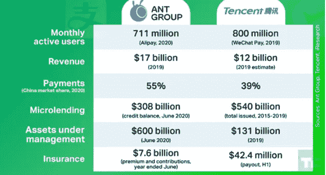

# 在全世界的注视下，中国推出了自己的数字货币

> 原文：<https://medium.datadriveninvestor.com/china-rolls-out-its-own-digital-currency-while-the-world-watches-on-b901ad0e9f63?source=collection_archive---------28----------------------->

[2 分钟视频](https://youtu.be/pc6GleVyIFI)评估 CBDC 的影响，因为中国推出了自己的

[BNY·梅隆评论](https://www.bnymellon.com/us/en/insights/aerial-view-magazine/china-and-the-dawn-of-digital-currency.html):*在发明纸币 1500 年后，中国现在正试图将货币真正带入数字时代。然而，世界其他地区仍然不确定它是否愿意效仿*。

随着中国在线购物门户网站 JD.Com[确认将接受中国新的数字货币(](https://www.technologytimes.pk/2020/12/06/jd-com-becomes-first-online-platform-to-accept-chinas-digital-currency/))作为支付手段(但仅限于其平台上销售的部分商品),中国央行数字货币(【CBDC】的逐步推出仍在继续。JD.Com 被选中并不令人意外腾讯的微信支付和阿里巴巴的支付宝是中国政府采用 CBDC 面临的两大威胁。阿里巴巴和腾讯因反垄断行为被中国政府罚款，这些行为与两家公司几年前进行的收购有关。随着中国政府对金融科技领域的公司行使立法权，因为它希望确保数字人民币的成功，这是一个迹象吗？

支付宝和腾讯对中国数字支付的掌控

Source: [TechCrunch.com](https://techcrunch.com/2020/11/09/tencent-vs-alibaba-ant-fintech/?guccounter=1&guce_referrer=aHR0cHM6Ly93d3cuZ29vZ2xlLmNvbS8&guce_referrer_sig=AQAAAMvUHtMBhBDrlANKqRS-iVuD5GCwYD_FOlmQX-SIaKm899lAx0FqPN-NcvLF8fKAAK81h09poPq2gRrIjUqTft-SF8ZQR_tsDiE1s1OLExBOmylJVeyTrl9U1Ae5NgoeD2-AH8UoywSKAm-M2J1SpoKCAcOZTg4y5uEgSBrrku8f)

此外，中国政府已经开始推广其 CBDC，随机抽取深圳市居民，向 5 万名市民发放相当于 30 美元的新数字货币。政府也给了另外一个[3 万到 10 万](https://news.cgtn.com/news/2020-10-24/PBOC-draft-law-provides-legal-basis-for-digital-currency-URaFFN37IA/index.html)的市民，但这次是给那些住在苏州的人。在上一次“赠品”中，人们有 4 天的时间来使用或失去他们的 30 美元，所以第二次“赠品”可能也会有类似的限制。据[巴基斯坦科技时报](https://www.technologytimes.pk/2020/12/06/jd-com-becomes-first-online-platform-to-accept-chinas-digital-currency/)报道，使用中国数字货币的势头越来越猛，仅在上个月，“迄今为止，在 400 万笔单独交易中，使用中国数字货币的支出已经超过 20 亿元”。

数字货币为政府提供了一个全新的工具，即使只是为了监控谁在哪里花了什么，这至少可以帮助当局(在打击逃税的斗争中)解决困扰许多国家的影子经济。由于利率几乎为零，央行和政府很难刺激经济。然而，通过使用数字货币，政府可以非常专注，并随后对数字货币进行编程，以专门用于特定商品(甚至只允许根据特定的邮政编码使用)。BNY 梅隆，可以说是全球最大的托管服务提供商，最近宣称“*中国人给了我们钞票，现在他们正在向我们展示如何使用 CBDC。问题是，下一个被数字化的主要货币是哪一种？”*

 [## 面向开发者的区块链；API 提供商的重要性|数据驱动的投资者

### 在过去的几年里，区块链突然成为这个领域最热门的新技术。每一个…

www.datadriveninvestor.com](https://www.datadriveninvestor.com/2020/11/25/blockchain-for-developers-the-importance-of-api-providers/) 

**进入专家视角—** [**订阅 DDI 英特尔**](https://datadriveninvestor.com/ddi-intel)