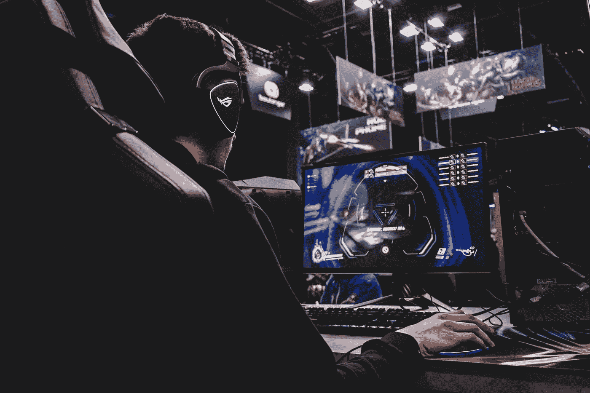

# 中国将承认游戏为正式职业

> 原文：<https://medium.datadriveninvestor.com/china-to-recognize-gaming-as-official-profession-1ba5aee834d0?source=collection_archive---------39----------------------->

## 随着电子竞技产业的快速发展，整个产业链对人才的需求越来越迫切

Photo by [Florian Olivo](https://unsplash.com/@florianolv?utm_source=unsplash&utm_medium=referral&utm_content=creditCopyText) on [Unsplash](https://unsplash.com/?utm_source=unsplash&utm_medium=referral&utm_content=creditCopyText)

想想一个不需要遵循朝九晚五常规的工作场所；在那里你每天打 12 到 14 个小时的游戏，吸引人的数字是收费的。你猜对了。游戏生涯现在已经成为现实！你可以成为职业玩家；你可以在国家和国际比赛中为你的国家竞争和比赛。有什么不爱？但是，嘿，还有件事你需要知道。你必须在这方面表现出色。

> **中国政府将承认博彩为正式职业。**

# **职业玩家职位空缺**

●保守估计，国际上和中国竞争性产业链上的相关岗位超过 100 个。包括活动、产品、编导和直播、业务团队、运营、营销、活动合作等。

●赛事服务和技术服务岗位仍然是中国电竞行业最重要的两个岗位。

## 中国电子竞技人才

●截至 2018 年底，中国电竞相关行业从业者中，有 7.1 万人处于电竞生态圈。

●只有 26%的岗位处于人力饱和状态，近 15 万的劳动力缺口尚未填补。

● 74.45%的电竞从业者每周工作时间超过 40 小时，15.5%的受访者甚至每周工作时间超过 60 小时。

●47.76%的电竞从业者认为电竞行业目前最缺乏管理方面的人才。

## **下游人才**

电竞选手，裁判，教练，游戏陪练，游戏主播，等职业。

电竞解说通常由 2 至 3 人组成，他们共同合作完成比赛的解说。一对搭档负责游戏的描述、评论和分析。目前除了专业赛事解说，来自广播学院的人才和退役的职业选手都有机会从事电竞解说。

 [## 苹果 iCar:规格和传言

### 路透社爆料称，苹果正在推进自动驾驶技术，计划在 2024 年生产一款乘用车…

medium.com](https://medium.com/datadriveninvestor/apple-icar-specs-and-rumors-299a41cfdedb) 

## **中游人才**

游戏运营人员:负责把开发出来的游戏放到线上，通过线上活动和举办电竞赛事，让游戏有曝光度。

电竞高管:为一款游戏策划电竞比赛，包括设计游戏规模、选择主办城市、如何比赛等。，赛前准备，赛后做后勤。包括项目管理团队、导演及直播团队、艺人经纪、活动业务拓展等职业。

## **上游人才**

**游戏策划:**策划一个游戏，这个游戏可以是休闲游戏，也可以用于电子竞技。

**游戏开发者:**配合策划人员开发制作游戏。

**国内最早开设电子竞技教育的高校有哪些？**

答案是“中国传媒大学南广学院。”

**2017 年**开设数字媒体艺术(数字娱乐方向)，主要培养游戏策划和电竞运营人才。

**2020 年**，中传南广学院将转入南京传媒学院。

**2017 年**，中国传媒大学南广学院开始招收中国首个电子竞技分析本科专业。同年，国内首家家电竞赛学院正式成立。

**上海戏剧学院**

2017 年启动“上海戏剧学院电竞主持解说与舞台设计专业人才培养计划”，开设电竞主持解说和电竞舞台设计两大课程。

**上海体育大学**

2018 年，上海体育大学正式开设播音与主持艺术专业(电竞解说方向)，开始招生。

## 电子竞技产业发展史

**2003 年**

国家体育总局宣布电子竞技为第 99 个体育项目。

**2016 年**

9 月教育部将“电子竞技运动与管理”列入辅修专业。

10 月，国务院办公厅发布相关文件，明确指出要促进电子竞技等时尚运动健康发展，培育相关专业培训市场。

**2019 年**

今年 4 月，人力资源和社会保障部和国家统计局发布了 13 个新职业，包括“电子竞技操作员”和“电子竞技运动员”

**2020 年**

12 月，亚奥理事会宣布电子竞技成为亚运会正式比赛项目。