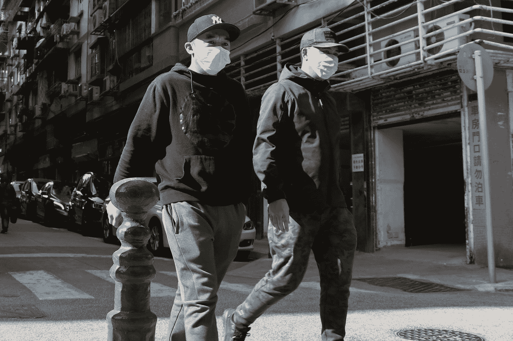

# 中国共产党对冠状病毒危机负有责任

> 原文：<https://medium.datadriveninvestor.com/chinas-communist-party-is-responsible-for-the-coronavirus-crisis-af3c43f829ac?source=collection_archive---------11----------------------->

Photo by [Macau Photo Agency](https://unsplash.com/@macauphotoagency?utm_source=medium&utm_medium=referral) on [Unsplash](https://unsplash.com?utm_source=medium&utm_medium=referral)

## CCP 如何掩盖冠状病毒的爆发

当全世界都在努力应对新冠肺炎病毒的时候，T2 解除了对人们行动的限制，武汉是 T4 病毒的发源地。中国共产党(CCP)也在宣扬“中国模式”的表面优势，同时诋毁西方，尤其是美国。随着 CCP 继续将病毒爆发的责任归咎于美国，它还将西方国家的应对措施描述为混乱和无效，并传播关于病毒起源的阴谋论。

的确，世界各地的许多政府和领导人都因没有迅速采取行动阻止病毒传播而受到指责，包括特朗普总统。但是，CCP 无法挑战一个不可否认的事实，尽管它尽了最大努力进行宣传:病毒源于中国，CCP 的保密、压制异议和隐瞒真相的倾向，以及对疫情的掩盖，通过剥夺世界其他地区宝贵的几天和几周的准备时间，对全球冠状病毒危机负有责任。

 [## 保护主义、政治和经济动荡|数据驱动的投资者

### 美国股市昨日出现 400 多点的大幅反转，为未来的事情发出了警告信号。市场…

www.datadriveninvestor.com](https://www.datadriveninvestor.com/2018/06/28/protectionism-politics-economic-turmoil/) 

根据《柳叶刀》杂志*上的[研究](https://www.thelancet.com/journals/lancet/article/PIIS0140-6736(20)30183-5/fulltext), 2019 年 12 月 1 日出现了第一个有新的致命新病毒证据的患者，并且“在发病 5 天后，他的妻子，一名 53 岁的女性，没有已知的市场暴露史，也出现了肺炎，并在隔离病房住院。”这是病毒人际传播的第一个证据。*

12 月 30 日，李文亮博士警告他的同事，新患者的疾病可能是由 SARS 引起的，病毒可能在人与人之间传播。然而，他后来被政府传唤，并因“在网上发表虚假言论”而被迫忏悔。

第二天，武汉市卫生委员会[声明](http://wjw.wuhan.gov.cn/front/web/showDetail/2019123108989)“到目前为止的调查没有发现明显的人际传播，也没有医务人员被感染，”尽管当地医生，包括[医生梁文，](https://www.thelancet.com/journals/lancet/article/PIIS0140-6736(20)30382-2/fulltext)不这么认为。

1 月 12 日，在武汉医院治疗患者的梁文医生出现发烧后住院，其他中国医生也发现了病毒的[传播](https://www.thelancet.com/journals/lancet/article/PIIS0140-6736(20)30154-9/fulltext)病例。梁文博士随后于今年 2 月死于冠状病毒。

直到 1 月 20 日，中国才正式承认新型冠状病毒可以在人与人之间传播，这是在第一个证据出现一个多月后，尽管事实上几周前中国医生提出了警告，但被压制。很明显，中国隐瞒了新冠肺炎疫情数周。

毫无疑问，中国共产党的行为对这种疾病在全世界的传播负有责任，而世界卫生组织(世卫组织)也是同谋。

尽管到 1 月中旬，中国医生[已经知道](https://www.wsj.com/articles/how-it-all-started-chinas-early-coronavirus-missteps-11583508932?mod=article_inline)有冠状病毒人际传播的病例，但 1 月 14 日，世界卫生组织(世卫组织)[在推特](https://twitter.com/who/status/1217043229427761152?lang=en)上回应了中国政府的说法，称“中国当局进行的初步调查没有发现在[武汉](https://twitter.com/hashtag/Wuhan?src=hashtag_click)、[中国](https://twitter.com/hashtag/China?src=hashtag_click)发现的新型[冠状病毒](https://twitter.com/hashtag/coronavirus?src=hashtag_click) (2019-nCoV)人际传播的明确证据。”一直以来，世卫组织都在称赞中国“信息共享的开放性”在台湾于 12 月 31 日通知世卫组织冠状病毒在人与人之间传播后，世卫组织对此不予理会，并随后否认向该国提供任何帮助，这与中国政府关于冠状病毒和台湾的官方说法相吻合。

当特朗普政府于 1 月 31 日限制来自中国的旅行时，世卫组织总干事 Tedros Adhanom Ghebreyesus [表示](https://www.who.int/dg/speeches/detail/who-director-general-s-opening-remarks-at-the-technical-briefing-on-2019-novel-coronavirus)这一决定将“产生增加恐惧和耻辱的效果，对公共健康几乎没有好处”，尽管这对于遏制冠状病毒的传播至关重要。尽管对世卫组织的预算贡献只有美国的十分之一，该组织还是对中国的要求卑躬屈膝，并传播自己的观点。

最近，中国宣布武汉的死亡人数被低估，并将其提高了 50%。而且很有可能国家[少报了](https://www.rfa.org/english/news/china/wuhan-deaths-03272020182846.html)新冠肺炎病例的数量，根据火葬场的活动估计，仅武汉的实际死亡人数就超过 4 万，远远高于官方公布的死亡人数(3300)。如果这是真的，那么共产党也要对意大利和西班牙等国家成千上万人的死亡负责，这些国家淡化了这种威胁，因为相对于其庞大的人口而言，中国的数字“较低”。

华盛顿必须准备好应对中国对美国及其盟友的利益和国家安全构成的挑战。因此，白宫必须在对抗冠状病毒的全球行动中发挥领导作用，并应与其盟友一起，对病毒的起源以及 CCP 和世卫组织的行动展开调查。

*原载于* [*孤注一掷*](https://loneconservative.com/2020/05/04/the-ccp-is-responsible-for-the-coronavirus-crisis/)