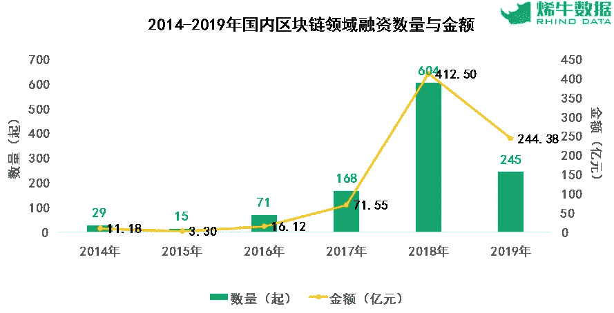

# 2019 年中国区块链投资总额

> 原文：<https://medium.datadriveninvestor.com/chinas-total-blockchain-investments-in-2019-3da0aaa51a35?source=collection_archive---------14----------------------->

与 2018 年相比，2019 年中国在区块链的投资总额下降了 40%。2019 年，中国有 245 项投资和融资交易，比上年减少近 60%。

根据中国政府经营的金融信息和媒体公司新华社和金融数据平台犀牛数据的联合研究，区块链投资交易的总支出为 244 亿元人民币(合 36 亿美元)。与 2018 年相比，2019 年这一数字下降了 40.8%。

 [## 5 行业转型区块链应用|数据驱动投资者

### 除非你一直生活在岩石下，否则我相信你现在已经听说过区块链了。而区块链…

www.datadriveninvestor.com](https://www.datadriveninvestor.com/2019/02/13/5-real-world-blockchain-applications/) 

然而，报告指出，自 2017 年以来，交易的价值和数量都大幅增加。数据显示，截至目前，2018 年仍是区块链对中国投资支出的峰值，全年发生了 600 多起交易，而 2017 年仅发生了 168 起交易。

*China’s blockchain investment spending from 2014 to 2019\. Source:* [*Xinhua*](http://fintech.xinhua08.com/a/20200115/1907673.shtml)

2019 年，292 家机构参与了投资，京、深、杭吸引了最大的区块链项目。

在中国国家主席于 2019 年 10 月下旬呼吁中国加快区块链的采用后，中国一直在更彻底地加强其在区块链的专业知识，区块链在中国的支出在 2019 年下降的事实看起来有些出人意料。

2019 年底，新华社援引美国市场情报公司 IDC 的一项研究预测，2023 年，该国在区块链技术上的支出将超过 20 亿美元。

除了积极资助区块链的倡议，中国政府还在开发政府支持的数字货币“数字元”方面取得了进展。中国人民银行在 2019 年 12 月提出其首个真实世界的人民币试点之前，已经对 CBDC 进行了五年的研究。

*今年中国的区块链生活会发生什么？请继续关注，了解更多关于中国及其经济和最新的区块链技术。*

***如果您想了解更多，请访问 BIDITEX 页面并提出您的问题，关注我们的*** [***推特***](https://twitter.com/biditex_com) ***，*** [***脸书***](https://www.facebook.com/biditex/) ***，*** [***中型***](https://medium.com/@biditex) ***，*** 用[***bidi tex***](http://www.biditex.com/)***投标你的空格。***