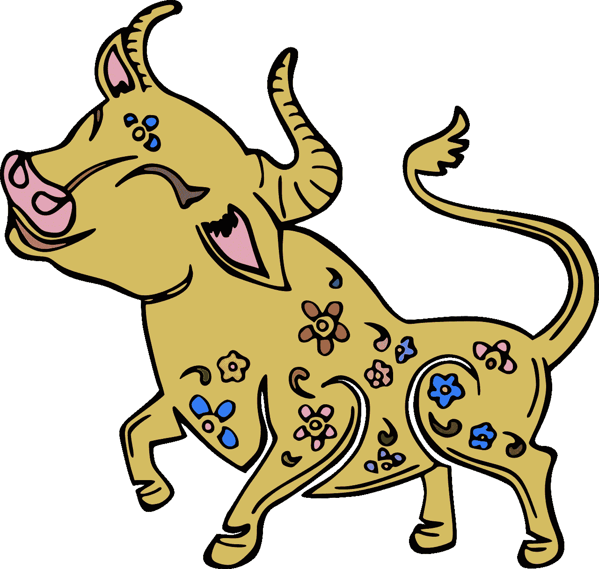
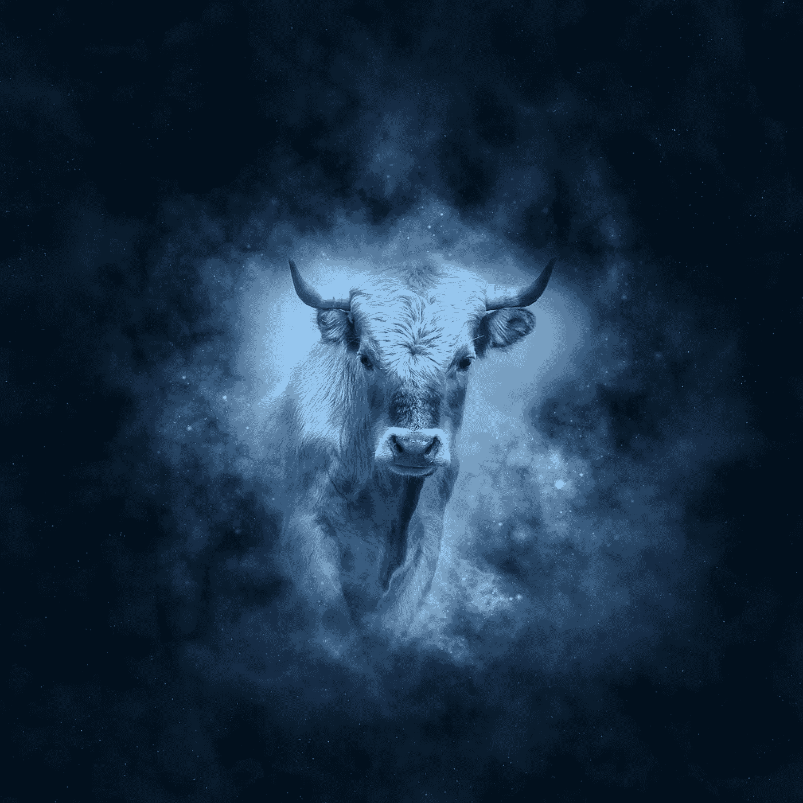

# 中国十二生肖:2021 牛年

> 原文：<https://medium.datadriveninvestor.com/chinese-zodiac-2021-year-of-the-ox-1023f2a86e02?source=collection_archive---------19----------------------->

## 为什么十二生肖中的牛排在鼠之后？

Image by [D. Aida](https://pixabay.com/users/minadori-48729/?utm_source=link-attribution&utm_medium=referral&utm_campaign=image&utm_content=250718) from [Pixabay](https://pixabay.com/?utm_source=link-attribution&utm_medium=referral&utm_campaign=image&utm_content=250718)

金鼠辞旧岁，福牛迎春！今年是牛年。今天一起来说说黄牛吧。牛是[牛科](https://en.wikipedia.org/wiki/Bovidae_in_Chinese_mythology)动物的统称。除了极端恶劣的环境，如极度寒冷和极度[干旱](https://en.wikipedia.org/wiki/Drought)，牛广泛分布在世界各地。

## **为什么十二生肖中的牛排在鼠之后？**

那么，牛这么大，对人类的贡献是不可替代的，为什么生肖排在老鼠后面呢？根据[民间传说](https://en.wikipedia.org/wiki/Folklore)、[、**轩辕皇帝**、](https://en.wikipedia.org/wiki/Yellow_Emperor)要选出十二种动物担任十二生肖，比赛就是通过一场比赛来决定哪十二种动物。本来比赛是公牛领先的，没想到，老鼠溜到公牛背上领先了，所以排第一。

这个说法当然只是为了娱乐。要知道排名是什么，我们首先要知道十二生肖是怎么来的。

在古巴比伦[和中国](https://en.wikipedia.org/wiki/Sino-Babylonianism)这样的古文明中，他们的祖先感受到了冷热交替，植物枯荣的循环。他们称之为“*一岁*”。他们用木星作为一年的周期，木星(*也叫“年星】*)绕轨道运行，太阳绕轨道运行正好十二年。在原始社会早期，人们常用各种动物作为[图腾](https://en.wikipedia.org/wiki/Totem)，所以十二图腾被用作十二年的象征。

 [## 为什么我们在镜子里看起来很有魅力？

### 镜子，墙上的镜子

medium.com](https://medium.com/datadriveninvestor/why-do-we-look-attractive-in-the-mirror-765fbdd1f269) 

有人考证，生肖可能是从外国传入的。然而，许多人认为十二生肖的顺序是基于动物的习惯。

也有人认为黄道十二宫和二十八星有对应关系。二十八星座中的日、火、金三组确实与十二生肖相对应，但由于二十八星座的记载晚于十二生肖，所以可能不可避免地要附上这样的说法。

Image by [Please supports me! Thank you!](https://pixabay.com/users/artjane-16042123/?utm_source=link-attribution&utm_medium=referral&utm_campaign=image&utm_content=5909131) from [Pixabay](https://pixabay.com/?utm_source=link-attribution&utm_medium=referral&utm_campaign=image&utm_content=5909131)

# **吹牛和对牛弹琴是怎么来的？**

[**Niu** (Chinese: 牛; pinyin: *Niú*)](https://en.wikipedia.org/wiki/Niu_(surname)) often appears in Chinese spoken language. Such as using “[*boasting*](https://en.wikipedia.org/wiki/Boasting)” to describe the exaggeration of others. The historian [**Gu Jiegang**](https://en.wikipedia.org/wiki/Gu_Jiegang) has done textual research, and the term [*boasting*](https://en.wikipedia.org/wiki/Boasting) was originally the dialect of the people in the Northwest.

因为西北地区有些地方在[黄河](https://en.wikipedia.org/wiki/Yellow_River)附近，水流湍急，根本无法航行，所以老百姓就把牛皮或者羊皮缝起来，然后吹成一个皮袋子，再绑在木筏上，做成渡河用的木筏。

如果是羊皮[皮标签](https://en.wikipedia.org/wiki/Skin_tag)，那就很普通了，因为肺活量大一点就能吹起来。渡河用的牛皮荷包很大，整张皮需要直接剥皮缝合，只留一个吹空气的洞。

古代没有打气筒，只能靠肺活量特别大的人来送。谁要是说他好，周围人就逗他，你怎么不吹牛？所以就有了以[自夸的说法，来形容人口众多。](https://en.wikipedia.org/wiki/Boasting)

还有一种说法是，这是因为用了古代吹猪羊的方法:在脚下剪一条，吹进去。由于体型巨大，奶牛不会爆炸。所以如果有人说它爆炸了，那就是大话！

> ***对牛弹琴*也是常见的习语。韩某荣在《*疑之论*》中说:** [**易**](https://en.wiktionary.org/wiki/%E5%B0%8D%E7%89%9B%E5%BD%88%E7%90%B4) **是清牛之角的行为。习语的“P *对牛弹琴”比喻对不讲道理的外行人讲深奥的道理是徒劳的。***

 [## 中国制造:挑战与机遇

### 在过去的十年里，中国在全球对外贸易中的作用越来越重要

medium.com](https://medium.com/datadriveninvestor/made-in-china-challenges-and-opportunities-476015fb2490) 

## **为什么中国人说你很厉害？**

那么，为什么中国人会用“*很好*”和“*超级好*”这两个词来形容一个人呢？牛是古代人生活中相对常见的最大动物。在古代，养牛对农民来说特别重要，需要用生命来保护。

牛的价值很高，高于狗等大多数家畜。因为牛是农业社会中提供劳动力和推销产品的重要生产工具，所以在大多数朝代，杀牛都会被判刑。

古时候有人家有头牛，基本和现在的名车差不多。所以要夸人家伟大，就说很牛，很牛，等等。至于牛气，成了骄傲自大的表现。

Image by [Gerd Altmann](https://pixabay.com/users/geralt-9301/?utm_source=link-attribution&utm_medium=referral&utm_campaign=image&utm_content=639127) from [Pixabay](https://pixabay.com/?utm_source=link-attribution&utm_medium=referral&utm_campaign=image&utm_content=639127)

# 你见过世界上有多少头牛？

从文化角度讲牛，那我们也从科学角度讲。不同品种的牛有什么区别？常见的牛包括水牛亚科和牛亚科。非洲水牛和其他水牛都是水牛亚科。[美洲野牛](https://en.wikipedia.org/wiki/American_bison)以及对人类非常重要的牛和牦牛都是牛亚科。

它们的共同特点是:[门牙](https://en.wikipedia.org/wiki/Incisor)和犬齿均已退化，但下门牙保留，胃为 4 格，反刍功能完善；成年雌雄有腔，角横切面呈圆形或三角形，脚上有 4 趾，但侧趾较鹿退化，适合奔跑。

至于[麝牛](https://en.wikipedia.org/wiki/Musk-ox_(Nikolai_Leskov))，它是[羊](https://en.wikipedia.org/wiki/Sheep)亚科绵羊牛科麝牛属的动物。最近的亲戚是中国羚牛。他们像牛一样粗壮，但他们的牙齿、角和蹄更接近绵羊。

根据出土的牛头骨化石和古代壁画可以证明，普通牛起源于 [**原始牛**](https://en.wikipedia.org/wiki/Aurochs) ，在新石器时代**开始[驯化](https://en.wikipedia.org/wiki/Domestication)。**

**世界上最大的牛种是[印度野牛](https://en.wikipedia.org/wiki/Gaur)，又称白腿野牛，体长**250–330**cm，体重**650–1000kg**，最大 **1225** kg。主要分布在南亚和东南亚。家养的野牛被称为大头牛，生活在热带和亚热带的山林和草原上。最高的栖息地可以达到海拔 2000 米左右。**

**这头牛的成年毛色以深棕色为主，几乎是黑色，但四肢的下半部分是白色的，仿佛穿着白色的丝袜。**

**由于体型较大，这种野牛的天敌较少。只有孟加拉虎和印度狮子能杀死它们，但主要是小的或多病的印度野牛。[孟加拉虎](https://en.wikipedia.org/wiki/Bengal_tiger)害怕强壮的雄性白腿野牛。用力扛前面。**

**我们常见的奶牛是[荷斯坦奶牛](https://en.wikipedia.org/wiki/Holstein_Friesian_cattle)，原产于荷兰。中国荷斯坦牛是纯荷兰牛和本地牛的杂交品种。它已经繁殖了很长时间，是中国唯一的奶牛。**

** [## 人类冬眠:睡眠的大秘密

### DNA 修复机制在低温下工作得更好吗？

medium.com](https://medium.com/datadriveninvestor/human-hibernation-the-big-sleep-secrets-881fb4889e89) 

虽然世界上的奶牛种类很多，甚至黄牛、水牛也能产奶，但奶牛荷斯坦奶牛的产奶量是所有奶牛中最高的。例如，最高产奶纪录是美国加利福尼亚州的一头奶牛，它在哺乳期 **4796** 天内产奶**189000**公斤。**