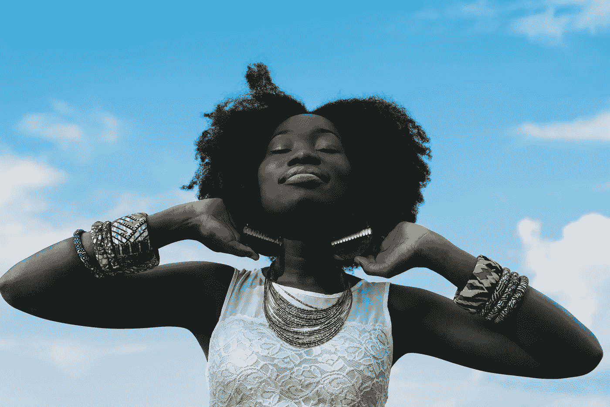

# 选择乐观(即使别人都不乐观)

> 原文：<https://medium.datadriveninvestor.com/choose-optimism-even-when-nobody-else-is-6e41c467c7b9?source=collection_archive---------9----------------------->

有意的行为揭示了别人拒绝看到的光明面。
(二手灵感项目)

Photo by [nappy](https://www.pexels.com/@nappy?utm_content=attributionCopyText&utm_medium=referral&utm_source=pexels) from [Pexels](https://www.pexels.com/photo/woman-wearing-white-sleeveless-lace-shirt-935985/?utm_content=attributionCopyText&utm_medium=referral&utm_source=pexels)

**二手灵感项目从一句励志名言开始，在创意之路蜿蜒的任何地方冒险。**

> "大多数人认为自己有多幸福，就有多幸福。"—亚伯拉罕·林肯

今年是黑天鹅事件超载的一年，冠状末日、谋杀黄蜂(我打赌他们还在等着伏击我们)、经济困境、社会动荡和种族紧张都在啃噬着社会的肌体。

这种消极的氛围让人无法抗拒，即使对最坚定的理想主义者来说也是如此。

在这种混乱中，很容易忘记我们在日常生活中还有选择。即使在这场 2020 年的狗屎秀中，当每个人都告诉我们什么能做什么不能做时，我们仍然有选择。

我们决定我们是想成为屹耳还是流露出积极的一面。

我们决定是否让偏见和仇恨吞噬我们的灵魂。

我们决定是否陷入有害的常规或保持乐观的态度。

人们终其一生都在寻找幸福，却从来没有意识到这是一种选择，而是取决于他们每天有意识地选择幸福。当感觉世界在积极限制我们的选择时，尤其如此。

现在我不会撒谎了——这的确需要很大的精神毅力。

有韧性的人拒绝被他们的环境挟持，他们不寻求人或财产的价值。他们认识到，当我们停止追求世界上有缺陷的幸福定义时，我们开始看到体验快乐的决定一直都存在。

Photo by [Andrea Piacquadio](https://www.pexels.com/@olly?utm_content=attributionCopyText&utm_medium=referral&utm_source=pexels) from [Pexels](https://www.pexels.com/photo/close-up-photo-of-a-woman-listening-to-music-813940/?utm_content=attributionCopyText&utm_medium=referral&utm_source=pexels)

但是仅仅知道乐观是一种选择并不足以实现它。完全体验它仍然需要每天做出有意识的决定来选择有建设性的选择——即使我们带着悲观的心态醒来。

如果你是一个苦苦挣扎的作家，一整天都在寻找原始材料和发人深省的想法，对创造的机会保持感激。

如果你想健身，但目前生活单调，去跑步，而不是感到沮丧、停滞不前或没有出路。

如果你被迫在家工作，把这个场景看作是一份礼物和一个与家人共度额外时间的机会。

如果你和一个重要的人关系不太好，把这段关系看作是一种激情，而不是一种义务。

如果你面临财务困境，把它作为一个机会，预算掉一些你浪费金钱的多余开支。

即使你运气不好，也要把这个世界看成充满了可能性，而不是陷阱。

如果你有一个艰难的童年，向前看，而不是纠结于过去的苦难。

如果你在工作中损失了时间，把这些额外的时间用在你的兼职上。

如果你感到无聊，每天晚上读书，而不是看无聊的电视。

如果你觉得被生活束缚了，那就去上网络课，拓展视野。

如果你有压力，早上做一些有意识的事情(比如瑜伽、冥想或伸展运动)，而不是马上浏览社交媒体。

我们积极地决定是做守财奴还是空想家。这才是你能站在六英尺之内的新闻！在 COVID 的这段时间里，我们都适应并改变了我们的生活方式。但这并不意味着我们已经完全失去了控制。

变化可能令人恐惧，但也可能鼓舞人心。

我们可以哀叹事情有多糟糕，或者我们可以扩大视野，关注有益的事情。细数我们的幸福比罗列我们的烦恼更令人愉快。

我们可以皱着眉头，怒气冲冲地度过每一天，或者我们可以表现出平静和积极。带着微笑当然比愁眉不展感觉更好。

我们决定支持什么样的社会问题或政治哲学，或者我们可以选择不支持任何事业。无论哪种方式，仍然努力善待他人(即使是观点对立的人)，给予每个人尊重和善意。

这是我们的选择。

我们控制了局面。选择快乐。选择成功。尽管最近发生了混乱，但要意识到我们仍然生活在一个充满无限机遇的时代。

现代生活有有害和有益的一面。我们必须决定我们喜欢哪一方，然后按照我们的方式塑造它。

**阿德里安·s·波特**是一名作家、工程师、顾问和演说家。他写诗歌、短篇小说和各种主题的文章，包括创造力和个人成长。他是诗集《T4》和散文集《自我手册》的作者。在[http://adrianspotter.com/](http://adrianspotter.com/)在线拜访他。

# 附加文字

[你真了不起](https://medium.com/datadriveninvestor/you-are-amazing-274651127432?source=friends_link&sk=34312c5fa72f2109d6031c2a4b7c2e4c)

[没有污垢，就没有花朵](https://medium.com/@adrianpotter/without-dirt-there-can-be-no-flowers-581b1be16a71?source=friends_link&sk=37d7e1543e7be4bd52e239b10e1a3685.)

[让我感到恐惧的四句名言](https://medium.com/datadriveninvestor/four-quotes-that-pulled-me-out-a-funk-c76b77354df5?source=friends_link&sk=29b2f6b71ed819b43424d68eff806d6c)