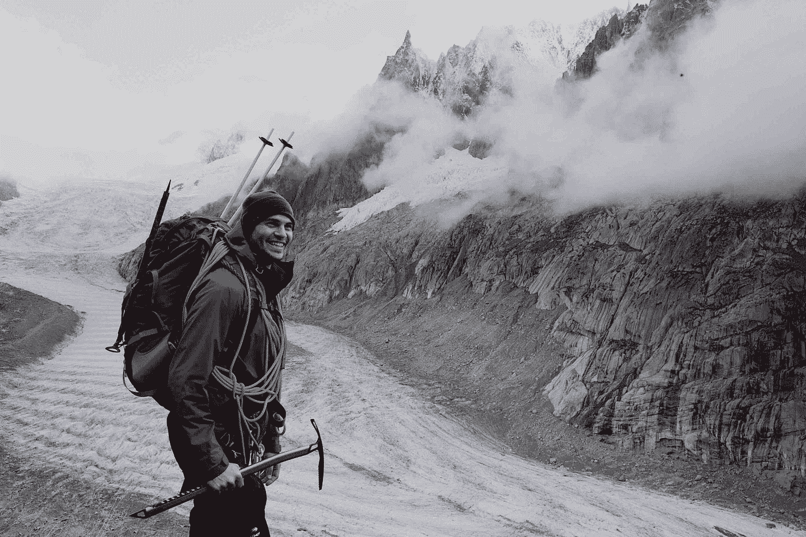

# 选择激情而不是旁敲侧击

> 原文：<https://medium.datadriveninvestor.com/choose-passion-over-a-side-hustle-909d2a347cdb?source=collection_archive---------18----------------------->

## 有一份你讨厌的工作就足够了，至少热爱你的副业。

Photo by [Sheshan R](https://unsplash.com/@thelankankid?utm_source=medium&utm_medium=referral) on [Unsplash](https://unsplash.com?utm_source=medium&utm_medium=referral)

> 从今天开始，明天赚取你的第一个 1000 美元。
> 
> 这很简单，看看蒂姆，我的格式客户，现在过着他的梦想生活。
> 
> 你还在等什么？

我知道你以前看过这样的广告。

也许你甚至考虑购买在线课程、观看网上研讨会或购买会员资格。

我去过那里。

我花了整整一年的时间追逐金钱。你可以在这里阅读更多相关信息[。](https://medium.com/datadriveninvestor/how-i-invested-one-year-in-becoming-a-profitable-forex-trader-and-then-stopped-trading-completely-13c73dadb374)

# 钱是必要的，但是

我住在世界上最富有的国家之一，我的桌子上总是有食物。所以我永远不会说钱不是必需的。因为我敢肯定，住在街上的人会喜欢有更多的它。

然而，在某一点之后，更多的钱并不会让你在比例上更快乐。

对于年轻一代来说，仅仅工作、赚钱、支付账单、纳税和为退休储蓄已经不够了。

 [## 良好的生活是习惯的形成|数据驱动的投资者

### 过度思考是过度紧张。仅仅几个简单的习惯就会在一天中产生巨大的影响。那是…

www.datadriveninvestor.com](https://www.datadriveninvestor.com/2020/01/17/a-good-life-is-habit-forming/) 

相反，我们在寻找不仅能让我们快乐和满足，而且能让世界变得不同的工作。

# 如何找到你的完美工作

日本的冲绳岛是著名的蓝色区域之一，那里的人们比平时活得长得多。除了营养和富有成效的社会生活， *ikigai* 似乎是长寿的一个必要因素。

*Ikigai* 是你喜欢做的事情，你擅长的事情，这个世界需要的事情，以及别人愿意为你付出的事情之间的横截面。

Image: Toronto Star

**通过问自己:**

1.我喜欢做什么？

2.我擅长什么？

3.我现在或将来能得到什么报酬？

4.世界需要什么？

你可以感觉到什么是你的 ikigai。如果你找到了你的 ikigai，你的工作就不再是工作而是实现你人生愿景的工具。

在这里，我写了如何创建一个引人注目的愿景:

 [## 为你 2020 年的生活创造一个强大愿景的 10 个步骤

### 你会成为你相信你能成为的人——现在就开始为你的生活制定一个令人信服的愿景吧！

medium.com](https://medium.com/datadriveninvestor/10-steps-to-create-a-powerful-vision-for-your-life-in-2020-23c6e2a00bdb) 

# 我缺乏技能、信心或文凭来开始我的激情生活。

> 辞职并全力以赴听起来可能很英雄，但这通常是愚蠢的。

你可以从你想要的开始。作为一个新手，最大的好处是你可以快速适应。你是发号施令的人。通过反复试验，你会很快变得更好。在社交媒体这样的新行业，我们必须转换思维。我们不能再去学校学理论，然后在有经验的专业人士指导下开始工作。你在课堂上学的东西很可能已经过时了。

我说这些不是为了打击你；我希望你们认识到，今天比以往任何时候，你们的信念都掌握在自己手中。如果你发现你的激情和新技术之间的重叠，今天就开始实验和测试，你很快就能成为专家。

没有什么比擅长你热爱的事情更有回报的了。你不需要得到批准就可以这么做。

# 克服绝望之谷

即使你热爱你正在做的事情，也会有事情变得艰难的时候。

然后是时候了，对自己说实话，这是你必须决定你所做的是你真正的激情还是只是一场美丽的小恋爱的时刻。即使很难，你仍然热爱你正在做的事情吗？还是你把金钱、快速进步、积极反馈错当成了激情？

如果你仍然对你正在做的事情充满热情，采取以下三个步骤来克服绝望的低谷:

**1。重新确立你的总体目标**
回想一下你当初为什么要开始。如果你缩小视野，你会意识到你现在的处境只是你旅途中一个微小但重要的垫脚石。不要放弃，回去工作。

**2。关注过程**
不要纠结于结果。作为一个天生的健美运动员，我必须在早期就学会这一点。不能举重若轻，立竿见影。相反，你必须确保你的过程尽可能合理。相信过程，结果就会到来。

**3。庆祝进步**
但是一旦你看到结果——像一个大胜利一样庆祝它们。不要等到你庆祝的时候。每一个小小的成就都值得庆祝。这将帮助你进入一个向上的螺旋。

# 外卖

如果你看看你的长期目标。你现在的工作是正道吗？

没有吗？

好吧，那么是时候去寻找别的东西了。

不要辞掉目前的工作。做点副业。但是不要错误地选择短期内能给你带来最多钱的东西。

取而代之的是，选择你有激情的事情，让你更接近你的总体目标的事情，作为奖励，使用新技术的事情。

小步前进，不要气馁，永远不要停止进步。

## **准备变得无限？**

如果你想变得无限并大大加快你的学习速度，看看我的小抄:

[点击此处立即获取备忘单！](https://roadtolimitless.com/cheatsheet/)