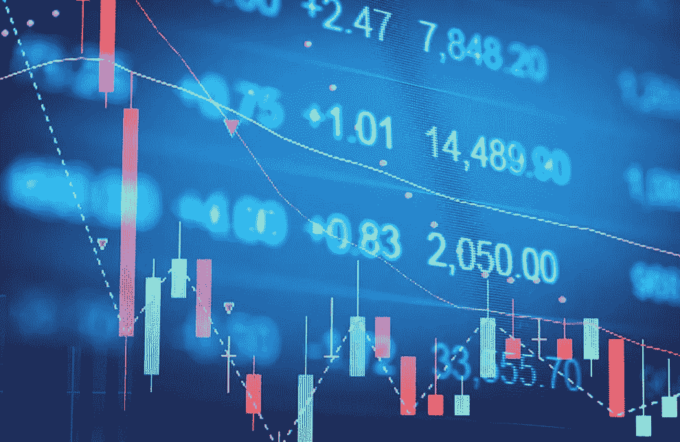
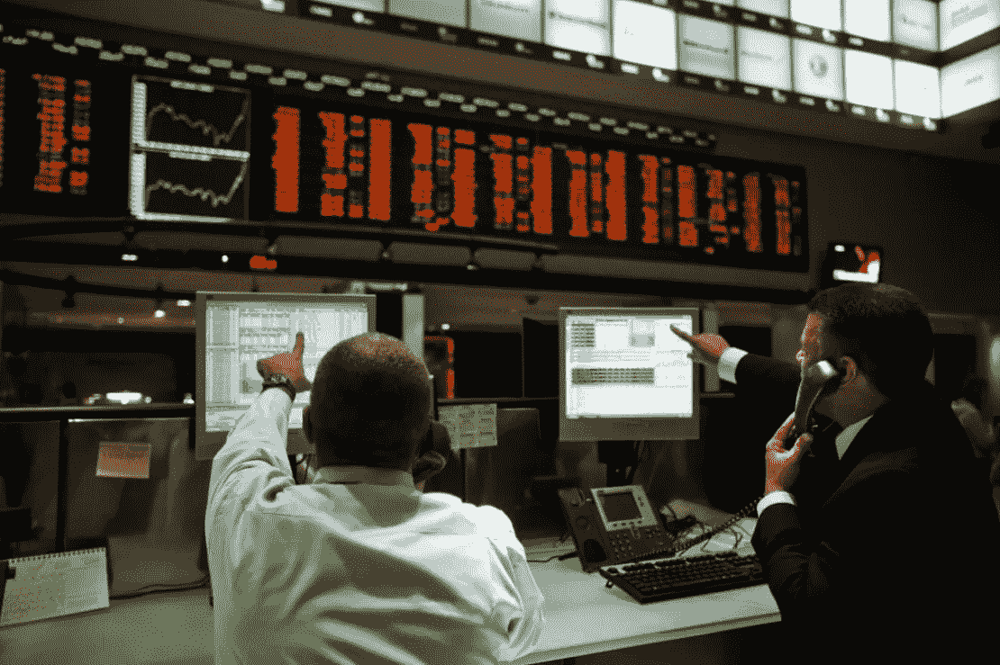

# 断路器和行为经济学

> 原文：<https://medium.datadriveninvestor.com/circuit-breaker-and-behavioral-economics-97458a806ecc?source=collection_archive---------23----------------------->

由于市场非常不稳定，本周巴西 B3 证券交易所启动了熔断机制。在本帖中，我们将解释断路器及其与行为经济学的关系。

# **什么是断路器？**

这是一种在 B3(巴西证券交易所)启动的机制，旨在遏制股票交易中的突然波动。

在市场非常不稳定(波动)的日子里，熔断机制可以有所帮助，减少投资者的紧张情绪，遏制因恐惧或害怕错过大多数人采用的运动或“知识”而激发的冲动。

B3: Brazilian Stock Exchange

# **断路器作为一种行为经济学机制**

我认为断路器是一种激活投资者系统的机制 2。这样，由于市场的巨大不稳定性和证券交易所的谈判，投资者赢得了时间，以便他们可以考虑该做什么。

 [## 为什么包容性财富指数比 GDP 更能衡量社会进步？|数据驱动…

### 你不需要成为一个经济奇才或金融大师就能知道 GDP 的定义。即使你从未拿过 ECON 奖…

www.datadriveninvestor.com](https://www.datadriveninvestor.com/2019/03/08/why-inclusive-wealth-index-is-a-better-measure-of-societal-progress-than-gdp/) 

B3 的这种机制，也可以被视为阻止投资者羊群行为的一种尝试。另一个功能与行为经济学有关。

当投资者不确定如何行为或决定时，他们可能会选择跟随大多数人的动向，从而增加市场波动。

就决策而言，当我们对如何行事有疑问时，这种行为是很典型的，因此，我们的决定是基于他人正在做的事情。在这种情况下，典型的动机是社会证明。

这也可能是投资者担心没有理解这一时刻，或者只是担心被遗漏而采取的行动。

因为每个人都很恐慌…

有时由于不安全感、无知或恐惧，我们认为最好的决定是跟随大多数人。问题是这并不总是正确的。

下次再见，好的投资，不要惊慌！

***原载于 geekonomics.com.br***