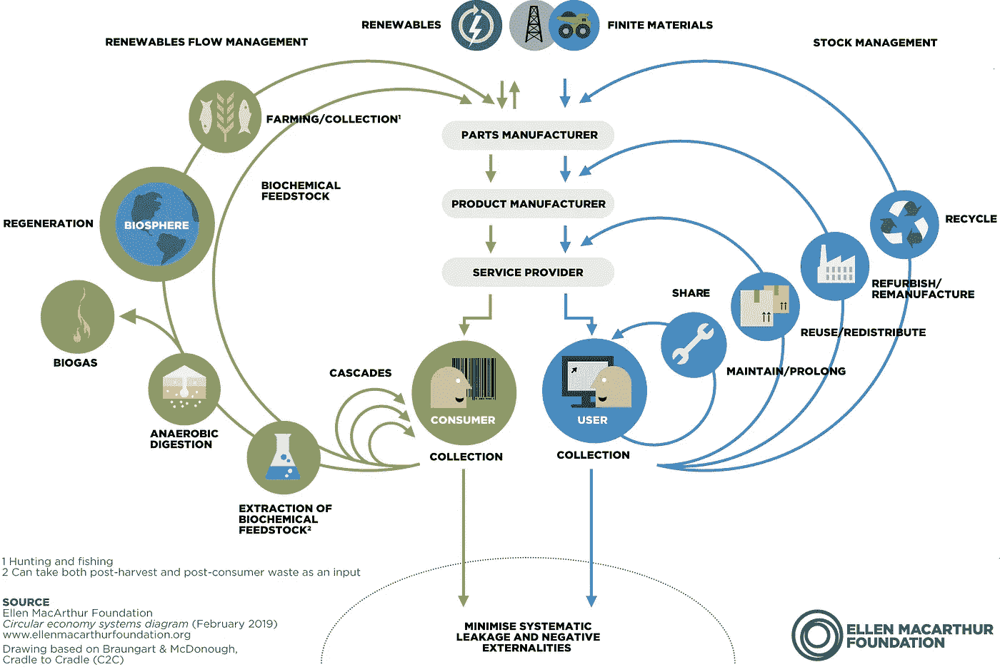

# 循环经济和循环利用:蝴蝶要说什么？

> 原文：<https://medium.datadriveninvestor.com/circular-economy-and-recycling-what-does-the-butterfly-have-to-say-507fa9d7a91b?source=collection_archive---------4----------------------->

当我解释循环经济就是保持材料的使用时，我得到的一个经典答案是

> “哦，所以基本上是回收。”

虽然肯定不是跑题，回收和循环经济是不一样的。

蝴蝶是这样解释循环经济的:

但是蝴蝶到底是什么呢？

> 蝶形图模拟了循环经济中不同的物流。

绿色的是那些生物材料，它们可以重新进入自然界，并随着时间的推移进行生物降解，没有污染的风险。在经历了几个循环中的一个之后，营养物将被返回到环境中。

蓝色的是技术材料，如塑料或合成化学品，它们不能重新进入自然界，需要通过一个系统不断循环，以捕捉和重获它们的物质价值。

如果我们关注技术材料的流动(蓝色)，我们会注意到不同的循环，每个循环都有不同的值，这取决于它们离中心有多近。

 [## 另一场精心策划的全球经济危机正在逼近？如果我们的数据经济可以帮助它|数据…

### 我们的 DApp 的开发，称为 DECENTR，目前正与我们的 R&D 同步进行，作为我们即将到来的…

www.datadriveninvestor.com](https://www.datadriveninvestor.com/2019/03/06/another-engineered-global-economic-crisis-looming-not-if-our-data-economy-can-help-it/) 

*   第一个也是最里面的循环包括维持产品和材料在经济中尽可能长的时间而不产生浪费。由于循环经济是对有限自然资源的战略性利用，持久性消除了创造新产品的需要。为此，产品制造商**必须为维护和维修**进行设计。
*   第二个循环显示了一个策略，该策略赋予产品**重用**或**再分配**给新用户的原始形式，几乎没有增强。像易贝这样的数字市场是重用和共享是有效且成熟的方法的例子。尽管需要创新的商业模式来保持对线性替代方案的竞争力。新的应用技术，如人工智能可以有所帮助。
*   第三个循环包括**修复已经损坏的**物体和**整修**那些需要更换的部件，以恢复损失的价值，而不是丢弃。
*   **最后是回收利用**或将一种产品还原到其最基本的物质水平，以便转化为其他产品。同样，如果这是大多数不熟悉循环模式的人所联想到的，那么回收实际上只是循环经济的一个子类。

现在，从垃圾桶到回收工厂，从垃圾到非物质化，回收需要劳动力以及资源和能源的使用，材料在这个过程中不可避免地会丢失。完全重新制造一个产品成本很高，因此效率不高。虽然重要，但回收提供了该图中最低的价值循环，这有利于再利用和再制造。

论循环经济

当前的经济体系不再为企业、人民或环境服务。我们从地下获取资源来制造产品，我们使用这些产品，当我们不再需要它们时，就把它们扔掉。每秒钟，相当于一卡车纺织品被填埋或焚烧。我们有一系列有限的材料正在被用完。

我们做事的方式已经到了极限。

循环经济通过蝴蝶提供了另一种途径，一种通过设计恢复和再生的途径。