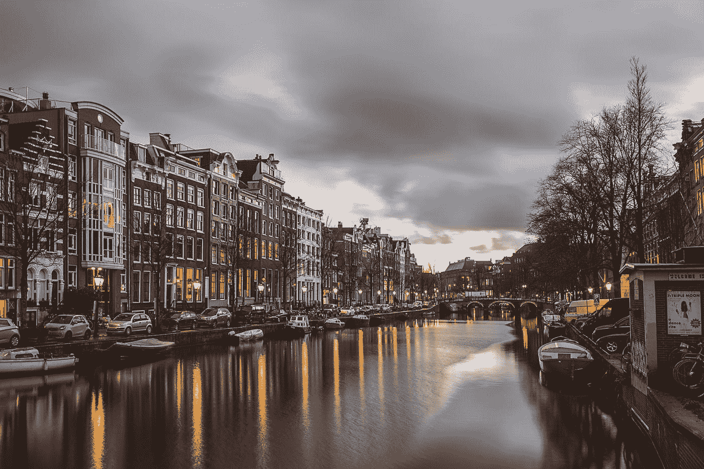
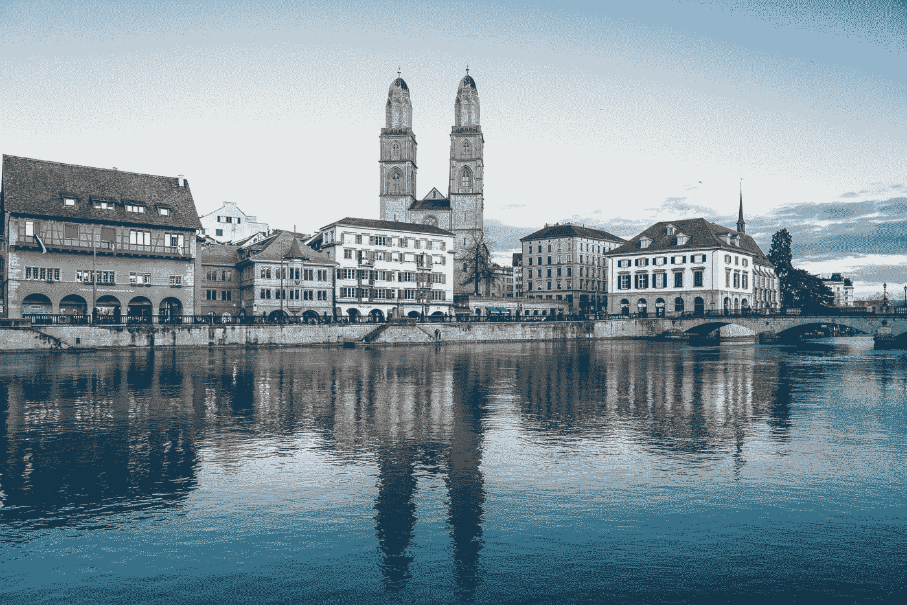
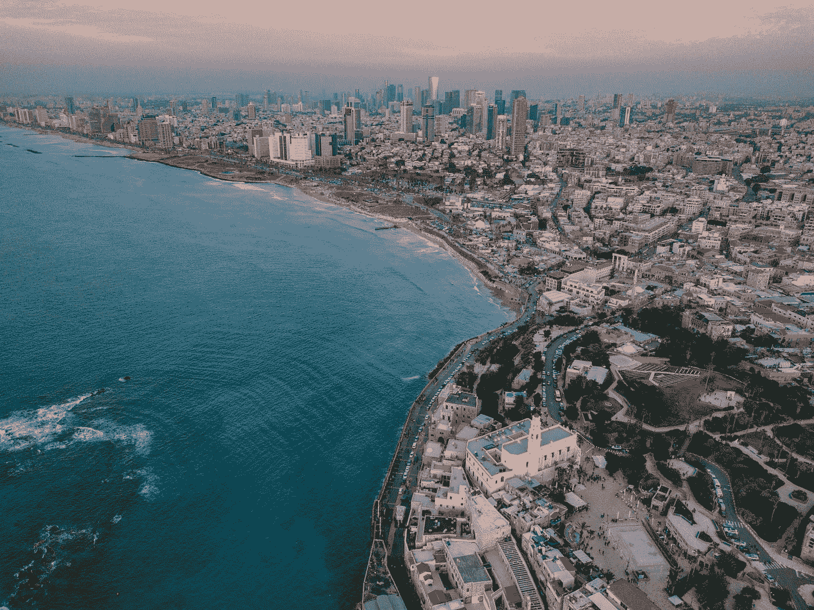
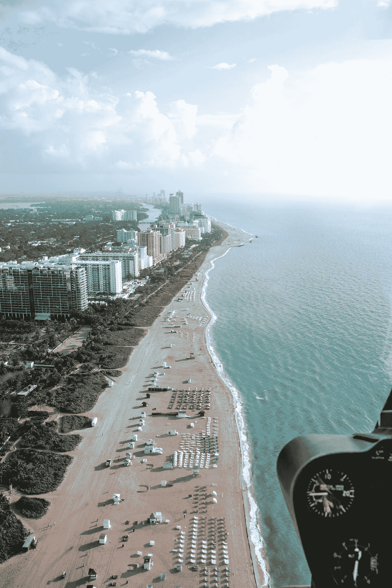
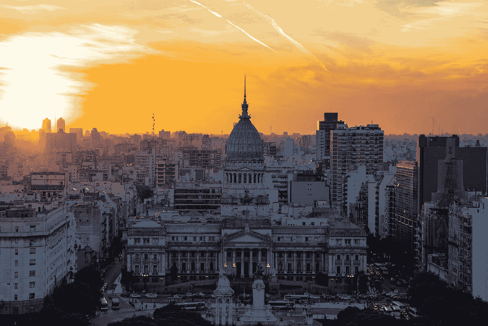

# 2020 年接受比特币的城市

> 原文：<https://medium.datadriveninvestor.com/cities-that-embrace-bitcoin-in-2020-7baf86cd3326?source=collection_archive---------21----------------------->

比特币是世界上第一种也是最受欢迎的加密货币。懂加密货币或区块链技术的人都知道“比特币”。第一枚比特币于 2009 年被挖掘出来，并在加密货币领域留下了印记，同时它正稳步发展成为数字货币世界更大图景的一部分。此外，现在我们许多人都想投资和储存比特币，而许多人已经开始接受比特币进行支付和交易。有趣的是，随着国际金融中心的建立。小城镇也在拥抱比特币空间。

# **在本文中，我们列出了 2020 年拥抱比特币的 10 个城市，是当今世界的比特币热点:**

# ***1。阿姆斯特丹***

Photo by [Azhar J](https://unsplash.com/@azhrjl?utm_source=medium&utm_medium=referral) on [Unsplash](https://unsplash.com?utm_source=medium&utm_medium=referral)

阿姆斯特丹是两家知名加密公司的所在地——支付服务提供商 BitPay 的欧洲总部和领先的矿业软件公司 Bitfury。

该市有大约 12 台比特币自动取款机和 30 多家接受比特币的企业，如自行车租赁店、古董戒指店、理发店等，海牙、鹿特丹和乌得勒支的商家也接受加密货币。

# **2。旧金山**

Photo by [Joseph Barrientos](https://unsplash.com/@jbcreate_?utm_source=medium&utm_medium=referral) on [Unsplash](https://unsplash.com?utm_source=medium&utm_medium=referral)

据说旧金山是美国的创新中心和科技之都，也是加密货币交易平台的所在地，如比特币基地和北海巨妖。它还以硬币大会和旧金山比特币会议的名义召开会议。

超过 20 家接受比特币的企业，包括面包店、酒吧、餐馆、精神病医生葡萄园、商业顾问等等，还有 19 个购买比特币的自动取款机。

# **3。苏黎世**

Photo by [🇨🇭 Claudio Schwarz | @purzlbaum](https://unsplash.com/@purzlbaum?utm_source=medium&utm_medium=referral) on [Unsplash](https://unsplash.com?utm_source=medium&utm_medium=referral)

苏黎世是瑞士主要的金融中心，也是世界上最适宜居住的城市之一。

它有大约 20 多家接受比特币的企业和 10 多台自动取款机。

 [## 稳定币会危及比特币在加密领域的地位吗？数据驱动的投资者

### Stablecoin 是一种加密货币，主要用于维持稳定的市场价值。它可以通过…

www.datadriveninvestor.com](https://www.datadriveninvestor.com/2020/06/08/can-a-stablecoin-jeopardize-the-position-of-bitcoin-in-the-crypto-space/) 

*根据比特币市场杂志的文章—*[*2020 年有多少人使用比特币*](https://www.bitcoinmarketjournal.com/how-many-people-use-bitcoin/#:~:text=While%20active%20bitcoin%20users%20are,another%20736%20million%20users%20globally.)*；全球超过 580 万人是活跃的比特币用户。*

# **4。纽约**

Photo by [Oliver Niblett](https://unsplash.com/@ojnibl?utm_source=medium&utm_medium=referral) on [Unsplash](https://unsplash.com?utm_source=medium&utm_medium=referral)

纽约是金融和技术中心，也是世界金融之都。它是名为 Gemini 的加密交易所的所在地，华尔街公司是探索区块链的一部分，以将其作为金融业的工具，并主办比特币会议，如拉瓜迪亚社区学院的比特币活动。

它有超过 36 家企业，有 14 台自动取款机可以购买比特币。

# **5。伦敦**

Photo by [Eva Dang](https://unsplash.com/@evantdang?utm_source=medium&utm_medium=referral) on [Unsplash](https://unsplash.com?utm_source=medium&utm_medium=referral)

coin floor——英国的一家比特币交易所声称自己是运营时间最长的交易所。伦敦也有比特币和加密货币聚会团体。伦敦剧院区是首批允许使用比特币的票务公司之一。

它有大约 50 家接受比特币支付的企业，有超过 130 台比特币自动取款机。

# **6。特拉维夫**

Photo by [Shai Pal](https://unsplash.com/@shaipal?utm_source=medium&utm_medium=referral) on [Unsplash](https://unsplash.com?utm_source=medium&utm_medium=referral)

特拉维夫是以色列的金融中心，也是创业公司的领先城市之一。以色列比特币聚会小组是最活跃的小组之一，拥有 3800 多名成员。

它有十几家接受比特币的企业，还有两台比特币自动取款机。

# **7。温哥华**

Photo by [Aditya Chinchure](https://unsplash.com/@adityachinchure?utm_source=medium&utm_medium=referral) on [Unsplash](https://unsplash.com?utm_source=medium&utm_medium=referral)

温哥华是加拿大的一个城市，也被称为“比特币之都”,在这里经常可以看到写有“此处接受比特币”的招牌。加拿大有一个强大的比特币社区，并有一个虚拟货币的监管框架。它是 QuadrigaCX 的所在地，QuadrigaCX 是已倒闭的加密货币交易所，被认为是加拿大最大的加密交易所。该交易所于 2019 年停止运营，并宣布资产约 2，800 万加元和负债 2.157 亿加元破产。世界上第一台比特币自动取款机于 2003 年 10 月在温哥华的 Waves 咖啡屋启动。

温哥华有二十多家接受比特币的企业和 40 台购买比特币的自动取款机。

# **8。佛罗里达州坦帕**

Photo by [Mark](https://unsplash.com/@mprage?utm_source=medium&utm_medium=referral) on [Unsplash](https://unsplash.com?utm_source=medium&utm_medium=referral)

它有 40 多家接受比特币支付的企业，还有 45 台比特币自动取款机。此外，在某些市场，你可以很容易地用比特币支付，他们也使用闪电网络。那里的每个人都可以很容易地使用它，并且有很多选择来花费它。

# **9。阿根廷布宜诺斯艾利斯**

Photo by [Sander Crombach](https://unsplash.com/@sandercrombach?utm_source=medium&utm_medium=referral) on [Unsplash](https://unsplash.com?utm_source=medium&utm_medium=referral)

阿根廷的布宜诺斯艾利斯拥有世界上第二多的比特币交易。它也被称为阿根廷的“比特币之都”。

它有超过 100 家接受比特币的企业和大约 11 台比特币自动取款机。

# **10。斯洛文尼亚卢布尔雅那**

Photo by [Amel Majanovic](https://unsplash.com/@just_amelo?utm_source=medium&utm_medium=referral) on [Unsplash](https://unsplash.com?utm_source=medium&utm_medium=referral)

广受欢迎的比特币交易所 Bitstamp 是由斯洛文尼亚人创建的，后来才在伦敦和卢森堡开展业务。这是比特币投资者和技术中心的所在地之一。

它有大约 200 家接受比特币的企业和 4 台比特币自动取款机。

PayPal 的联合创始人彼得·泰尔(Peter Theil)说，“我确实认为比特币是第一种有潜力改变世界的加密货币。”

加密货币正在发展，并出现在每个意想不到的角落，因此很明显，比特币将很快成为最受信任和最受采用的加密货币。

**进入专家视图—** [**订阅 DDI 英特尔**](https://datadriveninvestor.com/ddi-intel)