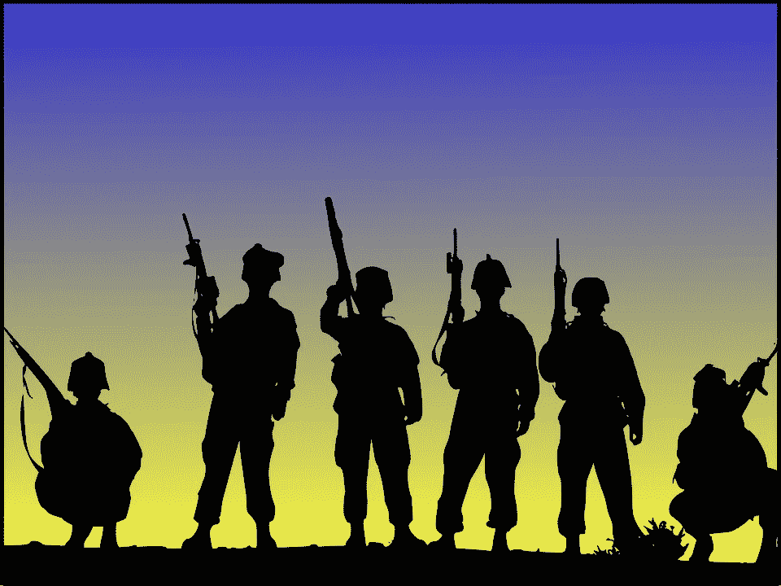

# 内战开始了

> 原文：<https://medium.datadriveninvestor.com/civil-war-has-begun-2dc95e5c5be8?source=collection_archive---------4----------------------->

## 政治

## 下一个会是你的州吗？

Photo by [Clker-Free-Vector-Images](https://pixabay.com/users/clker-free-vector-images-3736/) on [Pixabay](https://pixabay.com/vectors/soldiers-military-army-militia-311925/)

《纽约时报》报道称，13 名男子因恐怖主义、阴谋和武器指控在密歇根州被捕。一个组织计划绑架州长格雷琴·惠特莫，并以叛国罪审判她。另一个组织计划突袭国会大厦，推翻州政府。两个团体都不满意州长关于封锁以对抗冠状病毒的政策。

是的，你没看错。两个所谓的民兵组织自行推翻了正式选举产生的州长和州政府，因为他们声称控制冠状病毒传播的行动是违反宪法的。

 [## 区块链投票和美国选举|数据驱动的投资者

### 在不到 70 天的时间里，这个世界上最古老的民主国家将以前所未有的方式面临最大的摊牌…

www.datadriveninvestor.com](https://www.datadriveninvestor.com/2020/08/26/blockchain-voting-and-the-american-elections/) 

关键是。私人民兵组织是违宪的。许多民兵声称保卫的第二修正案只授权各州征召民兵进行防卫，因为在宪法制定的时候，还没有常备军。

所有的州都宣布私人民兵为非法，他们这样做的权利得到了最高法院的支持[。因此，这些团体不仅行为非法，他们的组织也是非法的。](https://law.jrank.org/pages/10067/Second-Amendment-PRIVATE-MILITIAS.html)

州长指责特朗普拒绝谴责白人至上主义者。他的狗向骄傲的男孩吹口哨“退后，袖手旁观”，被民兵组织用来鼓励对他们认为的敌人使用暴力。

许多人预计，如果特朗普输掉选举，可能会出现暴力和内战，但我认为没有人会预料到它会在选举日之前开始。

我不得不同意惠特莫州长的观点。这是特朗普的错。几个月来，他一直声称，如果他赢不了，选举就会被操纵。他努力压制投票，鼓励他的支持者在选举日亲自监督投票，并表示如果他失败，他不会将权力移交给拜登。

现在，因为他的追随者相信他会赢，他们不再等待选举来推翻民主党州的政府。你知道，AG Barr 宣布的州包含“无政府主义管辖区”的城市

民兵组织认为，他们正在遵循特朗普的愿望，重新开放各州，将经济从萧条的边缘带回来，所以为什么要等到选举结束后，他才会赢呢？

我认为在选举之前不会有很多暴力事件。我们现在看到的只是一些小冲突。但你应该利用选举前的时间做好准备。做好准备，好像暴风雨要来了。

确保你家里的每个人都有两周的食物和水供应。补充你的处方。如果你有宠物，就储备宠物用品。让你的汽车油箱装满油。

一场暴风雨即将来临。叫做特朗普如果输了就拒绝接受选举结果。街上会有暴力。供应链将被打乱。人们会死，因为特朗普不明白宪法和政府是如何运作的。

他不明白他既不能使用军队也不能使用私人军队来执行他的命令。他不懂分权。他不明白，当他被投票罢免时，他必须和平地将权力移交给拜登。

我的建议是抱最好的希望，做最坏的打算。

## 访问专家视图— [订阅 DDI 英特尔](https://datadriveninvestor.com/ddi-intel)