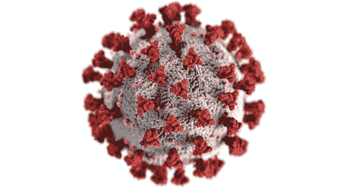
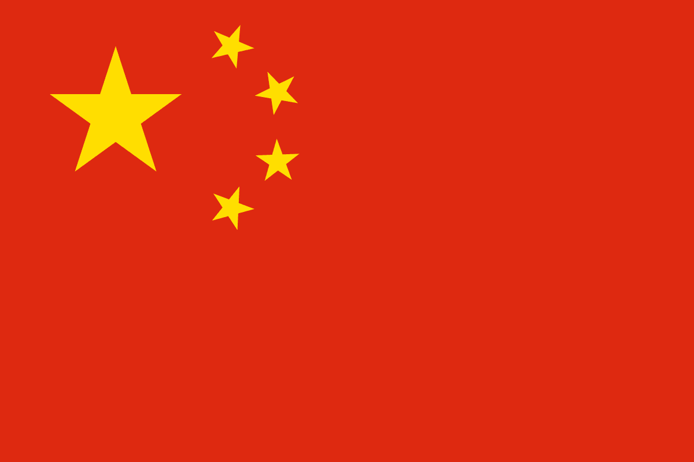
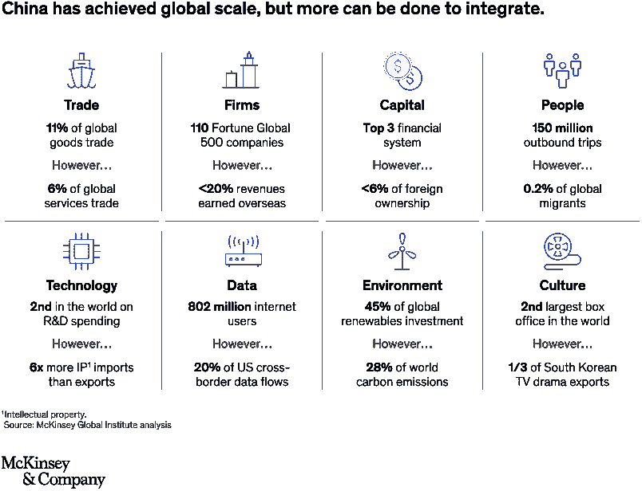
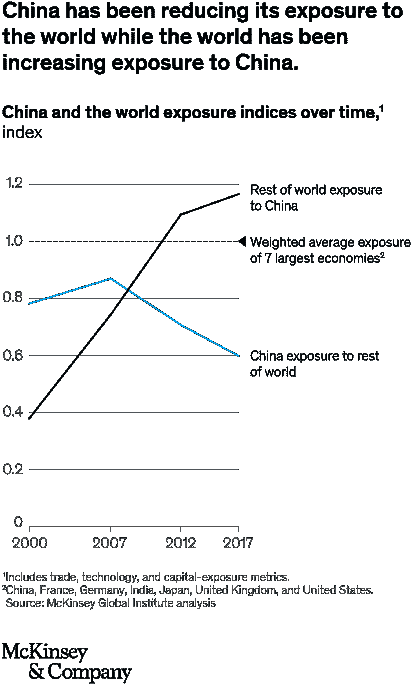
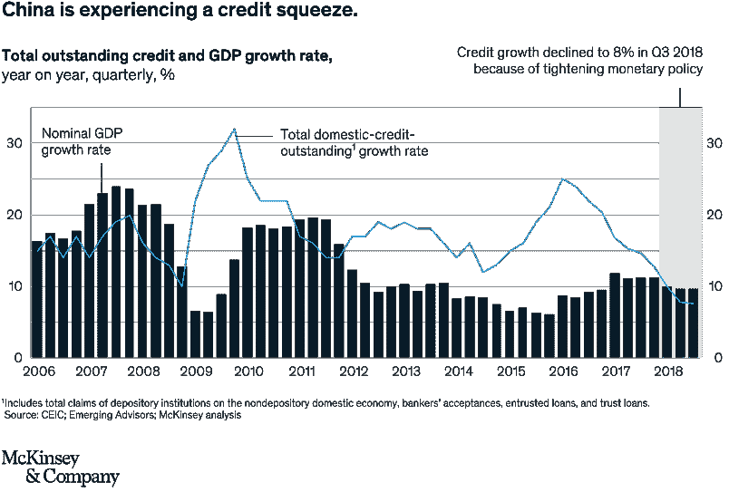
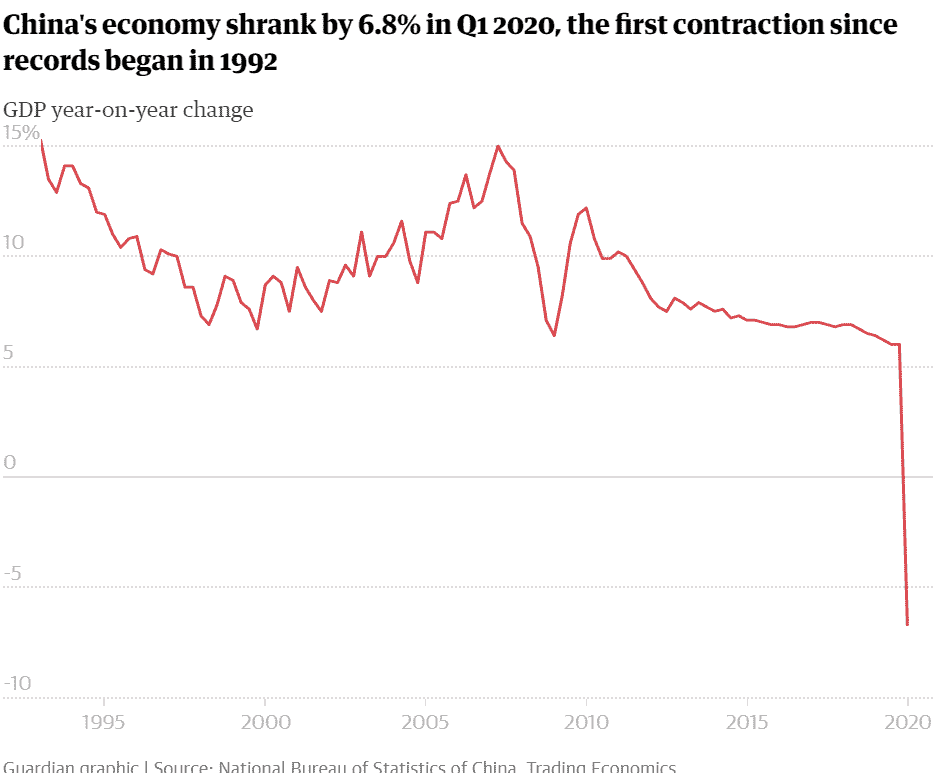

# 与科罗纳…或中国的冲突！

> 原文：<https://medium.datadriveninvestor.com/clash-with-corona-or-china-edae94b2e67b?source=collection_archive---------7----------------------->

> 概述中国与其他国家的关系，以及冠状病毒的爆发将如何影响中国。

冠状病毒爆发于 2019 年 12 月初在中国湖北省武汉市首次出现。2019 年 12 月 10 日，该市华南市场的一名海鲜商人患病，该市场出售包括蝙蝠在内的野生动物作为食物。到 12 月 18 日，她将与其他几个商人一起住进医院。从那以后，它传遍了全球。

一项新的研究表明，冠状病毒可能会持续两年以上，并可能感染高达 60-70%的世界人口，这对经济来说似乎不是好事。中国及其参与受到质疑，许多国家可能不愿意与中国进行贸易或接触。

## **恒星中的断层**

China’s Flag (It has stars)

特朗普推测，由于某种可怕的“错误”，中国可能已经向世界释放了冠状病毒。特朗普甚至暗示释放可能是故意的，并声称已经看到了证据。美国国家情报总监办公室表示，已经排除了病毒是人为的，这表明疫情病毒的可能来源仍然是自然的，它从受感染的动物传播到人类。

> “中国病毒”
> 
> 川普多次使用这个词[，明确指责中国是疫情爆发的原因。](https://theconversation.com/donald-trumps-chinese-virus-the-politics-of-naming-136796)

据三名美国官员说，美国情报部门在一份提交给白宫的机密报告中得出结论，中国隐瞒了冠状病毒在中国爆发的程度，少报了该疾病的总病例数和死亡人数。尽管中国最终实施了严格的封锁，但国内外对中国报告的数字仍有相当大的怀疑。

世界卫生组织的角色也受到质疑，因为它很晚才宣布疫情为疫情。在最初阶段，世卫组织质疑禁止乘飞机前往中国的国家，并试图淡化疫情，称疫情没有那么危险，各国不应停止与中国的旅行和贸易。这是一个表明中国可能控制世卫组织的争议。

中国现在已经解除封锁，大部分经济活动似乎正在恢复。外出的普遍情绪降低了。商业萧条，生产下降。人们仍然害怕第二次浪潮。人们带着口罩外出，采取了更多的预防措施。

 [## 如果资本主义失败了，那么还有什么选择呢？数据驱动的投资者

### 在当前政治领域的修辞之旅中，我们都可以面对面地接触到流行词汇，如…

www.datadriveninvestor.com](https://www.datadriveninvestor.com/2020/03/16/if-capitalism-is-a-failure-then-what-is-the-alternative/) 

作为病毒源头的中国已经开始恢复正常生活，这使人们对中国的参与产生了怀疑，许多阴谋已经浮出水面。世界各地的许多政治领导人都提出了这个问题，并为此谴责中国。

## **电晕前**

按购买力平价计算，中国在 2014 年成为世界上最大的经济体。按名义价值计算，2018 年中国国内生产总值是美国的 66%，成为世界第二大经济体。2018 年，中国占世界 GDP 的 16%。中国继续以世界上最令人羡慕的速度增长，每年增加相当于“另一个澳大利亚”的数量。

Source: [McKinsey & Company](https://www.mckinsey.com/featured-insights/china/china-and-the-world-inside-the-dynamics-of-a-changing-relationship)

中国在 2009 年成为世界上最大的商品出口国，在 2013 年成为最大的商品贸易国。中国在全球商品贸易中的份额从 2000 年的 1.9%升至 2017 年的 11.4%。从 2015 年到 2017 年，中国也是世界第二大对外直接投资来源国和第二大内向外国直接投资接受国。然而，中国的金融体系仍远未全球化。2018 年，外资所有权仅占中国银行体系的约 2%，中国债券市场的 2%，以及中国股市的约 6%。

中国是出境学生(2017 年 54.5 万人)和游客(2018 年 1.5 亿人次)的最大来源。相比之下，中国入境学生和游客仅占全球总数的一小部分，仅占全球海外学生人数的 3%，占 2017 年海外旅行的 4%。

中国的研发支出规模飙升——国内 R&D 的支出从 2000 年的约 90 亿美元升至 2018 年的 2930 亿美元——位居世界第二。中国的技术进口合同在地理上高度集中——31%来自美国，21%来自日本，10%来自德国。

中国更倾向于国内消费。2017 年至 2018 年，约 76%的国内生产总值增长来自国内消费，而净贸易对国内生产总值增长的贡献为负。

Source: [McKinsey & Company](https://www.mckinsey.com/featured-insights/china/china-and-the-world-inside-the-dynamics-of-a-changing-relationship)

世界其他地区对中国的敞口越来越大，反映出中国作为市场、供应商和资本提供者的重要性日益增加。中国占全球制造业产出的 35%。此外，在包括汽车和手机在内的一些品类中，中国在全球消费中的份额达到 30%或以上。中国的消费市场已经与世界高度融合，跨国公司的渗透也相当可观。

Source: [McKinsey & Company](https://www.mckinsey.com/featured-insights/china/china-and-the-world-inside-the-dynamics-of-a-changing-relationship)

甚至在病毒爆发前，中国就经历了信贷紧缩。贸易争端成为每日头条，评估技术流动的新规则正在出现，地缘政治紧张局势变得更加激烈。伴随着光环和争议，中国会继续成为世界经济中的一个大玩家吗？它能与其他国家保持关系吗？

## **改变关系**

**印度-**

> “我们寻求你们善意的指导和支持，以保护印度企业部门不被出售给处于困境中的中国公司，”行业机构印度微型、小型和中型企业综合协会(Integrated Association of Micro，Small and Medium Enterprises of India)在 4 月 12 日的信中说。

据估计，印度有 6，330 万个非公司制中小微型企业，雇用了 1.1 亿人。据行业估计，中小微企业贡献了印度近 30%的 GDP 和近一半的出口总额。

在此之后，中国政府对 FDI 政策中的现有条款做了一个微妙的改变，以阻止中国进入，如果你与印度(中国)有共同的陆地边界，你(或你的印度子公司)想投资一家印度公司，你现在必须得到政府的明确批准。

莫迪政府的反应非常平静，不像美国，因为在这个时候，印度需要成千上万的口罩，防护装备，通风机等。来应对新冠肺炎病毒的爆发，而这一切只能来自中国。

**美国-**

中国和美国在 1 月份签署了贸易协定的第一阶段，因为世界上两个最大的经济大国正在努力结束为期两年的针锋相对的关税战。到目前为止，这两个国家已经对价值近 5000 亿美元的商品征收了额外关税。美国对超过 3600 亿美元的中国商品征收关税，中国对超过 1100 亿美元的美国产品征收关税进行报复。

随着特朗普指责中国故意传播电晕病毒，中国可以援引协议中的一项条款，允许两国在“发生自然灾害或其他不可预见的事件”时进行新的贸易磋商，推迟任何一方验证条款得到满足的能力。

由于病毒的影响，美国也正在改变其移民法，并制定新的移民政策。

**英国-**

鲍里斯·约翰逊(Boris Johnson)做出了一个有问题的决定，允许中国电信巨头华为接入英国新的 5G 电信网络。总理将面临新的内阁压力，要求终止这一安排，因为这一决定可能会妨碍国家安全。

英国的边境贸易每年价值 250 亿美元，许多重要的经济部门都外包给中国，从汽车零部件制造到重要的制药，希望获得利润丰厚的合同。中国共产党(CCP)曾一度威胁要停止关键医疗用品的出口，行业领袖也认真考虑过将关键制造业迁回英国。

**澳大利亚-**

今年 3 月，由于越来越担心中国企业的掠夺性行为，澳大利亚政府收紧了外资收购和投资规则。澳大利亚政府现在将在其外国投资审查委员会下审查所有外国提案。在此之前，中国外国投资审查委员会不会审查大多数低于一定门槛的中国私营企业海外收购。

中国警告澳大利亚的贸易影响，因为它在特朗普政府的支持下，发起了对冠状病毒的独立调查。

> 中国媒体甚至称澳大利亚为“粘在中国鞋底的口香糖”

**德国-**

德国使得非欧盟公司更难收购德国私营企业**。**在德国，就像在英国一样，除了对在新的 5G 系统中使用华为的合理性产生新的疑问之外，对关键材料和药品依赖中国的担忧也在增加。中国驻柏林大使馆与德国报纸《图片报》公开争吵，此前该小报要求中国赔偿德国因该病毒遭受的损失 1600 亿美元。

**日本-**

在正常情况下，中国是日本最大的贸易伙伴，但由于为遏制病毒蔓延打击制造业和供应链而实施的封锁，2 月份日本从中国的进口下降了近一半。作为其经济刺激方案的一部分，日本已拨款 22 亿美元帮助其制造商将生产转移出中国。其中，2200 亿日元(20 亿美元)用于将生产转移回日本的公司，235 亿日元用于寻求将生产转移到其他国家的公司。

**其他-**

当其他国家试图质疑中国时，俄罗斯似乎在支持中国，获得中国的帮助，并与中国建立联系。这是建立感情的最佳时机。

另一方面，中国正在谴责一些政府，如法国，对危机处理不当，这可能会恶化他们之间的良好关系。中国还强迫其他国家对中国的援助表示感谢。由于日益增长的不信任和中国的天真，与欧盟的关系似乎正在恶化。

## **中国的王牌**

廉价贷款、廉价劳动力和原材料的便捷供应推动了一场制造业革命，在这场革命的推动下，中国实现了指数级增长。中国不仅在工厂内部，而且在整个制造业集群中完善了流水线式的效率，在这些集群中，与某个特定行业(比如纺织业)相关的工厂都很集中。这些集群就像一条大型装配线，中小型企业作为齿轮，高效地为更大的行业提供食物。袜子城就是这样一个位于诸暨市的集群，这里生产了世界上 30%的袜子。此外，它们还拥有优秀的出口基础设施、强大的运输系统、低税收制度(针对出口商品)，以及经常被人为贬值以提高出口成本竞争力的货币。

## **非典经历**

冠状病毒常被比作 2002 年 11 月从广东省传播到全世界的 SARS。SARS 导致约 800 人死亡，并在 17 个国家传播。与冠状病毒相比，它可以忽略不计，因为截至 2020 年 5 月 5 日，冠状病毒已经导致 25 万人死亡，并在 180 多个国家传播。

Source: [CNBC](https://www.cnbc.com/2020/02/11/coronavirus-4-charts-show-how-sars-hit-chinas-economy-in-2003.html)

根据中国国家统计局的数据，非典疫情将中国经济增长率从 2003 年第一季度的 11.1%拉低至随后三个月的 9.1%。但各种估计显示，如果没有非典的干扰，中国 2003 年的年增长率可能会高出 0.5 至 1 个百分点。非典爆发后，中国加强了医疗能力和准备工作，积累了应对疫情的经验。

根据一项分析，SARS 危机给世界经济造成了总计约 400 亿美元的损失。中国在世界经济中令人生畏的地位意味着当前疫情的影响可能远远超过 SARS。

## **收尾**

当冠状病毒迫使中国停止工业生产时，它给全世界带来了冲击波。多家企业破产，供应链破裂，包括汽车、电子、制药和医药在内的行业都严重受损。

Source: [The Guardian](https://www.theguardian.com/world/2020/apr/17/china-economy-shrinks-record-wuhan-covid-19-death-toll-rises-50-percent)

供应链不是一夜之间建成的。建立供应商网络、创造工业产能并以低成本确保质量绝非易事，这需要时间和知识。除非受到像日本这样的经济刺激，否则大公司不太可能撤出中国，而是将生产设在其他地方，即使有像越南、墨西哥这样劳动力成本较低的国家。

中国已经向 80 多个国家提供了援助。许多国家收到了有缺陷的设备和检测包，像印度、土耳其、法国等，这对它的形象是不利的。中国一直在指责那些对病毒传播负有责任的国家。

随着中国开始控制病毒，这本来可以是一个机会，让中国强调其富有同情心的一面，重建信任和作为一个负责任的全球大国的声誉，但这一外交努力被 CCP 劫持了，以获得对中国作为一个国家及其在阻止病毒传播方面的表现的赞扬。