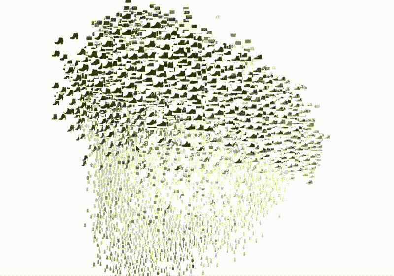
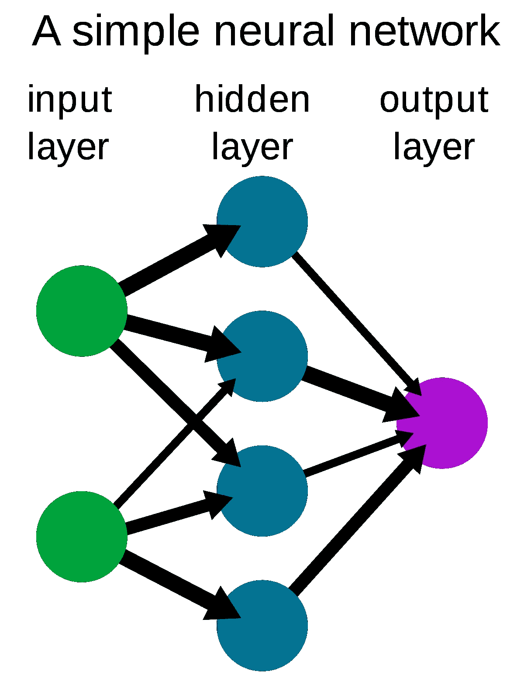
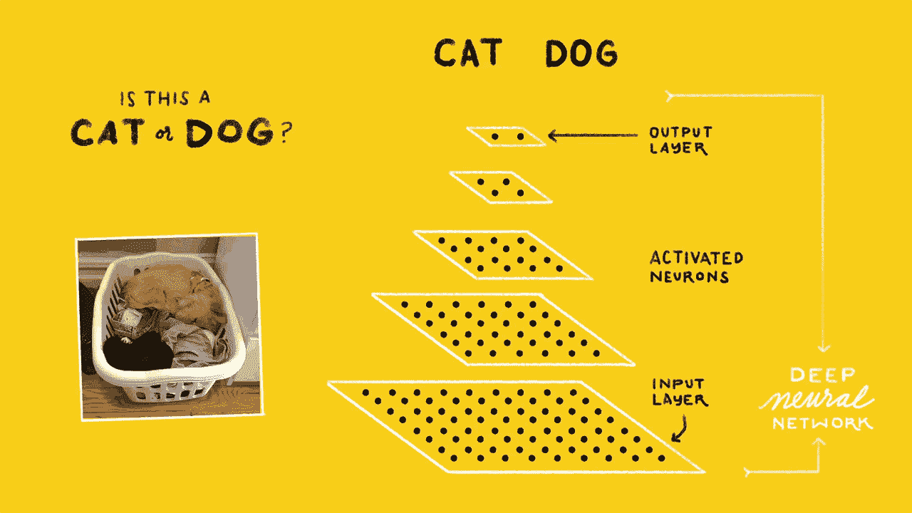
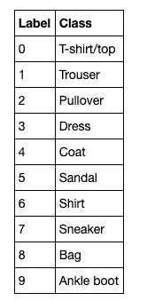
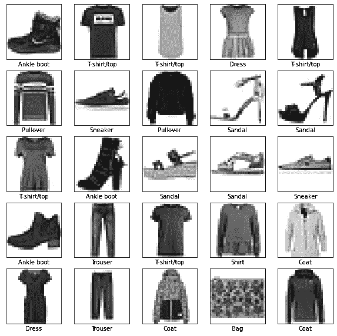
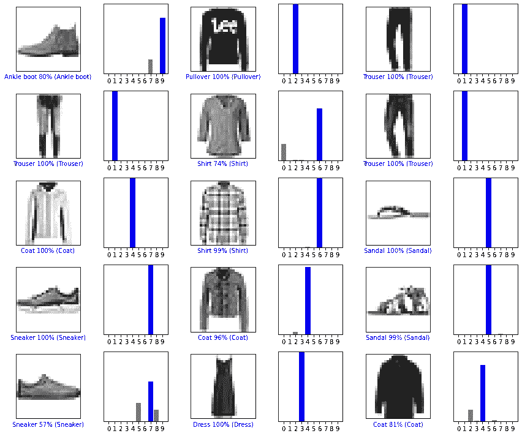

# 利用张量流对服装图像进行分类

> 原文：<https://medium.datadriveninvestor.com/classify-images-of-clothing-using-tensorflow-7bc71b357739?source=collection_archive---------2----------------------->

## 训练基本神经网络模型以对服装图像进行分类



Fashion MNIST (Image source and credits: Zalando Research)

# 机器学习中的分类

分类是将一组给定的数据分类的过程。该过程从预测给定数据点的类别开始，其中这些类别可以被称为目标、标签或类别。

可以对结构化或非结构化数据执行分类。分类的主要目标是识别新数据将属于哪个类/类别，并且当输出具有有限和离散值时最好使用哪个类/类别*。*

不同类型的分类算法是—

线性模型

*   逻辑回归
*   支持向量机(SVM)

非线性模型

*   k-最近邻(KNN)
*   核支持向量机(SVM)
*   朴素贝叶斯
*   决策树分类
*   随机森林分类

# 其他一些最好的系列—

> [**30 天的机器学习 Ops**](https://medium.com/coders-mojo/day-1-of-30-days-of-machine-learning-ops-7c299e4b09be?sk=4ab48350a5c359fc157109e48b1d738f)
> 
> [**30 天自然语言处理系列**](https://medium.com/coders-mojo/quick-recap-30-days-of-natural-language-processing-nlp-with-projects-series-ceb674e3c09b?sk=ca09b27b3d5867f23ab4dc367b6c0c32)
> 
> [**30 天数据工程与项目系列**](https://medium.com/coders-mojo/day-1-of-30-days-of-data-engineering-894822fcb128?sk=76ba558bfe2d9f85cbe741e505295531)
> 
> [**数据科学与机器学习研究(论文)简体**](https://medium.com/coders-mojo/day-1-data-science-and-ml-research-papers-simplified-a68b00a3b1c4?sk=56136229ff738bd734f19d2b6953f78c) ******
> 
> [**60 天数据科学与 ML 系列带项目**](https://medium.com/coders-mojo/day-1-day-60-quick-recap-of-60-days-of-data-science-and-ml-6fc021643d1?sk=4e75e043b7630a9f963562ebac94e129)
> 
> [**100 天:你的数据科学与机器学习学位系列与项目**](https://medium.com/coders-mojo/100-days-your-data-science-and-ml-degree-part-3-c621ecfdf711?sk=1a8c7b0c204d73432d56b7d1a3a26474)
> 
> [**你应该知道的 23 个数据科学技巧**](https://ai.plainenglish.io/23-data-science-techniques-you-should-know-61bc2c9d1b3a?sk=1680c36193eb22198974c9008d62a33c)
> 
> [**科技面试系列—编码问题精选清单**](https://medium.com/coders-mojo/mega-post-tech-interview-the-only-list-of-questions-you-need-to-practice-ee349ea197bb?sk=fac3614684daff4b50a70c0a71e4d528)
> 
> [**完成系统设计与最热门问题系列**](https://medium.com/coders-mojo/system-design-made-easy-quick-recap-of-complete-system-design-34af7e3aedfb?sk=bdd6a19edc1f3ce4a5064923f5b68721)
> 
> [**完成数据可视化及预处理系列与项目**](https://medium.com/coders-mojo/complete-data-preprocessing-and-data-visualization-with-projects-mega-compilation-part-2-41584ef0920e?sk=842390da51689b8d43148c3980570db0)
> 
> [**完整的 Python 系列与项目**](https://medium.com/coders-mojo/complete-python-and-projects-mega-compilation-7ec8f7adfe71?sk=ee0ecf43f23c6dd44dd35d984b3e5df4)
> 
> [**完成高级 Python 系列与项目**](https://medium.com/coders-mojo/complete-advanced-python-with-projects-mega-compilation-part-6-729c1826032b?sk=7faffe20f8039fa57099f7a372b6d665)
> 
> [**Kaggle 最会教你的笔记本**](https://medium.com/coders-mojo/my-list-of-kaggle-best-notebooks-topic-wise-data-science-and-machine-learning-part-2-84772863e9ae?sk=5ed02e419854a6c11add3ddc1e52947f)
> 
> [**Git 开发者指南**](/the-complete-developers-guide-to-git-6a23125996e1?sk=e30479bbe713930ea93018e1a46d9185)
> 
> [**打赏 Github Repos**](https://medium.com/coders-mojo/6-exceptional-github-repos-for-all-developers-part-1-21e8fa04e150?sk=9140b249af6fe73d45717185fad48962) **—第一部分**
> 
> [**打赏 Github Repos**](https://medium.com/coders-mojo/6-exceptional-github-repos-for-all-developers-part-2-3eec9a68c31c?sk=8e31d0eb7eb1d2d0bbbcecaa66bd4e7e) **—第二部**
> 
> [**所有数据科学和机器学习资源**](/best-resources-for-data-science-and-machine-learning-full-list-5ceb9a2791bf?sk=cf85b2cef95560c58509877a794577ff)
> 
> [**210 机器学习项目**](/210-machine-learning-projects-with-source-code-that-you-can-build-today-721b035649e0?sk=da5f593572a0261a6314afad99a0356c)

## 科技时事通讯—

> 如果你感兴趣，你可以加入我的时事通讯，通过它我向超过 30，000 名读者发送技术面试技巧，技术，模式，黑客——软件开发，ML，数据科学，创业公司和技术项目。可以订阅 **Tech Brew :**

[](https://naina0405.substack.com/) [## 点火器

### 数据科学，人工智能，人工智能和更多…点击阅读由 Naina Chaturvedi 撰写的 Ignito，子堆栈出版物。推出 7 个月…

naina0405.substack.com](https://naina0405.substack.com/) 

## Github —

[](https://github.com/Coder-World04) [## 编码器-world 04-概述

### 此时您不能执行该操作。您已使用另一个标签页或窗口登录。您已在另一个选项卡中注销，或者…

github.com](https://github.com/Coder-World04) 

# 什么是神经网络？

简单来说，神经网络是设计用于识别模式的多层神经元网络。它们识别的模式是数字，包含在向量中，所有现实世界的数据，无论是图像、声音、文本等等，都进入其中。，必须改造。

一个简单的神经网络包括—

1.  输入层—这一层将大量数据作为输入来构建神经网络
2.  隐藏层-该层通过执行复杂计算来处理数据，并执行特征提取
3.  输出层—使用合适的激活函数生成预测输出
4.  箭头-连接图层并显示数据如何从输入图层通过隐藏图层到达输出图层。



A simple neural network(Image source and credits: Pinterest)

# 什么是张量流？

TensorFlow 最初是为大型数值计算开发的，是由谷歌大脑团队开发的开源库，用 C++、Python 和 CUDA 编写，用于深度学习和机器学习应用。



Example of Image recognition using TensorFlow (Image source and credits: Source Dexter)

TensorFlow 基于有节点和边的数据流图工作。它接受张量形式的数据，张量不过是更高维度的多维数组，可以处理大量数据。

[](https://www.datadriveninvestor.com/2020/08/27/what-is-a-data-catalog-and-how-does-it-enable-machine-learning-success/) [## 什么是数据目录，它如何使机器学习取得成功？数据驱动的投资者

### 数据目录是机器学习和数据分析的燃料。没有它，你将不得不花费很多…

www.datadriveninvestor.com](https://www.datadriveninvestor.com/2020/08/27/what-is-a-data-catalog-and-how-does-it-enable-machine-learning-success/) 

# 项目-对服装图像进行分类

# 1.导入重要的库

我们将使用 **tf.keras，**这是 TensorFlow 用于构建和训练深度学习模型的高级 API。它用于快速原型制作，创建新的层、指标、损失函数，并开发最先进的模型。

Numpy 是 Python 中科学计算的核心库，Matplotlib 是用于创建静态、动画和交互式可视化的库。

```
**# import TensorFlow, tf.keras, numpy and matplotlib**
import tensorflow as tf
from tensorflow import keras
import numpy as np
import matplotlib.pyplot as plt
```

# 2.导入数据集

我们将在这个项目中使用[时尚 MNIST 数据集](https://github.com/zalandoresearch/fashion-mnist)。该图像包含 10 个类别的 70，000 幅灰度图像，其中 60，000 幅图像用于训练网络，10，000 幅图像用于评估网络学习图像分类的准确性。


Individual articles of clothing at low resolution (28 by 28 pixels)

```
fashion_mnist = keras.datasets.fashion_mnist
#returns four numpy 28x28 arrays with pixel values ranging from 0 to #255
(train_images, train_labels), (test_images, test_labels) = fashion_mnist.load_data()
```

每个图像映射到一个标签。标签不过是整数数组，范围从 0 到 9，对应于图像所代表的服装类别。



Clothing Labels and Classes

训练集代表模型用来学习的数据— `train_images`和`train_labels`数组。

测试集代表模型用来测试— `test_images`和`test_labels`阵列的数据。

```
class_names = ['T-shirt/top', 'Trouser', 'Pullover', 'Dress',     
              'Coat','Sandal', 'Shirt', 'Sneaker', 'Bag', 'Ankle    
               boot']
```

# 3.数据探索

```
train_images.shape
```

(60000, 28, 28)

```
len(train_labels)
```

60000

```
test_images.shape
```

(10000, 28, 28)

```
len(test_labels)
```

10000

# 4.数据预处理

对于训练集和测试集，您可以看到图像的像素值在 0 到 255 的范围内，需要在 0 到 1 的范围内进行缩放，然后再输入到神经网络中。为此，将这些值除以 255。

```
train_images = train_images / 255.0test_images = test_images / 255.0
```

若要验证数据的格式是否正确，请显示训练集中的前 25 幅图像，并在每幅图像下显示类名。

```
plt.figure(figsize=(10,10))
**for** i **in** range(25):
    plt.subplot(5,5,i+1)
    plt.xticks([])
    plt.yticks([])
    plt.grid(**False**)
    plt.imshow(train_images[i], cmap=plt.cm.binary)
    plt.xlabel(class_names[train_labels[i]])
plt.show()
```



# 5.建立模型

要构建模型，首先链接不同的层，配置它们，然后编译模型。

```
model = keras.Sequential([
    keras.layers.Flatten(input_shape=(28, 28)),
    keras.layers.Dense(128, activation='relu'),
    keras.layers.Dense(10)
])
```

这些层—

`tf.keras.layers.Flatten` —将图像格式从二维数组(28 x 28 像素)转换为一维数组(28 x 28 = 784 像素)。一旦像素被展平，网络就由两个密集层的序列组成。

`tf.keras.layers.Dense` —这两层是密集/全连接的神经层，第一密集层有 128 个节点，第二层返回长度为 10 的 logits 数组。

在此之后编译模型，其中—

*   优化器-这是模型基于其看到的数据及其损失函数进行更新的方式。Adam 是一种优化算法，可以用来代替经典的随机梯度下降过程，以基于训练数据迭代地更新网络权重。用起来很简单。
*   损失函数——损失函数是神经网络的重要组成部分之一，它只不过是神经网络的一个预测误差。这衡量了模型在训练过程中的精确度。
*   指标——为了监控培训和测试步骤，我们使用指标。在这个例子中，我们将使用 ***准确度*** 度量，其仅指示正确分类的图像的部分。

```
model.compile(optimizer='adam',
loss=tf.keras.losses.SparseCategoricalCrossentropy(from_logits=**True**),metrics=['accuracy'])
```

# 6.模特培训

这分为 4 个步骤— *输入训练数据、学习、预测、验证预测*

```
#fit the model to the training data 
model.fit(train_images, train_labels, epochs=10)Epoch 1/10
1875/1875 [==============================] - 4s 2ms/step - loss: 1.0486 - accuracy: 0.6656
Epoch 2/10
1875/1875 [==============================] - 4s 2ms/step - loss: 0.6211 - accuracy: 0.7744
Epoch 3/10
1875/1875 [==============================] - 4s 2ms/step - loss: 0.5498 - accuracy: 0.8026
Epoch 4/10
1875/1875 [==============================] - 4s 2ms/step - loss: 0.5096 - accuracy: 0.8185
Epoch 5/10
1875/1875 [==============================] - 4s 2ms/step - loss: 0.4832 - accuracy: 0.8284
Epoch 6/10
1875/1875 [==============================] - 4s 2ms/step - loss: 0.4636 - accuracy: 0.8363
Epoch 7/10
1875/1875 [==============================] - 4s 2ms/step - loss: 0.4485 - accuracy: 0.8418
Epoch 8/10
1875/1875 [==============================] - 4s 2ms/step - loss: 0.4365 - accuracy: 0.8456
Epoch 9/10
1875/1875 [==============================] - 3s 2ms/step - loss: 0.4265 - accuracy: 0.8496
Epoch 10/10
1875/1875 [==============================] - 4s 2ms/step - loss: 0.4175 - accuracy: 0.8539<tensorflow.python.keras.callbacks.History at 0x7faeadc6d048>
```

您可以看到，损失和准确性是在每个历元中计算的。该模型在训练数据上达到了大约 85%的准确率。

# 7.评估测试数据的准确性

```
test_loss, test_acc = model.evaluate(test_images,  test_labels, verbose=2)print('**\n**Test accuracy:', test_acc)
```

测试精度:0.80486868881

这是一个 ***过拟合*** 的情况，其中测试数据集的精度小于训练数据集的精度。当您的模型“记忆”训练数据集中的噪音和细节达到一定程度时，就会发生过度拟合，这会对模型在新数据上的性能产生负面影响。

# 8.预测时间

```
probability_model = tf.keras.Sequential([model, 
                                         tf.keras.layers.Softmax()])
predictions = probability_model.predict(test_images)
predictions[0]
#Output is an array of 10 numbers which represent model's confidencearray
([2.0062183e-07, 3.7709762e-11, 7.3624884e-10, 2.9959158e-12, 1.1696175e-09, 3.5686058e-04, 2.6559412e-08, 1.0531254e-03, 7.2562241e-11, 9.9858981e-01], dtype=float32)
```

可以看到哪个标签的置信度值最高。

```
np.argmax(predictions[1])
Output : 0
```

所以，模特最有信心的是这张图片是 t 恤/上衣，或者`class_names[0]`。

让我们用它们的预测来绘制几幅图像。

```
*# Plot the first X test images, their predicted labels, and the true #labels.*
*# Color correct predictions in blue and incorrect predictions in #red.*
num_rows = 5
num_cols = 3
num_images = num_rows*num_cols
plt.figure(figsize=(2*2*num_cols, 2*num_rows))
**for** i **in** range(num_images):
  plt.subplot(num_rows, 2*num_cols, 2*i+1)
  plot_image(i, predictions[i], test_labels, test_images)
  plt.subplot(num_rows, 2*num_cols, 2*i+2)
  plot_value_array(i, predictions[i], test_labels)
plt.tight_layout()
plt.show()
```



Cloth images with their predictions

*注:这是一个非常基础的使用 TensorFlow(代码参考:TensorFlow.org)的项目。我写这篇文章是为了介绍神经网络，张量流，并通过一个项目展示它的内部工作。非常感谢 Google 提供了 TensorFlow 库。*

# 感谢阅读。继续学习:)

# 想看程序员幽默？

[](https://medium.com/datadriveninvestor/programming-humor-part-2-f92cf5a26f2b) [## 编程幽默第 2 部分

### 继续笑，因为太搞笑了…

medium.com](https://medium.com/datadriveninvestor/programming-humor-part-2-f92cf5a26f2b) [](https://medium.com/datadriveninvestor/the-most-hilarious-code-comments-ever-bae3cb1030b5) [## 史上最搞笑的代码注释

### 程序员幽默:是的，实际上是程序员写的！

medium.com](https://medium.com/datadriveninvestor/the-most-hilarious-code-comments-ever-bae3cb1030b5) [](https://medium.com/datadriveninvestor/coding-sins-hilarious-developer-confessions-f55eb342454e) [## 编码原罪:令人捧腹的开发者自白

### “白板”是如何被嘲笑的

medium.com](https://medium.com/datadriveninvestor/coding-sins-hilarious-developer-confessions-f55eb342454e) [](https://medium.com/datadriveninvestor/10-witty-programming-jokes-that-will-make-you-go-rofl-a53fbfb91943) [## 10 个让你着迷的诙谐编程笑话

### 这些太搞笑了…

medium.com](https://medium.com/datadriveninvestor/10-witty-programming-jokes-that-will-make-you-go-rofl-a53fbfb91943) 

# 推荐文章-

[](https://medium.com/python-in-plain-english/python-iterators-generators-and-decorators-made-easy-659cae26054f) [## Python 迭代器、生成器和装饰器变得简单

### 快速实施指南

medium.com](https://medium.com/python-in-plain-english/python-iterators-generators-and-decorators-made-easy-659cae26054f) [](https://medium.com/ai-in-plain-english/23-data-science-techniques-you-should-know-61bc2c9d1b3a) [## 你应该知道的 23 种数据科学技术！

### 使用这些技巧来节省你的宝贵时间

medium.com](https://medium.com/ai-in-plain-english/23-data-science-techniques-you-should-know-61bc2c9d1b3a) [](https://medium.com/datadriveninvestor/coding-sins-hilarious-developer-confessions-f55eb342454e) [## 编码原罪:令人捧腹的开发者自白

### “白板”是如何被嘲笑的

medium.com](https://medium.com/datadriveninvestor/coding-sins-hilarious-developer-confessions-f55eb342454e) [](https://medium.com/datadriveninvestor/5-cool-advanced-pandas-techniques-for-data-scientists-c5a59ae0625d) [## 面向数据科学家的 5 项酷炫先进熊猫技术

### 使用这些技巧…

medium.com](https://medium.com/datadriveninvestor/5-cool-advanced-pandas-techniques-for-data-scientists-c5a59ae0625d) [](https://medium.com/datadriveninvestor/stack-overflow-analyzed-data-from-60-000-software-developers-hours-they-work-languages-they-476ac6ca0197) [## Stack Overflow 分析了来自 60，000 多名软件开发人员的数据，包括他们的工作时间、语言…

### 以下是他们的发现…

medium.com](https://medium.com/datadriveninvestor/stack-overflow-analyzed-data-from-60-000-software-developers-hours-they-work-languages-they-476ac6ca0197) [](https://medium.com/datadriveninvestor/advanced-python-made-easy-part-4-a4996ba9fe19) [## 高级 Python 变得简单—第 4 部分

### 使用这些技巧和技术…

medium.com](https://medium.com/datadriveninvestor/advanced-python-made-easy-part-4-a4996ba9fe19) [](https://medium.com/datadriveninvestor/advanced-python-made-easy-part-1-ce1e2f17431e) [## 高级 Python 变得简单—第 1 部分

### 使用这些技巧和技术…

medium.com](https://medium.com/datadriveninvestor/advanced-python-made-easy-part-1-ce1e2f17431e)