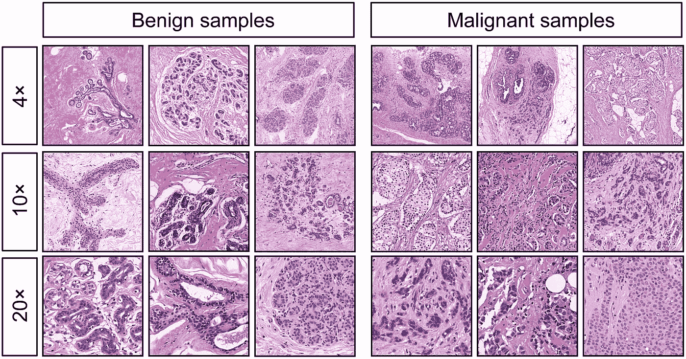
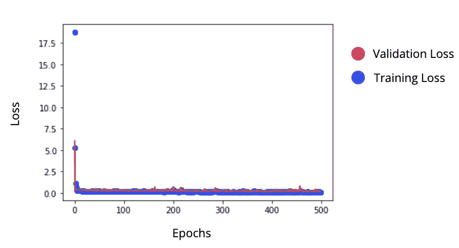

# 用神经网络分类恶性和良性乳腺癌肿瘤

> 原文：<https://medium.datadriveninvestor.com/classifying-malignant-and-benign-breast-tumours-with-a-neural-network-ab470562d0e?source=collection_archive---------1----------------------->

> 这篇文章中的代码基于一个教程，可以在这里找到。
> 
> 答:本文假设对神经网络有一个基本的直观理解。关于背景，[看看这个](https://medium.com/datadriveninvestor/neural-networks-demystified-34bee0c45fb7)。

使用[这个](https://archive.ics.uci.edu/ml/datasets/Breast+Cancer+Wisconsin+%28Diagnostic%29)数据集，我创建了一个能够对乳腺肿瘤进行分类的神经网络。这些特征是肿瘤内细胞核的测量特征，包括周长、凹度和光滑度。标签为 0 或 1，分别代表良性和恶性诊断。通过我的网络，我绘制了这两个变量之间的关系。



# 我是这样做的

我们将首先导入以下库。

```
import numpy as npimport tensorflow as tffrom tensorflow.keras.models import Sequentialfrom tensorflow.keras.layers import Dense, Dropoutimport pandas as pdfrom sklearn import preprocessingfrom sklearn.model_selection import train_test_splitfrom matplotlib import pyplot as plt
```

然后，我们将使用 pandas 读入我们的要素和标注数据，方法是将每组数据分配给变量 x 和 y。在 pandas 中，这些数据被称为数据帧，基本上与数据集相同。

```
x = pd.read_csv(‘https://raw.githubusercontent.com/antaloaalonso/Classification-Model-YT-Video/master/X_data.csv')y = pd.read_csv(‘[https://raw.githubusercontent.com/antaloaalonso/Classification-Model-YT-Video/master/Y_data.csv](https://raw.githubusercontent.com/antaloaalonso/Classification-Model-YT-Video/master/Y_data.csv)')
```

然后，作为预处理阶段的一部分，我们将缩放要素数据。

```
x = preprocessing.scale(x)
```

现在是时候将我们的数据分成测试和训练数据了。训练数据是我们的神经网络用来学习如何将我们的特征映射到我们的标签的数据，而测试数据是我们用来查看我们的模型在它以前从未见过的数据样本上的行为的数据。我们 20%的数据将是测试数据，80%将是训练数据。

```
x_train, x_test, y_train, y_test = train_test_split(x, y, test_size=0.2)
```

现在让我们将我们的训练和测试数据转换成 numpy 数组，以便我们可以将它们用于 Keras 神经网络。

```
x_train = np.array(x_train)y_train = np.array(y_train)x_test = np.array(x_test)y_test = np.array(y_test)
```

让我们现在建立我们的实际模型。我们只是在构建一个前馈神经网络，所以顺序模型很容易就足够了。我们的模型由具有 ReLU 激活函数和 20 个节点的密集层组成，然后以代表最终分类预测的 1 个节点结束。为了了解更多关于激活函数 sigmoid 和 ReLU 的含义，[看看这个](https://medium.com/@joshua.payne/activation-functions-in-artificial-neural-networks-8aa6a5ddf832)。

我们的输入形状代表了我们的特征数组的形状。

```
model = Sequential()model.add(Dense(20, input_shape=(30,)))model.add(Dense(20, activation=’relu’))model.add(Dense(20, activation=’relu’))model.add(Dense(20, activation=’relu’))model.add(Dense(1, activation=’sigmoid’))
```

我们现在将编译我们的模型。Adam 优化器非常有效，二元交叉熵是两类分类问题的首选损失函数。它将 sigmoid 输出舍入为整数，然后将其与数据集的输出进行比较，以测量误差。“输出”代表乳腺癌的预测或实际诊断——0 代表良性，1 代表恶性。我们将使用精确度指标，以便了解我们的模型在分类这些类型的乳腺肿瘤时有多精确。

[](https://www.datadriveninvestor.com/2019/02/08/machine-learning-in-finance/) [## 金融中的机器学习|数据驱动的投资者

### 在我们讲述一些机器学习金融应用之前，我们先来了解一下什么是机器学习。机器…

www.datadriveninvestor.com](https://www.datadriveninvestor.com/2019/02/08/machine-learning-in-finance/) 

之后，我们将使我们的模型适合我们的训练数据，传递数据 500 次，并且具有 0.3 的验证分割。这意味着我们的数据的 30%成为验证数据，我们的模型测试它的验证准确性。这些不同于测试样本，因为这些样本用于我们自己的预测，不在我们模型的训练范围内。然后我们会保存我们神经网络的历史。

```
model.compile(optimizer=’adam’, loss=’binary_crossentropy’, metrics=[‘accuracy’])history = model.fit(x_train, y_train, epochs=500, validation_split=0.3)history_dict = history.history
```

现在是时候在图表上绘制我们在模型训练期间测量的训练损失和验证损失，以更好地了解我们的网络是如何运行的。

```
loss_values = history_dict[‘loss’]val_loss_values = history_dict[‘val_loss’]plt.figure()plt.plot(loss_values, ‘bo’, label=’training loss’)plt.plot(val_loss_values, ‘r’, label=’validation loss’)
```

经过 500 次迭代训练模型后，这里是最后一个时期的指标和我们的图表。

```
Epoch 500/500
317/317 [==============================] - 0s 155us/sample - loss: 0.0851 - accuracy: 0.9621 - val_loss: 0.1539 - val_accuracy: 0.9270
```



Labels and legend added by me :)

我们显然超级成功！由于验证和训练数据的超低损失率和高准确性，我们的模型非常成功。

# 让我们看看它的实际效果吧！

我们将使用测试数据中的第一个数据样本，并查看我们的模型预测的标签。这意味着我们将使用 x_test[1]。

```
x_test[1] = [1.096e+01 1.762e+01 7.079e+01 3.656e+02 9.687e-02 9.752e-02 5.263e-02 2.788e-02 1.619e-01 6.408e-02 1.507e-01 1.583e+00 1.165e+00 1.009e+01 9.501e-03 3.378e-02 4.401e-02 1.346e-02 1.322e-02 3.534e-03 1.162e+01 2.651e+01 7.643e+01 4.075e+02 1.428e-01 2.510e-01 2.123e-01 9.861e-02 2.289e-01 8.278e-02]
```

但是，当使用 Keras 进行预测时，我们需要有逗号，并传递一个列表的列表。让我们创建一个新的变量，以便满足这些要求。

```
x_test_1 = [[1.096e+01, 1.762e+01, 7.079e+01, 3.656e+02, 9.687e-02, 9.752e-02, 5.263e-02, 2.788e-02, 1.619e-01, 6.408e-02, 1.507e-01, 1.583e+00, 1.165e+00, 1.009e+01, 9.501e-03, 3.378e-02, 4.401e-02, 1.346e-02, 1.322e-02, 3.534e-03, 1.162e+01, 2.651e+01, 7.643e+01, 4.075e+02, 1.428e-01, 2.510e-01, 2.123e-01, 9.861e-02, 2.289e-01, 8.278e-02]]
```

“0”的输出意味着肿瘤被预测为良性，而“1”的输出意味着恶性预测。通过创建一个类变量，我们可以修改我们的输出来表示肿瘤的类型，而不是 0 或 1。

```
classes = [‘benign’, ‘malignant’]
```

我们现在可以实际使用我们的模型了！为第一个测试数据样本预测的数字标签 0 或 1 被用作 classes 变量的索引。如果预测 0，良性是预测，如果预测 1，恶性是预测。

```
prediction = classes[int(model.predict(x_test_1))]
```

让我们看看我们的模型预测了什么！

```
print(prediction)
>>> benign
```

我们现在可以检查这个预测是否准确，因为我们知道数据集上的标签实际上是什么。该模型预测第一个测试数据样本的标签(y ),我们在测试数据集中可以交叉引用该标签。

```
print(classes[int(y_test[1])])
>>> benign
```

实际诊断是良性的，这意味着我们的模型成功地预测了输入数据属于良性还是恶性乳腺癌肿瘤！

# 关键要点

*   分析了良性和恶性肿瘤的医学图像中的现有细胞核
*   使用带有 Keras 的神经网络，我们能够根据输入数据对乳腺肿瘤进行分类
*   我们实现了 96%的准确率和 92%的验证准确率！
*   我们的模型准确地预测了我们的第一个测试数据样本是一个良性肿瘤

*如果你喜欢这篇文章，请随时在 joshuapayne1275@gmail.com 的* [*LinkedIn*](https://www.linkedin.com/in/joshua-payne-0bb2a7194/) *联系我。感谢阅读！*