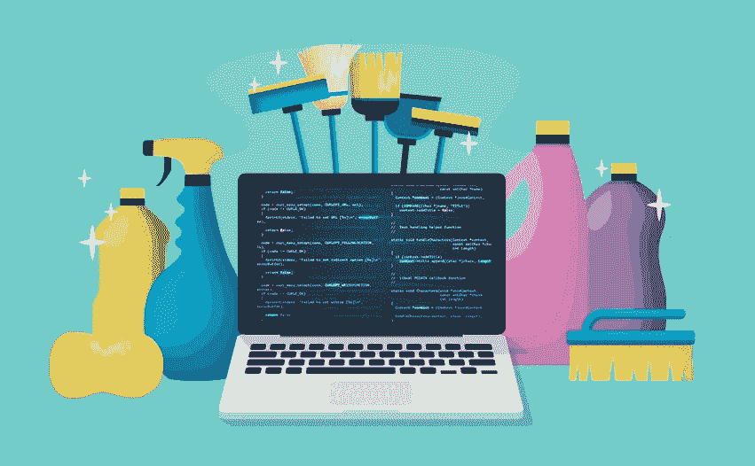
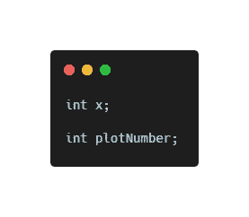
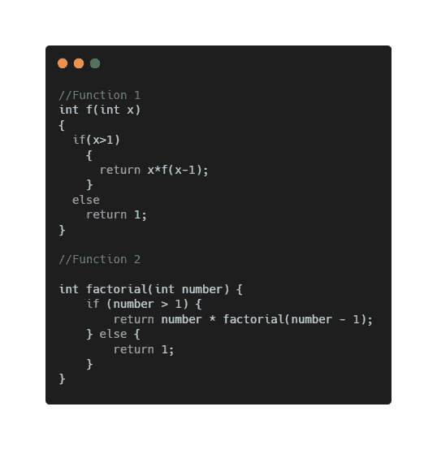

# 干净的代码！真的吗？

> 原文：<https://medium.datadriveninvestor.com/clean-code-really-51c85703e835?source=collection_archive---------10----------------------->

[https://blog.testproject.io/2020/04/22/clean-code-in-tests-what-why-and-how/](https://blog.testproject.io/2020/04/22/clean-code-in-tests-what-why-and-how/)

人们一定会想，这个术语“干净的编码”是什么意思，如果 ze 知道，他一定会想为什么我要实践它？

最近，我的一些朋友告诉我

> “我很乐意用 x，y，a，b 作为变量名，为什么要写大名？我没时间写这么大的名字，你知道我们有时间限制...我们需要通过测试，这非常重要。如果测试用例在竞赛中通过，这意味着我的编码是完美的。”

当然，ze 必须擅长编码，我不怀疑他的能力，但是“编码”和“干净地编码”之间有很大的区别。

当我在学校的时候，我被教导要用适当的间距、保持一致性和缩进来干净地编码。在我大学的第一年，我在学校做的所有练习都很顺利。但是，当我加入 WTEF 项目时，我学到的第一件事就是干净的编码。我就想，为什么我需要这个？渐渐地，我意识到了它的必要性，以及编写和阅读干净代码的感觉有多好…

你不能指望自己一口气写出一个完美漂亮的代码。编写干净的代码并不是一个大的或者费时的任务，但是让它成为你的例行公事，并致力于它，将会对你的职业发展和改善你的时间管理大有帮助。

您读到这里可能有两个原因:首先，您是一名程序员。第二，你想成为一个更好的程序员。我希望你来这里是因为这两个原因。我们需要更好的程序员。

继续阅读，了解为什么干净的代码很重要，你会成为一名更好的程序员。

在真正开始“实践”让你的代码看起来整洁干净之前，让我们先读一些引言。

> “即使是糟糕的代码也能运行。但是如果代码不干净，它会使开发组织陷入困境。每年，都有无数的时间和大量的资源因为糟糕的代码而被浪费。但是事情并不一定是那样的”摘自罗伯特·塞西尔·马丁的《干净的代码:敏捷软件工艺手册》。
> 
> 沃德·坎宁安(维基的发明者)“当你阅读的每一个例程都非常符合你的预期时，你就知道你正在编写干净的代码。”
> 
> “一个功能失调的团队最糟糕的症状之一是，每个程序员都在自己的代码周围筑起一堵墙，不让其他程序员碰它。我去过一些地方，那里的程序员甚至不让其他程序员看他们的代码。这是一个灾难的配方。”——罗伯特·马丁的《干净的程序员:职业程序员的行为准则》
> 
> “任何傻瓜都能写出计算机能理解的代码。优秀的程序员会写出人类能理解的代码。”马丁·福勒
> 
> “编写代码的时候，要把最终维护你代码的人想象成一个知道你住哪儿的暴力精神病患者。”马丁·戈尔丁

您可能经常听说软件开发人员花在维护、测试和保护现有代码上的时间比他们写或改进代码的时间还多。是的，那是真的。

## 写干净代码的重要性是什么？

看下面的例子，自己理解；

看这个，第一个变量的名字是 x，另一个是 plotNumber。从 x，你能推断出什么？x 可以是从咖啡数量到汽车数量的任何数字。它可以是任何东西！(但当然是整数值)但在读取第二个变量的名称后，您确定它是一个图号。

看看这两个函数，然后问自己这些问题。哪个函数可读性更强？看哪个函数，就能很容易推断出它在做什么？函数 1 中的 x 是什么？

如果你认为函数 1 更具可读性，亲爱的朋友，你真的需要再考虑一下。第二种方法可读性更好，在需要的地方有适当的空格，有好的变量名和函数名。只要提到函数名，就可以推断出函数在计算一个数的阶乘。

 [## 干净的代码在软件开发中至关重要——这就是为什么|数据驱动投资者

### 干净的代码是“容易理解和容易改变的”，它是关于对细节的关注。但是开发人员为什么要担心…

www.datadriveninvestor.com](https://www.datadriveninvestor.com/2020/05/27/clean-code-is-crucial-in-software-development-heres-why/) 

不管你写的是脏代码还是干净代码，bug 都是不可避免的。但是干净的代码将帮助你更快地调试，不管你有多少经验或专业知识。随着任何项目的增长，它将需要新的特性或对现有特性的改变。干净的代码使维护变得相对快速和容易。

好的代码必须易于阅读、维护、变更和伸缩。它应该足够干净，以至于当你在一整年后检查它时，你可以一气呵成地理解它。

好了，说了这么多，我想你可能想知道什么是“干净的编码实践”,所以让我们开始吧。

## 小贴士:

*   遵循一致的编码标准
*   富于表现力，边说边写代码，最好是冗长的
*   在代码中遵循适当的缩进
*   具有相同目的和功能的代码应该放在相同的位置。您不希望在 10 个文件中滚动或搜索特定功能。
*   使用 camelCase 作为变量和函数名。上课要从大写开始。
*   保持一个函数尽可能的短。函数分解是让代码看起来干净的一个非常好的方法。有时它可以更长，但是代码应该在概念上清晰易懂。
*   不要重复代码。与其一次又一次地写一段代码，不如为它做一个单独的函数。
*   定义常量或使用变量，而不是硬编码值。

## 命名规则:

*   用 1-2 个单词描述变量和函数名称，并揭示其意图。
*   对相似的名字进行有意义的区分。例如，可以使用 like、currentCustomer 和 nextCustomer 代替 cust 和 custo 作为变量名。
*   避免不符合格式的名称。例如，两个函数 delete()和 remove()可能会混淆。
*   使用可发音和可搜索的名称。
*   建议在尽可能靠近变量使用位置的地方声明变量。你不想在第 1 行声明一个变量，只在第 20 行使用它。假设，你在第 5 行声明了一个变量 x，然后在第 30 行使用了它，当面试官在第 30 行问你 x 是怎么来的，然后你向上滚动查看你提到它的行号。繁琐的流程 *oof* +负面评分作为面试官的礼物。
*   不要犹豫在名称中使用技术术语。队列大小优于 n

## 评论规则:

*   如果你的函数名说明了它的用途，你不需要注释。
*   不要多余，永远不要在代码中添加明显的注释。
*   不要试图通过添加注释来使代码更漂亮。当你有一个无法理解的代码时，注释不是解决方法。尝试重写代码或重命名字段和其他元素，以便读者能够理解您在那里所做的操作。

## **更多一些提示:**

*   函数应该有两个或更少的参数，越少越好。尽可能避免三个或更多的争论。
*   你应该知道你的语言在间距、注释和命名方面的惯例。许多语言都有样式指南。例如，在 Java 中应该使用 camelCase，而在 Python 中应该使用 snake_case。在 C#中，你把左括号放在新的一行，但是在 Java 和 JavaScript 中，你把它们放在同一行。
*   尽量避免全局变量。您可以使用函数中声明的变量，而不是使用全局变量。
*   即使在写一行程序时也要用花括号。这使得代码看起来复杂，容易被其他人阅读。
*   使用 const，适当时通过值/引用传递。这将有助于节省内存。

尽量遵循 FD&CC(功能分解&干净编码)。如果你正在编写高质量、干净的代码，你应该感到超级自信。我确实有同感。干净的代码— *敏捷软件工艺手册*对开发者来说是一本好书，尤其是当你想成为一名更好的软件开发者的时候。我还没有尝试过，但很快就会尝试。这本书解释了什么是干净的代码和帮助你写干净代码的最佳实践。如果你想要良好的编码技能，你需要从今天开始。习惯不是一夜之间养成的。相信我，从长远来看，这一切真的会对你有帮助。

## 访问专家视图— [订阅 DDI 英特尔](https://datadriveninvestor.com/ddi-intel)