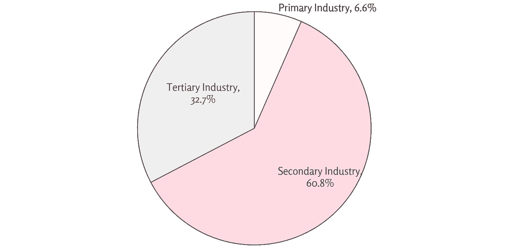
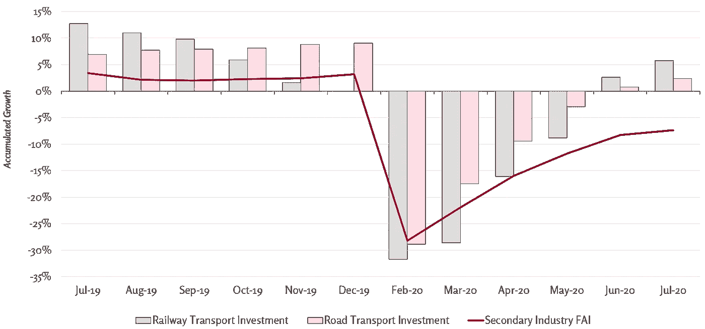
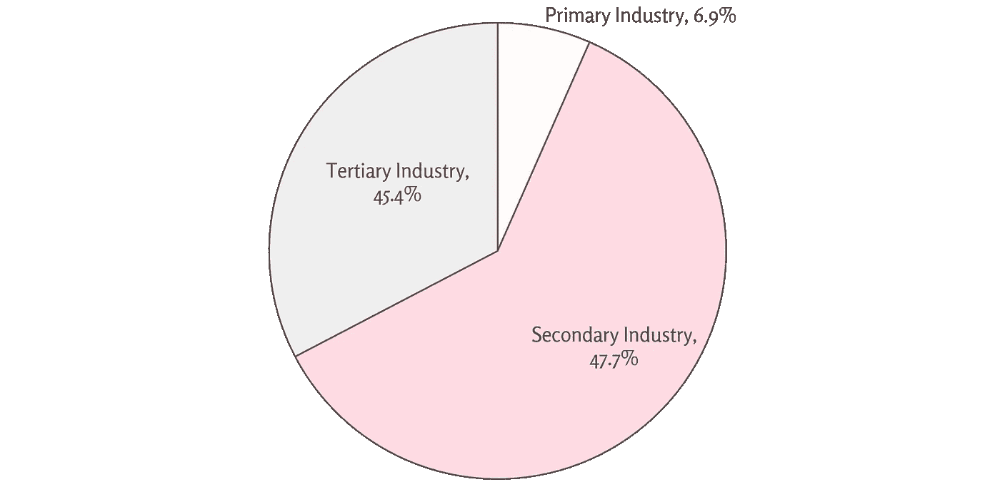
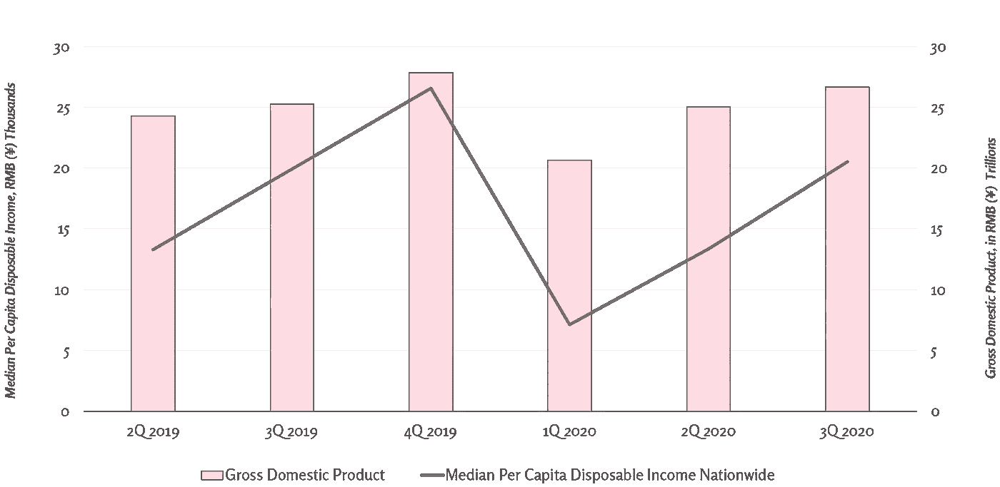

# 中国经济在 4Q 和其他地方的碧水蓝天

> 原文：<https://medium.datadriveninvestor.com/clear-waters-and-blue-skies-for-chinas-economy-in-4q-and-beyond-6037a02f0db3?source=collection_archive---------11----------------------->

Image via: [Adobe Stock](https://stock.adobe.com/)

# 摘要

继毛泽东执政以来的首次经济收缩后，中国成为首个恢复增长的主要经济体。虽然复苏之路充满了不平衡发展的迹象，但第三季度的业绩加上目标明确的政策支持，为中国第四季度及以后的发展描绘了一个充满希望的前景。

***想呆在对一切都了如指掌的中国？订阅我们的时事通讯让真知灼见直接送达您的收件箱:【www.thechinaguys.com】*******。****

*………*

*随着新型冠状病毒的出现，政府强制实施的检疫措施导致工厂、商店和企业关闭，消费者削减支出，为艰难时期做准备。从那以后，发展中国家和发达国家的经济都被以大规模裁员和股市暴跌为特征的衰退染红了。2020 年 6 月，世界银行[预测](https://www.worldbank.org/en/publication/global-economic-prospects)全球 GDP 将在这一年中收缩-5.2%或更多。*

*尽管被定位为冠状病毒疫情的原始中心，并承受着严峻的第一季度业绩，但中国已设法迅速遏制病毒的传播，并重振其经济。该国通过实施强有力的反病毒遏制措施和提供目标明确的财政和政策刺激，引领了引人注目的转变，这预示着严峻的结果。第二季度，中国成为第一个在一个季度内实现同比增长的主要经济体；在第三季度，中国是第一个在 2020 年实现复合年增长率的国家。*

*尽管如此，并不是所有闪光的东西都是金子。在增长数字的背后，中国的经济活力极度失衡。在第二季度和第三季度，财政刺激和物资储备作为主要经济驱动力发挥了决定性作用，而作为中国经济增长支柱的消费仍然疲软。然而，此后的每个季度都显示出了改善的结果，收入、消费和外国投资的增长数字为第四季度及以后描绘了一幅积极的前景。*

# *回顾中国 2020 年中期的成果*

## *Q2 的不平衡增长*

*继毛泽东执政以来中国首次出现经济收缩后，Q2 3.2%的 GDP 增长让经济学家们大吃一惊，他们曾预测增长率在 2%左右。尽管增长就是增长，但中国 GDP 背后的驱动力指向了不平衡的增长。一反先例，中国最大的增长引擎——家庭消费——在 Q2 表现平平。在好年景下，这一动力部分通常贡献中国 GDP 的 40%左右，但在 Q2 年末，消费仍处于负值区域。*

*那么，如果不是来自传统源头，那么今年中国的增长来自哪里呢？在国内生产总值组成部分一级，主要驱动因素是固定资本形成总额(“GFCF”)，固定资产投资的另一个术语。在深入解释 GFCF 之前，先了解行业层面的细分会有所帮助。第二产业——建筑、工业和制造业——飙升至 Q2 GDP 增长的 60.8%。第一产业，即农业，贡献了 6.6%，第三产业，即服务业，落后于 32.7%。*

## *第二产业推动 Q2 经济增长*

**

**Sources:* [*National Bureau of Statistics*](http://www.stats.gov.cn/english)*,* [*The China Guys*](https://thechinaguys.com/)*

*虽然第二产业表现的提升通常可以归因于沉重的制造业销售，但 Q2 消费者支出数据表明，零售销售仍然下降了 10%。钢铁等中间产品的产量继续攀升，但终端产品(以汽车为例)的消费却很低迷，这表明市场失衡，生产蓬勃发展，但终端销售几乎不存在。建筑业的固定资本形成总额和制造业的材料储备是造成这种差异的原因。*

## *固定资本形成总额(GFCF)*

*GFCF 涵盖了对建筑、设备和基础设施等固定资产的新投资。这部分增长占中国 Q2 GDP 的 156 %( T2 ),而消费对经济增长的影响为-73%。*

*推动 GCFC 经济增长的是中国的中央财政刺激，其中一半资金流向支持省级和地方基础设施项目。今年 5 月，李克强总理宣布通过发行特别配额债券增加 1 万亿元的联邦支出，并在省级和地方层面发行价值 1.6 万亿元的特别债券。这些资金主要用于投资基础设施项目，为中国的第二产业提供了重要支持。例如，对铁路和公路等实体基础设施的投资迅速反弹，两者在 7 月份分别实现了 5.7%和 2.4%的正累计增长。*

## *基础设施在 Q2 影子投资中闪耀*

**

**FAI=fixed asset investment. Sources:* [*National Bureau of Statistics*](http://www.stats.gov.cn/english)*,* [*The China Guys*](https://thechinaguys.com/)*

*建筑公司通过基础设施项目的资本形成为宏观经济做出贡献，工业公司通过提供支持这些项目的材料而受益。此外，大多数分析师一致认为，由于工业生产水平上升与制造业和零售业销售疲软之间存在明显差异，本季度肯定存在大量材料库存。汽车工业是一个典型的例子。随着汽车销量下滑，金属产量继续上升，这导致[中国经销商](https://www.autonews.com/china/dealership-stockpiles-spike-amid-epidemic)的车辆平均积压量从 45 天的供应量跃升至 444 天的供应量。*

*总的来说，中国第二季度的经济增长描绘了一幅摇摇欲坠的经济增长图景。刺激在发展中的作用非常明显，由于财政刺激的有限性，导致投资者对发展的可持续性感到担忧。虽然增长通常是一个积极的结果，但北京和全球投资者都更喜欢由消费和私人投资引领的可持续有机增长。2020 年第三季度的数据更符合这些预期，因为它们揭示了一个主要由有机增长驱动的经济。*

# *第三季度活动势头增强*

*中国经济作为一个整体[在第三季度](https://www.cnbc.com/2020/10/19/china-economy-q3-gdp-2020.html)增长了 4.9%，使得 2020 年的总增长率为 0.7%。新的季度数据不仅超过了 Q2 的数据，而且与疫情之前的数据更加接近。GDP 增长的三个组成部分——最终消费、GFCF 和进口/出口——对增长的贡献率分别为 34.9%、52%和 13.1%。虽然贸易保持稳定，但消费从-73%的收缩中获得了巨大收益，而 GFCF 从 Q2 156%的收益下降到了更正常的水平。*

*部门一级的捐款也反映了这一增长。最终消费是第三产业——服务和零售——的主要因素，其增长份额达到 45.4%，高于 Q2 的 32.7%，而第二产业的贡献从 60.8%降至 47.7%。尽管稍微以工业为中心，但第三季度的增长与 covid 之前的增长指标更接近(从历史上看，中国一直通过零售和服务消费支持其经济增长)，因为消费增长推动了第三产业的增长。第三季度第三产业的反弹是一个受欢迎的转变，因为固定资产投资的收益率可能会有所不同，但消费会带来有保证的经济回报。*

## *第三产业在第三季度重新站稳脚跟*

**

**Sources:* [*National Bureau of Statistics*](http://www.stats.gov.cn/english)*,* [*The China Guys*](https://thechinaguys.com/)*

*消费和零售销售的积极增长可能会让北京方面松一口气，北京方面已经承担了比往常更大的预算赤字，以通过基础设施支出和支持企业的措施来刺激经济。尽管不太可能在 2020 年的最后几个月发生，但随着各行业在 2021 年初继续站稳脚跟，中国官员可能会开始取消税收和社会保障豁免——假设第四季度的增长继续正常化。*

# *展望第四季度及以后的中国经济*

## *收入趋势*

*2020 年还剩两个月，中国第四季度及以后的经济前景相当强劲。在最近发布第三季度 GDP 数据的同时，国家统计局也发布了收入季度数据。在大幅下降后，全国人均可支配收入同比增长 0.6%，而中值收入增长 3.2%，表明就业和工资正增长。尽管中国低收入者受到了特别关注，但由于刺激措施分配不均，他们在疫情承受了最沉重的打击，通常与低收入相关的农村家庭的平均可支配收入达到 12297 元人民币(合 1852 美元)，比去年同期高出 675 元人民币(合 102 美元)。*

## *中国的收入中值与 GDP 同步回升*

**

**Sources:* [*National Bureau of Statistics*](http://www.stats.gov.cn/english)*,* [*The China Guys*](https://thechinaguys.com/)*

*这种快速复苏主要归功于北京有效的检疫措施和政策刺激。尽管被定位为冠状病毒的原始中心，但据报道，截至 3 月底，99%的企业已经恢复正常运营，仅在武汉确诊第[起 COVID 相关肺炎病例后三个月](https://www.who.int/news/item/27-04-2020-who-timeline---covid-19)。自那以后，中国政府相对宽松的经济刺激政策聚焦于通过削减成本的措施来缓解企业压力，如提供税收和社会保障税减免以及降低信贷壁垒等[。通过将资源优先用于供应方，企业能够留住更多员工，即使在强制隔离期间和之后关门歇业，这最终促进了更快的经济复苏。](https://thechinaguys.com/china-bolsters-supply-chains-signaling-our-doors-are-open-for-trade/)*

# *就业趋势*

*尽管做出了努力，但北京方面的政策支持仍然不足。在隔离后的一段时间里，大批工人申请失业。在 2 月份疫情爆发的高峰期，中国的失业率从 5.3%跃升至 6.2%；然而，截至 9 月份，失业率已经稳定在 5.4%。*

*尽管如此，鉴于中国众所周知的不透明的失业计算，很难准确评估国内失业率实际上升到了什么程度。令人痛心的是，失业数据是基于对城市雇员的调查，忽略了中国庞大的农村流动人口。此外，随着中国最大规模的本科生毕业于失业率飙升的时期，北京实施了改革，将数字和其他非传统工作，如“直播”或“游戏”重新归类为正式就业。虽然这些工作偶尔可能会产生收入，但赚取适当工资的机会少之又少。因此，北京对就业定义进行重新分类的举措可能会进一步夸大就业数据。*

*虽然当前的就业数据可能会偏离目标，但通过不断上升的消费数据、收入数据和消费者信心调查，实际就业的积极趋势已经足够明显。中国经济快速恢复增长，为返乡的城市员工和外来务工人员带来了新的机遇。弱势群体依然存在，例如，中国 2020 年的 874 万毕业生的失业率比他们一年前的同学高 4%；但是，总的来说，消费者带着更大的工作保障和将消费提升到更正常水平的信心进入 4Q。*

# *充满希望的资本流入*

*虽然[2020 年世界投资报告](https://unctad.org/webflyer/world-investment-report-2020)估计 2020 年前九个月全球外国直接投资流量缩水超过 40%,但中国的外国直接投资流入量一直在稳步上升。截至 9 月，中国已经收到超过 7000 亿元人民币的外国投资，同比增长 5.2%。*

*通过迅速遏制新型冠状病毒的传播并注入刺激以恢复增长，中国在吸引外国投资方面处于有利地位。此外，中国在 2020 年实施了市场改革，包括在 4 月向 100%外资开放共同基金市场[。自公告发布以来，中国证券监督管理委员会(CSRC)已收到瑞银集团(UBS Group)、摩根大通(JPMorgan)、野村证券(Nomura)、高盛(Goldman Sachs)等机构的申请，要求将它们在中国的合资企业作为全资外国实体来运营，这将加大对它们在华业务的投资。今年早些时候，中国将其国家负面清单的限制行业从 40 个减少到 33 个，在空中交通管制、冶炼、核燃料生产和放射性矿物等领域为更多的外国参与和外国投资敞开了大门。尽管 2020 年的市场改革没有过去几年那么循序渐进，但在全球经济陷入困境的背景下，北京的市场活动允许新的资本流入，中国强劲的 FDI 数据反映了这一点。](https://www.chinadaily.com.cn/a/201910/12/WS5da0e774a310cf3e35570018.html)*

# *4Q 及其他地方的碧水蓝天*

*2020 年，全球经济面临前所未有的系统性风险。虽然中国遭受了沉重的打击，但该国强有力的病毒遏制措施和目标明确的刺激措施很快使其经济从悬崖边上回来。第三季度的数据表明，有机增长的构成更加平衡，而 4Q 及其他地区的前景看起来更有希望。虽然北京在 2020 年剩余时间内控制经济支持措施可能为时过早，但官员们可能会在 2021 年重新评估他们的支持立场。消费和投资的反弹，加上渐进的市场改革，暗示着未来一年外国投资将持续在中国——特别是如果其他主要全球经济体在疫情的重压下继续停滞不前的话。总而言之，中国的增长奇迹似乎还有很长的路要走。*

**原载于 2020 年 11 月 5 日*[*【https://thechinaguys.com】*](https://thechinaguys.com/clear-waters-and-blue-skies-for-chinas-economy-in-4q-and-beyond/)*。**