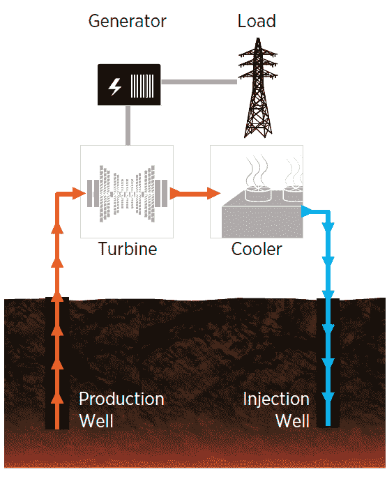
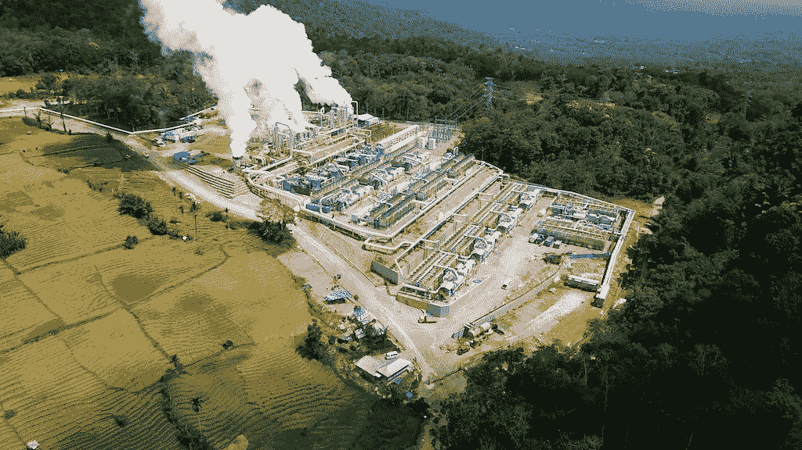
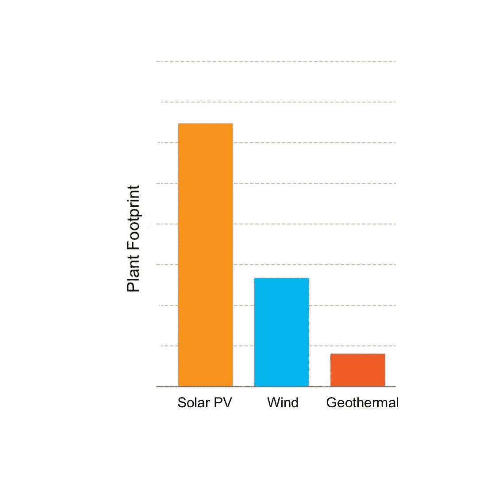
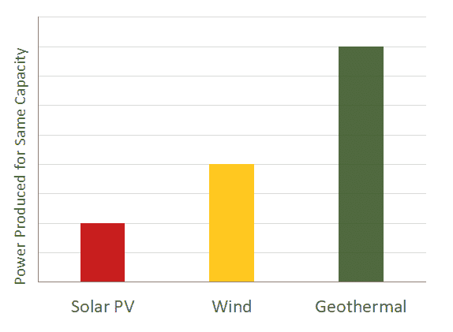
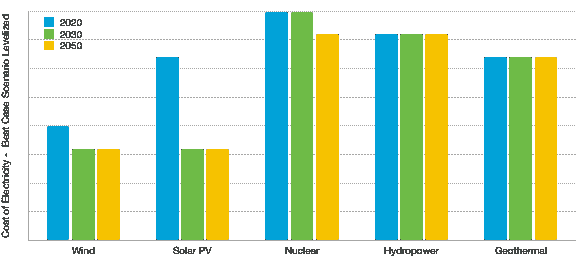
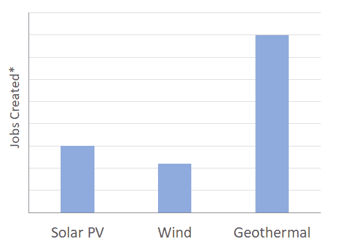

# 气候变化&地热的未来

> 原文：<https://medium.datadriveninvestor.com/climate-change-and-a-geothermal-future-b202c133024e?source=collection_archive---------19----------------------->

Yellowstone National Park, Wyoming. Photo credit: Jim Stimac

气候变化已经对我们的星球产生了巨大影响，并将继续每天影响着我们的地球。而气候科学相当复杂；世界上大多数气候科学家一致认为，碳排放正在以改变全球气温的方式改变气候。仅在 2019 年，全球就多释放了约 370 亿吨。这比 2000 年的全球排放量高出 50%,几乎是 50 年前排放量的三倍。展望未来，根据世界银行的数据，到 2050 年，世界人口将达到 100 亿。这些预测意味着世界能源消耗只会更高，因此碳排放将继续上升，尽管需要减少到零。一个有希望的解决方案是地热能源，它可以帮助满足世界日益增长的能源需求，同时又具有低排放。

地热能是储存在地球深层的热能。地核被认为是由熔融的铁构成的，来自熔融地核的热量向外层固体地壳散发。这些热量可以从地球深处提取出来，用来加热水以产生蒸汽，蒸汽驱动涡轮机产生可再生的低碳电力。地热的一个优势是，它能够产生可靠和安全的可再生电力，有助于能源弹性。

Geothermal Electricity Production — Image by DOE

好消息是，由于地热盆地的性质，地热能源排放的碳和碳当量(主要是二氧化硫和硫化氢)很少，地热井盆地中存在的一些气体会排放到大气中。

 [## 气候变化辩论中的科学与金钱|数据驱动的投资者

### 没有关于气候变化的公开辩论。在我发布文章的媒体上，有成千上万的文章是关于…

www.datadriveninvestor.com](https://www.datadriveninvestor.com/2020/01/30/science-and-money-in-the-climate-change-debate/) 

地热能的问题是，虽然地球上的这种能源丰富，但地热能，类似于水力发电，在能源项目可行的地方有地理限制。具体来说，存在较高构造板块活动的位置，例如，见下图，与东部(蓝色)相比，美国西部每平方米的热能更丰富(红色)。

Geothermal Heat flow map of the continental U.S in 2011 by SMU Geothermal Laboratory and Dr. Blackwell, Temperature at 7 km Depth

> 地热能的问题是，虽然地球上的地热能丰富，但却有地理上的限制。

**地热的状态**

2019 年，全球新增地热发电近 0.8 吉瓦。这是有记录以来的最高水平。这要感谢土耳其、印度尼西亚和肯尼亚，它们是这一增长的最大贡献者，合计占全球增长的四分之三。这三个国家也有望在 2021 年前继续引领地热发电的增长。总的来说，全球增加地热发电的前景是有希望的，但还远远没有达到需要的水平。

Indonesian Geothermal Plant — KS Orka Renewables

**低碳能源转型与地热能的未来**

谈到减缓气候变化，地热能是一个非常有吸引力的选择。第一个原因是可靠性。地热发电站能够提供连续的 24/7 服务，而不需要能量存储。由于其高容量系数(CF ),地热发电厂的发电量是相同容量的风力或太阳能发电厂的 2-4 倍，而占用的空间却少得多。这些类型的工厂的额定基本负载功率对于工业加工等应用至关重要。

> 化石燃料行业有巨大的机会提供技术和专业知识，使地热能对全球所有能源用户具有经济吸引力。

地热能系统的成本取决于系统的规模和持续时间。系统越大，所需投资越大，电价越低。尽管具有可靠性、可用性和较低的占地面积要求，但在未来 30 年内，地热能源在发电成本方面将与太阳能光伏发电和风能形成强有力的竞争。除非地热技术有多项突破(这并不罕见)，否则与地热能相比，太阳能和光伏发电的运行成本可能更低。然而，对于需要高可靠性、可用性和高温的应用，使用地热能的成本溢价将会实现。以及其他经济方面的考虑，例如为太阳能和风能项目增加储能以匹配地热项目的成本。

Projected cost of electricity from Different Sources over the next 30 years, DOE Estimates

地热能源的一个令人兴奋的机会是利用温度相对较低的能源。人们可以利用这种能量建立热循环(开放或封闭),为分布式能源、区域能源和中等规模的商业和住宅应用提供热能。这种先进的地热系统为消费者提供了一个利用可靠的持续可再生能源的绝佳机会。

也许地热能最令人兴奋的机会是，它可以帮助解决一个全球性问题，而我们的目标是到 2050 年建立低碳能源系统。这是将化石燃料(石油和天然气)行业融入低碳未来。地热工业以及石油和天然气工业使用类似的步骤和技术来定位和钻探资源，然后用于产生能量。地热项目需要有利于每个项目钻探和维护地热盆地的技术。通过调整油气技术以满足超越传统限制的需求，地热技术取得了诸多进步。化石燃料行业有巨大的机会提供技术和专业知识，使地热能对全球所有能源用户具有经济吸引力。事实证明，地热项目创造的长期就业机会是风能和太阳能的数倍。如果这个行业的参与者能够实现这一点，他们将成为转型的重要组成部分，而不会被排除在外。

Long-term jobs Created per 1000 Homes powered, California Based, DOE

**进入专家视角—** [**订阅 DDI 英特尔**](https://datadriveninvestor.com/ddi-intel)