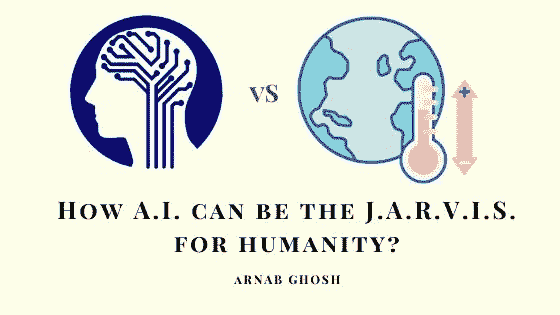
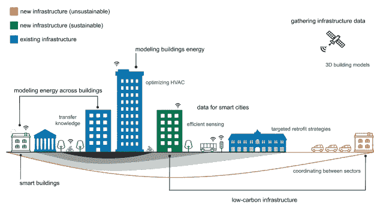
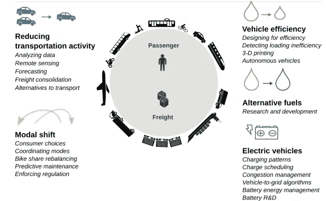
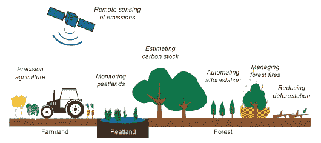

# 气候变化 vs 人工智能:人工智能如何成为人类的 J.A.R.V.I.S？

> 原文：<https://medium.datadriveninvestor.com/climate-change-vs-ai-how-ai-can-be-the-j-a-r-v-i-s-for-humanity-dfabccfdc1dd?source=collection_archive---------7----------------------->

气候变化是真实的。

10 年前，你可能会认为这是胡言乱语。但是此时此刻，看到灾难发生在我们的星球上，你不能把气候变化当成一个骗局。

(不管唐纳德·特朗普怎么说)。

据[哥伦比亚大学地球研究所](https://blogs.ei.columbia.edu/2018/06/05/artificial-intelligence-climate-environment/)，

***“目前有 20%的物种面临灭绝，这个数字到 2100 年可能会上升到 50%。即使所有国家都遵守巴黎气候承诺，到 2100 年，全球平均气温也可能会比前工业时代高出 3 摄氏度。”***

年复一年的无知使得气候变化成为一个复杂的问题，无法用基本的措施来解决。但是，人工智能和机器学习可以帮助我们解决这个问题。

 [## 气候变化、ESG 和对更好数据的追求|数据驱动的投资者

### 在地球上许多地方经历了另一个令人难以置信的炎热夏季后，来自 S&P 的最新发现…

www.datadriveninvestor.com](https://www.datadriveninvestor.com/2018/08/24/climate-change-esg-and-the-quest-for-better-data/) 

人工智能和机器学习可以用来分析和预测当前气候变化的原因，并帮助将气候变化的影响降至最低。

看到人工智能的潜力，人工智能领域一些最有头脑的人发表了一篇[研究论文](https://arxiv.org/pdf/1906.05433.pdf)，描述了人工智能可以帮助应对气候变化的 13 种方式，并有可能将人类从即将到来的危险中拯救出来。

不仅仅是一篇研究论文，AI 已经证明了自己，通过提供土地数据、肥料和播种日期的信息，帮助印度农民将花生产量提高了 30%。此外，人工智能还帮助识别热带气旋、[天气锋](https://en.wikipedia.org/wiki/Weather_front)和[大气河流](https://en.wikipedia.org/wiki/Atmospheric_river)，准确率达到 90–99%，有助于将这些事件造成的人员伤亡和损失降至最低。

显然，人工智能不是银弹，也可能不是解决气候变化的完美方案，但它肯定能帮助我们赢得这场战斗。

以下是机器学习帮助应对气候变化的方式。

**1。提高电气系统的效率**

电力是一个可以用人工智能彻底改造的行业。我们正朝着可再生能源(太阳能、风能)和可控能源(核能、地热能)相结合的方向发展。

由于可再生能源是一种可变来源(即只有在太阳升起时才能获得太阳能)，我们需要更好的方法来实时预测需要多少能源，以满足可控能源的需求。

机器学习可以实时识别电力的供需，帮助供应商根据需求调整电力输出。

**2。管理森林砍伐和农业排放**

仅仅指责工业和汽车排放温室气体是不公平的。据估计，每年有超过 15 亿吨的二氧化碳因森林砍伐而释放，主要是因为砍伐和焚烧森林。

在人工智能和卫星成像技术的帮助下，可以确定这些事件，并采取行动找出原因。

**3。提供更好的天气预报**

预测天气和发现任何自然灾害的早期迹象是人工智能的主要应用之一。

人工智能可以生成气候模型并模拟虚拟气候，考虑不同的方面，如云的运动，冰，海洋运动，土地结构等，并对未来事件做出准确的预测。

它让政府和公民在与这些灾难性事件的斗争中占据上风。

**4。开发低碳材料**

你知道吗？10%的温室气体仅仅来自钢铁和混凝土的生产。

机器学习可以通过减少碳密集型材料的使用以及重组整个生产过程以低碳能源运行，甚至通过重新设计材料的化学成分来帮助减少排放。

研究人员已经使用 ML 和各种设计软件来开发使用更少原材料的结构产品，从而减少温室气体排放。

**5。发展智能节能建筑**

[Source](https://arxiv.org/pdf/1906.05433.pdf)

将建筑电气系统与机器学习结合起来，可以极大地影响建筑电气系统的能效。

例如，了解建筑物中的人的行为模式和使用更多能源的设备的数据对于提高效率措施是必不可少的，并且可以用于了解和激励人们限制他们的能源浪费。根据[研究论文](https://arxiv.org/pdf/1906.05433.pdf)

***“建筑中的智能控制系统可以通过减少能源消耗和提供将低碳能源融入电力组合的方式来减少碳足迹。”***

不过也不全是好事。这个系统有一些缺点。智能设备必须持续开启并连接到网络。这本身将消耗额外的能量，并且智能设备可能容易出现安全和隐私风险。

**6。让交通更加节能**

[Source](https://arxiv.org/pdf/1906.05433.pdf)

运输业占全球二氧化碳排放总量的四分之一。而且每天都在增加。与其他部门相比，交通部门在解决高二氧化碳排放方面做得并不多。

这主要是因为大多数车辆所需的高密度化石燃料和电动汽车的局限性。

研究表明，超过三分之二的交通排放来自公路旅行。拥抱人工智能有助于减少能源浪费和提高车辆效率。

人工智能还可以帮助减少交通堵塞。通过人工智能，可以对行驶时间、装载和优化车辆路线进行必要的调整，从而减少车辆里程数。

**7。充分利用农业**

[Source](https://arxiv.org/pdf/1906.05433.pdf)

你可能不相信，但全球温室气体排放的主要部分来自森林砍伐和不可持续的农业。

人工智能可以通过更好的土地管理和农业来帮助减少 GHG 排放。此外，精准农业是一种提高作物产量的好方法，同时还能减少农田的碳排放。在人工智能和卫星成像的帮助下，监测森林和泥炭地成为可能，因此可以准确预测火灾或任何其他类型的潜在危险。

**8。教育人们，给他们减少碳足迹的工具。**

的确，我们抗击气候变化的唯一途径是通过教育。还需要教育来提供与之斗争所必需的技能和工具。

尽管气候变化影响着地球上的每一个人，但它对全球的影响并不一致。一些地区受影响很深，而其他地区受影响不太大。

这就是为什么许多人至今否认气候变化，因为他们不知道气候变化的真正影响。

人工智能可以通过模拟气候变化的场景来帮助人们传播意识。这种体验可以帮助人们了解信息技术的真正影响，并在人们之间传播意识。