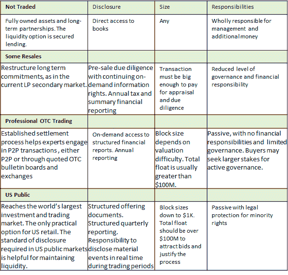

# 攀登流动性阶梯

> 原文：<https://medium.datadriveninvestor.com/climbing-the-liquidity-ladder-ca7d2a2c9e8d?source=collection_archive---------6----------------------->

私人市场流动性正在发生重大变化。就在令牌化热潮崩溃和燃烧的时候，一波更大的私募股权二级交易在曲棍球杆式增长的道路上起飞，创造了一个 1000 亿美元的市场。

成功的努力具有适合他们的[交换水平](https://www.datadriveninvestor.com/glossary/exchange/)的属性。他们在 ***流动性阶梯*** 上找到合适的位置。

# 资产在阶梯上上下移动

当你意识到发行者和投资者有动机在不同类别之间转移时，这个阶梯就变得更有趣了。在过去的十年中，超过 4 万亿美元的资产从公共类别转移到了私人类别。现在他们开始在私人领域活动。

## 对于发行人

发行者有动机转向更大的流动性。这让他们能够接触到大量投资者。这也给了他们“流动性溢价”。如果投资者可以轻松地转售证券，他们可能会为其证券支付更高的价格，并给予更高的估值。转售市场降低了他们的风险，允许他们管理他们的长期资金需求，并为他们提供未来再投资的选择。学术研究认为这一流动性溢价约为 25%。

 [## 为什么包容性财富指数比 GDP 更能衡量社会进步？|数据驱动…

### 你不需要成为一个经济奇才或金融大师就能知道 GDP 的定义。即使你从未拿过 ECON 奖…

www.datadriveninvestor.com](https://www.datadriveninvestor.com/2019/03/08/why-inclusive-wealth-index-is-a-better-measure-of-societal-progress-than-gdp/) 

然而，发行者显然有很多动机从公共流动性转向私人非流动性。

*   少数股东可能会为控制权支付溢价
*   它们可以锁定投资者的长期承诺，并为他们创造增值的激励
*   他们有更多的保密性和更少的披露成本
*   他们避免负流动性溢价。如果能够交易，大盘股、交易活跃的证券通常会更值钱。但是，如果交易的话，小盘股的价值可能会降低。他们的出价者很少，当有人去卖时，可能不会有出价者购买订单。自 1996 年以来，规模较小的公司一直在离开美国公开市场。有一种理论认为，这是因为做市商规则的变化，这使得在小规模发行中购买和重新分配卖出订单无利可图。从上市股票交易中获益的最低浮存规模可能超过 2 亿美元。

## 对投资者而言

投资者将大量资金投入公共证券。他们喜欢将私人证券带入交易市场，在那里他们可以获得转售期权和流动性溢价。即使在公开市场内部，他们也倾向于更具流动性的证券。在过去十年中，这是一个很好的投资策略，当时量化宽松的资金推动了大型被动股票指数的高回报。

然而，私人收购基金的回报甚至更高。出于多种原因，投资者可能希望跟踪私募市场的发行情况:

*   回报可能更高。从理论上讲，非流动性折扣可以提高回报率。
*   他们想把时间转换成金钱。他们可能是非常有耐心的投资者，他们可以通过长期锁定资金来寻求更高的回报。
*   私人市场正在创造新的资产和新的资产类别，具有潜在的高回报。做规模较小、更不为人知的交易也能获得更高的回报。
*   他们拥有专业知识，有时间进行实际管理和增值

## 在梯子中间导航

我们拥有巨大的高端市场(非常长期的投资)和低端市场(完全公开活跃交易的投资)。目前人们对私人市场流动性的兴趣，很大程度上是为了让更多的证券进入阶梯的中间位置。这是一种两全其美的尝试——长期承诺的回报，与重量级投资者的关系，以及转售选择权。

在我看来，当发行者试图这么做时，这种做法并不奏效。他们最终出售的是一种规模有限、披露有限的证券，这是一笔糟糕的投资。

当投资者这样做时，它就在起作用。他们开始做质量控制和设计他们的长期投资来赚钱。然后他们会想办法转售投资。这就是风险投资应该如何赚钱，通过让公司上市。然而，IPO 渠道已经变得不那么有吸引力了，因此投资者开始从私募股权二级市场开始，向中间位置抛售。根据 Triago 的数据，他们在 2018 年交换了价值 600 亿美元的私募股权二级市场，在 2019 年交换了 900 亿美元，并呈持续上升趋势。

那么，基金做的时候会怎么样呢？理论上，我们应该能够将长期“另类”投资基金打包，作为流动性证券转售。

已经试过很多次了。它适用于房地产。事实表明，公共房地产投资信托基金往往是比私人房地产合伙企业更好的投资。通常一个房地产项目会由能够进行“增值”开发的专家作为私人投资开始，然后在开始获得收入时转移到证券化的 REIT 基金。

在其他类别的私募股权和风险投资中，公众的选择有限，小型私募基金往往表现出色。美国的法规使这些基金的交易变得特别困难。现有的私人 LP 交易在某种程度上进行了优化，使证券化版本失去了吸引力。我写过关于证券化基金的文章，并继续致力于增加流动性的新结构，如非绑定基金。希望我们很快会有更多结论性的解决方案。

# 提示和技巧

## 定义“流动性”

当你的资产有多个竞标者时，你就获得了流动性。

如果你有大量的现有股东，你会有多个投标人，他们有信息流，让他们有信心对你的资产进行估值，从披露，持续报告，或可观察到的特征，如网络活动。

## 什么在私募发行中起作用

阶梯的私人端对于建立长期承诺的价值非常重要。私人报价有一些我们需要记住的属性:

*   如果发行需要投资者方面的大量研究和尽职调查，那么发行人应该只向一小部分投资者发行。投资者不会在一项可能会输给其他竞购者的交易上投入时间。
*   这些术语通常是定制的。条款必须适合投资者，因为投资者做出了长期承诺，如果投资不符合他们的预期，他们不会轻易退出。投资者可以要求定制，以换取他们对尽职调查的承诺。
*   发行人可以要求保密
*   投资者通常会按需获得信息，而不是按计划披露
*   产品可以是从小到大的任何规模。

## 什么在公开发行中起作用

阶梯的公共端可以有更好的定价和更高的交易量，因为它降低了投资者长期锁定资金时所承担的风险。公开招股也有一些自然属性:

*   优惠不是定制的。它们尽可能标准化，并打包成几个大盘股。如果投资者不喜欢这些条款，他们可以卖出。
*   他们对证券和基础业务有很好的披露。
*   他们有大量的流动资金和许多股东

## 问题:对于小额投资来说，众筹和“民主化”是失败的概念

向投资金额较小的更广泛受众提供专业投资机会听起来不错。这是[众筹](https://www.datadriveninvestor.com/glossary/crowdfunding/)和“民主化”的承诺。数百种产品已经以此为目标推出。然而，它们不起作用！以下是投资者回避它们的一些原因:

*   逆向选择。这些提议往往是糟糕的投资。如果发行人有少数大投资者会购买的好交易，他们就不会花时间和费用向许多小投资者出售投资。
*   很难把钱要回来。没有人对披露不充分的小规模发行进行投标。
*   小市场。做研究选择个人小盘股投资的个人投资者没有多少钱。德国的牙医不会分析佛罗里达州的购物中心房产(正如我收到的一份提案中所描述的)。这不是很好地利用他们的时间，他们意识到专业投资者有更好的信息。个人投资者将大部分资金放在专业管理的基金中，或者直接投资，或者通过养老金投资。

如果我们想为所有投资者提供全方位的投资渠道，我们就应该降低基金管理成本，扩大公开的大型投资结构的范围，以便更容易地纳入“另类”投资。

## 摘要

如果你正在购买、出售或建立新的金融服务，在流动性阶梯的连贯槽中工作是很重要的。我一直在研究数字私人市场和非绑定基金。这个阶梯改编自我们的一些战略方针。

Andy 是一名软件架构师、首席执行官/首席技术官，也是创新领域的学生。他目前正在开发 HumanDB，这是一种提供自动化医疗建议的新架构，以及 Unbundled Fund，这是一种针对数字私人市场的更好的投资结构。他是 SaaS 合作公司 ampla、SaaS 企业公司 PowerSteering Software、进化算法公司 Creation Mechanics 的创始人，也是 SNL Financial 的第二名员工。他拥有哈佛大学的本科学位。

*原载于 2020 年 3 月 3 日*[*【https://www.datadriveninvestor.com】*](https://www.datadriveninvestor.com/2020/03/03/climbing-the-liquidity-ladder/)*。*