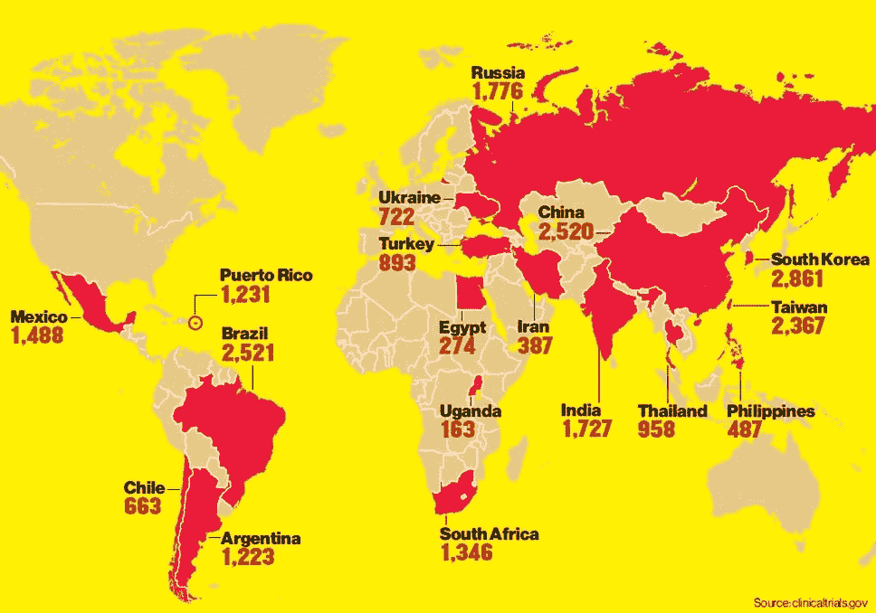
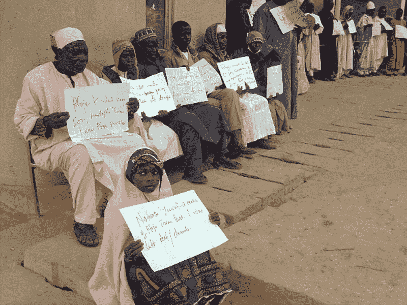

# 临床混乱:新冠肺炎治疗试验的伦理

> 原文：<https://medium.datadriveninvestor.com/clinical-chaos-the-ethics-of-covid-19-treatment-testing-c8218d49a01b?source=collection_archive---------8----------------------->

Source: Chicago Booth

这个世界可能不再是我们曾经熟悉的那个地方，但是那些掌管人类生活的人的行动仍然是一样的。

人类从未有过如此紧迫的期限来寻找解决如此巨大问题的方法。世界各地的研究人员和科学家正在加快药物开发过程，努力使所有这些社会距离都是值得的。我们可以在接下来的十年里试图使曲线变平，但如果没有有效的治疗方案，生命将会被夺走。

人类的痛苦被定义为“忍受死亡、痛苦或悲伤；遭受损失或损害；屈服或被迫忍受

这些词都描述了低收入和中等收入国家的贫困人口的状况，在这些国家，他们不仅可能被用作开发可行治疗方案的实验品；他们也无法获得这种治疗。

 [## 冠状病毒；惊慌失措；字里行间的 z |数据驱动的投资者

### 围绕冠状病毒的话题；更准确地说，新冠肺炎几乎占据了整个新闻预报的头条…

www.datadriveninvestor.com](https://www.datadriveninvestor.com/2020/03/23/coronavirus-a-to-panic-z-between-the-lines/) 

# 临床试验的阴暗面

不平等和不公正充斥着现代药物开发行业。我很幸运地生活在一个地方，虽然不是免费的，但我有足够的医疗保健。对于一些国家的人来说，他们与医生的唯一联系是通过临床试验。

明尼苏达大学生物伦理学教授、著名作家卡尔·埃利奥特博士进一步阐明了这一点，他说，“最令我沮丧的是，我看不到有什么行动的途径，可以反击承受这一负担的人……病人和穷人如此脆弱，如此容易被利用，以至于几乎没有采取某种集体行动的机会。”

> **“我们发展中国家拥有医疗保险的富人可以依靠没有医疗保健的穷人来为我们测试我们的药物，没有人认为这是一个问题…”**

Clinical Trial participants from around the world. Source: The Independent

在冠状病毒恐慌中，由于需求的紧迫性，是否有必要进行临床试验存在争议。通常，这些试验是为了防止接受试验性治疗的患者健康状况下降，并避免应用无效的药物。

由于没有这些相同的目标，许多试验可能会违背几个典型的伦理规范。哈佛大学多区域临床试验中心的执行主任丽贝卡·李(Rebecca Li)强烈反对对实验性新冠肺炎药物进行临床试验，她解释说:“临床试验是有原因的。大多数药物最终都不起作用。”

在这篇文章中，您将了解一些开发药物的制药公司如何专门针对发展中国家的低收入群体对这些人造成伤害，以及制药公司的做法如何导致人类痛苦，如果我们对它们应用某些标准，这可以得到解决。

## 腐败行为的历史…

制药业的腐败——甚至是药品本身——并不新鲜。在迄今为止最糟糕的一次试验中，辉瑞公司进行的一项实验性药物测试以许多本来可以避免的死亡告终。1996 年尼日利亚爆发可怕的脑膜炎期间，辉瑞在未经儿童或家长同意的情况下，在 200 名儿童身上测试了 Trovan。这导致 11 人死亡，许多人现在都有残疾。

Source: BBC News

*Trovan* 目前在欧洲被禁止，在美国需要非常严格的措施才能获得。该临床试验中缺乏沟通和伦理决策，给参与者带来了巨大的伤害和痛苦。公司做出这种跳跃的最大原因是因为市场——最明显的是，需要快速完成研究。

“让他们慢下来的是招募对象，”埃利奥特说。“完成得越快，药物就能越早上市，公司就能越早赚钱。”

> “最容易招募的病人是那些没有医疗保险和/或贫穷的人。他们需要钱。”

并非所有出错的临床试验都是因为不道德。有些事情是无法预防或预测的，这里有一些在第一世界国家失败的试验的例子，在这些国家，没有发现医疗监督是影响结果的一个因素…

*   【TGN1412 的“象人”试验

*   **在法国进行的*比亚尔*药物试验**

# 是什么促使医学研究者忽视伦理学？

研究或临床试验资金不足也会导致腐败行为。许多低收入和中等收入国家积极开展本国的临床研究，因为这可以促进经济发展。这种研究很容易吸引生活贫困的病人，因为临床试验是他们获得医疗保健的唯一途径。

当我综合我自己对医学开发的想法时，我发现 Boghuma Kabisen Titanji 的这个演示内容非常丰富，我建议我的所有读者看一看。

> “在缺乏良好的医疗保健系统的情况下，几乎任何医疗援助都被认为是聊胜于无，”— Boghuma Kabisen Titanji

正如研究人员在以前的研究中发现的——现在又在冠状病毒中发现的——迫切需要治愈的人会尽一切可能确保自己和/或亲人的安全。

据 Chicago Booth 称，一旦试验结束，许多参与这些试验的人甚至将负担不起他们正在服用的药物。这可能造成威胁生命的后果，引发停药、复发、疾病严重程度增加以及改用不同药物的副作用。这种情况经常发生在南非，那里的医疗基础设施不利于穷人，导致许多欧洲制药公司前来进行测试，然后在试验结束后立即取消任何医疗支持。

> 每年花费在药物开发上的资金超过 70，000，000，000 美元，其中不到 10%的资金用于解决世界上 90%的健康问题。

Source: The Guardian

临床试验可能会给参与者带来真正的健康风险，因为正在测试的药物或疫苗的安全性和副作用尚不完全清楚。

卡内基梅隆大学伦理与政策中心主任亚历克斯·约翰·伦敦说:“你要确保你不会利用贫困。”。

> “不要把世界看成是一个方便的病人群体，你可以去那里获得你需要的数据，以便在高收入国家建立更强大的卫生系统，”

# 为了战胜市场竞争，制药公司需要尽快完成研究…

时间就是金钱；人们越快注册参加临床试验，制药公司就能越快赚钱。埃利奥特说:“越来越多的临床试验仅仅是为了营销，而不是为了科学目的(增进我们对疾病或治疗的了解)。”临床试验是为了让一种药物看起来更好，这样它就可以被批准上市。…这完全是由市场驱动的。"

“为了确定一种药物是否安全而进行的第一期 T2 试验(T3)，研究人员必须招募健康的人。然而，哪个健康的人会自愿成为第一个服用实验性药物的人呢？失业者和穷人，”埃利奥特说。

“很多病人在美国，因为我们没有全民健康保险，”他说，“但这也意味着发展中国家的人们。发展中国家有很多病人很乐意报名参加试验。”

这些中低收入国家的非政府组织亲眼目睹了这场灾难；他们不断声称，药物开发行业利用了低收入公民和没有受过正规教育的人的无力感。

在阿根廷，药物试验在误导家长的“同意”下进行。有些情况下，医生实际上持有药物和护理，除非一个人同意参加试验——在试验进展不顺利或父母拒绝让孩子参加的情况下，这可能是非常危险的。

更糟糕的是，当一些医生成功地让一个病人报名参加临床试验时，他们甚至可以获得利润分成或奖励。您可以在下面的视频中了解这些事件的更多信息:

在很大程度上，LIMCs 的执法部门甚至不监管科学研究或临床试验，因此让参与者在法律上无助于医疗虐待。这给参与者带来了一连串的未知，他们不知道在非正常死亡或严重副作用的情况下去哪里或向谁求助。

荷兰非政府组织 Wemos 的 Annelies den Boer 强调,“如果病人有副作用，公司通常会否认这些副作用与药物有任何联系。对于像这样的参与者来说，证明任何事情都异常困难。”

在过程的这一部分，人们没有努力通过拒绝在必要的程度上倾听参与者来减少痛苦——这意味着这不仅是不道德的，而且由于过程中缺乏沟通，可能会导致更不准确的结论。当公司实施像这样的非法措施时，并不一定有付诸行动的保障措施。即使在美国。

在美国*有近 6000 个机构审查委员会(IRB ),旨在确保程序的道德应用，然而他们的收入主要依赖于他们评估的公司的成功。埃利奥特补充道，正因为如此，IRB 往往对公司有监督权。在科罗拉多州，一个 IRB 被发现愿意给一个未经测试的产品一个假的试验通行证，使其对市场发布造成危险。虽然这一个例子被抓住了，但是没有必要证明更多像这样不道德和不公正的行为正在发生。*

# 这对新冠肺炎有什么影响？

如果你想了解更多关于病毒本身的影响，请[查看知识社会](https://medium.com/@theksociety/the-only-coronavirus-guide-youll-need-covid-19-explained-and-squashed-5af485c36d4d)发表的这篇文章，其中有一段我制作的关于流行病的基本原理和理解新冠肺炎的视频。这篇文章本身也包含了我与北美学生一起撰写的内容，以帮助公众更好地了解当前的全球形势和正在开发的对抗冠状病毒的治疗方法。

至少有 35 家公司和机构宣布，他们正在率先开发新冠肺炎疫苗，其中至少有 4 家公司达到了临床前试验水平。第一批参与者将是年龄在 18-55 岁的健康成年人，他们在登记时都没有感染过该病毒。通常疫苗需要 12-18 个月的时间来开发，这导致这些试验以极快的速度进行，因为家庭变得非常绝望。

正如在以前的大流行中看到的那样，医生选择使用所有提供给患者的常规护理作为“安慰剂”,而不是合法的药用安慰剂。这是因为他们不一定能省下假药，因为病人仍然需要一些子集的护理。卡耐基梅隆大学伦理和政策中心主任亚历克斯·约翰·伦敦同意这一点，强调“由于大多数新药不起作用或有害，在常规治疗的基础上随机服用安慰剂显然不会使你的病情恶化。”

最公正的试验方法是双盲法，医生和病人都不知道病人是在服用药物还是安慰剂。如果医生知道患者服用的是哪一种药物，即使是下意识的，他们也会做出快速判断，因此可能会对哪些患者应该和/或不应该服用试验药物产生偏见。

Jennifer Haller is the first patient to receive a vaccine that may pose a cure to COVID-19\. Source: NPR

到目前为止，世界卫生组织还没有进行双盲试验，尽管他们会从中受益匪浅。通过使用这种方法，他们确保程序的每个部分不仅是最准确的，而且在沟通和幕后工作方面也是平衡的。如果目标是实现从研究人员到设计人员的平等，那么他们都必须能够分享、交流和发布成果。要做到这一点，他们最好在整个过程中采用最道德的选择。

# 让新冠肺炎期间的测试更加道德

为了确保研究和伦理计划的最公平分配，每个人都必须参与到研究过程中，特别是参与者——如儿童和孕妇——以便科学家能够就药物的疗效得出最准确的结论。此外，保持参与者和研究人员之间的积极沟通，在这个过程中更容易做到公平。

对该过程最有益的是在治疗发展方法的所有方面将总体痛苦保持在尽可能最低的比率。这也意味着理解任何一个群体在任何时间和过程中的需求，并且能够根据需求的变化来评估需求。

目前正在进行的大多数临床试验都采取了一切预防措施，以确保他们的方法是公正的，他们的病人得到良好的照顾。我要感谢所有的医生和研究人员，他们不知疲倦地工作，以确保每个与新冠肺炎作斗争的人的健康和福祉；这些人是真正的英雄。

这篇文章中没有任何内容旨在批评前线的医护人员或那些参与当前新冠肺炎临床试验的人员。

同时，不管你来自哪个国家，在当前的新冠肺炎危机中，有三件事可以极大地提高药物测试的伦理性。

## 知情同意

在对患者进行测试时，确保他们了解参与实验性治疗的风险是非常重要的。应该用患者说/读的主要语言向他们完整地解释在手术过程中采取的措施和涉及的潜在副作用，以及他们将获得的医疗护理的全部范围。患者应该在手术之前、之中和之后有机会接触法律顾问，以确保患者的安全。

## 加强监督

在临床试验经常发生且存在大量医疗事故的国家，执法部门和政府官员必须加强保护公民的安全，以对抗这些大公司。通过在低收入和中等收入国家设立道德咨询机构或扩大现有委员会，

## 希波克拉底誓言的提醒

不是所有的临床试验都是腐败的；许多医生宣誓要严肃地防止伤害，坚持他们凭良心和尊严行医的诺言。

下面是 2019 年美国国家未来医生和医学科学家学会大会的视频，我的青少年朋友和未来的医生们一起宣读了希波克拉底誓言。

在我们需要尽可能多的支持医疗工作者的时候，这种在医疗事业中为他人服务的承诺是如此鼓舞人心！如果制药公司将在伦理基础上开发临床试验的需要内在化，这将是出于维护希波克拉底誓言标准的道德义务，而不管金融繁荣的拉动。

请务必给这篇文章留下掌声，并在 faithinello@gmail.com 给我发电子邮件，询问有关临床试验伦理研究的问题。如果你喜欢这篇文章，可以看看我关于改善青少年心理健康的[系列采访](https://blog.usejournal.com/dumb-jocks-work-smarter-by-working-out-6d22d6fa6370)或[我在童年不良经历刺激的化学途径方面的工作。](https://medium.com/@faith.inello/adverse-childhood-experiences-a-metabolic-view-45c000af1342)