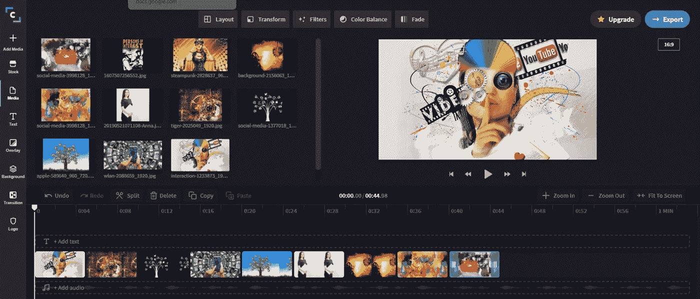

# 随着视频创作者激增，Clipchamp 获得 500 万用户

> 原文：<https://medium.datadriveninvestor.com/clipchamp-gains-5-million-users-as-video-creators-surge-7a41c24ea1f9?source=collection_archive---------13----------------------->

Image source [Clipchamp](https://clipchamp.com/en/).

越来越多的人在寻找简单的工具来进行视频创作，Clipchamp 满足了他们 40%的需求。

在最近的文章中，我报道了像 [Canva](https://hackernoon.com/canva-gains-10-million-new-users-in-2020-q3-interview-vt1j3ebp?ref=hackernoon.com) 和 [InVision](https://hackernoon.com/invision-gains-2-million-users-adds-freehand-templates-interview-t9293zye?ref=hackernoon.com) 这样的公司的重大公告，它们的用户群有了显著的增长。Clipchamp 没有 Canva 在美国的品牌知名度，但它为视频制作人做的事情基本上与 Canva 和 InVision 为潜在的图形设计师做的事情相同——为他们提供足够直观的点击式工具，用户可以快速开始创作，而无需学习大量复杂的编辑、布局或设计软件。

效果是否和聘请专业人士做你的设计或视频剪辑一样好？如果用户真的没有创作经验，很可能不会——但技术已经变得足够好，即使像我这样的非设计师也可以偶尔成功地装扮封面图像，而不必向设计师寻求帮助。在这方面，像 Clipchamp 这样的免费增值选项的可用性对于那些想在发布内容的同时学习新技术的创作者来说是一个真正的福音，而不是花 100 个小时关在黑暗的房间里学习 Adobe After Effects。

> 自从疫情问世以来，普通消费者对互联网的使用总体上有所增长，公司基于屏幕的收入也随之增长。

Zenith 的[在线视频报告](https://whatsnewinpublishing.com/ad-spend-on-online-video-will-rise-to-61b-by-2021-as-time-spent-viewing-grows-rapidly-at-32-a-year/?ref=hackernoon.com)称，2013 年至 2018 年间，观看在线视频的时间平均每年增长 32%。去年，观众每天花 84 分钟观看在线视频，但预计到 2021 年，这一数字将上升至平均 100 分钟。当然，哪里有好的内容和观众，哪里就有赚钱的机会——到 2021 年，在线视频广告将从今年的 450 亿美元上升到 610 亿美元，增长率几乎是在线广告的两倍。

Clipchamp 的增长伴随着新创作者的浪潮，他们已经获得了 40%的用户——自 2020 年 3 月以来增加了 500 万新用户(总共 1300 万用户)。

> 为了满足今年的客户需求，Clipchamp 的规模增加了近两倍，达到 80 名全职员工，新的领导层来自微软、亚马逊、谷歌、脸书、罗技和红帽等品牌。

该公司还在西雅图开设了一家新的美国分公司。我在 Clipchamp 的西雅图办公室找到了该公司的产品总监 Anna Ji，问了她几个问题，关于他们是如何调整他们的在线工具的，以及他们是如何在创作者活动激增的情况下实现增长的。

Anna Ji, Clipchamp

# 安娜·吉的反应是:

为了将这一机会转化为不断增长的用户群，Clipchamp 做了哪些工作？

在新冠肺炎之初，Clipchamp 意识到它在帮助受疫情影响的企业方面处于独特的地位，并为所有新用户推出了新冠肺炎免费试用服务。Clipchamp 的视频编辑器工具使企业能够轻松创建相关的视频内容，与客户进行交流。这不仅实现了企业和客户之间的清晰沟通，还为数字领域的创新提供了机会。

在此期间，Clipchamp 的新用户注册量增加了 69%，其中包括 41%的新冠肺炎免费试用用户继续使用付费计划。因此，2020 年 3 月至 10 月，Clipchamp 的视频出口增长了 120%，与前一年同期相比，出口大幅增长。

# 免费产品是否已经改变以适应不断变化的用户需求？

随着工作和学校变得越来越遥远，捕捉的能力变得比以往任何时候都重要。为了帮助那些现在需要远程交流的人，我们决定在我们的免费计划中增加捕捉屏幕录像和网络摄像头录像的功能。

> 这些功能的使用显著增加；自 3 月份以来，屏幕录像增加了 900%，网络摄像头录像增加了 550%。

我们现在还提供直观的编辑功能，如 freehand，允许用户自由裁剪和重新定位视频剪辑，而不受限制。该功能还允许用户在一帧中展示多个视频。这个工具在讲解视频或者现场事件的录音中特别有用。最近，我们发布了新版本的编辑时间表。新的和改进的时间线更加直观和用户友好，让日常编辑更容易使用 Clipchamp 进行编辑。

我们不断更新我们的媒体导入和导出选项(集成)，以满足日常编辑不断变化的需求。仅在 11 月，我们就在集成列表中添加了 Box 和 Zoom。

我们的 Box 集成允许用户安全地将媒体从他们的 Box 帐户直接导入 Clipchamp，编辑视频并将完成的项目导出回 Box。

我们的缩放集成使编辑缩放记录变得更简单…用户现在可以将缩放记录导入 Clipchamp，编辑它以提高其可观看性，并导出到共享。

除了集成之外，我们还启用了一个新的导入系统，允许编辑使用一个简单的六位数字代码将媒体文件从他们的手机“放”到 Clipchamp 中。

# Clipchamp 在内容创作领域哪里看到了最明显的增长？

我们已经看到整体视频出口的显著增长，但最重要的是，单个用户每月出口数量的增长。单个用户每月 11-20 个视频的出口增长了 152%,对于中小企业和企业用户，自 3 月份以来增长了 108%。

自 3 月份以来，我们还看到整体模板使用率增长了 119%,抖音特定宽高比视频出口增长了 93%,抖音模板使用率增长了 8000%。

总体用户增长中有多少是针对抖音用户的？

自 3 月份以来，我们看到抖音模板的使用量增长了 1000%，抖音特定宽高比视频的出口量增长了 93%。

**抖音是 Clipchamp 的主要关注点吗？**

我们的重点是确保我们为用户提供对他们重要的功能，这可以随着时间的推移而改变。现在，抖音在中小型企业方面做得非常好，所以我们肯定要满足这些需求。

**在隔离/封锁期间，创造和表达的能力是一种重要的调整方式吗？**

交流的能力是最基本的，而视频无疑是最有效的交流方式。我们确实看到视频的范围在扩大，我们的客户不再只是制作高预算、高投入的视频，而是将它用于日常目的。

# 你见过出乎意料/似乎特别有创意的用户趋势吗？

团队使用视频蒙太奇做他们的季度包装特别有创意和温暖人心。基于此，我们推出了模板，供用户制作“2020 年底”总结视频，用于内部和外部交流。

**你认为 2021 年创作者的视频内容轨迹是什么？**

我们将看到越来越多的视频创作被用于营销和社交媒体，也用于组织内部的日常交流，包括培训、操作和演示视频、员工和客户入职视频以及视频演示。非营销团队将加速采用视频来替代其他形式的异步交流。

【Clipchamp 为什么要在美国重新组建公司？

Clipchamp 在美国拥有庞大的客户群，从中小型企业到财富 500 强企业，数百万企业都在使用该客户群，因此，拥有一个实地团队对于了解这些客户的需求至关重要，可以确保我们掌握最新视频趋势的脉搏，从而了解我们如何在这个市场中发展壮大。

通过在西雅图和旧金山的办公室，Clipchamp 正在与谷歌、Dropbox 和 box 等合作伙伴携手合作，让来自世界各地的创作者能够与他们最喜爱的应用程序和文件云存储连接，在那里他们可以存储他们最喜爱的记忆。

Clipchamp 将很快宣布更多的合作伙伴关系，以不断减轻我们的创作者的工作流程。

谷歌报告称，YouTube 第三季度表现强劲，广告增长 50.4 亿美元，拥有 3200 万个频道，用户超过 20 亿。抖音已经拥有超过 5 亿用户，并躲过了美国政府关闭它的努力

可以肯定地说，视频消费将继续增长。此外，美国约有 4000 万人新近失业，疫情让我们所有人都呆在家里，很容易看出这种为更多创造者提供更多激励的趋势将如何继续下去。

看看将会有什么工具可以用来进一步使创建内容的能力民主化，这将是一件有趣的事情。1999 年，我在帮忙搬运 50 磅重的公路箱子。+每个人都用当天的测试设备拍摄——现在人们用他们的 iPhones 拍摄短片，并在他们的卧室里编辑它们。

在我看来，在接下来的几年里，看看在几乎没有经验或设备的情况下能做些什么将是非常有趣的，这肯定会成为基于网络创作的温床。

*原载于*[*hacker noon*](https://hackernoon.com/clipchamp-gains-5-million-users-as-video-creators-surge-9h1n34af)*。*