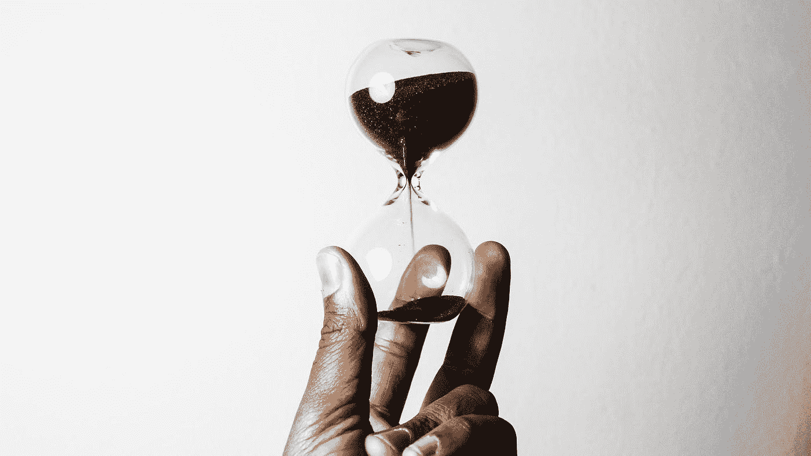

# 收盘，但没有雪茄——股市目标创历史新高，陷入停滞的 COVID 救济

> 原文：<https://medium.datadriveninvestor.com/close-but-no-cigar-stock-market-targets-record-highs-amidst-stalled-covid-relief-fad5a5699cde?source=collection_archive---------33----------------------->

## **DDI 市场&经济简讯| 8 月 17 日当周|连同 Alpha 交易**

## DDI 更新

**专家聊天程序:**一个协作市场，人们可以在这里与能够解决他们问题的专家聊天。你是专家吗？为你的时间和努力获得报酬！报名已经开始，[**跳上**](https://datadriveninvestor.com/expertchatregistration) **。**

顺便说一下，我们知道不是每个人都是文字大师。没关系，我们还有一个很酷的方法让你**将你的专业知识和智慧转化为金钱**。

你是一个习惯性的推特用户，还是一个世界级的 Redditor？你有没有每天花几个小时在 Quora 和 StackExchange 上找乐子？你需要第三只手来数你编辑了多少维基百科文章吗？

如果是这样，DDI 的幕后正在进行一个绝密项目，它可能非常适合你。

**如果你想在某件大事上合作，给我们发一封电子邮件**:主题为【思想者】的*research@datadriveninvestor.com*

最后一项工作:我们将时事通讯的市场&经济问题分成两期，因为发生了太多的事情！每周一和周四查看你的收件箱，看看 DDI 未来的内容。

[*订阅 DDI 简讯*](https://www.datadriveninvestor.com/about/) *，让你不漏一拍。*

**最新 DDI 问题:**

*   [加密货币](https://medium.com/datadriveninvestor/aaaand-its-gone-706f05f8b254)
*   [市场&经济](https://medium.com/datadriveninvestor/executive-order-trumps-new-stimulus-tech-shake-up-f846d81d0239)
*   [技术](https://medium.com/datadriveninvestor/rocky-start-for-reels-global-tech-splinters-5g-gets-a-boost-33f9dc14662a)

# DDI 编写器亮点

每期我们都喜欢从展示一些来自 DDI 社区的发人深省的故事开始。想让你的故事成为特色吗？[在这里提交你最好的](https://datadriveninvestor.com/mainsubmission)。

[筹集创业资金？保持势头并成功结束的 5 个步骤](https://www.datadriveninvestor.com/2020/08/16/raising-a-startup-round-the-5-steps-to-keeping-momentum-and-actually-close-successfully/)作者 Amit Garg

股票捐赠:了解什么

[理性背后的非理性](https://www.datadriveninvestor.com/2020/07/13/the-irrationality-behind-rationality/)

[钱:在疫情冠状病毒期间投资](https://www.datadriveninvestor.com/2020/07/29/money-investing-during-the-coronavirus-pandemic/)

如果资本主义失败了，那么还有什么选择？医学博士亚当·塔布里兹

# 推销

Photo by Who’s Denilo ? on Unsplash

[**恐惧&贪婪指数**](https://money.cnn.com/data/fear-and-greed/)**:【69:贪婪】(截至 2020 年 8 月 17 日)**

标准普尔 500 本周收盘时接近创纪录的收盘高点。在美国和海外的经济不确定性面前表现良好的贵金属遭遇抛售。金价曾短暂超过 2000 美元。美国 10 年期国债的实际收益率下滑至负值，给美元指数带来压力。

The S&P 500 this week, in a nutshell.

**特斯拉(TSLA)宣布了一项**[**5–1 股票分割**](https://www.marketwatch.com/story/companies-are-weighing-stock-splits-after-tesla-and-apples-announcements-expert-says-11597404072) ，这对寻找更便宜进场的罗宾汉散户来说应该是个福音。Robinhood 正在[碾压竞争](https://seekingalpha.com/news/3603877-robinhood-shares-monthly-trading-data-for-first-time-blows-away-competitors?utm_source=feed_news_all&utm_medium=referral)，看到 2020 年 6 月日均收入交易(飞镖)430 万，经纪平台新增账户 300 多万。

# 经济

**万亿美元的分歧|** 第五次冠状病毒救助计划可能会在[几周之后](https://thehill.com/homenews/senate/511896-senate-leaves-until-september-without-coronavirus-relief-deal)，领导人无法找到妥协方案。“我们的价值观相差甚远，”南希·佩洛西周四在谈判破裂后告诉记者。

**主街感受到了灼烧感|** 消费者价格通胀已经超过 29 年没有这么高了。尽管如此，由于有 3130 万人领取失业救济金，普通人经历的通货膨胀可能会受到控制。也就是说，有一些小的复苏迹象。申请失业救济人数[近五个月来首次低于 100 万](https://www.nbcnews.com/business/economy/weekly-initial-jobless-claims-fall-below-1-million-first-time-n1236583)，零售销售额[继续稳步攀升。](https://www.nytimes.com/2020/08/14/business/retail-sales-coronavirus.html)

**更绿的牧场|** 美国人[继续放弃美国昂贵的地区，比如纽约曼哈顿，搬到遥远的郊区。](https://nypost.com/2020/08/11/new-yorkers-flee-nyc-in-droves/)

**大局|** 美联储正在[放松](https://www.marketwatch.com/story/fed-slows-corporate-debt-purchases-to-trickle-11597104973)购买公司债券。然而，资产负债表上仍有令人眼花缭乱的 6.9 万亿美元。随着美国债务[接近 27 万亿美元](https://www.forbes.com/sites/mikepatton/2020/08/14/national-debt-to-surpass-78-trillion-by-2028-what-it-means-for-americans/#3f021fe65ddf)，到 2028 年将超过 78 万亿美元，贫富差距已经急剧扩大，下一个总统选举周期有很多风险。

## 英国

欧洲股市[上涨](https://www.marketwatch.com/story/european-stocks-rise-as-investors-shrug-off-u-k-economys-record-collapse-11597224132)，尽管英国经济年初至今下跌超过 [20%](https://www.wsj.com/articles/u-k-economy-shrinks-by-more-than-any-other-rich-country-11597213570?mod=breakingnews) 。

# 冠状病毒病

全球感染人数已经达到 2000 万(T1)，而美国(T2)的冠状病毒感染人数达到 500 万(T3)，新病例开始趋于平稳。这个国家的一些地区正在为学校开设面授课程给 T4 开绿灯。

英国与诺瓦瓦克斯公司(NVAX)和强生公司(JNJ)签署了另外 9000 万剂新冠肺炎疫苗的协议，使英国的库存达到 3 . 4 亿剂。

本周房间里的大象是俄罗斯，普京[宣布](https://www.marketwatch.com/story/dr-fauci-says-russia-risks-hurting-a-lot-of-people-by-rushing-coronavirus-vaccine-2020-08-12)该国已经开发出第一种 COVID 疫苗，被冠以名副其实的名字 **Sputnik-V** 。

国家过敏和传染病研究所主任安东尼·福奇表达了严重的担忧。“拥有疫苗和证明疫苗安全有效是两回事，”福奇博士告诉记者。

# 中国

在视频游戏热潮的支持下，腾讯的季度利润增长了 37%。这一消息是在特朗普总统发布行政命令，禁止在美国与腾讯的社交媒体公司微信进行商业交易之后发布的。腾讯似乎没有被吓倒，该公司的首席策略师詹姆斯·米切尔说，“美国占我们总收入的不到 2%。”

包括苹果、沃尔玛、迪士尼和福特在内的十几家美国公司就微信禁令游说白宫。

根据中国国家安全法，香港逮捕学者和记者的行动愈演愈烈，著名媒体大亨黎智英就是其中之一。

中国宣布将制裁 11 名美国官员，包括参议员马尔科·卢比奥和特德·克鲁兹。此举是对美国最近对香港 11 名中国官员实施制裁的回应。名单中包括行政长官林郑月娥，理由是破坏香港的政治自由。

# 如果你是加密货币的新手

比特币被一些人誉为“数字黄金”，被另一些人誉为“纯粹的货币”，对许多人来说，它意味着许多东西。 [**比特币基础知识:比特币入门**](https://www.amazon.com/dp/B08FBP9W4Y) 将帮助你开启比特币之旅。

这本书将帮助你对构成比特币的**基本概念**感到舒适，无论你是寻求被告知还是**准备好亲自参与**比特币。**了解比特币网络的关键特征**，解释如何将比特币从一个人转移到另一个人，深入研究**比特币的历史**，等等。

# 其他新闻

进入卡玛拉·哈里斯| 乔·拜登[宣布](https://www.marketwatch.com/story/kamala-harris-on-student-loan-forgiveness-medicare-universal-basic-income-credit-scores-and-a-tax-on-trading-stocks-2020-08-12)参议员卡玛拉·哈里斯为他 2020 年总统选举的竞选伙伴。她是第一位黑人女性，也是第一位被主要政党列入总统候选人名单的亚裔人士。在卡玛拉的待办事项清单上，将包括倡导学生贷款豁免、经济适用房、医疗保险以及公平信用报告法修正案。

中东里程碑事件| 以色列和阿联酋同意[T21 和平协议正常化。特朗普总统称之为“巨大的突破”。](https://www.ft.com/content/2712a625-e2d4-41f3-9ef1-536d0700cbb8)

美国最大的购物中心所有者 Simon Property Group 正在与亚马逊就将 Sears 和 JCPenney 等锚店转变为亚马逊履行中心进行谈判。

亚马逊的目标是在 COVID 将所有人都关在室内时，关闭他们向住宅区交付过程的“最后一英里”，转向电子商务。对于这家电子商务巨头来说，买下或租用空置的商场和百货商店空间是完美的房地产套利。

尽管季度收入下降了 67 %, AirBnB 计划本月[申请首次公开募股](https://www.bloomberg.com/news/articles/2020-08-12/airbnb-revenue-tanks-67-in-second-quarter-ipo-planned-for-2020)。

**美国中西部动荡不安|** 风速高达每小时 112 英里的风暴摧毁了爱荷华州的农田，冲垮了装有上一年收成的数百万蒲式耳的粮仓。这场风暴导致 60 多万居民断电。

# 观看表演

我们在 Alpha Trades 的朋友在这一周深入研究了市场、密码和经济。通过最近的剧集找到你的优势:

[2020 年 8 月 17 日美国股市讨论周](https://youtu.be/aP70JWqRdZc)

[莱特币会超过以太坊和比特币吗？](https://youtu.be/qi7qa6-6go0)

[订阅 Alpha Trades Discord 服务器](https://bit.ly/2KJ1oor)学习技术分析以及如何投资获利。询问 2 天的高级会员试用！

# 放弃

数据驱动投资者(DDI)提供的信息不用于做出任何金融决策，也不是购买、持有和/或出售特定证券或金融工具的请求或建议。

Alpha Trades，LLC 提供的信息不用于制定任何财务决策，也不是购买、持有和/或出售特定证券或金融工具的请求或建议。

访问 Alpha Trades 的完整服务条款:[https://bit.ly/3faVeeV](https://bit.ly/3faVeeV)