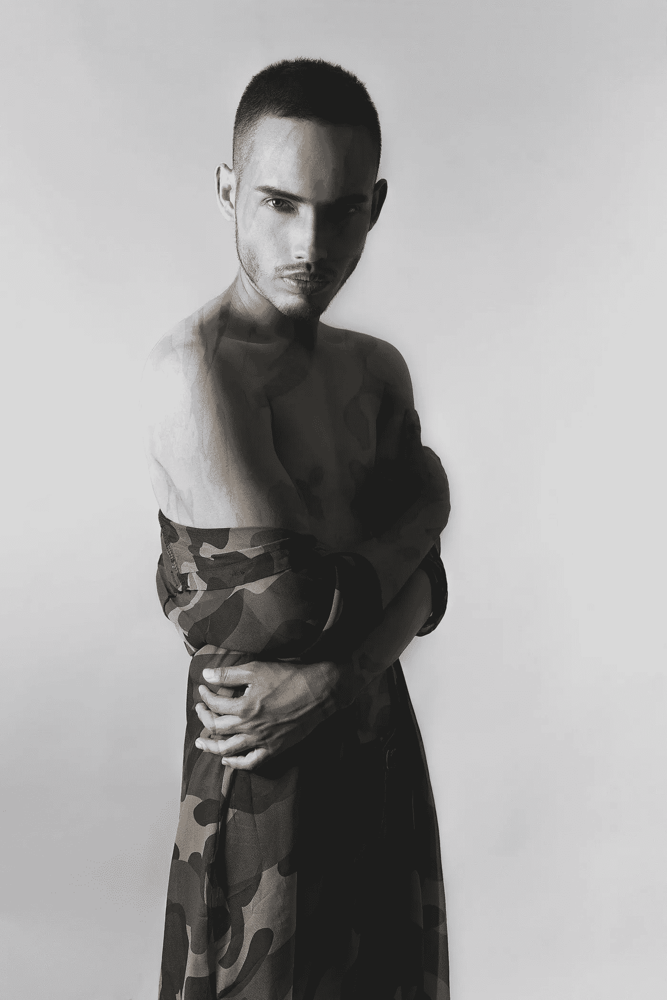
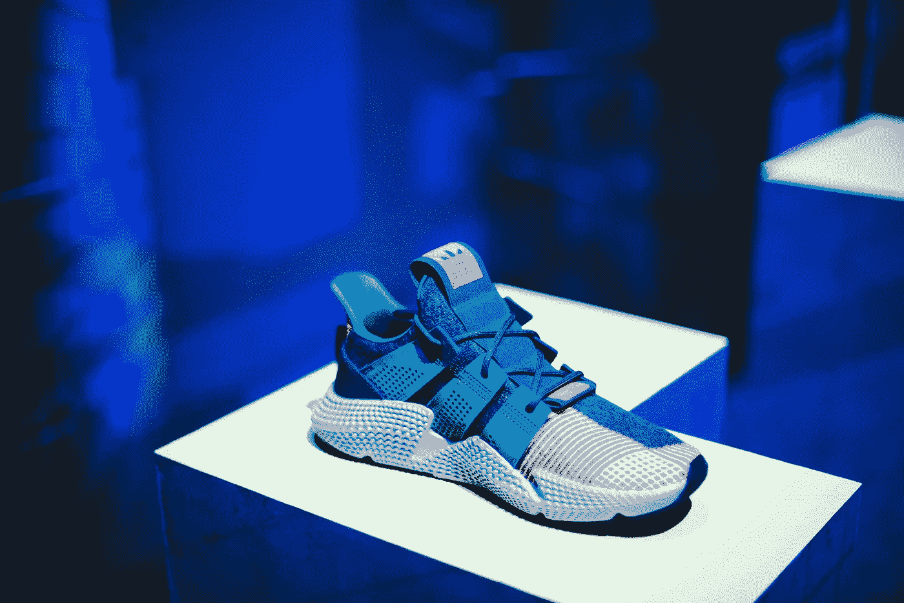
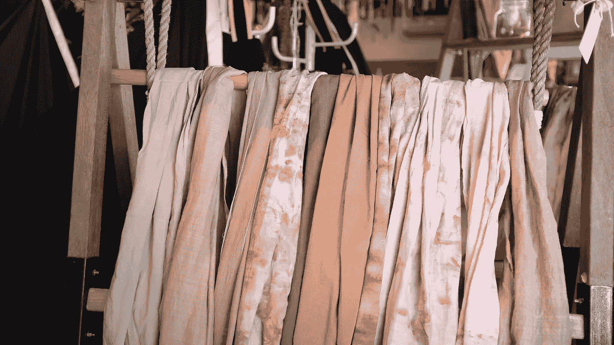

# 衣服得合身好看不是吗？

> 原文：<https://medium.datadriveninvestor.com/clothes-have-to-fit-and-look-good-dont-they-9865b8feb8c7?source=collection_archive---------27----------------------->

## 如果你通过互联网购买衣服，人工智能如何在这个过程中提供帮助？

Photo by [DIEGO SANCHEZ](https://unsplash.com/@ediegosanchez?utm_source=unsplash&utm_medium=referral&utm_content=creditCopyText)

> 你穿什么就是你如何向世界展示自己，尤其是在今天，当人类的接触是如此之快。时尚是即时语言。—缪西娅·普拉达

时尚界是一个瞬息万变的世界，对新奇和值得关注的事物有着永不满足的渴望。在它的范围内，时尚创造了偶像，驱散了信仰，并可以将平凡提升到崇高——但前提是穿着正确。

服装顾客可能不会去买高级定制服装，但他们确实希望自己的服装能反映出某种风格，并能彰显自己的个性。破旧或破损的时装已经在相当长的一段时间里做出了这种声明，街头顽童的样子已经过时了，但合身呢？

 [## 处理时尚行业的文化挪用|数据驱动的投资者

### 真实性已经成为衡量现代时装设计艺术价值的流行标准。根据缪西娅的说法…

www.datadriveninvestor.com](https://www.datadriveninvestor.com/2020/07/06/tackling-cultural-appropriation-in-the-fashion-industry/) 

牛仔裤的膝盖可能会被撕碎，布料[会被石洗](https://www.nrdc.org/stories/are-my-denim-jeans-bad-environment)(一个环保的耳光)，但是合身才是最重要的。这些设计可能来自一个时髦的房子，但是，如果你不能试穿，你怎么能把它脱下来呢？

Photo by [Christian Wiediger](https://unsplash.com/@christianw?utm_source=unsplash&utm_medium=referral&utm_content=creditCopyText)

## 零售业的衰落

[购物中心，典型的美国购物场所](https://www.businessinsider.com/american-retail-apocalypse-in-photos-2018-1#:~:text=50%20haunting%20photos%20of%20abandoned%20shopping%20malls%20across%20America&text=American%20malls%20are%20closing%20all,8%2C600%20store%20closings%20in%202019.)，已经开始稳步下滑。尽管梅西百货(Macy's)和西尔斯百货(Sears)等锚店有着预期的实力，但它们已经达到了高潮，现在正濒临死亡。

他们曾经确保的客流量已经留给了一种新的购物体验，互联网。逃离购物中心的一个有力来源是冠状病毒。

> 分析师预测，随着 J.C. Penney 试图避免清算，较小的零售商关闭或要求租金减免，剧院等场所仍因新冠肺炎而暂时关闭，四分之一到二分之一的购物中心可能会完全停业。

据估计，2020 年将有 8000 万平方英尺的购物中心关闭，随之关闭的品牌包括 *Brooks Brothers、Neiman Marcus、J. Crew、金宝贝、*和 *Payless ShoeSource* 。原因很简单；由于这种病毒及其与拥挤空间的联系，亲自购物被认为是最危险的顾客体验。

在一个商场甚至当地商店都在关闭的世界里，需要服装、鞋子和其他商场商品的顾客该怎么办？互联网是显而易见的答案，但有一个问题，合身和服装的外观。在这种规模的行业中，这是最重要的考虑因素。

> [全球服装市场](https://www.statista.com/statistics/821415/value-of-the-global-apparel-market/)的价值预计将从 2015 年的 1.3 万亿美元增长到 2020 年的约 1.5 万亿美元，这表明全球对服装和鞋子的需求正在上升。

Photo by [CHUTTERSNAP](https://unsplash.com/@chuttersnap?utm_source=unsplash&utm_medium=referral&utm_content=creditCopyText)

## AI 会拯救设计行业吗？

互联网巨头亚马逊设计了一种方法，用人工智能程序为顾客解决至少一个服装选择方面的问题。

> [在过去，研究人员](https://www.amazon.science/blog/how-computer-vision-will-help-amazon-customers-shop-online)已经开发了将装备项目作为输入并预测其兼容性的系统，但是这些系统没有针对大规模数据检索进行优化。
> 
> 亚马逊应用科学家延-林良和他的同事想要一个能够大规模发现产品的系统，他们希望它能够接受多种输入，例如，客户可以选择衬衫、裤子和夹克，并收到鞋子的建议。

虽然这一系统将使消费者能够看到各种商品如何以混搭的方式相互补充，但仍有一些问题需要解决。一个主要的症结是消费者如何看待这些商品。

Photo by [Nafinia Putra](https://unsplash.com/@nputra?utm_source=unsplash&utm_medium=referral&utm_content=creditCopyText)

## 时尚的合体感

首先，电脑允许我们通过给我们拍照，然后将图像叠加在上面，来“试”戴[眼镜](https://apps.apple.com/us/developer/warby-parker/id1107693362)(Warby-Parker)[【Zenni】](https://www.zennioptical.com/c/faq#virtual-try-on-faq)或衣服。消费者喜欢不用去眼镜店，也能避免接触任何东西。现在我们有了新的计算机生成的程序，可以做更多的事情。

> [触觉是利用技术](https://www.google.com/search?q=haptics&rlz=1C5CHFA_enUS854US854&oq=haptics&aqs=chrome..69i57j0l7.2384j1j7&sourceid=chrome&ie=UTF-8)刺激触觉和运动感，特别是在远程操作或计算机模拟中再现用户与实物直接交互时的感觉。

不仅能在网上购买衣服，还能看到自己穿上衣服的样子，并“感受”布料，这种做法的附加价值是显而易见的。正如 [2017 年的一篇论文](https://www.emerald.com/insight/content/doi/10.1108/JFMM-02-2016-0018/full/html)所说。

> 这些发现尤其有价值，因为评估在线服装商务中 NFT(触觉需求)的研究数量目前非常有限。因此，这项研究为现有的知识体系增加了新的经验证据，并可以帮助发展全球营销战略，以增加网上时装销售。
> 
> 然而，现有的研究表明，在偏好使用触摸作为获取信息的手段方面存在相当大的个体差异，并且
> 消费者在购物时需要的触摸量差异很大。

除了亚马逊(Amazon)和苹果(Apple)之外，还有谁在解决消费者的 NFT 问题呢？这些消费者想要购买服装，但又担心服装的外观和感觉。

已经有人提出要编写包含所有三个因素的算法，即服装的外观、合身性和手感。

**访问专家视图—** [**订阅 DDI 英特尔**](https://datadriveninvestor.com/ddi-intel)