# 基于云的协作:OneDrive 和团队

> 原文：<https://medium.datadriveninvestor.com/cloud-based-collaboration-onedrive-and-teams-275bd4e05c29?source=collection_archive---------2----------------------->

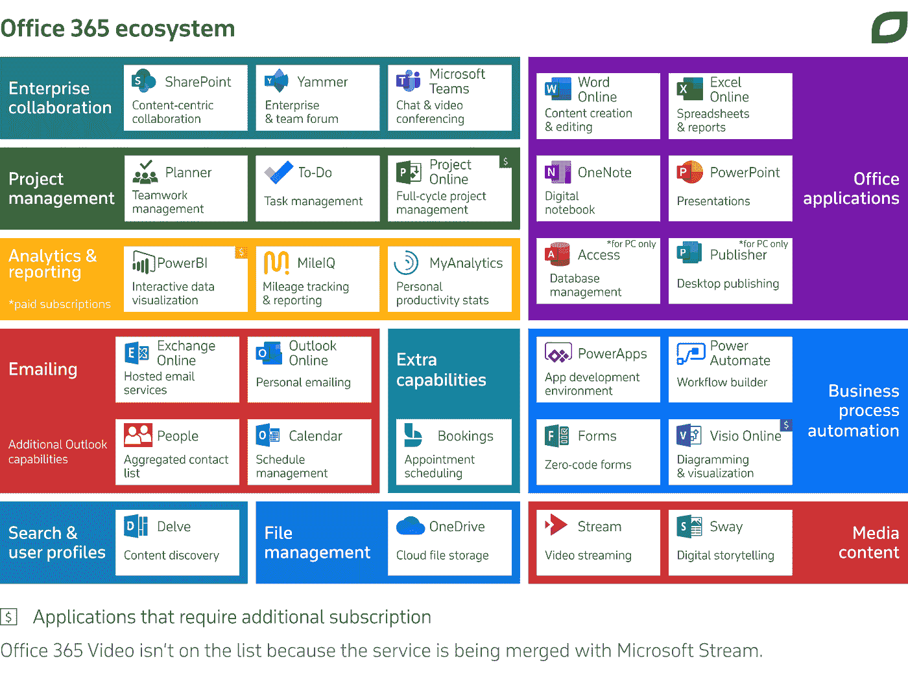

Microsoft SharePoint Online、OneDrive 和 Microsoft 团队可以帮助组织保护其文件的安全，更有效地共享信息，并轻松地进行通信。在这篇文章中，学习如何配置和管理 SharePoint Online、OneDrive 和 Microsoft 团队的基础知识。我将解释如何在 OneDrive 中创建 SharePoint 网站、管理 SharePoint 存储以及共享文档。我还将概述与微软团队合作的基础，以及如何在您的组织内部署通信平台。

# 学习目标

*   使用 OneDrive 和 OneDrive for Business 管理文件
*   与微软团队合作
*   从 Skype for Business Online 转向团队

# OneDrive 和 OneDrive for Business

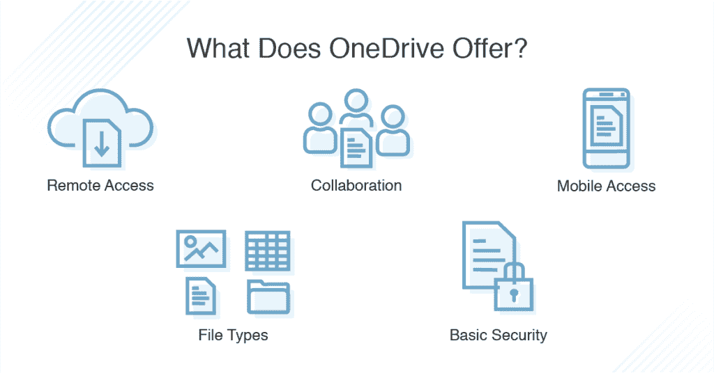

Office 365 的另一个组成部分是基于云的存储。OneDrive 和 OneDrive for Business 提供基于云的安全存储，您可以在其中存储、共享和同步您的文件。你可以把它想象成你在云中的硬盘。OneDrive 最有用的一个方面是，任何数据都可以从任何位置使用安全的浏览器连接通过互联网访问。也可以使用许多不同的设备访问数据，如台式电脑或移动电话。您可以在任何设备上直接从互联网访问 OneDrive，只需使用浏览器或使用 OneDrive 应用程序，或者在 Windows 10 中使用文件资源管理器。微软提供了两个版本的 OneDrive。OneDrive 适用于个人云存储，如与 Office 365 个人计划捆绑销售或适用于 outlook.com 用户。OneDrive for Business 是一个企业版，可与 SharePoint Online 协同工作。OneDrive 免费供个人使用。个人 OneDrive 空间的商业用途未经许可。如果您有 Microsoft 帐户，并且注册了 Xbox Live、Outlook.com 或 Hotmail.com 等 Microsoft 服务，就可以使用它。使用免费层，你可以获得 5g 的存储空间，但你可以每月支付少量费用购买更多。OneDrive sync 客户端预装在 Windows 10 设备上，允许您通过文件资源管理器访问存储在云中的文件。OneDrive for Business 使用与 OneDrive 个人版相同的同步引擎，但 OneDrive for Business 指向完全不同的数据存储设施。其他差异包括它是为企业设计的，并使用 SharePoint online 作为存储平台。它获得了商业使用许可，每个用户拥有 1tb 的存储空间。OneDrive 的两个版本都允许用户与 Office Online 文档进行协作，即使用户没有 Office 许可证，也可以使用 Office 文档。他们可以在任何地方通过网络使用这一功能。OneDrive for Business 将 SharePoint Online 用于基于云的存储，该存储安全地存储在 Microsoft 数据中心。值得注意的是，微软已经建立了足够的保护和安全措施来满足所有领先行业标准的合规性标准，包括 HIPAA 和 ISO 27001 以及更多标准。

# 访问 OneDrive 和 OneDrive for Business

现在，我们来看看如何访问 OneDrive 和 OneDrive for Business。您可以通过多种方式访问 OneDrive 和 OneDrive for Business。这两个版本都允许使用预装在 Windows 10 PC 上的 OneDrive 应用程序，或者可以从在线商店下载的 Android 和 iOS 平台的 OneDrive 应用程序。您也可以通过浏览器或使用任何 office for the web app 的 app launcher 链接来访问 OneDrive。让我们看看如何通过网络浏览器访问 OneDrive。打开 web 浏览器。然后进入 OneDrive.live.com。并使用个人 Microsoft 帐户登录。这里我们可以看到，网络中的 OneDrive。在 OneDrive 下，我们可以看到我们最近处理过的文件，照片。我们共享的或由我们共享的任何文件。此外还有回收站，它可以记录所有从网上删除的内容，也可以记录我使用 OneDrive 个人账户从任何电脑上删除的内容。在左下角，我们可以看到 OneDrive 帐户中已用和可用的空间量。我们还可以看到一个邀请去溢价。如果我们单击此处，我们可以看到可用的 OneDrive 计划和可能的升级。其中包括 Office 365 家庭或个人计划。在右侧，我们也可以仅选择 OneDrive。我们为云中的额外存储空间付费。

# OneDrive 实现业务共享

组织内的大部分数据都是私有的，不会供公众使用。企业需要确保公司数据不会被未经授权的人获取。借助 OneDrive for Business，您可以控制用户共享文档的方式。如果管理员允许共享，企业用户只能共享 OneDrive 的业务内容。您可以为您的租户设置三个共享选项。这些是，

*   可共享:任何有链接的人
*   内部:只有您组织中的人，
*   直接分享:通过电子邮件与特定的人分享。

当您从 OneDrive 共享文件时，用户有几个选项。您可以邀请他人查看或编辑文稿，并且可以通过键入特定人员的电子邮件地址或姓名来选择他们。OneDrive for Business 应该会自动解析您组织内的人员。您还可以从视图中修改权限以允许编辑，并为接收电子邮件的用户添加一条消息。您还可以设置共享的到期日期。如果您有 Office 365 或 SharePoint online 订阅，而不只是 OneDrive for Business 独立订阅，则可以使用 OneDrive 或 SharePoint 管理中心中的共享页面来管理您的共享设置。您可以配置您的租户范围共享权限，并为 SharePoint 文件和 OneDrive 中共享的文件设置不同的设置。SharePoint 设置适用于所有网站、Office 365 组和 OneDrive。[有关 SharePoint 和 OneDrive 文件共享设置的更多信息，请查看链接。](https://docs.microsoft.com/en-us/sharepoint/turn-external-sharing-on-or-off)

作为管理员，您可以访问 OneDrive for Business Admin Center。该控制台可从 Microsoft 365 管理中心获得，或通过单击左下角的 OneDrive 管理直接从 OneDrive 网页获得，尽管此链接仅对管理员可见。使用 OneDrive for Business Admin Center 的好处是，它允许您在一个位置轻松管理您组织的 OneDrive 业务设置。登录 OneDrive 管理中心后，您可以访问许多任务，包括管理外部共享和共享通知、阻止用户安装 OneDrive 同步客户端、允许在加入特定域的计算机上同步以及阻止同步特定文件类型的功能。您还可以为 OneDrive 用户设置默认存储空间限额，在用户离开组织后保留 OneDrive 文件，以及控制用户对 OneDrive 的访问。您还可以控制对 OneDrive 移动应用中功能的访问。作为管理员，您还可以授予自己访问用户 OneDrive for Business files 的权限，并查看 OneDrive 中存储的文件和文件夹。

让我们看看如何共享存储在 OneDrive for Business 中的文件。以管理员身份登录 Microsoft 365 管理中心。单击左侧的“显示全部”，然后单击“所有管理中心”，再单击“OneDrive”。将显示 OneDrive 管理中心，并在左侧选择“共享”。在这里，您可以看到租户内共享的全局设置。默认情况下，任何人都可以共享指向所有文件的链接。我们可以将其限制在内部，以便只有您组织内的人员可以查看共享链接，也可以直接查看，以便我们可以指定希望查看链接的人员。我们还可以配置可共享链接的高级设置。让我们来看看。默认情况下，所有链接都不会过期。然而，这并不十分安全，我建议您将此设置为至少 90 天。这样，所有链接将在 90 天后过期。我们还可以通过一个链接来配置文件和文件夹会发生什么。请记住，这些是全局设置，因此，如果您想让您的用户拥有一定的自主权并能够共享文件，您需要教育他们，以便他们可以修改行为。您也可以配置外部共享。请记住，SharePoint 和 OneDrive 共享相同的存储位置，因此，此处会显示设置。默认情况下，外部共享允许最宽松的使用，您可能希望将此限制为新用户和外部用户必须登录才能访问文件。如果您想将您的内部公司文件只锁定给您组织中的人，那么您将使用最不允许的选项。但是，您可以混合使用 SharePoint 和 OneDrive。我们还可以查看外部共享的高级设置，例如允许或阻止特定域上的共享。指定允许或阻止的域。我们还可以强制外部用户使用邀请最初发送到的同一电子邮件帐户，并阻止外部用户共享他们不拥有的项目。您还可以选择向所有者显示查看过他们文件的人的姓名。现在我们来看看存储设置。这里我们可以看到，默认情况下，每个 OneDrive for Business 用户获得 1tb 的存储，但您可以减少存储容量。一些 E3、E4 和 E5 计划允许您将默认存储增加到 5tb。然而，根据我的经验，我发现将默认存储减少到 10gb 左右是可以接受的。最后，您可以设置在用户离开组织且其帐户被标记为删除后，OneDrive 文件可以保留的天数。默认设置为 30 天，但您可以将其最长增加到 3，650 天，即 10 年。通知面向管理员和用户，有助于监视和控制哪些外部用户可以访问他们的文件。默认情况下启用后，当其他用户邀请外部用户访问您的共享文件、外部用户接受访问您的文件的邀请或者创建或更改匿名访问链接时，OneDrive 中存储的文件和文件夹的所有者将会收到电子邮件。作为管理员，您还可以打开审核功能来监控外部共享的内容。但是，这将在微软 365 安全和合规中心完成。最后，如果您需要访问用户的 OneDrive for Business 文件，您可以。请记住，这只能由管理员执行。返回 Microsoft 365 管理中心，选择“用户”、“活动用户”,然后选择用户。在用户的属性页面上，单击 OneDrive，在这里我们可以看到一个创建文件链接的选项。只要用户以前访问过他们的 OneDrive 帐户，您就会看到一个创建文件链接的选项。让我们选择链接。片刻之后，Office 365 会创建一个特殊链接，单击该链接会打开一个新窗口，显示用户的 OneDrive for Business 文件。在这里，我们可以看到用户已经使用并存储在 OneDrive for Business location 中的所有文件和文件夹。

# 将已知文件夹重定向到 OneDrive

如果您的组织使用云存储，如 OneDrive for Business，您可以使用类似于文件夹重定向的功能，该功能允许您设置文件夹重定向到您的云存储。此功能称为将已知文件夹重定向到 OneDrive for Business。让我们来提醒一下哪些 Windows 10 文件夹被归类为已知文件夹。这些文件夹包括桌面、文档、图片、截图和胶卷文件夹。您可以将这些文件夹视为用户配置文件中包含的所有文件夹。你可以使用组策略自动移动或重定向文件和文件夹，以便它们自动保存在 OneDrive for Business 中。您可以使用几个组策略来配置此功能。第一个是提示用户将 Windows 已知文件夹移动到 OneDrive，第二个是静默地将 Windows 已知文件夹移动到 OneDrive，这将静默地强制将文件和文件夹重定向到云。您的用户仍将使用相同的熟悉文件夹。作为一项优势，他们的数据将备份到 OneDrive for Business。使用“提示用户移动组策略”设置，用户将看到一个弹出通知，要求他们确认操作并单击“启动保护”。然后，这将他们的已知文件夹移动到 OneDrive for Business。如果取消提示，活动中心将出现一个提醒，直到移动完成。一些终端用户可能已经将他们的已知文件夹重定向到他们的个人 OneDrive 帐户，在这种情况下，弹出窗口将要求他们重定向到组织的 OneDrive for Business 帐户。如果不希望用户选择何时执行此操作，管理员可以使用“将 Windows 已知文件夹静默移动到 OneDrive”组策略对象设置。启用此组策略后，文件夹将自动重定向到 OneDrive for Business，无需任何用户交互。此设置可以与移动设置一起使用，这样，如果静默重定向失败，将提示用户手动移动他们的文件夹。您可以使用另外两个组策略来防止重定向。防止用户将其 Windows 已知文件夹重定向到他们的 PC。您可以使用此设置强制用户将其已知文件夹定向到 OneDrive，并防止用户将其 Windows 已知文件夹移动到 OneDrive，这将禁用该功能。若要使用将已知文件夹重定向到 OneDrive for Business 功能，您需要拥有 OneDrive for Business 许可证。这些许可证可以作为独立许可证提供，也可以与 SharePoint Online、Office 365 订阅和 Microsoft 365 订阅捆绑在一起。对于将已知文件夹重定向到 OneDrive for Business，也有一些要求。其中包括您必须确保您在客户端设备上拥有当前的 OneDrive sync 版本，并且您没有任何用于 Windows 文件夹重定向的现有 GPO 设置。如果任何已知文件夹包含 OneNote 笔记本，则整个文件夹将不会移动到 OneDrive for Business，因此您需要从已知文件夹中删除任何 OneNote 笔记本。您可以通过单击 OneDrive 应用中的“关于”选项卡来检查 OneDrive 同步引擎的版本。

# 微软团队

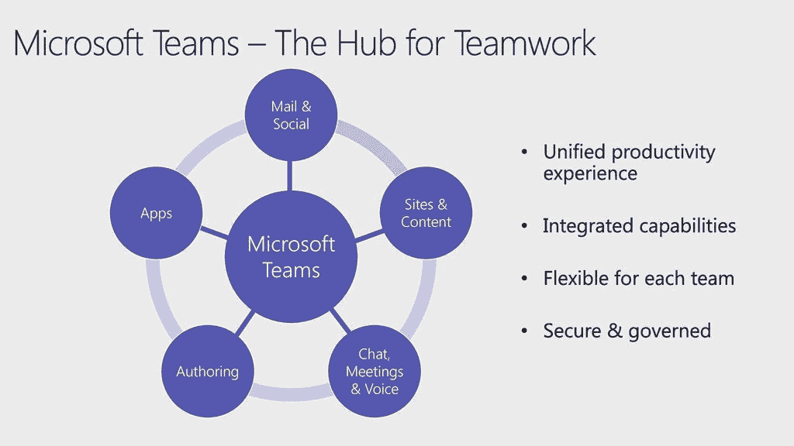

微软团队是一个云应用程序，旨在作为团队合作的枢纽。它允许您将团队和资源聚集在一起，通过聊天和消息进行交流，打电话和举行会议和现场活动，以及共享和编辑文档。Microsoft Teams 与现有的 Microsoft 产品(如 Office 365 应用程序)相集成，并使用 SharePoint 来存储数据和文档。Microsoft Teams 建立在 Office 365 组的基础上，它使用 Microsoft Graph 将数据和服务链接在一起。

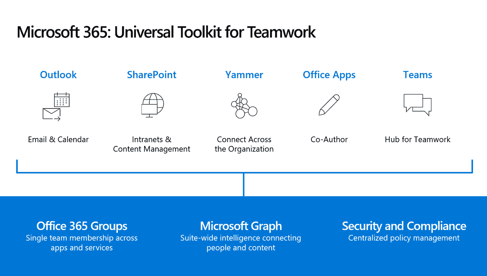

你可能会认为微软团队提供的功能听起来很像微软的另一款通信应用 Skype 提供的功能。是的，它们听起来确实很相似。然而，Skype for Business 将于 2021 年 7 月 31 日全面退役。自 2019 年 9 月 1 日起，微软已将所有新的 Office 365 客户直接纳入微软团队，而不是 Skype，用于所有聊天、会议和通话。为了避免在这篇文章中产生混淆，我将使用微软团队这个词来指代这个应用程序本身，而团队这个词是指使用微软团队应用程序创建的一个协作空间。

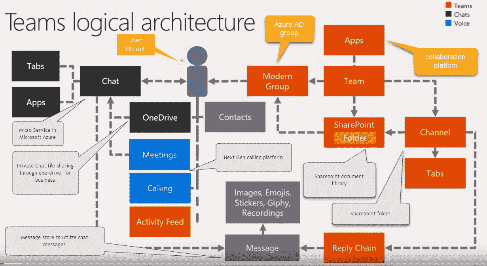

使用 Microsoft Teams 应用程序，您可以创建新团队。这包括人和内容，如聊天、文件和工具。团队所有者可以邀请成员聚在一起，将团队作为一个交流和协作的空间。团队也可以对组织中的任何人公开，或者可以是私有的，只允许被邀请的用户访问。创建新团队时，会自动创建许多组件。团队成员的新 Office 365 组。用于存储工作组文件的 SharePoint Online 工作组网站和文档库。Exchange Online 共享邮箱和日历。OneNote 笔记本。还链接到其他服务，如 Planner 和 Power BI。

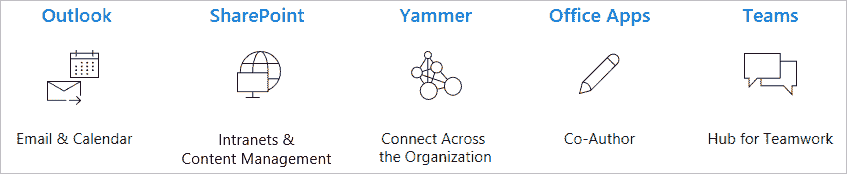

# 团队频道、聊天和应用程序

现在让我们回顾一下微软团队。沟通是微软团队的核心，有几种可用的沟通工具。其中包括频道、聊天和应用程序。让我们回顾一下这些关键组件。团队是由渠道组成的。渠道是团队中针对特定主题、部门或项目的专门部分。然后，频道被用于向有权访问频道的所有成员共享相关消息、文档、应用和其他资源。每个频道在 SharePoint Online 工作组网站中也有不同的文件夹。聊天是一个很受欢迎的功能，它允许你实时地给你组里的其他成员发消息。每条消息都显示有用户名、消息撰写的日期和时间。公共聊天可以发送给一个频道内的所有团队成员，或者您可以将它们用作单个成员之间的私人文本对话。聊天的主要好处是，与电子邮件相比，交流更快、更有效。您还可以使用频道内的应用程序来查找和共享内容。例如，您可以以特定格式共享选项卡上的内容。例如，共享 Excel 或 Word 文档。使用连接器从 Twitter 和 RSS 源等地方直接接收频道的自动更新。您可以添加来自外部服务的内容，可能是最新的新闻、天气预报或视频。你甚至可以和提供帮助和协助的服务机器人聊天。

# 通话、会议和事件

Microsoft Teams 允许您通过共享文件、外部内容和与同事进行基于文本的聊天来进行交流。您还可以使用 Microsoft 团队打电话、召开会议，甚至进行现场活动。Microsoft Teams Calls 功能允许您拨打电话号码或拨入会议。团队会议包括多达 300 人的音频、视频和屏幕共享。与会者可以使用台式电脑、移动设备甚至普通电话参加会议。任何人都可以参加会议，甚至是来自组织外部没有 Microsoft Teams 帐户的人。他们只需要会议链接。录制会议时，录音会自动联机存储，以便您可以与参与者共享。加入团队会议有几种不同的方式。其中包括使用发送给您的链接加入会议、使用电话号码拨入会议或拨出给某人、通过预定的日历邀请加入会议、通过您可以看到加入邀请的渠道加入会议。从聊天中加入。任何已经开始的会议都将显示出来，并使用传统的会议室链接到 Microsoft Teams 会议。微软团队的另一个特点是现场活动。使用此功能，您可以安排一个现场活动，然后在线向大量观众播放。由于现场活动通常需要安全人员来管理，您可以使用 Microsoft 团队来管理活动计划，并且可以将活动公开或保密。您可以使用 Microsoft Teams 应用程序直接创建事件，邀请与会者和演示者使用他们自己的设备参与；也可以使用专业的外部摄像机和录像机创建事件，然后查看者可以通过邀请链接使用 Microsoft Teams 访问和查看事件。

# 在团队中使用文档和文件

Microsoft Teams 与 SharePoint Online 完全集成，您可以在 Microsoft Teams 中查看、共享和编辑文档。因为 Microsoft Teams 已集成到 SharePoint Online 中，所以它也与 OneDrive for Business 集成在一起。您可以与其他 Microsoft Teams 用户共享文档。例如，在聊天消息屏幕中，您可以从 OneDrive for Business 或设备的本地硬盘上传文件。您还可以将文件添加到频道，供其他用户查看。您还可以编辑文档，并与微软团队的其他用户协同工作。每当单击指向存储在团队中的共享文档的链接时，您都可以直接在 Microsoft Teams 环境中编辑该文档。这样，您和您的同事可以实时协作编辑显示内容。您不能直接管理存储在 Microsoft 团队中的文件的单个文档共享设置。这是因为 Microsoft Teams 使用已为 SharePoint Online 和 OneDrive for Business 配置的共享设置。

# 部署 Microsoft 团队

现在让我们看看如何部署微软团队。微软团队可能是组织使用的第一个通信和协作应用程序。或者你可能从 Skype for Business Online 转到微软团队。让我们快速概述一下如何将 Microsoft Teams 作为一个新的实现来实现。因为 Microsoft Teams 允许您集成许多其他 Microsoft 产品，所以您应该首先将这些产品设置为 Microsoft Teams 部署的一部分。这可以包括 Office 365、SharePoint Online、Exchange Online for email、OneNote 等服务；如 Planner、Power BI、Azure Active Directory 等。为团队准备好组织网络。这包括配置您的 Microsoft 365 或 Office 365 域、SharePoint Online、Exchange Online 和 OneDrive for Business。

即使您已经在使用其中的一些服务，您可能仍然需要检查和修改设置，以便可以将它们配置为与 Microsoft 团队一起工作。让我们看一下部署团队需要做什么的高级概述。为每个人获得团队许可证。查看团队计划和微软团队服务说明。

首先，您要确保所有相关服务都已准备好与微软团队集成。您需要评估任何当前设置，并实施任何必要的更改。或者，如果您是从零开始，那么您需要完成每个产品或服务的设置。然后，您需要为 Microsoft 团队配置组织范围内的设置。这些设置允许您管理 Microsoft Teams 的工作方式，包括通知、电子邮件、订阅源、文件和设备的设置。下一步是管理特定于 Microsoft 团队功能的设置。例如，您应该创建策略来控制如何在您的组织内使用功能，或者控制谁可以记录实时事件，或者是否允许使用第三方应用程序。然后需要部署客户端应用程序。为此，您可以推出自己的设备，或者告知最终用户如何自行安装 Microsoft Teams 客户端应用程序。[然后你需要创建一个初始团队和相关的渠道](https://docs.microsoft.com/en-us/MicrosoftTeams/get-started-with-teams-create-your-first-teams-and-channels)。这通常是公司范围内对微软团队的欢迎。当然，您可以允许最终用户创建他们自己的团队和渠道，但是对于管理员来说，最好在部署过程中创建几个初始团队。然后，管理员将需要管理用户的权限，如果 Office 365 中不存在用户组，可能还需要创建用户组。[需要向最终用户发出邀请，邀请他们使用现有团队，您需要确保为 IT 员工和最终用户提供并完成培训](https://docs.microsoft.com/en-us/MicrosoftTeams/get-started-with-teams-onboard-early-adopters)。最后，一旦完成了所有这些部署步骤，用户就可以使用团队了。然后，他们可以创建自己的团队，建立频道，添加应用程序、文件和订阅源，并与同事进行交流和协作。[了解用户如何使用团队以及他们对团队的体验很重要。使用情况报告可以帮助您更好地了解使用模式，并根据用户反馈为您提供见解，从而为您更广泛的推广提供信息，并确定培训和沟通工作的优先顺序。](https://docs.microsoft.com/en-us/MicrosoftTeams/get-started-with-teams-monitor-usage-and-feedback)

[如果你是一家小企业，或者如果你想从聊天、团队&渠道和会议开始推广团队，使用微软说明性的**入门指南**，它旨在让你快速启动并运行。如果您是一个拥有混合或内部 Skype for Business 配置的大型组织，或者如果您想要推出语音功能(如 Microsoft 365 或 Office 365 通话计划或电话系统)，您可以从 Microsoft 入门指南开始，但您需要下面的额外指南，在**深入采用**指南下。](https://docs.microsoft.com/en-us/MicrosoftTeams/adopt-microsoft-teams-landing-page)

# 从 Skype for Business Online 转向

对于从 Skype for Business Online 升级到 Microsoft Teams 的企业，还有一些额外的考虑事项。Skype for Business Online 将于 2021 年 7 月 31 日终止支持，Skype for Business Online 用户需要升级到微软团队。[微软提供升级框架，帮助您升级到微软团队。](https://docs.microsoft.com/en-us/MicrosoftTeams/upgrade-start-here)该框架涵盖了从计划到微软团队准备使用的每一个步骤。您很可能需要同时运行 Skype for Business Online 和 Microsoft 团队，至少在升级期间的一段时间内是如此。您可以使用几种受支持的方案。

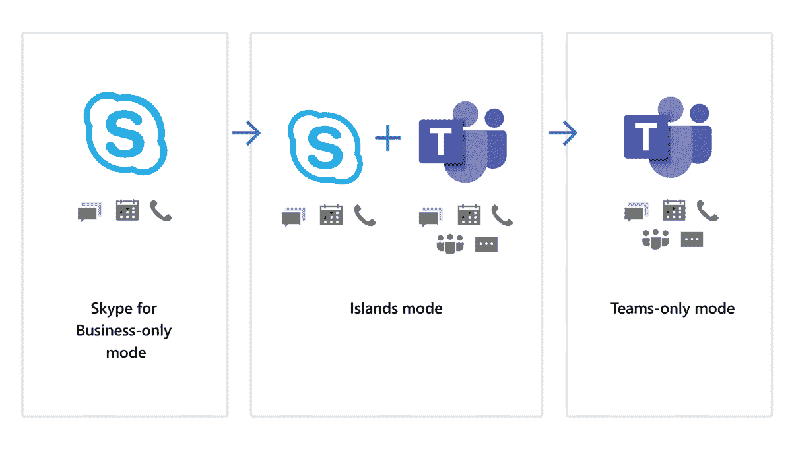

这些被称为**岛屿模式**、**Skype for Business Online**、 **Microsoft Teams only** 、**Skype for Business Online with Microsoft Teams**。孤岛模式是指两个服务彼此独立运行。Skype for Business Online 仅在后台执行微软团队，然后进行切换。Microsoft Teams only 是用户在部署环中升级的地方。升级后，除了参加与未升级用户的会议之外，他们不能再使用 Skype。最后，Skype for Business Online with Microsoft Teams collaboration 是 Skype 用法不变的地方，但您添加了 Microsoft Teams 功能，如团队、频道和文件访问。为了准备升级到 Microsoft Teams，您需要评估您当前的 Skype for Business Online 设置。你需要审查你的网络能力，以确保它将抑制文件共享以及通话和会议等附加功能，并检查你的 Office 365 设置，如目录同步，以及你是否使用多租户或专用租户。由于微软团队还使用 OneDrive for Business、SharePoint Online、Exchange Online、OneNote 和 Azure Active Directory，因此您需要确保这些服务都经过正确配置，以便与微软团队一起工作。

# 如何展示微软团队和功能

一旦技术设置完成并且 Microsoft Teams 可以使用，管理员就可以实现 Microsoft Teams 功能。

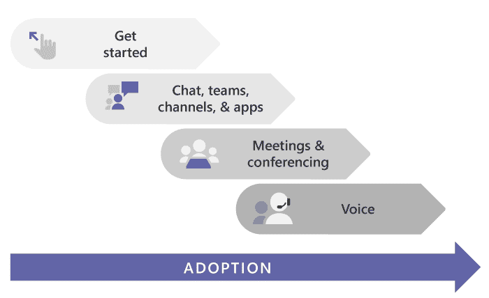

微软建议从团队和渠道开始，按照屏幕上的图表所示，分阶段逐个功能进行展示。管理员将首先创建一个新团队，然后为管理该团队的团队添加额外的所有者。然后向用户推出微软团队客户端应用程序。邀请人们加入团队。这些通常是早期采用者。并为新成立的团队建立渠道。他们还需要管理团队的设置，例如允许最终用户创建新的渠道。下一步是创建控制如何使用聊天功能的策略。您还可以管理一些设置，如允许他人删除已发送的邮件、使用 URL 预览以及允许语音消息。您还可以在聊天中添加自定义标签，以便用户可以轻松找到所需内容。管理员还可以将应用程序添加到频道，如 OneNote 应用程序，或者从您的公司 Twitter 帐户或外部网页直接订阅源。您还可以在频道中添加带有链接的新标签，以组织内容并使用户更容易找到项目。创建新的团队频道时，默认情况下会创建对话、文件和 Wiki 选项卡。

会议和实时事件都有需要管理的策略设置。对于会议，这些包括允许使用 Outlook 的设置、匿名用户是否可以加入会议、电子邮件邀请的格式以及您的网络设置。对于事件，您需要管理谁可以查看事件，谁可以记录事件。

最后，如果你有一个电话计划，那么你需要建立微软团队用于语音通话。这包括当人们在等待接听电话时设置呼叫队列消息，菜单系统，也称为自动话务员。比如“按一销售。”并创建呼叫暂留策略，当有人被转移到另一个话务员时使用该策略。使用呼叫者 ID 策略阻止呼叫者，并创建呼叫策略来管理设置，以控制可以使用哪些呼叫功能。

[当然，您还需要确保您的 IT 员工接受过管理和支持微软团队的培训](https://docs.microsoft.com/en-us/microsoftteams/itadmin-readiness)。[您的最终用户将需要被告知升级事宜，然后接受培训以使用微软团队并知道如何找到支持和帮助。](https://support.office.com/article/microsoft-teams-video-training-4f108e54-240b-4351-8084-b1089f0d21d7)您的用户可以开始创建自己的频道，添加应用和文件，并与其他人合作。

让我们来看看我们可以配置的策略设置。让我们登录微软 365 管理中心。在左侧，单击全部显示。然后选择团队项目。在这里我们可以看到微软团队管理中心已经启动。如果您想创建一个新策略来管理聊天功能的设置。因此，在左侧，选择消息传递策略。在这里，我们可以看到全球组织范围的默认策略，我们可以查看该策略。要创建策略，请单击添加，提供策略名称和描述，然后检查各种设置。假设我们很乐意让所有者和用户删除已发送的消息，那么让我们首先将这两个设置设置为 on。我们不希望任何人能够编辑已发送的消息，因此我将禁用此设置。我们希望为每个人打开阅读回执。我将确认聊天已启用，我们可以继续在列表中选择所需的选项。如果我们需要特定选项的更多信息，我们可以在可用的地方单击小 I。如果需要，我们还可以使用“支持 office.com”查看帮助。选择底部的策略设置后，我们可以单击“save”按钮，该策略将被创建并作为自定义策略显示在您的列表中。我们现在需要将该策略分配给用户或组。在左侧菜单中，单击“users ”,您可以看到所有用户。使用左侧的复选框选择要应用此策略的用户。然后单击编辑设置。在这里，我们可以看到我们可以应用的各种政策。在下拉列表中的消息策略下，选择我们最近配置的消息策略，然后单击应用。我们可以看到该策略已经分配给了用户。

# 管理微软团队

您可以使用 Microsoft 团队管理中心来管理 Microsoft 团队。您可以从 Microsoft 365 管理中心访问 Microsoft 团队管理中心。选择管理中心，然后单击团队。这里我们可以看到微软团队管理中心。为了分散工作量，较大的组织将需要一个以上的管理员来管理 Microsoft 团队。目前有四种角色可供选择。其中包括能够管理服务并创建和管理 Office 365 群组的**团队服务管理员**、能够管理呼叫和会议功能的**团队通信管理员**、**团队通信支持工程师**、能够使用一套高级工具对通信问题进行故障排除的**团队通信支持专家**。管理员需要管理设置，包括外部访问、访客访问的组织范围设置，以及 Microsoft 团队设置，如邮件集成、文件、设备和订阅源。他们还需要管理将在微软团队中使用的应用程序的设置。您还可以配置策略，创建这些策略是为了控制如何使用功能。您可以为团队、会议、实时活动、应用程序和通话创建策略。最后，您需要监控您的微软团队的部署。这将包括，在最初的试点部署阶段，在将 Microsoft 团队推广到组织的其他部门之前，确保设置已正确实施。稍后，您将深入了解最终用户如何使用 Microsoft 团队，以便优化设置。让我们使用 Microsoft 团队管理中心来查看组织范围的设置。在左侧菜单中，选择组织范围设置。在这里，我们可以看到可供我们选择的各种方案。

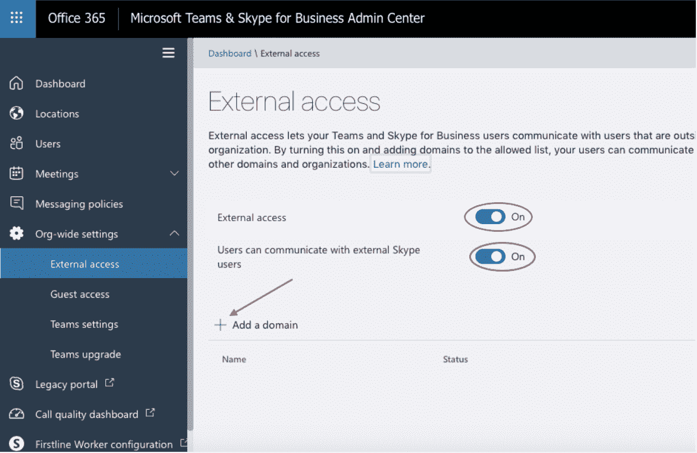

选择外部访问，我们可以在这里为 Skype for Business 和 Skype 外部用户配置集成选项，我们还可以在此区域添加或阻止域。如果我们想与外部公司交流，我们应该添加他们的域。让我们输入一个域，单击“完成”,然后单击“保存”,设置即会保存。在左侧，选择访客访问，在这里，我们可以授予团队中的访客访问权限。如果我们将此权限设置为 on，这将暴露我们可以允许来宾访问的各个区域。您应该查看所有设置，并仔细考虑您希望来宾访问哪些区域。在团队设置中，我们有通知和订阅源、电子邮件集成的设置。在文件中，我们可以配置云文件存储选项。管理组织视图、设备以及搜索。在团队升级中，我们正在从 Skype for Business online 升级到 Microsoft 团队。因此，我将选择孤岛模式。

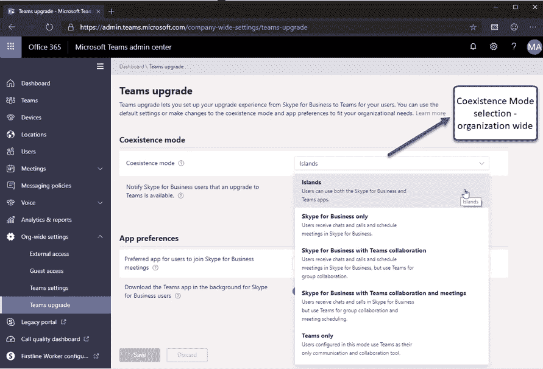

我将通知我的用户，团队升级可用。我将单击保存。

如果您单击“假日”，在这里，我们可以添加我们公司将关闭的假日。比如圣诞节。点按“添加假日”,提供名称，选择日期，然后点按“存储”。这些假期将被填充到我们组织内的所有日历中。

我不需要在我的租户中提供任何资源帐户。

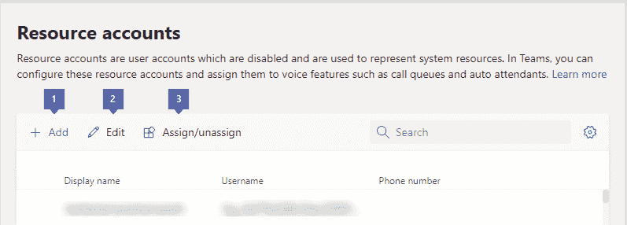

当试图计算出将不同物理位置连接在一起的网络要求时，网络规划人员会很有用。

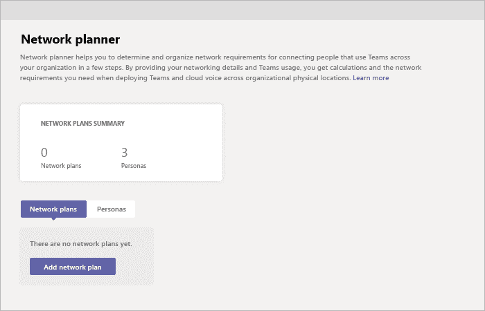

*最初发表于*[*【https://github.com】*](https://github.com/ealtili/Blog/blob/master/Microsoft365/Cloud_based_collaboration.md)*。*

[对于第 1 部分，请遵循基于云的协作:SharePoint Online](https://medium.com/@ealtili/cloud-based-collaboration-sharepoint-online-onedrive-and-teams-1ba5e967d323)