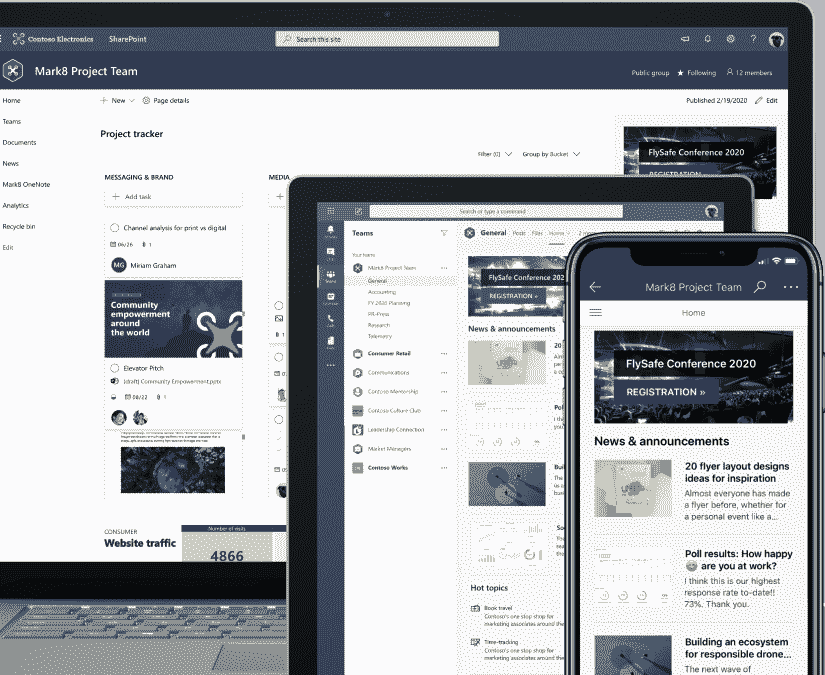
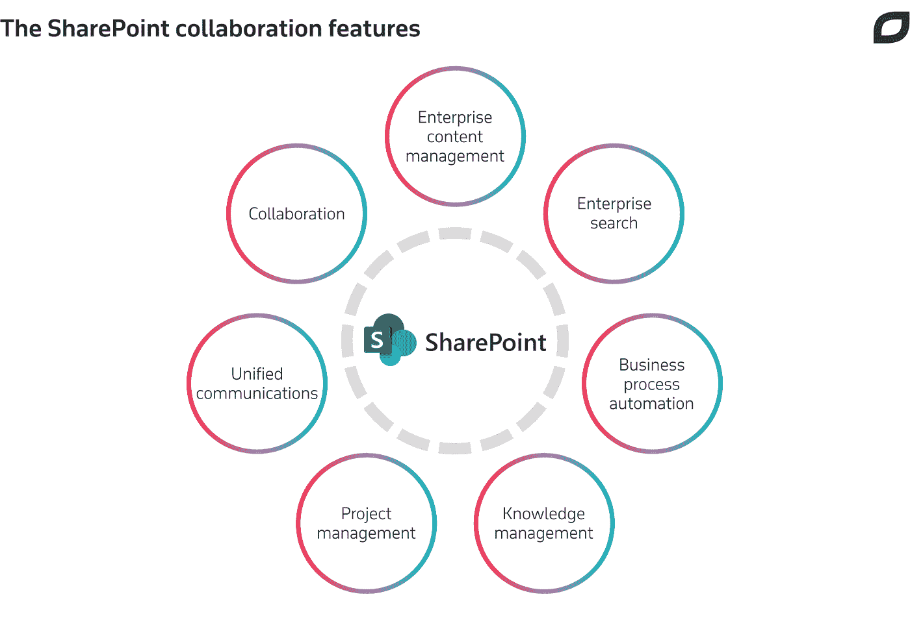
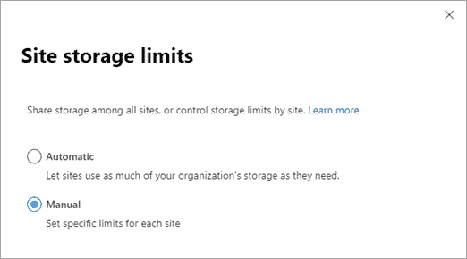

# 基于云的协作:SharePoint Online

> 原文：<https://medium.datadriveninvestor.com/cloud-based-collaboration-sharepoint-online-onedrive-and-teams-1ba5e967d323?source=collection_archive---------1----------------------->

Microsoft SharePoint Online、OneDrive 和 Microsoft 团队可以帮助组织保护其文件的安全，更有效地共享信息，并轻松地进行通信。在这篇文章中，学习如何配置和管理 SharePoint Online、OneDrive 和 Microsoft 团队的基础知识。我将解释如何在 OneDrive 中创建 SharePoint 网站、管理 SharePoint 存储以及共享文档。我还将概述与微软团队合作的基础，以及如何在您的组织内部署通信平台。

# 学习目标

*   SharePoint Online 工作组网站
*   创建 SharePoint Online 网站
*   为网站配置外部共享
*   管理 SharePoint 在线社交协作和主题
*   管理 SharePoint 在线存储限制

# Sharepoint Online

SharePoint Online 是一个现成的基于云的应用程序，为文档管理、协作工作和信息分发提供解决方案。SharePoint Online 使用 web 技术，为您的工作组或项目创建一个网站，称为工作组网站，供工作组成员使用。此团队网站是一个门户，允许您的最终用户查看信息、访问应用程序并与其团队中的其他人协作。在工作组网站中，您可以共享新闻、文档，并在本地或 web 上编辑它们。此外，通过共享对文档的访问，您可以与其他用户协作。您还可以从 Office 365 应用程序的“文件”区域访问您的团队网站自己的文档。还可以从文件资源管理器和 OneDrive for Business 访问文档。让我们回顾一下可供您使用的一些核心 SharePoint Online 功能。您拥有文件的中央信息存储库、熟悉的环境、可定制的平台，以及各种信息创建工具。您还拥有信息共享工具、数据保护和安全控制、跟踪任务和流程的工具以及管理工作流的工具。让我们更详细地回顾一下其中的一些。SharePoint Online 的核心是一个中央信息库。你可以把它想象成一个在线数据库管理系统，用来安全地存储和管理文档，共享文档，允许多个用户同时编辑文档，并在编辑当前版本的同时保留文档的以前版本。由于 SharePoint 已经存在多年，SharePoint Online 界面可能会为您的许多用户提供一个熟悉的工作环境，SharePoint Online 的新用户可以很快提高工作效率，因为他们可以使用 Office 365 工具在 SharePoint Online 中创建和共享内容。SharePoint Online 为您提供了一个高度可自定义的平台，可以构建一个简单或复杂的网站，其中可以包含许多加载项和功能。网站可以被品牌化，有定制的配色方案，个性化的背景，字体和页面布局，等等。对于所有 SharePoint Online 用户，页面中嵌入了用户友好的信息创建工具，可以直接从工作组网站访问 Word 和 Excel 等办公应用程序。SharePoint online 包括几个信息共享工具，为用户提供对企业信息和应用程序的访问。这包括协作软件功能，如项目日程安排、社交协作、共享邮箱访问和项目相关文档存储。此外，如果您启用了新闻源，所有成员都可以了解最新的团队新闻。为了保证数据的安全，SharePoint Online 提供了多种数据保护控件。这些允许您在站点内实现不同级别的数据保护和权限。这些设置可以基于您的用户和群组、内容、设备，甚至数据位置。协作、任务和流程跟踪对于项目团队非常重要，在 SharePoint Online 中，您可以跟踪与单个文档、人员、网站和元标记相关的活动。您还可以使用一些增强的搜索工具来搜索文档和元数据。对于过程跟踪，您可以设置截止日期并跟踪项目和任务。通过将工作流构建到组织流程中，您可以使用 SharePoint Online 来控制和跟踪活动。例如，您可以自动进行文档审阅，当需要审阅者注意时，他们会自动得到通知。工作流的使用有助于确保企业遵循一致的实践。您可以看到，SharePoint Online 为企业提供了丰富的工具和功能，远远超出了简单的网站管理系统。

## SharePoint Online 网站类型

— **队部**

SharePoint 团队网站将您和您的团队与您每天依赖的内容、信息和应用程序联系起来。例如，您可以使用工作组网站来存储文件并进行协作，或者创建和管理信息列表。在工作组网站主页上，您可以查看指向重要工作组文件、应用程序和网页的链接，并在活动源中查看最近的网站活动。

— **沟通地点**

SharePoint 通讯网站是与他人共享信息的好地方。您可以以视觉上引人注目的格式共享新闻、报告、状态和其他信息。通信站点内容是只读的，这些类型的站点用于传播信息，如新闻、消息和其他公司信息。

— **枢纽站**

SharePoint hub 站点为您的 intranet 提供了一个重要的构建块。它们是您在组织团队站点和通信站点系列时使用的“结缔组织”。

SharePoint hub 网站通过基于项目、部门、分部、区域等连接和组织网站来帮助您满足组织的需求。更容易:

*   发现相关内容，如新闻和其他网站活动
*   跨相关网站应用通用导航、品牌和网站结构。
*   搜索所有相关网站。

SharePoint 管理员决定您的组织中可以创建多少个中心网站，谁可以将网站与每个中心网站相关联，以及将网站与中心相关联是否需要审批。规划您的 SharePoint 中心网站将确保您充分利用中心网站。

## SharePoint Online 工作组网站

SharePoint online 工作组网站通常是为组织内的新项目或新组创建的。小组站点是一个门户，小组成员可以在其中访问应用程序、存储文档，更重要的是，与小组中的其他人进行协作。它可以是最终用户用来相互联系和协作的中心和主要位置。团队网站被用作协作平台。首次创建团队网站时，它会有一个主页。在工作组网站主页上，您的用户可以查看指向工作组库文件、应用程序、列表和讨论的链接。让我们在 Microsoft 365 管理中心的 SharePoint 管理中心查看更多详细信息。我们可以看到组所有者、描述、外部共享信息，请注意，我们可以编辑其中的许多属性。当你启动网站的时候。你可以看到主页。如果我单击加号，然后从下拉列表中新建，我们可以看到我可以添加文档、页面、新闻帖子等。让我们看看不同类型的应用程序。我想添加一个应用程序选项，所以我将选择应用程序。在这里，我们可以看到您的应用程序屏幕出现。我们可以看到一些可以添加到团队网站的应用程序。这些应用程序包括文稿库、自定列表、任务、站点邮箱、链接、通知、通讯录和日历等应用程序。让我们点击文档库应用程序详细信息。在这里，我们可以看到与该应用程序相关的更多信息。我们可以在描述中看到，文档库用于与人存储文档，用户可以上传和创建文档，进行文件协作，以及共享和跟踪文档上的更改。通过 Wiki 页面库，我们可以看到这个应用程序允许您使用一组链接和可编辑的网页在您的组织内收集和共享想法。最后，调查应用程序允许您对团队成员进行投票。在这里，您可以创建问题并查看他们的回答的图形摘要。如您所见，您可以在 SharePoint online 工作组网站上使用内置于 SharePoint online 中的许多不同的 web 应用程序类型。你应该点击每个应用程序的详细信息链接，了解每个应用程序可以提供什么。

## 在 SharePoint Online 中创建网站

要创建站点，请执行以下操作:

*   在 SharePoint 起始页上选择+创建网站。在向导中:选择要创建工作组网站还是通信网站。
*   输入站点的标题(如果需要，还可以输入描述)。您可以选择编辑铅笔图标的图像来编辑流程。然后编辑群组电子邮件名称。
*   选择群组是公共的还是私有的。(如果您将站点配置为私有，则个人成员需要请求访问该站点。)为您的站点信息选择一个敏感级别。
*   为您的站点选择默认语言，然后单击下一步。在下一个窗格中，输入所有者和成员。选择完成。

一个现代化的 SharePoint Online 网站在几秒钟内就完成了配置并准备就绪。如果您选择了一个工作组站点，还会创建一个 Microsoft 365 组。

在 Microsoft 365 或 SharePoint Server 的 SharePoint 中创建网站后，您可以更改网站的设置，如名称、徽标、描述、隐私级别和网站分类，以及网站的服务限制和权限。

转到您的 SharePoint 工作组或交流网站。

在右上角，单击设置设置图标，然后单击站点设置。

# 您应该如何在 SharePoint Online 服务中创建角色分离？

我们有两种主要方法可以实现这一点。通过不同级别的管理员，也可以通过授予用户访问权限。SharePoint Online 中预配置了三种类型的管理员帐户。这些管理员包括全局管理员、SharePoint 管理员和站点管理员。**全局管理员**是微软 365 门户的管理员。全局管理员也是 SharePoint Online 管理员。一个 **SharePoint 管理员**的主要工作是在线管理 SharePoint。他们可以通过 SharePoint Online 管理中心做到这一点。他们将管理 Office 365 群组，并创建和管理网站。管理站点管理员和其他用户配置文件，管理服务请求并监控服务运行状况。**网站管理员**，以前被称为网站集管理员，是拥有管理团队网站的管理职位的用户。一个团队网站可以有几个管理员，但只有一个主要管理员。您还可以将管理 SharePoint 网站的能力委托给组织外部的人员，例如 Microsoft 合作伙伴，他们可能专门从事 SharePoint Online 管理。

# Sharepoint Online 权限

一旦我们创建了 SharePoint 工作组网站，我们需要考虑谁将使用它。这可以是我们自己组织的用户，也可以是外部用户，如合作伙伴、供应商、客户或顾客。通过将权限直接分配给用户或用户组来配置访问权限。管理员还需要管理其他方面，例如从组中移除用户、删除组或修改组的权限。用户和组可以被赋予五个默认权限级别中的一个**。这些是完全控制、设计、编辑、贡献和读取。edit 和 contribute 的主要区别在于，编辑者也可以删除列表。**

# [为站点配置外部共享](https://docs.microsoft.com/en-us/sharepoint/deploy-file-collaboration)

SharePoint Online 通常用作内部 intranet 资源。但是，您可能希望与组织外部的人员共享网站或文档。例如，供应商、客户或承包商。默认情况下，整个 SharePoint Online 环境的外部共享功能是打开的。如果需要，您可以全局关闭它。SharePoint Online 共享选项允许您与外部用户共享工作组网站。Microsoft 将外部用户定义为您组织之外没有 SharePoint Online 或 Microsoft 365 订阅许可证的人。您可以通过三种方式设置共享。您可以与已在 office 365 用户目录中或已接受共享邀请的外部用户共享整个工作组网站或文档。这些是已知用户。您可以与经过身份验证的外部用户共享整个站点或文档。这些外部用户拥有来自另一个 Office 365 订阅或 Azure Active Directory 订阅的 Microsoft 帐户或工作或学校帐户。最后，您可以给用户一个访客链接，他们可以使用该链接匿名查看您站点上的单个文档和文件夹。这些用户无权访问您网站的其余部分。当您与经过身份验证的外部用户共享文档或站点时，会通过电子邮件向他们发送邀请。这包含到资源的链接，例如站点或文档。当他们点击链接时，他们需要使用他们的 Microsoft 帐户或他们的工作或学校帐户登录。然后，他们会被添加到您的 Office 365 订阅的用户列表中。您会看到他们的用户名中带有 EXT。您可以通过移除他们的权限或从 Office 365 中删除他们来停止与他们共享。当您与匿名用户共享内容时，您可以允许他们编辑或查看文档，甚至上传到文件夹。查看和编辑链接是分别创建的。并且您可以将它们设置为在未来的特定时间过期。你应该注意，一旦你创建了一个链接，它们就可以被重用，任何有链接的人都可以访问这个文档。与经过身份验证的外部用户不同，匿名用户不会被添加到 Office 365 的用户列表中，并且不能访问网站或被分配 Office 365 许可证。最后，您可以通过删除匿名链接来停止与他们的共享。网站所有者或对网站拥有完全控制权限的任何用户都可以共享项目组网站。任何外部用户都将继承向他们提供邀请的 Office 365 客户的使用权。此外，外部用户可以执行与已分配的权限级别一致的任务。例如，添加到“编辑者”组的外部用户将拥有与“编辑者”组内部成员相同的权限。但是，默认情况下，外部用户不能访问搜索中心，也不能对所有内容执行搜索。

Let’s see how to configure external sharing for SharePoint Online. First, we’ll take a look at how to turn on or off the global external sharing option. In Microsoft 365 admin center select the SharePoint admin center. On the left hand side, under policies, select Sharing. We can now manage the sharing options for both SharePoint Online and OneDrive and manage their settings for all team sites. Here you can see the sliders that allow us to set permissions with choices of most permissive, least permissive, or somewhere in between. Selecting the most permissive option allows everyone to share content and selecting the least permissive option sets the sharing permissions to no external sharing allowed. This will then prevent all users on all teams sites from sharing sites or sharing content on team sites with external users. Other options include new and existing guests who must sign in or user a verification code. And there’s also an option for only guests who are already in your directory option. These external users may exist in your directory because they have previously been shared to before. If they have the EXT in their user name then they are external users. There are other sharing settings that we can manage, such as advanced settings to limit external sharing, settings for the default type of link used when sharing a document, managing any one permissions, so if you have the setting, allow anyone with the link to access a file then you can grant them permissions, such as view only on that file. Let’s now move to team site level to configure external sharing for individual team sites. You’ll need to be a SharePoint Online admin. In the admin center, on the left hand side under Sites, click Active sites and then we need to select one of the pages that we want to configure. Then, on the right hand side, under the Properties, we can edit the external sharing. Click Edit and here you can see the various options we saw earlier. Remember that if the global or tenant-wide setting prevents sharing then the global settings will override any settings on the individual team sites. I’ll choose to limit the sharing to only people in my organization and click Save. The site permissions are updates and take effect immediately. Invitations are usually sent to external users by email. By default, invitations expire after 90 days and can only be used once and expire after use. However, if an invitation is not used, it can be forwarded to someone else. The recipient of the invitation uses a link and must long onto the site with a Microsoft account or a work account. If the share was via an anonymous link then they don’t need to sign in and the links can be used multiple times and shared to others. When sharing access to external users you have three levels of access. These are full control, edit, and read. Most commonly, you would allocate read access to anonymous users and edit permissions to known users. You should be careful issuing full control, since this could give users too much access to resources. Let’s see how to share a site using SharePoint Online. You’ll need to be a site owner or have full control permissions to be able to share a site with external users. From home page, set the site that you want to share. For example a communication site and on the right hand side we can see a link to share the site. This allows us to share the site to external users and also other users within our organization. We share this site to a specific person. we can include an email message and then click Share. That person will receive an email. That person can click the link in the email to get access to the SharePoint site. By default, any invitations that you send to external users will expire in 90 days. You can also send links to share specific documents or folders within SharePoint. Lets say I want to share a launch campaign. Let’s take a look. On the left hand side I’ll select Documents and I want to select one of files. On the top menu bar we can see a link to share and here we can define how we want the share to perform. By default, anyone with a link within the organization can see the content. We can share to people with existing access or define specific people. Note that a link who has, note that anyone with a link at the top is grayed out because external sharing for this site has been disabled. Additionally, we can configure if we want the recipients to edit the document. We’ll enter the user’s name or email address, add an optional message and then we can either choose to send the message directly from SharePoint or we can choose to copy the link and we can send the link. Click Send and the link is sent to the email address. Another method is to click Copy link and this will generate a link directly to the file. Again, we can review the settings for the link and here we can see that anyone within our organization with the link can edit the file. We would then send the link in social media, a teams chat, or via email. If I open a new browser tab and paste the link, the page displays just the item and not the website.

# SharePoint 社交协作

SharePoint Online 的开发已经超越了文档管理系统。它现在提供了允许用户查看、共享和与组织内外的其他人协作的工具。随着脸书和 Twitter 等社交媒体越来越受欢迎，SharePoint Online 现在整合了一些有限的社交协作工具。这些工具使用户能够在 SharePoint Online 的安全环境中与其他人交流。通过这种方式，企业能够支持和鼓励用户参与与工作项目相关的社交网络并与之交互，这通常会导致劳动力内部协作的增加。可以整合到 SharePoint Online 中的一些社交协作工具包括“问我哪里的员工是专家或产品负责人”、博客、社区和团体、声誉、徽章和审核、公共新闻源或公司源以及 Yammer 对话。让我们来看看这些社交功能能提供什么。当您需要组织内部的帮助或协助时，您可以使用“询问我”功能。这允许用户向他们的简档列表添加信息，例如专业知识和技能以及经验和历史。然后，组织中的其他用户可以看到谁拥有相关经验来帮助完成项目和任务。大多数用户都会在互联网上看到博客。这些都是分享信息的好地方。在组织内部，博客对于与员工、合作伙伴或客户共享有关新程序或实践的指导信息非常有用。通过鼓励和促进工作场所内的虚拟在线社区，用户可以在工作中变得更加互联，尤其是在参与项目或共享任务时。SharePoint 中的社区是讨论想法和分享专业知识的好地方。声誉和徽章允许参与者因参与社区讨论而获得奖励和反馈。随着时间的推移，可以通过积极参与和赢得积分、徽章或荣誉来建立声誉。如果你有喜欢帮助支持社区环境的用户，那么应该鼓励他们成为版主。公司订阅源是组织的公共新闻订阅源，是向员工或客户传播信息的有用方法。一组用户，例如营销团队的成员，可以向新闻提要投稿，并且会出现来自同一公司来源的帖子。订阅源类似于公司的公共博客，但通常消息更频繁、更小，比如允许浏览者回复帖子的微博。您的 Office 订阅可能还包括 Yammer，这是一个企业工具，允许基于围绕某个主题或某个小组活动的对话在组织内进行安全通信。你可以把 Yammer 看作是脸书的私人版。Yammer 完全集成到 Office 365 和 SharePoint Online 中，可以向下访问存储在文档库中或 OneDrive for Business 中的文件。在组织内部，可能有许多您可以关注的群组，或者您可以轻松创建自己的群组。用户还可以订阅他们可能感兴趣的新帖子或回复。除了 SharePoint Online 的企业功能之外，值得一提的是，每个 SharePoint Online 用户都可以在平台内免费创建自己的个人网站。这可以根据他们自己的爱好、兴趣，甚至作为一个博客进行个性化设置，并且可以包括诸如新闻提要、站点页面甚至个人文档库之类的项目。

当您开始在 SharePoint Online 中部署一些社交协作工具时，您需要了解一些功能，如照片和状态、评级、与我共享、网站反馈、企业关键字、任务，甚至是 Wiki 页面库。现在让我们回顾一下其中的一些项目。允许您的个人资料照片和在线状态在应用程序之间同步在企业内非常有用，因为这允许其他用户看到同事何时在线、离线或离开。分级允许网站用户对 SharePoint Online 文档库中的项目进行分级，使用一至五颗星的星级或给予项目(如微型文章)类似的评级，并允许用户评估被分级项目的相对有用性或吸引力。通过这种方式，分级的使用可以帮助您的用户区分内容阅读的优先级，并确定与内容制作相关的良好实践。创建在线内容(如博客页面或维基条目)的用户应该使用企业关键字。事实上，每当作者创作新内容时，他们都会被提供现有的关键词来标记他们的作品。企业关键词帮助读者对内容进行分组和排序，并通过点击相关关键词链接来搜索和过滤相似的文章。而随着时间的推移，这些关键字可以形成元数据关键字云，从而丰富库并提供元数据一致性。以前，此功能被称为标签。最后，可以在 SharePoint Online 中创建 Wiki 页面库。这可以通过创建一个网页库并将它们链接在一起来快速捕捉和分享想法。在大型企业中，wikis 被用作内部网信息站点，包含数以千计的相关文档，所有这些文档都存储在网上并可供在线使用。在较小的范围内，您可能希望为特定的项目创建一个 wiki，以便在团队中收集和共享关于项目的想法。

# 探索 SharePoint 存储限制

当迁移到托管的 SharePoint Online 解决方案时，管理员欣赏的一个主要优势是您可以获得大量存储，这是您的租户订阅的一部分。除非您的企业有巨大的数据存储需求，否则您的网站不太可能超出 SharePoint Online 租户存储限额。让我们探讨一下存储限额，看看它们是如何应用的。使用托管 SharePoint Online 解决方案，存储空间将根据您购买的订阅进行分配。我们可以在屏幕上看到表格中的差异。对于大多数订阅，您将获得每个组织 1tb 的总存储空间，外加每个购买的用户许可证 10gb 的额外存储空间。如果您拥有 Office 365 订阅，然后添加新的独立 SharePoint Online 订阅，则两个订阅的存储量会加在一起。总存储容量被取出，然后供租户内的所有团队站点使用。默认情况下，站点的存储分配是自动的。因此，管理员不需要为每个小组站点分配空间。准确地说，最大容量是 25tb 或 25,600。但实际上租户容量会比这少得多。最后，值得留意一下回收站。如果您接近工作组网站的存储限制，您可以考虑清空回收站，因为该存储空间也包括在组织的总文件存储限制中。理想情况下，您应该将存储限制设为自动。如果您真的需要，您可以将存储限制设置为手动。然后，您必须定期执行一些管理任务，包括您必须监控存储使用情况，跟踪和分析使用趋势和模式，您需要手动将可用存储空间重新分配给站点，并且您可以设置和配置警告级别，以便在空间用完设定的百分比时向站点所有者发送电子邮件。

[管理存储限制](https://docs.microsoft.com/en-us/sharepoint/manage-site-collection-storage-limits)

转到新的 SharePoint 管理中心的“设置”页面，使用对您的组织具有管理权限的帐户登录。

选择存储限制

选择自动或手动，然后选择保存。

[对于第 2 部分，请遵循](https://medium.com/@ealtili/cloud-based-collaboration-onedrive-and-teams-275bd4e05c29) [基于云的协作:OneDrive 和团队](https://medium.com/@ealtili/cloud-based-collaboration-onedrive-and-teams-275bd4e05c29?source=your_stories_page---------------------------)

*最初发表于*[*【https://github.com】*](https://github.com/ealtili/Blog/blob/master/Microsoft365/Cloud_based_collaboration.md)*。*