# 2019 年基于云的挖矿僵尸网络趋势:挖矿木马作为蠕虫传播

> 原文：<https://medium.datadriveninvestor.com/cloud-based-mining-botnet-trends-in-2019-mining-trojans-spreading-as-worms-96eb9cf5481?source=collection_archive---------10----------------------->

挖矿木马(mining trojan)是一种利用漏洞入侵计算机并植入挖矿软件以挖掘加密数字货币获利的木马。受影响的计算机可能会经历 CPU 使用率增加、系统延迟和业务服务失败。为了长时间保留在服务器上，挖矿木马使用各种方法来危害服务器安全，例如修改计划任务、防火墙配置和系统动态链接库，这可能会导致目标服务器上的服务中断。

 [## 信息图:云之旅|数据驱动的投资者

### 聪明的企业领导者了解利用云的价值。随着数据存储需求的增长，他们已经…

www.datadriveninvestor.com](https://www.datadriveninvestor.com/2018/09/22/infographic-journey-to-the-clouds/) 

挖矿木马最早出现在 2012 年。自 2017 年以来，加密数字货币的价格飙升，由于 Monero 等匿名硬币的出现，服务器的计算资源可以得到更好的利用，这些硬币无法追踪，并且不受 ASIC 矿商的影响。自 2018 年以来，挖矿木马一直是互联网上的一大安全威胁。阿里云安全团队长期跟踪研究挖矿木马。2019 年，我们检测到多起挖矿木马的爆发，其中一些木马呈现出新的发展趋势。本文根据我们的长期监测数据，分析总结了 2019 年观察到的挖矿木马趋势。

# 现状

*   2019 年共检测出 80 个带有挖矿僵尸网络的主要网络犯罪集团，以 Linux 服务器为主要攻击目标。
*   目前木马以蠕虫的形式传播。攻击通常是通过利用多个漏洞发起的。
*   非法加密货币矿工通过暴力攻击传播木马。弱密码仍然是互联网上的主要威胁。
*   非 web 基础框架和组件的安全配置不当，为挖矿木马的传播提供了新的机会。
*   网络犯罪集团经常利用常见的 N 日漏洞来传播采矿僵尸网络。这缩短了用户必须修复 N 天漏洞的时间。
*   企业必须开发更专业的安全突发事件响应能力，以应对使用日益复杂的方法来危害安全和争夺资源的挖矿木马。

# 大局

2019 年共检测到 80 个传播采矿木马的主要网络犯罪集团。下图和表分别显示了前 10 个最活跃的特洛伊木马家族及其概况，其中特洛伊木马的活跃性通过其受害者总数来衡量。在被入侵的主机中，69%使用 Linux 操作系统，31%使用 Windows。十大最活跃的特洛伊木马家族主要针对 Linux 操作系统。

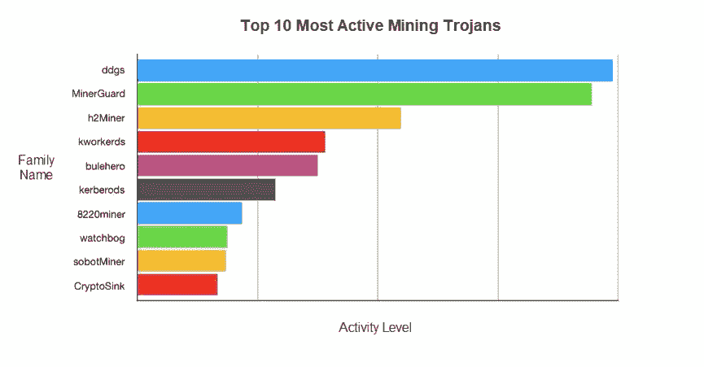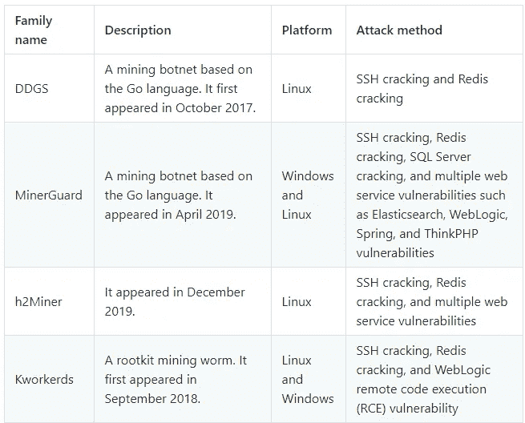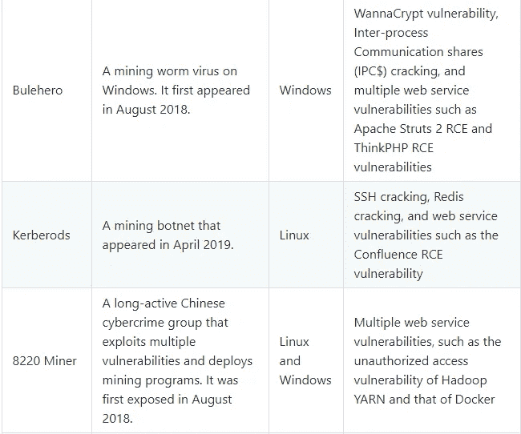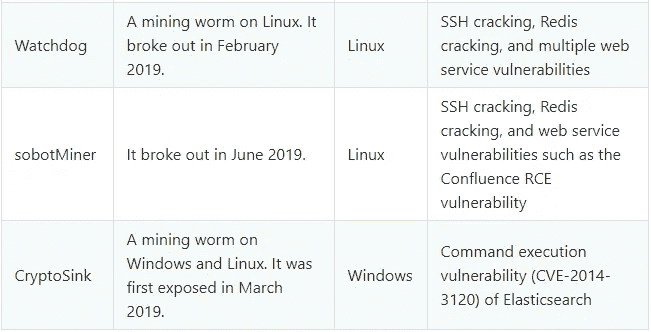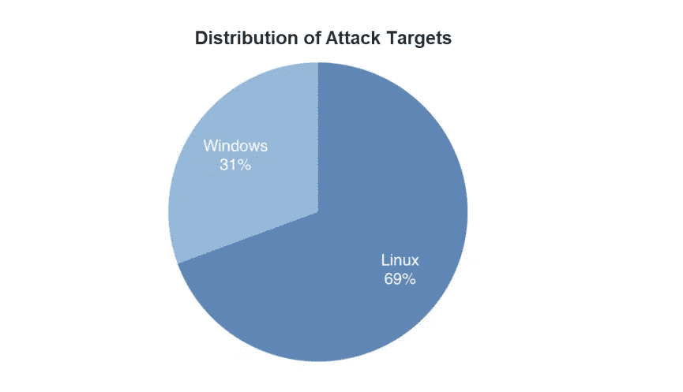

# 攻击趋势

1.目前，挖矿木马作为蠕虫传播，通常通过利用多个漏洞进行攻击。2019 年暴露了大量 RCE 漏洞。一个 N 天的漏洞在暴露后很难在短时间内修复，可能很快被黑客利用来传播挖矿木马和僵尸网络。2019 年，我们发现了一些常见漏洞被非法加密货币矿工利用的事件。下图显示了一些漏洞从暴露到被利用的时间表。大多数漏洞被非法加密货币矿工在几天到十几天的时间内利用。这对云平台和用户的快速响应能力提出了严峻的挑战。

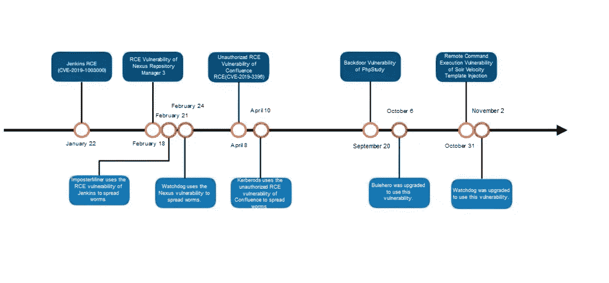

2.目前，特洛伊木马以蠕虫的形式传播，通常通过利用多个漏洞来发起攻击。前 10 名最活跃的挖矿木马以蠕虫形式传播(8220 Miner 除外)，并利用两个以上的漏洞(CryptoSink 除外)。这意味着挖矿木马的传播方式更加有效和广泛。如果企业的信息系统包含易于被任意利用的漏洞，那么在安全边界被打破之后，企业的内部网络可能很快就会受到危害。企业必须开发全面的漏洞防御能力，以应对单点防御失败时出现的漏桶效应。

3.非法加密货币矿工通过暴力攻击传播木马。弱密码仍然是互联网上的主要威胁。下图显示了不同应用程序因加密货币挖掘而受损的百分比。Redis、SSH、SQL Server 和 RDP 仍然是主要目标。由于 O&M 工程师的安全意识不足，弱密码在互联网上被广泛使用。暴力攻击容易发动，已经成为挖矿木马传播的重要手段。

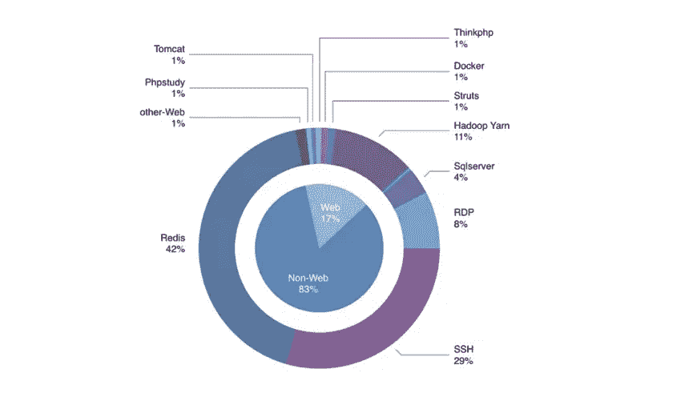

4.非 web 基础框架和组件的安全配置不当，为挖矿木马的传播提供了新的机会。近年来，大数据和容器等新技术得到了广泛应用，企业开始在云迁移后将开发和测试环境部署在云上。这使得服务配置面临安全威胁，因为企业缺乏专业的安全工程师，技术工程师缺乏安全意识。例如，服务暴露在互联网上，接口缺乏认证并使用弱密码，N 天漏洞被暴露。易受攻击的应用程序通常是企业的非核心业务，因此在安全强化和漏洞修复方面没有 web 应用程序得到的投资多。易受攻击的应用程序通常是通过非标准端口或使用非 HTTP 协议提供的，并且不能受到本地安全策略的完全保护。2018 年以来，挖矿木马通过大数据和容器组件传播。自 2019 年以来，容器编排和供应链框架和组件一直是挖掘木马攻击的目标。下表列出了已被挖矿木马利用的非 web 基础框架和组件的漏洞。

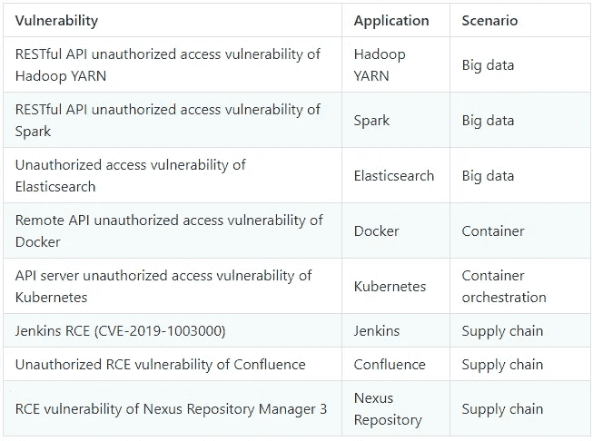

# 攻击方法的趋势

成功入侵后，挖掘木马可能会使用多种方法来危害安全，并阻止安全系统检测和删除它。这使得木马可以稳定、长期地挖掘虚拟货币。挖矿木马不得不用多种方法争夺资源。我们观察到 2019 年挖矿木马使用越来越复杂的安全妥协和资源争用方法。下面列出了挖掘僵尸网络使用的主要方法。

# 1.安全妥协

*   无文件攻击

无文件攻击是在没有将恶意软件植入磁盘的情况下发起的，因此它可以绕过防病毒软件的静态扫描。因此，防病毒软件很难检测和防御无文件攻击。在挖掘僵尸网络中，通过调用各种工具(如 Windows 上的 WMI 命令行工具 wmic.exe)或脚本语言(如 PowerShell)提供的 API 来访问 Windows Management Instrumentation(WMI)，从而发起无文件攻击。黑客利用 wmic.exe 通过以下代码发起无文件攻击:

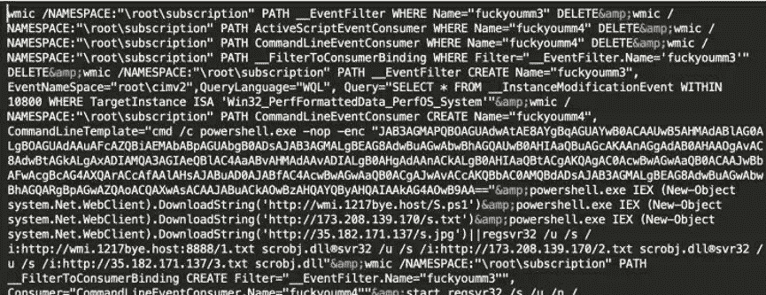

*   Rootkit

挖矿木马通过长期驻留在目标服务器上获取利润。Rootkit 是恶意驻留技术的总称。恶意长期居留最常见的手法就是写预定任务。2019 年预装的动态链接库 rootkits 被挖矿木马广泛使用。挖矿木马通过动态链接库的预加载机制，挂接常用函数，如 libc 中的 readdir。当使用 ps 和 top 等 shell 命令从/proc/目录中读取进程信息时，恶意进程是隐藏的。下图显示了 8220 Miner 如何通过 ProcessHider 隐藏 rootkits。

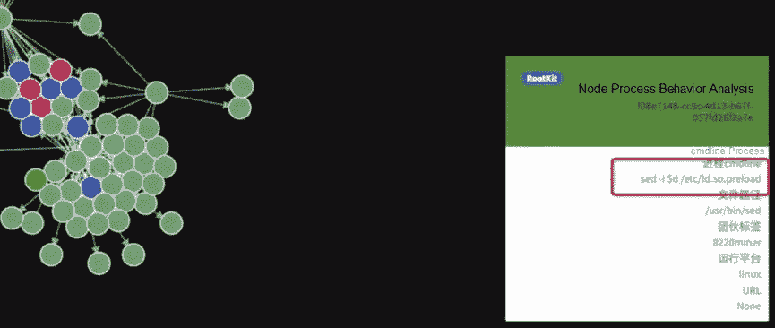

*   中央控制

在中央控制攻击中，黑客在受损主机上运行后门，后门定期与黑客操纵的中央控制服务器通信，允许黑客向受损主机发送命令并从中窃取数据。在恶意加密货币挖掘过程中，不需要对机器人进行强有力的控制。所以大部分挖矿木马都没有完整的中控模块。相反，黑客经常使用配置文件和计划任务来修改 bot 配置和升级 bot 版本。然而，自 2019 年以来，越来越多的采矿僵尸网络求助于中央控制，以在资源争夺中获得更大的优势。下图是 h2Miner 的一些中控模块。

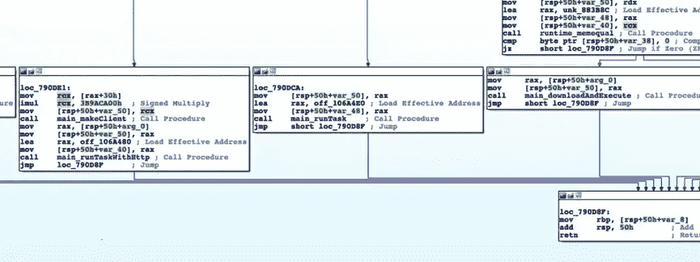

*   黑暗之网

挖矿僵尸网络将其服务器放在暗网和洋葱路由器(Tor)上，使得追踪挖矿木马和僵尸网络更加困难。暗网自 2019 年以来被挖矿僵尸网络广泛利用。下图显示了 2019 年 5 月爆发的名为徐璐的非法加密货币矿工的攻击过程，该矿工将其控制服务器隐藏在 TOR 上。

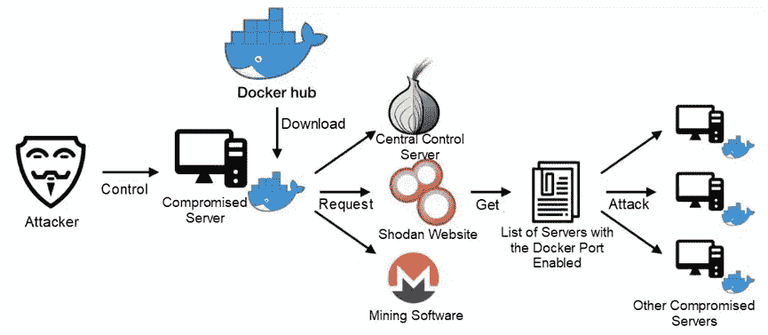

# 2.资源竞争

*   扼杀竞争进程

一个挖矿僵尸网络根据进程指纹库检测其他挖矿进程，或者直接杀死 CPU 使用率高的进程。下图是 h2Miner 使用的一些指纹库，使用了 460 多个进程指纹。这也是 2019 年 12 月 h2Miner 突然崛起的原因之一。

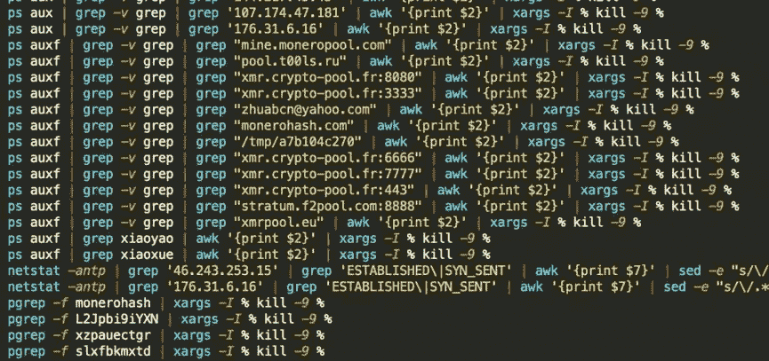

*   修改防火墙配置

挖矿机器人会修改防火墙的 iptables，并禁用易受攻击的服务端口，以阻止其他挖矿木马。或者，挖矿机器人禁用常见的挖矿池端口，以阻止竞争对手的加密货币挖矿。

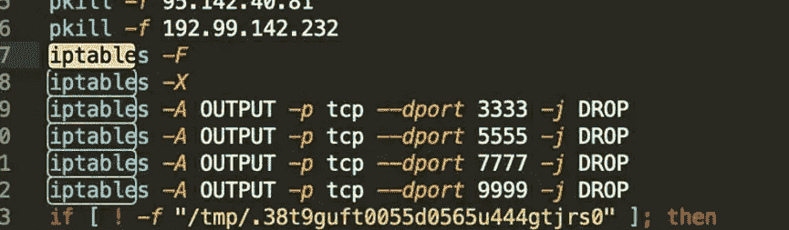

*   天坑

Sinkhole 是安全工程师用来将恶意域名解析为无效 IP 地址的一种方法。挖矿僵尸网络利用 Sinkhole 进行资源争夺，通过修改/etc/hosts 将竞争对手和常用挖矿池的域名解析为无效 IP 地址。这就阻断了竞争对手的加密货币挖掘。以下恶意代码允许采矿僵尸网络通过 Sinkhole 将竞争对手的域名解析为无效的 IP 地址。

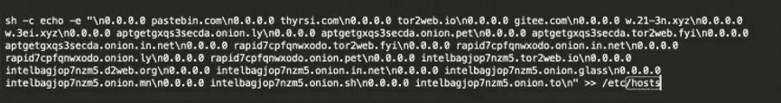

# 典型僵尸网络的示例

2019 年出现了一批利用挖矿木马的主要网络犯罪集团。他们以前所未有的方式发动了大规模的攻击。

*   watchdog(2 月出现):这种蠕虫经常升级，并不断向其武器库中添加最新的漏洞。它通过 2019 年 2 月 Nexus Repository Manager 的最新 RCE 漏洞和 2019 年 11 月初 Solr Velocity 模板注入的最新远程命令执行漏洞进行传播。
*   miner guard(4 月出现):该木马使用多种复杂的攻击方式，并提供全面的进程保护模块。
*   Kerberos(4 月出现):该木马通过 Confluence 的 RCE 漏洞进行传播，并使用了多种基于持久性的攻击方法。
*   H2 miner(12 月出现):该木马通过 Redis 4.x 的 RCE 漏洞广泛传播，并因其强大的竞争进程指纹库所衍生的资源争夺的巨大优势而成为 2019 年底最活跃的挖矿木马。

2019 年，许多长期存在的非法加密货币矿工不断升级他们的攻击方法，并广泛传播采矿木马。

*   DDGS:这个僵尸网络在一月份升级了中央控制的通信模块，然后在 11 月份又升级了一次。它从中央控制结构升级到非中央 P2P 结构，以完全隐藏其黑客操纵的中央控制服务器。
*   Bulehero:这种蠕虫在 2019 年频繁升级，为其武器库中添加了最新的攻击方法。它在 10 月初通过 PHPStudy 最新的后门漏洞进行传播，并升级了其文件命名方式，以增强其资源竞争力。

# 1.h2Miner

h2Miner 是一个以 Linux 为目标的挖掘僵尸网络，它通过 Redis 破解入侵，并利用多个 web 服务漏洞。我们早在 12 月 5 日就检测到了 h2Miner，并以恶意 shell 脚本 h2.sh 命名。它的活跃度一直很低，直到 12 月 18 日才爆发，并在短短五天内成为互联网上最活跃的采矿僵尸网络，超过了 DDGS 和 MinerGuard。

h2Miner 的爆发是由于其 Redis 入侵的新方法。Redis 破解后，h2Miner 通过利用 Redis 4.x 的 RCE 漏洞而不是编写调度任务(这是常用的方法)来启动权限提升。这使得 h2Miner 可以绕过 Redis 的安全配置。帕维尔·托波尔科夫(Pavel Toporkov)在 2018 年国际网络安全大会 ZeroNights 上阐述了 h2Miner 的新攻击方式。Redis 在 Redis 4.x 以后的版本中增加了一个新的模块特性，允许您加载由 C 语言编译的 so 文件来运行特定的 Redis 命令。下图是 h2Miner 爆发前后的活动趋势。

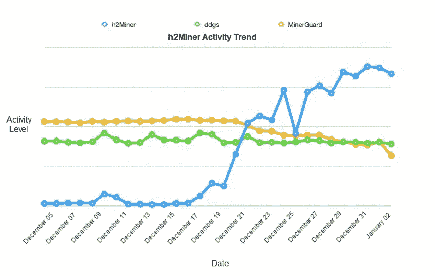

下图是 h2Miner 的攻击过程。攻击者通过利用 Redis 4.x 的 RCE 漏洞加载 red2.so 恶意文件，以运行恶意命令来下载和运行恶意脚本。此脚本用于下载名为 kinsing 的恶意二进制文件，以接收来自中央控制服务器的黑客命令。这有助于发动攻击和传播蠕虫。下载的恶意脚本也删除了大量的竞争对手。所使用的指纹库包含 460 个竞争过程的指纹。这助长了 h2Miner 的快速爆发。如上图所示，12 月 18 日 h2Miner 大规模爆发时，DDGS 和 MinerGuard 的活跃度大幅下降。

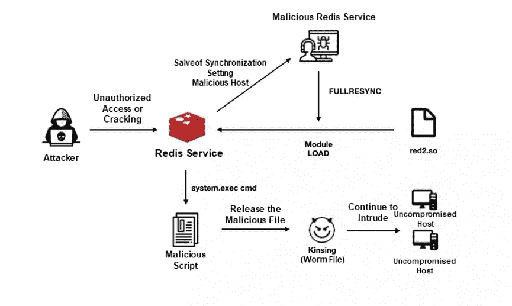

# 2.DDGS

DDGS 矿业僵尸网络于 2017 年 10 月首次曝光。它早期利用 OrientDB 的漏洞，现在又借助 Redis 的未授权访问漏洞和 SSH 的弱口令漏洞进行入侵。下图显示了 DDGS 的攻击过程。入侵主机后，DDGS 下载 i.sh 恶意脚本和 DDGS 程序。然后，DDGS 运行 disable.sh 脚本删除其他挖矿程序，在与黑客操纵的中央控制服务器通信后启动其挖矿程序，入侵其他主机。

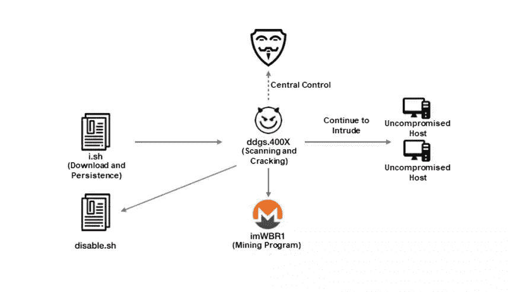

DDGS 从 2019 年开始频繁升级，从 301X 升级到 4008。它最近利用 Nexus 的 RCE 漏洞作为一种次要的攻击方法。DDGS 在 2019 年两次更新了其中央控制协议，从中央控制结构到完全的 P2P 结构。

在 DDGS 3014 和早期版本中，中央控制服务器的 IP 地址被硬编码在恶意文件中，这使得安全工程师很容易跟踪。

在 2019 年 1 月发布的 DDGS 3015 中，被攻破的主机使用 Memberlist 协议框架构建 P2P 网络，其中隐藏了真正的中控服务器。被入侵的主机需要使用该协议穿越 P2P 网络成员来定位真正的中央控制服务器。但是，与中央控制服务器的通信仍然是集中式的。安全工程师可以模拟被入侵的主机来获取中央控制服务器的真实 IP 地址。

DDGS 于 2019 年 11 月升级到 4008 版本。在这个版本中，DDGS 监听被入侵主机的随机端口，并通过网络将通信数据包转发给 P2P 网络成员。戈朗的烟斗()。这意味着被入侵的主机和中央控制服务器之间不存在直接通信。通信包可以通过其他被入侵的主机被路由到真正的中央控制服务器。中控服务器的 IP 地址隐藏在类似 TOR 的匿名结构中。下图显示了不同 DDGS 版本的中央控制结构。

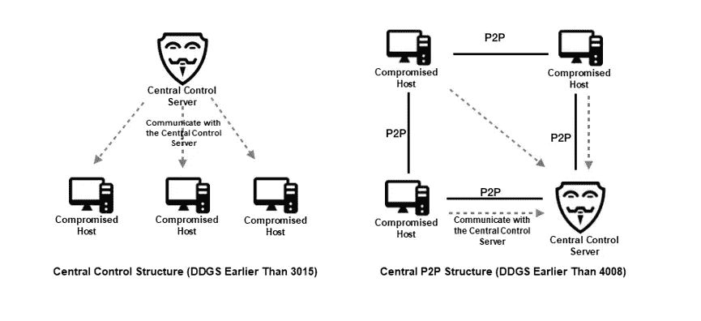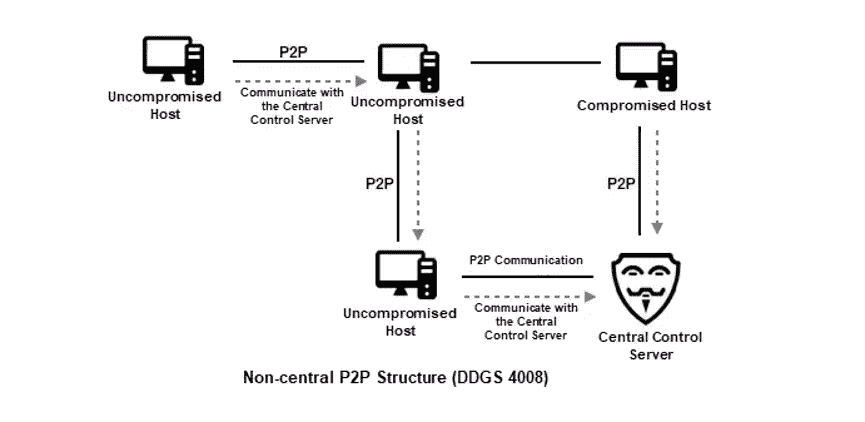

# 3.矿工卫队

MinerGuard 是一个针对 Windows 和 Linux 的挖掘僵尸网络，利用 Redis 的未授权访问漏洞、SSH 的弱密码漏洞和多个 web 服务漏洞。2019 年 4 月爆发。MinerGuard 在不同平台上使用相同的程序逻辑，并在受损主机上运行 sysguard、networkservice 和 sysupdate 恶意文件。

networkservice 文件是 MinerGuard 的攻击模块，它利用了多个 web 服务漏洞。sysupdate 模块是一个开源的 Monero 挖掘程序，它从 config.json 加载 miner 参数。sysguard 模块更新中央控制服务器的 IP 地址，并确保病毒永久驻留在服务器上。sysguard 模块启动后，将创建四个线程，分别用于更新中央控制服务器的 IP 地址、保护启动项目、启动守护进程和升级版本。sysguard 模块提供了全面的保护，使 MinerGuard 在矿业僵尸网络中排名第三。

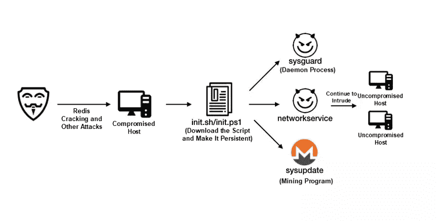

# 4.布勒赫罗

Bulehero 矿虫出现于 2018 年初，2018 年 8 月首次曝光。它的名称源自该蠕虫最初使用的域名 bulehero.in。Bulehero 以 Windows 服务器为目标，通过植入恶意挖矿软件获利。Bulehero 通过使用多种复杂的攻击方式进行传播。自出现以来，它一直在频繁升级，并不断向其武库中添加新的攻击方法。

2019 年 9 月 20 日 PHPStudy 后门漏洞曝光后，Bulehero 在十几天左右就被利用这个漏洞进行了传播。下图是 Bulehero 的攻击过程。攻击有效负载下载 download.exe 文件，该文件用于下载用于蠕虫传播和恶意挖掘的攻击模块、扫描模块和挖掘模块。三个模块的恶意文件在最近一次升级前通过将文件名伪装成系统文件名来隐藏。现在它们被改为随机文件名。随机文件名使 O&M 工程师能够轻松识别和清除恶意文件，但防止竞争对手创建进程指纹。这让 Bulehero 在资源争夺上有了优势。

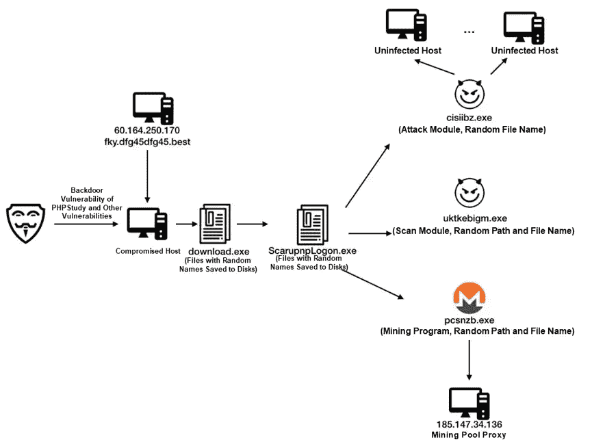

# 5.工人们

Kworkerds 是一个针对 Windows 和 Linux 的挖掘僵尸网络，它利用了 Redis 的未授权访问漏洞、SSH 的弱密码漏洞以及多个 web 服务漏洞，如 WebLogic RCE 漏洞。2018 年 9 月爆发。Kworkerds 非常活跃。它的恶意文件 URL 经常改变，但它的代码结构没有明显改变。Kworkerds 可以利用漏洞下载并运行 mr.sh/2mr.sh 恶意脚本和植入挖掘程序。Kworkerds 通过劫持动态链接库植入 rootkit 后门。

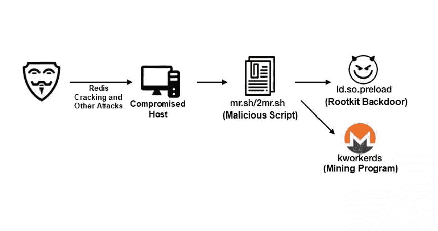

# 6.克伯罗兹

Kerberods 是一种针对 Linux 的挖矿蠕虫。2019 年 4 月利用合流的 RCE 漏洞(CVE-2019–3396)进行了广泛传播。下图显示了它的传播过程。Kerberods 提供了一个持久化模块，使用三种持久化方法:(1)编写/etc/init.d/netdns 文件启动恶意守护进程；(2)编写/usr/local/lib/libpamcd.so 来挂接所有系统函数；(3)将用于下载恶意程序的命令写入 cron 文件进行调度执行。恶意文件的逆向工程表明，Kerberods 使用的技术、程序结构和基础结构与 Watchdog 使用的类似，Watchdog 利用 Redis 漏洞。因此，Kerberods 和 Watchdog 可能是由同一个人创建的。

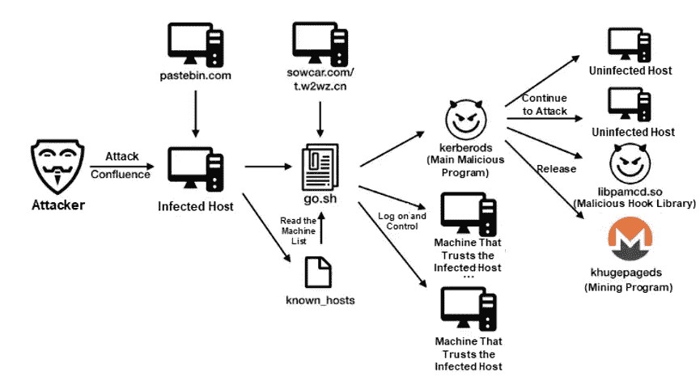

# 7.8220 矿工

8220 Miner 于 2018 年 8 月首次曝光，并且不变地使用 8220 端口。这是第一个利用 Hadoop YARN 的未授权访问漏洞的挖掘木马，它还利用了多个 web 服务漏洞。

下图是 8220 Miner 的攻击过程，入侵后运行 mr.sh 脚本执行挖矿程序。8220 Miner 通过使用一组固定的 IP 地址，而不是通过传播蠕虫来发起网络范围的攻击。我们长期跟踪 8220 Miner，发现其 IP 地址大部分位于东南亚。8220 Miner 是 2018 年最活跃的采矿木马，但截至 2019 年下半年，几乎没有新活动的迹象。我们推测 8220 Miner 在资源争夺中失败是因为它不传播蠕虫，而是使用简单的恶意文件。我们预计 8220 矿工将逐渐消失，如果没有更多的重大升级。

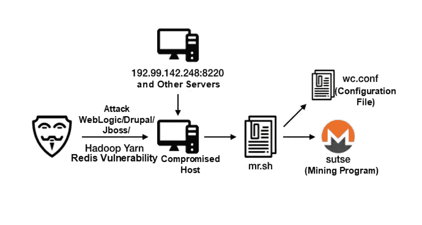

# 8.看门狗

Watchdog 是一种针对 Linux 的挖掘蠕虫，于 2019 年 2 月爆发，利用了 Nexus Repository Manager 的 RCE 漏洞。下图是看门狗的攻击过程。看门狗自出现以来就频繁升级。2019 年 7 月，它增加了多种攻击方法来利用 web 服务漏洞。在此次升级中，Watchdog 还获得了针对 Windows RDP 的 RCE 漏洞(CVE-2019–0708)的内置扫描模块。如果在扫描的主机上检测到此漏洞，主机地址将以 RC4 加密模式返回到中央控制服务器。攻击者可能会利用该僵尸网络来检测互联网上易受攻击的主机，为攻击 Windows 操作系统做准备。

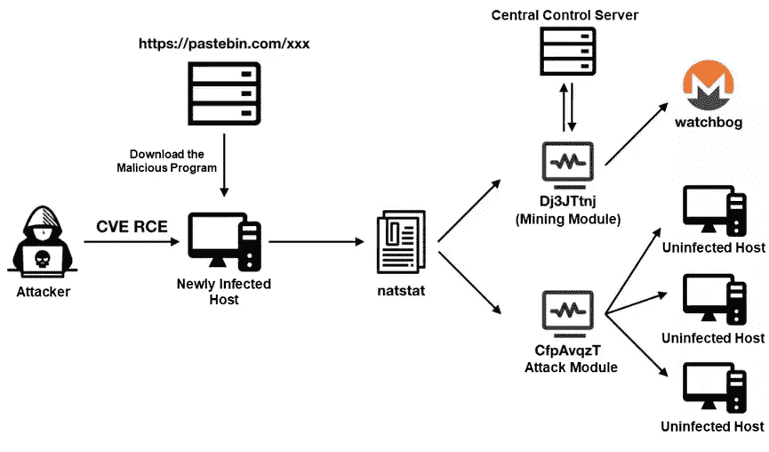

# 安全建议

2020 年 1 月我们准备这份报告的时候，虚拟货币经历了新一轮的升值。这可能会吸引更多黑客通过恶意挖矿获利，预计 2020 年恶意挖矿将会泛滥成灾。

根据我们的估计，阿里云安全团队为云用户提供了以下安全建议:

*   超过一半的挖矿木马利用弱密码漏洞。这些漏洞的存在是由于安全意识不足。企业的首要措施应该是加强安全意识教育和安全管理。
*   非法加密货币矿工可能会在漏洞暴露到修复这段时间内利用零天或 N 天漏洞。这要求企业提高其应急响应效率，实时监控产品安全建议，并及时进行升级。企业还可以购买托管安全服务来提高安全性。
*   企业倾向于专注于核心业务，并相应地进行安全投资。例如，企业可能会部署 web 应用防火墙(WAF)和防 DDoS Pro 来保护其核心 web 服务，但会将互联网上可用的非 Web 网络应用暴露于安全威胁。安全 O&M 工程师必须注意非 web 应用程序的安全威胁，或者购买具有入侵防御系统(IPS)功能的防火墙来防御零时差漏洞。

# 原始来源:

 [## 2019 年基于云的挖矿僵尸网络趋势:挖矿木马作为蠕虫传播

### 阿里云安全 2020 年 2 月 17 日 17 由桑多特别感谢苍坡和吴梵一矿木马是一种…

www.alibabacloud.com](https://www.alibabacloud.com/blog/cloud-based-mining-botnet-trends-in-2019-mining-trojans-spreading-as-worms_595839?spm=a2c41.14003924.0.0)