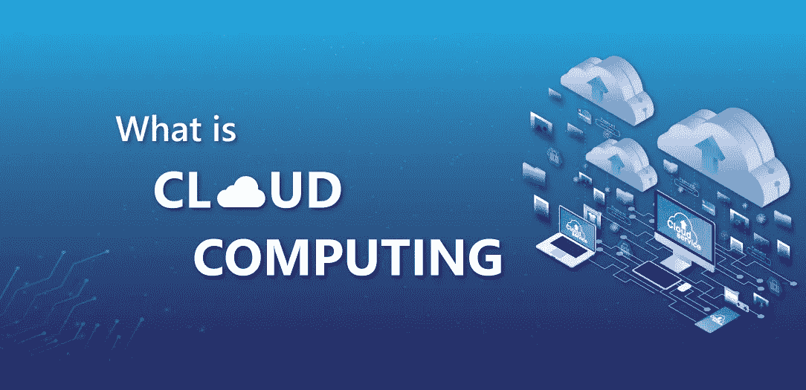
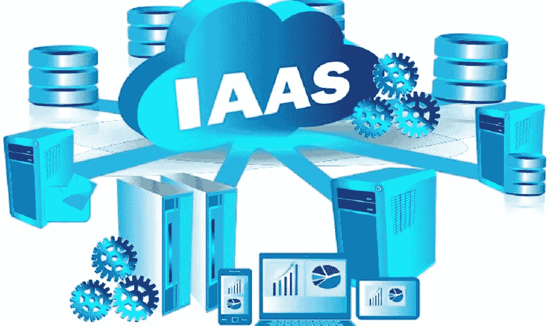
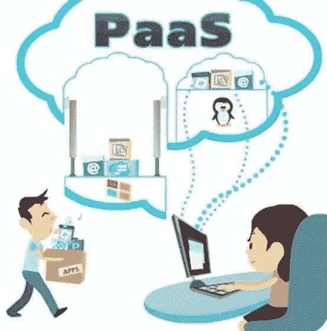

# 用简单的术语解释云计算——简单介绍

> 原文：<https://medium.datadriveninvestor.com/cloud-computing-explained-in-simple-terms-955801c29bed?source=collection_archive---------0----------------------->

如今，全球 65%的人口使用智能手机、电脑和平板电脑。所有这些用户可能都遇到过术语“云”，并且正在使用云及其服务，但是他们中的大多数人并不知道“**云”**到底是什么。随着云像智能手机、电脑、平板电脑一样成为我们日常生活的一部分，我们应该知道它是什么了吧！？

那么，让我们开始我们的话题**云计算**。

什么是云计算？

What is cloud computing?

云计算只不过是通过 **互联网**来**存储和访问数据**(比如你的图像、视频、文档等)和**程序，而不是你的电脑硬盘或手机内存。你们可能都在使用 Google Drive、Google Photos、OneDrive、Samsung cloud、iCloud 来备份自己的重要数据，这叫做**存储和访问数据(定义**中提到的**)**。我们都使用电子邮件或微软 outlook，这些被称为**程序(定义**中提到的**)**。我们能在没有互联网连接的情况下访问这些应用程序吗？答案是否定的，这就是为什么我们说**通过互联网(定义**中提到的**)**。**

在我们深入探讨如何在我们的业务中使用云之前，让我们先了解一下云计算的名字是从哪里来的？

过去在表示互联网的流程图中，人们会画一朵云来象征云，因而称之为云计算。

 [## 云让犹豫不决的职业生涯规划者变得简单:基础|数据驱动的投资者

### 尽管 IT 在当今的商业中扮演着重要的角色，但许多 IT 求职者都不愿意从事云计算职业…

www.datadriveninvestor.com](https://www.datadriveninvestor.com/2020/03/11/cloud-made-simple-for-undecided-career-change-planners-the-fundamentals/) 

有三种方法可以使用**云**。分别是 **IaaS(** 基础设施即服务**)、PaaS(** 平台即服务**)、SaaS(** 软件即服务 **)** 。

当您听到或说**即服务**时，请记住，客户正在使用其他人的基础架构开展业务。

**基础设施即服务(IaaS):** 它是一种通过互联网将服务器、存储、网络等虚拟化计算资源分配给用户的模式。

以 Medium 为例，Medium 非常依赖 Amazon Web Services(AWS ),这是一家 IaaS 公司。这里发生的是亚马逊向媒体提供计算资源。Medium 在此基础上建立了一个出版论坛。但仍有一些工作需要通过媒体来完成，如安装数据库和架构设计等。

简单地说，你买一套公寓(购买基础设施，如服务器、存储、网络)并住在那里。但是，你需要设计你的房间(建筑设计)，安装电力(安装数据库)。公寓是你的，但土地和建筑属于别人。亚马逊网络服务(AWS)、微软 Azure 就是其中的例子。

Infrastructure as a Service

**平台即服务(PaaS):** 这是一种由第三方提供商提供硬件和软件工具的模式，用户可以直接使用它们。

简单地说，这给了你一个家具齐全的房子(硬件和软件工具)，你所要做的就是搬到公寓去，你已经准备好了所有的家具和用具。谷歌应用引擎就是一个例子。

Platform as a service

**软件即服务(SaaS):** 这是一种软件分发模式，由第三方提供商托管应用程序，并通过互联网提供给用户。

简单地说，假设你需要一个停车的地方，你没有停车位。那么，在这种情况下你会怎么做？你去找一个提供停车位服务的供应商(第三方提供商)，你通过向他们付费来停车。

网飞、亚马逊 Prime、Gmail、Spotify 都是 SaaS 的例子。网飞(第三方提供商)允许你(用户)在互联网上播放视频，你向他们支付流媒体内容。

Software as a Service

为什么云现在成为趋势？

因为它很灵活，你可以随时随地从任何设备上使用它。它有一个选项，即付即用，这是最有吸引力的一部分，还有更多。

这就是云计算。我希望你能理解。你现在可以在云计算上享受和理解迷因了:P

谢谢大家！！！

## 欢迎在下方留言评论。