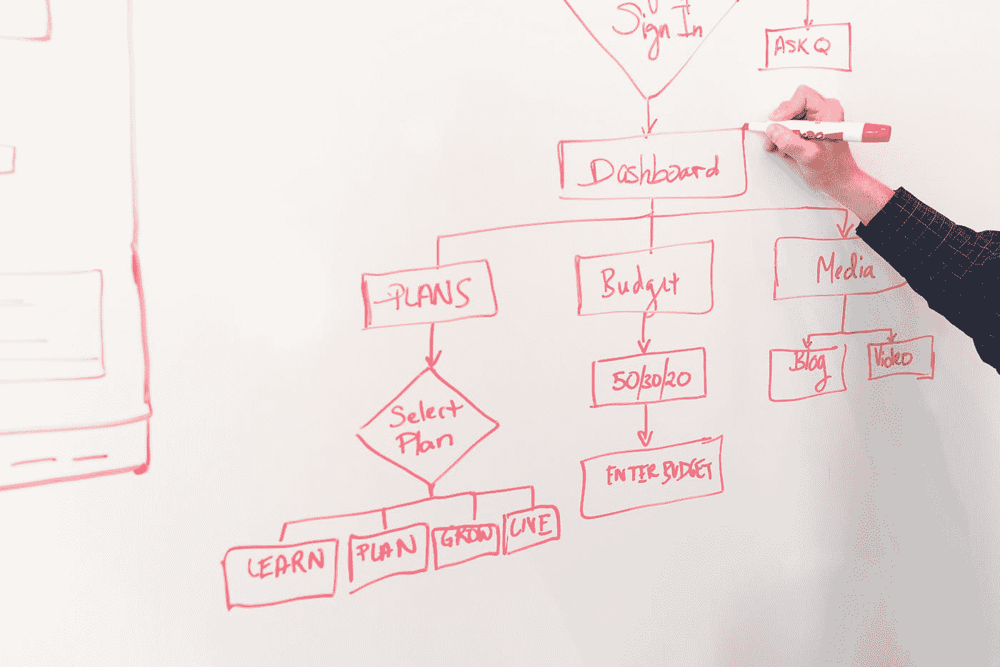

# 云工具概述

> 原文：<https://medium.datadriveninvestor.com/cloud-tools-overview-46d7bd0826cd?source=collection_archive---------16----------------------->

## AWS，Azure，GCP:应用架构工具

软件开发人员可用的服务和工具的数量和类型令人眼花缭乱。本文在简单的上下文中，概述了旗舰云供应商为应用程序架构提供的工具。

Photo by [Christina @ wocintechchat.com](https://unsplash.com/@wocintechchat?utm_source=medium&utm_medium=referral) on [Unsplash](https://unsplash.com?utm_source=medium&utm_medium=referral)

# 应用架构工具

如何部署和管理实际的应用程序业务逻辑是使用云的最核心的方面。下面的选项通常是从最有开发经验的到最抽象和最易管理的排列的。

# 虚拟基础设施(VI)

我们有能力创建虚拟机(VM)和虚拟网络。下表显示了可用的服务以及每个供应商对其服务版本的称呼。

## 供应商工具

Basic Virtual Infrastructure Services by Vendor

带直播链接的直播表:[https://docs . Google . com/spreadsheets/d/1nd _ al 7 ym 5 qjf 8m 6 hux-LZzurlBoBV _ SCA wo 0 ng 2 pfgy/edit # GID = 0](https://docs.google.com/spreadsheets/d/1nd_AL7ym5QJF8m6HuX-LZzurlBoBV_ScaWO0Ng2PfGY/edit#gid=0)

## 评论

**虚拟机:**通过 web 控制台和远程 API 管理虚拟机的能力

**虚拟网络:**定义 IP 地址、子网和路由表的能力。

**虚拟专用网:**能够配置安全的站点到站点(云内和本地到云)和点到站点(VPN 隧道)连接。

**DNS:** 虚拟域名服务器配置

**负载平衡器:**负载平衡器是基础设施的另一个关键部分，它允许基于流量/负载特征和“循环”平衡等策略来路由请求。

**专用网络:**到公共云网络的非互联网直接网络链接

总之，虚拟网络和虚拟机为过去用于运行应用程序的传统数据中心基础架构提供了基准替代品。

这些工具实质上是在虚拟环境中重建物理数据中心。没有什么可以阻止开发人员使用相同的架构进行应用程序开发。这是许多组织首次采用云的方式。

但是这些新工具实现了一种新方法:原生云。

Cloud native 一般是指项目采用三个要素:容器化应用、微服务架构和 devops。

下一个合乎逻辑的步骤是利用虚拟基础架构、容器化和集群技术来手动构建满足这些云原生元素的应用程序。

## 使用 Kubernates 和其他工具的虚拟基础架构

这里的“其他工具”是基础设施工具，如 Terraform 和 Ansible，云监控工具，如 Cloud Watch 和 CI/CD 工具，如 Jenkins 或 Cloud Build。它们负责管理构建 Kubernates 集群的底层基础设施，并自动化您的构建管道。

这是最需要手动操作的选项，但也为开发人员提供了最大程度的灵活性和控制。特别是，它允许处理正在过渡到云环境的传统应用程序的特性。

对开发团队来说，安排所有这些元素是很重要的，也是一项重要的工作。

## 托管库贝纳特

完善的下一步是设计一个抽象层，将共同需求捆绑在一起，促进与其他供应商工具的集成，并提供一个简化的管理界面。每个供应商都有一个旗舰托管 Kubernates 平台。

托管平台为那些在技术上符合采用条件的项目带来了好处，但也付出了代价。每个供应商对使用这些服务的收费都高于他们对运行这些服务的基础设施的收费。

## 无服务器容器平台

无服务器容器平台占据了托管平台和成熟无服务器选项之间的模糊区域。这里的想法是在保持一些熟悉的 Kubernates 体验的同时，允许不干涉的 PaaS 风格的管理体验。

## 平台即服务(PaaS)

## 无服务器功能

无服务器函数允许函数级代码在平台管理的上下文中执行。AWS Lambda 是第一家，但其他供应商在很大程度上已经达到了同等水平。

这些供应商支持一系列语言和框架，如下所示(在撰写本文时):

**GCP 功能:**节点。js，Python，Go，。Net、Ruby 和 Java

**AWS Lambda:** Java，Go，PowerShell，Node。js、C#、Python 和 Ruby

**Azure 函数:** C#、JavaScript、F#、Java、PowerShell、Python、TypeScript

此外，每个供应商都支持通过绑定使用任何支持 HTTP 的语言。

关于无服务器应用架构的一个关键点是它必须是无状态的。每个请求由平台路由，相同的功能实例可能不服务于后续的请求，此外，功能根据需求被动态地创建或销毁。

无服务器功能也提供了一个简单的“扩展到零”的途径，如果需求允许的话，它们可以被平台关闭而不占用任何资源。

# 结论

不同供应商工具的用途并不总是显而易见的。本文有助于解决应用程序架构的困惑，并将它们放入相互关联的上下文中。