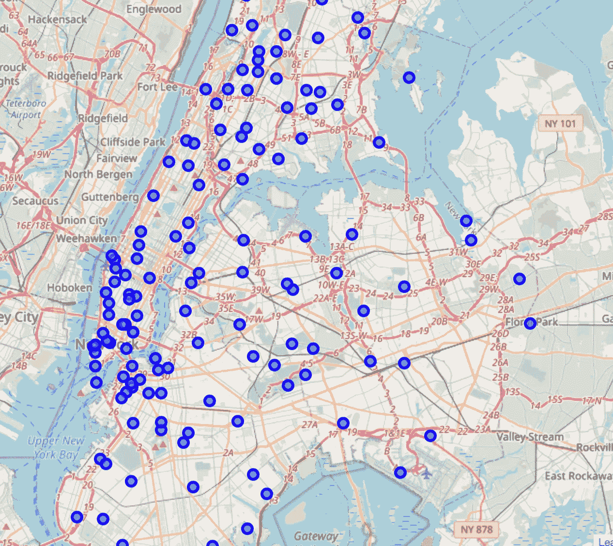
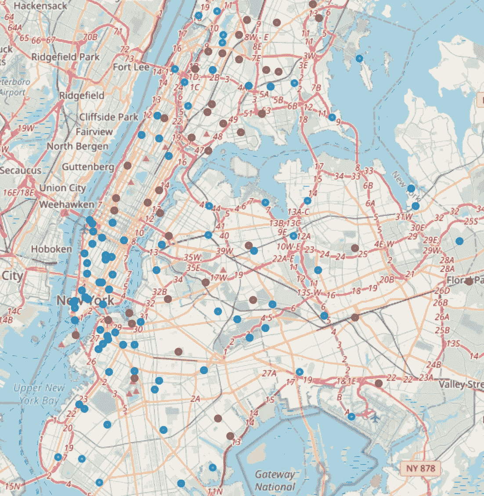
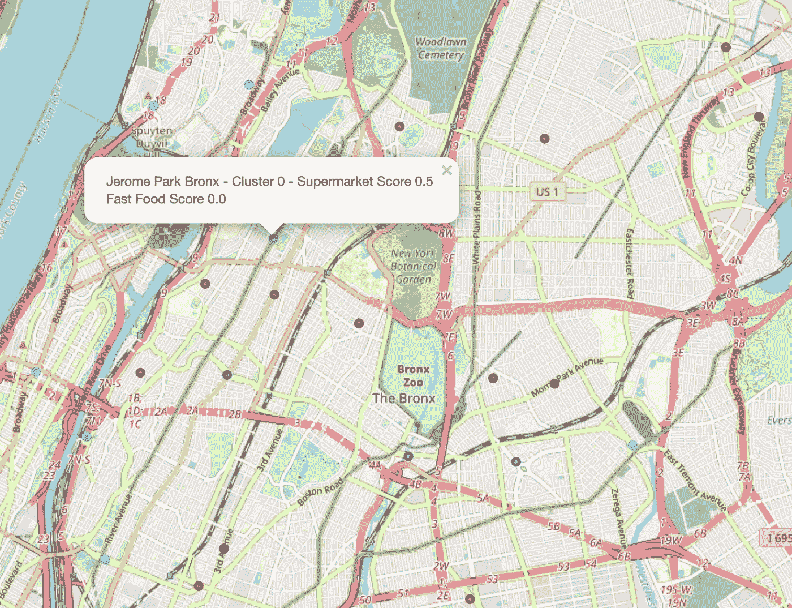

# 食物沙漠的聚类识别

> 原文：<https://medium.datadriveninvestor.com/cluster-identification-of-food-deserts-d3cedc176ed8?source=collection_archive---------16----------------------->

使用 Python 分析纽约市的食物短缺

Photo by [gemma](https://unsplash.com/@_gemmajade?utm_source=medium&utm_medium=referral) on [Unsplash](https://unsplash.com?utm_source=medium&utm_medium=referral)

食物短缺是纽约市众所周知的问题。它指的是一些地区缺乏健康食品的选择，通常由超市或新鲜食品店提供。这些俗称的“食物沙漠”通常会导致肥胖率和肥胖相关疾病的增加。或者，这些地区也有大量的快餐可供选择。快餐店(理所当然地)被认为是不健康的选择，因为它使用的原料和每餐平均摄入的热量。

超市是为数不多的提供大量新鲜农产品和健康食品的机构之一。虽然被归类为食物沙漠的社区可能有杂货店，但这些商店没有空间提供各种各样的新鲜农产品，而加工食品更容易销售。

这个项目的目标是使用从 Foursquare 收集的数据来发现在他们提供的健康食品选择数量方面有相似之处的地区。政府机构和社区倡导者将利用这些信息来确定哪些地区最需要健康食品补贴。

虽然补贴通常被视为浪费金钱，但肥胖相关疾病给医疗系统带来的负担远远超过了补贴低成本健康食品的支出。

# 数据

首先，看看我将在这个项目中使用的不同的包。

All of these packages are vital to the project

对于本项目，收集以下数据至关重要:

*   纽约市的社区列表
*   邻近地区的纬度和经度
*   Foursquare API 调用收集位于这些坐标周围的地点

为了获得所有这些数据，该项目要求对纽约每个区的社区进行网络搜集维基百科页面。完成后，下一步是使用 Python 包 Geocoder 为每个邻域分配坐标。下一节将介绍这种方法。

# 方法学

首先，我查找纽约市不同社区的列表。我找到了五个不同的维基百科页面，给了我五个区的社区列表。这些很重要，因为它们将是我们确定坐标的基础。查看下面的代码:

Webscraping neighborhoods for the Bronx

我们将使用 Python 的 *beautifulsoup* 包来收集数据，以便使用 Geocoder 包。使用 Geocoder，我们给每个邻域一个纬度和经度值。Geocoder 使用 GIS 系统，该系统根据邻域名称匹配坐标。

Creating a data frame for the Bronx with coordinates and neighborhood names

然后我们把它绘制在叶子上来检查结果。

Code for this image can be found in the project [repository](https://github.com/ptorres001/coursera_capstone/blob/main/Cluster_Final.ipynb)

接下来，我们使用 Foursquare API 查找坐标半径范围内的场馆及其类别。场地只是建立的另一个词。每个地点可以是商店、游乐场、地标等。类别比名称更重要，我们使用类别是为了以后找到聚类。在缩小了我认为与项目相关的特性之后，我忽略了其余的特性。被认为与本项目相关的场馆分为以下几类:

*   快餐店
*   超级市场
*   杂货店

所有不属于上述类别的场馆条目都已从数据框中删除。在对所有特征进行一次性编码后，我们能够确定不同社区的构成。从那里可以找到每一个邻居的平均值。

> 我们想知道每个场所类别在所有食物选择中所占的百分比。

也就是说，如果总共有 8 个选项，其中 3 个是快餐店，那么快餐将占 37.5%。

这种方法会完全移除一些邻域，之后需要将它们添加回去。这导致了一些 NaN 值，它们是那些类别中没有任何值的结果。它们很快被替换为零，并被推入聚类阶段。

因为维度提前缩小了，所以特征选择不是最重要的。然而，接下来进行了主成分分析(PCA ),以确定所解释的每个特征的变化量。结果是一个数字矩阵，它被确定为最能表明观察值的变化。结果用于 KMeans 聚类。

KMeans 的一个重要缺陷是质心的随机放置。这导致了与别处不同的集群。为了解决这个问题，我们循环了质心的随机放置以及使用多少个质心。遍历可能的聚类数，通过查看轮廓分数和肘部曲线来缩小数目。

一旦聚类最终确定，我们就使用叶子上的坐标对它们进行映射。我们包括了它们各自分数的细节和邻域名称，以便确定聚类之间的趋势。

# 结果

聚类模型的结果讲述了一个有趣的故事。首先，在我们运行了几次迭代并得出最佳质心数之后，我们找到了基于这些质心的轮廓分数。

对于那些不确定剪影分数的人，我会把这个[链接](https://en.wikipedia.org/wiki/Silhouette_(clustering))包括进来。它给出了轮廓分数的一般概念，以及为什么它对聚类很重要。

 [## 一瞬间学会数据科学！？数据驱动的投资者

### 在我之前的职业生涯中，我是一名训练有素的古典钢琴家。还记得那些声称你可以…

www.datadriveninvestor.com](https://www.datadriveninvestor.com/2020/07/23/learn-data-science-in-a-flash/) 

得分第二高的最终聚类模型是 3 质心模型。虽然 4 质心模型得分更高，但它实际上捕捉了很多噪声，所以我选择了 3 质心模型。

3 Centroid Model

该模型根据超市和快餐店的分数来划分聚类。聚类模型最有趣的部分是它们是无人监督的。这意味着模型给出的任何信息都必须由用户来解释。

This cluster with higher supermarket scores

集群是这样分解的:

*   第 1 类——超市更常见。
*   集群 2——超市和快餐店同样数量众多。
*   集群 3——快餐店数量更多。

# 结论

聚类是我最喜欢的非监督技术之一，因为它允许外部知识来分析结果。

基于我在这个项目中对纽约市的了解，我可以对聚集地做出一些结论。

1.  大多数商业区似乎都有较高比例的快餐店。这是显而易见的，无论是从它们在纽约市中心的位置，还是从游客/通勤者宁愿吃比超市更快的食物的想法来看。这些区域也是城市中数量最多的。
2.  在居民较多的地区，超级市场过剩。即使你给出了警告，超市比例最高的地区还是在高收入地区，比如布朗克斯区的河谷镇，或者远离为游客/通勤者提供上下班服务的高交通流量地区。这些集群数量最少。
3.  最后一组是百分比大致相等的地方。该集群混合了其他两个集群。它们更像住宅区，但仍被视为通勤者/游客的高交通流量区。

项目的结束带来了许多问题和下一步该做什么的想法。将从这些数据中收集的信息与人口普查信息结合起来，以获得收入和人口统计信息，将是一条值得走的道路。

你可以在我的 Github 上查看这个库。如果你想更多地谈论纽约市的食物短缺或纽约对抗食物短缺的计划，请通过 [LinkedIn](http://linkedin.com/in/pntorres/) 与我联系。

我也在推特上，你可以在这里关注我。

**访问专家视图—** [**订阅 DDI 英特尔**](https://datadriveninvestor.com/ddi-intel)