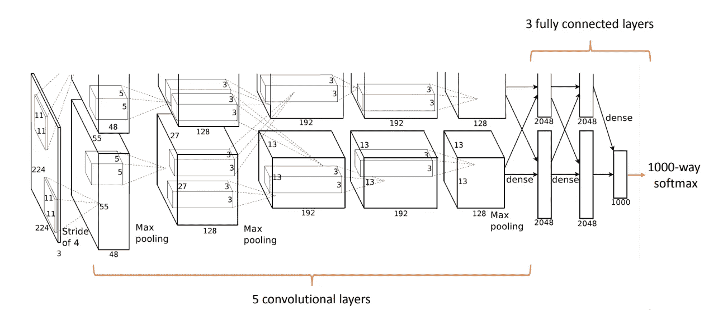
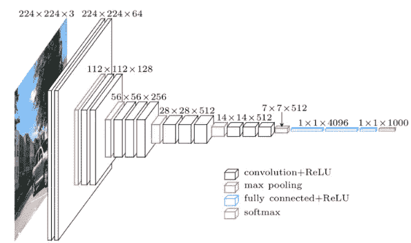
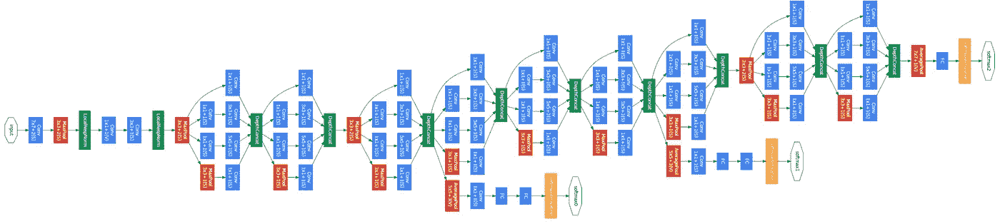
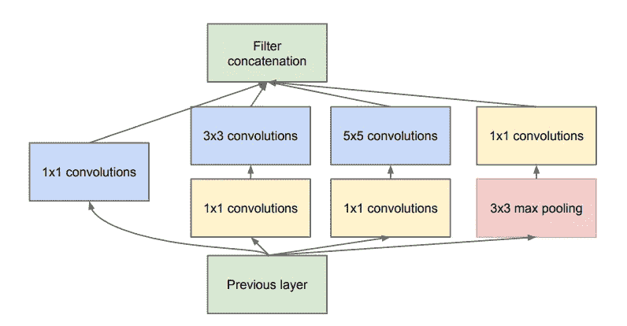
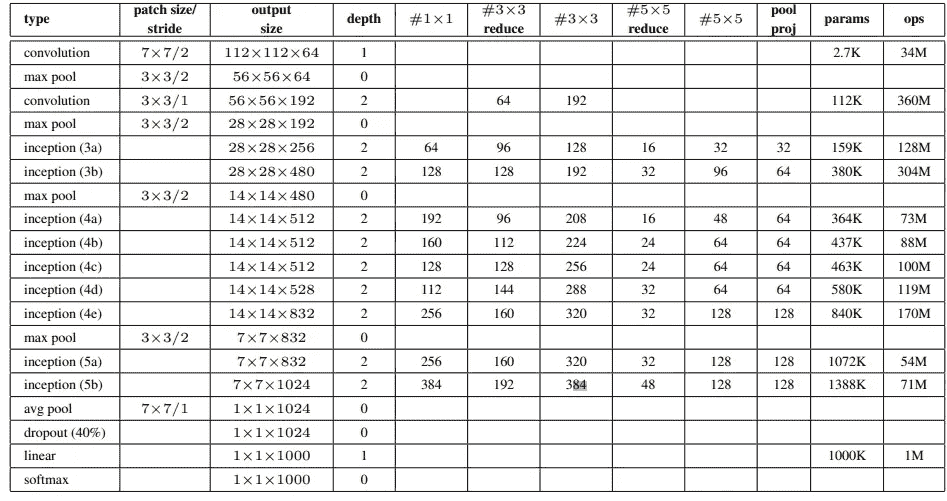
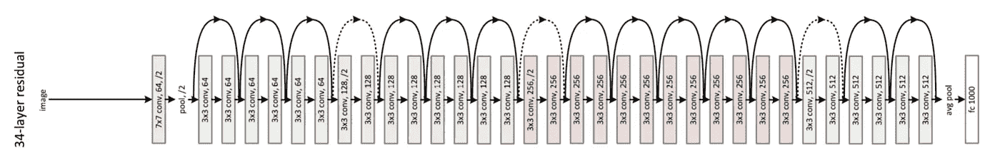
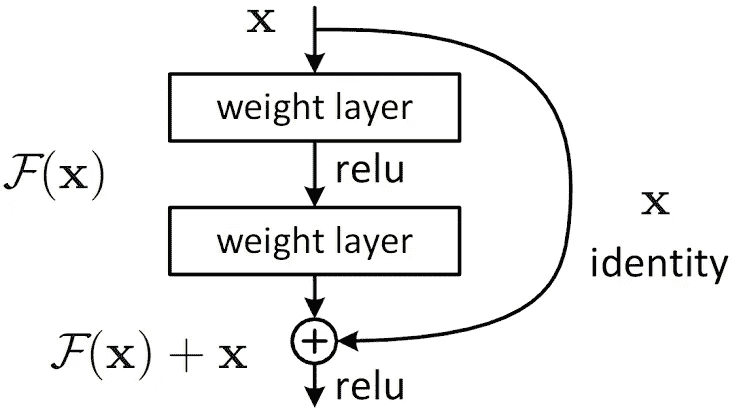

# 从头开始的 CNN 架构

> 原文：<https://medium.datadriveninvestor.com/cnn-architectures-from-scratch-c04d66ac20c2?source=collection_archive---------2----------------------->

## 从 Lenet 到 ResNet

Photo by [James Padolsey](https://unsplash.com/@padolsey?utm_source=unsplash&utm_medium=referral&utm_content=creditCopyText) on [Unsplash](https://unsplash.com/s/photos/architecture?utm_source=unsplash&utm_medium=referral&utm_content=creditCopyText)

卷积神经网络是一类深度神经网络，它不仅在计算机视觉任务中，而且在其他领域如语音识别、自然语言处理等方面都取得了最先进的成果。这些 CNN 不仅通过堆叠层，而且通过创建定制层，已经发展了很长时间。在当前的世界里，我们用这些模型来转移学习，达到更好的效果。

在本文中，我将讲述如何在 Pytorch 中从头开始实现最先进的 CNN 架构。我假设你知道这些 CNN 的理论，所以我不会涉及理论部分。在这篇文章的最后，我还会包括一些额外的资源来学习这个理论。

# Lenet:

Lenet 5 被认为是卷积神经网络的第一个架构，用于识别美国邮政编码中的手写数字。论文中介绍了“应用于文档识别的[梯度学习](http://vision.stanford.edu/cs598_spring07/papers/Lecun98.pdf)”

Lenet Architecture, [Image Source](http://vision.stanford.edu/cs598_spring07/papers/Lecun98.pdf)

> LeNet-5 架构包括两组卷积层、激活层和池层，接着是两个全连接层、tanh 激活层，最后是一个 softmax 分类器，用于对 MNIST 数字进行分类[1]

现在让我们在 Pytorch 中实现 Lenet。

Lenet Pytorch Implementation

在上面的代码中，我们创建了一个具有 *tanh* 激活函数的神经网络，两个卷积层后跟 AveragePooling 层，一个卷积层后跟两个带有 softmax 分类器的线性层[ [2](https://www.pyimagesearch.com/2016/08/01/lenet-convolutional-neural-network-in-python/) ]。

## Alexnet:

AlexNet 是由 Alex Krizhevsky 等人在 2012 年开发的深度神经网络。它旨在为 ImageNet [ [3](https://towardsdatascience.com/understanding-alexnet-a-detailed-walkthrough-20cd68a490aa?source=post_internal_links---------4----------------------------) ] ILSVRC-2012 竞赛对图像进行分类，并取得了最先进的结果。在论文[中介绍了用深度卷积神经网络进行 ImageNet 分类](https://papers.nips.cc/paper/2012/file/c399862d3b9d6b76c8436e924a68c45b-Paper.pdf)

> Alexnet 从 227 x 227 x 3 图像的输入层开始，下一个卷积层由 96 个(11 x 11)滤波器组成，步长为 4。这将它的尺寸减小了 55×55。随后是具有 3×3 过滤器的 MaxPool 层以及 stride 2。这一过程继续下去，最终到达具有 9216 个参数的全连接层和下两个各具有 4096 个节点的全连接层。最后，它使用具有 1000 个输出类的 Softmax 函数..Alexnet 是第一个使用 ReLU 非线性、正则化辍学和多 GPU 训练的架构[3]

[Image source](http://cvml.ist.ac.at/courses/DLWT_W17/material/AlexNet.pdf)

现在让我们在 Pytorch 中实现 Alexnet。

在上面的代码中，我们创建了一个神经网络，第一个卷积层的内核大小= 11，步幅= 4，填充= 2，然后是 LocalResponseNormalization 层和池层，第二层避免了 LocalResponseNormalization 层，最多创建了五个卷积层，然后是三个完全连接的层，最后输出 1000 个类。

## VGG:

VGG 可以被称为 Alexnet 的更深形式。这种网络比 Alexnet 堆叠更多的层，并使用相同的 ReLU 激活功能，但与 Alexnet 相比，参数数量较少。

VGG net architecture [Image Source](https://www.researchgate.net/figure/VGG16-architecture-16_fig2_321829624)

> VGG-16 是一个更简单的架构模型，因为它没有使用太多的超参数。它总是在卷积层中使用跨度为 1 的 3 x 3 过滤器，并在跨度为 2 的合并层中使用相同的(1，1)填充。[3]

现在让我们在 Pytorch 中实现 VGG。

在上面的代码中，首先，我们创建一个层值字典，其中' M '代表最大池层，整数是输入通道和输出通道的数量，接下来。我们创建一个函数 *create_conv_layers，*在字典的帮助下创建多个卷积层， *__init__* 方法和 *__forward__* 方法与任何其他 CNN 相同。

## InceptionNet(谷歌网):

Inception network 也被认为是 Googlenet，被认为是 CNN 历史上的一个重要里程碑。在 inception net 之前，所有的网络都在堆叠层，旨在获得更好的性能，但失败了。《盗梦空间网络》是 Imagenet 2014 挑战赛的获胜者，并在论文“[用卷积深入发展](https://arxiv.org/pdf/1409.4842.pdf)”中进行了介绍它的主要贡献是开发了一个*初始模块*，极大地减少了网络中的参数数量(4M，相比之下 AlexNet 有 60M)。此外，本文在 ConvNet 的顶部使用平均池而不是完全连接的层，消除了大量似乎不太重要的参数[ [4](http://cs231n.stanford.edu/slides/2017/cs231n_2017_lecture5.pdf) ]。

Inception network architecture [Source](https://arxiv.org/pdf/1409.4842.pdf)

该架构还包含两个连接到初始模块输出的辅助分类器层(黄色块)。

现在让我们实现 Inception 模块的卷积块，它将是整个 Inception 架构的构建块。

在上面的代码中，我们用 ReLU 激活函数和 BatchNorm 创建了一个卷积层用于正则化。卷积层动态地获得许多输入和输出通道。

辅助分类器的实现如下:

在上面的代码中，我们创建了一个 5*5 过滤器的平均池层和 1*1 过滤器的卷积层，然后是线性层。

现在让我们实现先启模块。

The Inception Module described in the [paper](https://arxiv.org/pdf/1409.4842.pdf)

上面的代码基于流程图，在流程图中，我们创建了四个卷积分支并将它们连接起来，这又形成了初始模块。

现在我们可以实现完整的初始架构了。

在上面的代码中，首先，我们创建两个内核大小为 3*3 的卷积层，然后是 Inception 块。借助这个表格可以更好地理解上面的代码。

[Image Source](https://arxiv.org/pdf/1409.4842.pdf)

> 这些初始块的主要特征是，它们不仅更深，而且更广

## Resnet:

Image from the paper

Resnet 被认为是一个改变游戏规则的架构，因为它被认为是一个真正更深层次的架构，有 152 层。在论文“[用于图像识别的深度残差学习](http://arxiv.org/abs/1512.03385)中介绍了它，它赢得了 Imagenet 2015 竞赛，此后大多数 CNNsare 都是这些 Resnets 的变体。它之所以如此受欢迎，是因为它避免了退化问题，即当创建更深的网络时，在训练和测试集中的某个点之后，网络的损耗通常会增加，为了避免这个主要问题，作者建议使用对前一层[[5](https://towardsdatascience.com/residual-network-implementing-resnet-a7da63c7b278)的引用来计算给定层的输出。在 ResNet 中，前一层的输出(称为残差)会添加到当前层的输出中。

Identity connection [Image source](https://arxiv.org/abs/1512.03385)

Resnet 的实现如下:首先，我们创建一个层块，这有助于我们创建主网络。

上面的代码创建了一个带有 ReLU 激活和 skip-connection 的 BatchNormalization 的卷积层块，现在称为 *identity_downsample* 。让我们用 skip 连接实现主 Resnet 层，它将在主网络中使用

它可以通过一个接一个地堆叠`n`个块来定义，我们应该注意到第一个卷积块的跨度为 2，因为"*我们直接通过跨度为 2* [ [5](https://towardsdatascience.com/residual-network-implementing-resnet-a7da63c7b278) ]的卷积层来执行身份下采样。

在上述函数的帮助下，我们可以从头开始创建我们的全残差网络，它遵循了论文“[用于图像识别的深度残差学习](http://arxiv.org/abs/1512.03385)”中的原始实现。

上面的代码创建了完整的 ResNet 模型。这种架构的主要优点是我们可以用这种架构训练更深层次的网络

所有代码都可以在我的 [Github](https://github.com/seanbenhur/papers) 上找到。如果您有任何疑问，请随时通过 [LinkedIn](https://www.linkedin.com/in/sean-benhur-70535119b) 联系我

## 其他资源:

*   [CS231n 课程笔记](https://cs231n.github.io/convolutional-networks/)
*   [吴恩达的卷积神经网络](http://coursera.org/lecture/convolutional-neural-networks/cnn-example-uRYL1)

## 参考资料:

*   [1] [理解和实现 LeNet-5 CNN 架构](https://towardsdatascience.com/understanding-and-implementing-lenet-5-cnn-architecture-deep-learning-a2d531ebc342)
*   [2][LeNet—Python 中的卷积神经网络](https://www.pyimagesearch.com/2016/08/01/lenet-convolutional-neural-network-in-python/)
*   [3] [了解 AlexNet:详细演练](https://towardsdatascience.com/understanding-alexnet-a-detailed-walkthrough-20cd68a490aa?source=post_internal_links---------4----------------------------)
*   [4][【cv 231n】第五讲|卷积神经网络 _gdtop](https://blog.csdn.net/weixin_37993251/article/details/88026138)
*   [5] [剩余网络:在 Pytorch 中实现 ResNet](https://towardsdatascience.com/residual-network-implementing-resnet-a7da63c7b278)
*   【6】[阿拉丁·皮尔森的机器学习文集](https://github.com/aladdinpersson/Machine-Learning-Collection)