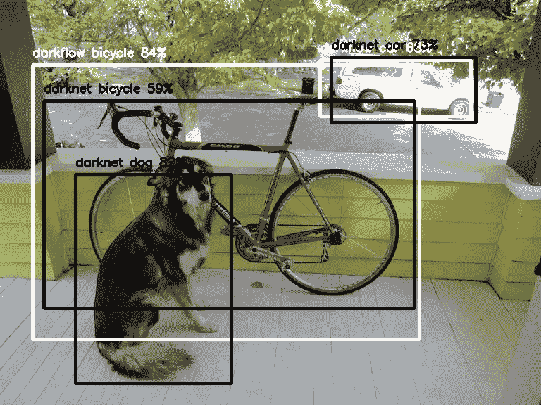
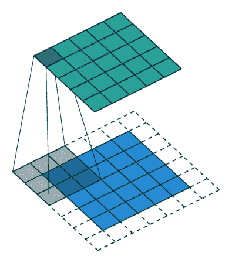
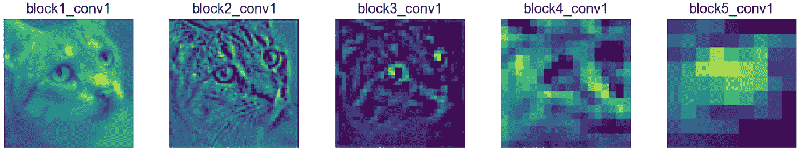
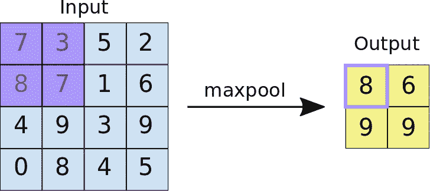
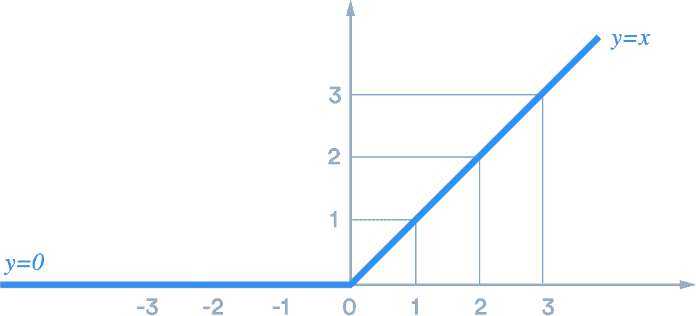
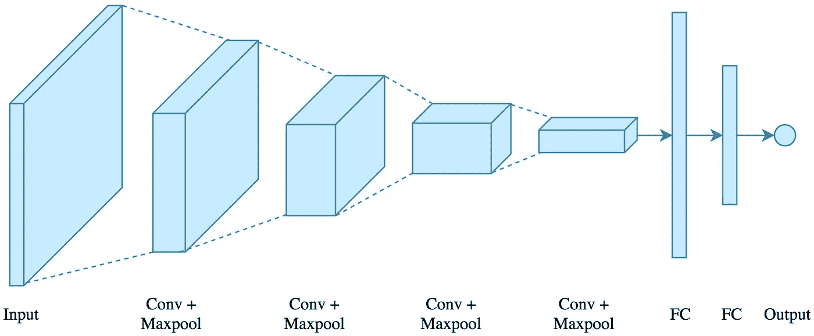
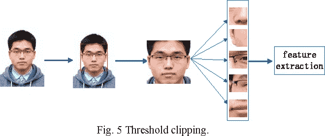
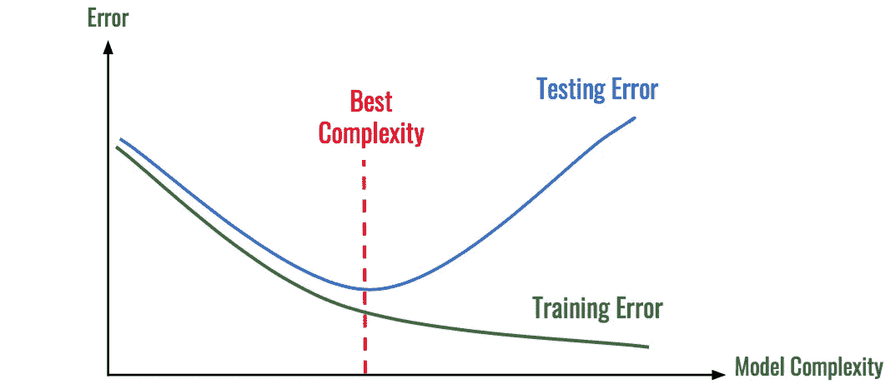

# CNN:计算机视觉的关键

> 原文：<https://medium.datadriveninvestor.com/cnns-the-key-to-computer-vision-29c6fe1c6fdc?source=collection_archive---------9----------------------->

> 无论是桔子、钢笔还是电话，我们人类都非常擅长识别和辨别物体。对我们来说，区分汽车和钢琴可能是微不足道的，但计算机却没有这么简单。

计算机无法自然地识别物理世界中的物体，将其分解，所有计算机能够从根本上理解的是**二进制 1 和 0**。然而，像已知宇宙中的大多数事物一样，它*并不那么简单*。

Computers are now able to accurately classify image content, as well as detect specific things like animals within them.

使用*机器学习*，或简称 ML，我们已经越来越能够教会我们的计算机如何做以前仅限于人类的任务，无论是玩视频游戏，创作艺术，甚至是**分类图像**。计算机识别和分类图像的行为通常被称为**计算机视觉**，随着卷积神经网络 [AlexNet](https://en.wikipedia.org/wiki/AlexNet) 的创建，该领域在 2012 年爆发。

 [## 修复摄影|数据驱动的投资者

### 汤姆·津伯洛夫在转向摄影之前曾在南加州大学学习音乐。作为一个…

www.datadriveninvestor.com](https://www.datadriveninvestor.com/2019/03/22/fixing-photography/) 

## CNN 到底是什么？

虽然这个名字并不简单，但是像 AlexNet 这样的**卷积神经网络(CNN)**在一些相当简单的前提下运行。首先也是最重要的是卷积的概念，它是两个函数的*组合，以创建第三个函数*。为了更好地理解这一点，让我们从一个 5 像素乘 5 像素的灰度(黑白)图像通过网络的例子开始。

我们可以将这个图像表示为一个二维数组**，其中每个值都在 0 到 1 之间，代表黑色或白色的强度。这将是卷积的第一个函数，称为输入。第二个是**过滤器，我们可以将其视为原始输入**的扫描仪。在 gif 的例子中，过滤器是对输入中的每个值进行扫描的 3×3 数组。**

**滤镜的九个值中的每一个都被*乘以图像上的相应值，并且其值被求和*。最终值记录在卷积层上，显示为红色值。关于过滤器需要注意的两个重要参数包括**步幅和内核大小**。在我们的例子中，步幅是 1，这意味着扫描器以它能达到的每一个像素值为中心。**内核大小是过滤器**的长度/宽度，在我们的例子中是 3。**

****

**这个新的 gif 显示了一个与输入大小相同的**特征图**(输入和过滤器的输出)。通常，这是我们在卷积层中想要的，并且是**填充**的结果，T3 是图像周围零值的边界。填充允许过滤器映射出边缘像素，确保数组的大小始终保持不变。**

## **要素和卷积图层**

**现在，让我们往回走一点，回到特征的想法，这是 CNN 如此特别的原因。**特征是图像的特定部分**；对于汽车来说，一个特征可能是它的轮子、窗户或排气管。在一个 CNN 中，我们可以*将多个卷积层叠起来，形成一个卷积层*，可以检测出图像中的多个特征，将它们相互区分开来。计算机可能会将它们检测为边或圆，并且随着过滤器/层数量的增加，它们的复杂性也会增加。**

****

**Feature maps of an image of a cat, being passed through multiple convolutional layers.**

## **联营**

**一个典型的 CNN 可以有许多卷积层，在普通计算机上运行它会被证明是计算要求很高的。为此，我们可以引入一个叫做**最大池**的东西。池允许我们减少卷积层的大小，使其更容易处理。池取每次扫描的最大值，并将其作为输出。系列中的下一层将合并输出作为其新输入。它们通常具有**步幅值，该步幅值对应于**与**尺寸缩减**的系数。步长为 2 将导致图像长度和宽度减半。**

**随着时间的推移，CNN 的目标是使**卷积层的深度大于其长度或宽度**；这是通过向每一层添加越来越多的过滤器，以及将它们合并来实现的。平均而言，这导致高精度的图像分类，并且是通常采用的好方法。**

****

**By pooling a convolutional layer, it makes the entire network train more quickly, and it can prevent something called **overfitting**, which is when a machine learning model fails to generalize on test data.**

## **完整 CNN 的布局**

****

**在将图像通过各层后，重要的是特征图中的所有值都是正的，因此 CNN 使用了一个 **ReLU 激活函数**，它将每个负数变成零，并保持其他一切不变。**

**最后，我们实际上必须**对图像**进行分类，并获取值来预测哪种类型的图像通过了层。数据集可以被训练来*区分几十个不同的图像*，但要做到这一点，我们必须摆脱卷积和池层的想法，转而使用**完全连接的线性层**。**

**完全连接的层不是使用二维数组，而是将数组“展平”成单个值链，并通过一个典型的神经网络，称为 [**多层感知器**](https://machinelearningmastery.com/neural-networks-crash-course/) 。这最终为图像的每个潜在分类产生一个值，例如猫或狗，并且它们可以被*转换成图像是每个的概率*。**

****

**Convolutional Neural Network Architecture, from input to output. (FC stands for Fully Connected)**

## **CNN 的应用**

**虽然我关注的是使用 CNN 解决图像分类问题，但是卷积神经网络可以用于各种各样的任务。**

1.  **与图像分类和对象检测相结合，细胞神经网络可用于改进 [**面部识别**](http://cs231n.stanford.edu/reports/2017/pdfs/222.pdf) 技术。**
2.  **[自然语言处理](https://arxiv.org/pdf/1703.03091.pdf)Siri 或 Google Translate 等应用需要能够处理和**理解语音模式**，CNN 可用于辅助解析、句子建模和预测。**
3.  **细胞神经网络用于[药物发现](https://www.frontiersin.org/articles/10.3389/frobt.2019.00108/full)，识别某些结构之间的模式，目的是合成具有**治愈疾病潜力的新化合物**。**

****

**By looking at specific features of a face, CNNs can classify and recognize different faces.**

## **CNN 当前的问题**

**虽然卷积神经网络在图像分类和特征识别/提取方面令人惊叹，但该方法目前面临一些挑战。**

****

**A model is overfitted if the training error reduces and the testing error increases.**

*   **有时，CNN 可能会对数据过度适应，这意味着它们会适应用来训练它的数据。这会导致测试数据的准确性降低，从而降低模型的有效性。**
*   **梯度可以根据之前分类的误差更新特征权重来改进模型，但是 [**爆炸梯度**](https://machinelearningmastery.com/exploding-gradients-in-neural-networks/) 会“腐蚀”权重，使模型难以改进。**
*   **有时我们没有足够的值给每个类，或者我们试图分类的对象。当一幅图像通过 CNN 时，如果没有足够的相似训练样本，就不太可能做出正确的预测。这就是所谓的**阶级失衡问题**。**

**尽管存在这些问题，CNN 仍然是一个优秀的工具，并且有许多计算机科学家致力于最小化上面列出的每个问题的影响。**

**随着机器学习领域的发展，我们可能会看到计算机视觉在图像分类方面变得超人，并且这一未来可能比看起来更近…**

**如果您对本文有任何疑问或修改，请随时通过电子邮件联系我。也非常感谢反馈！**

****电子邮箱:vedaant.varshney@gmail.com
LinkedIn:**[**veda ant Varshney**](https://www.linkedin.com/in/vedaant-varshney-80338518a/) **网址:**[**vedaantv.com**](https://vedaantv.com/)**