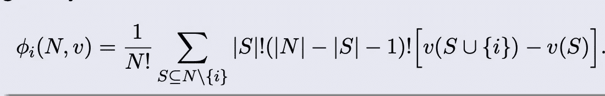
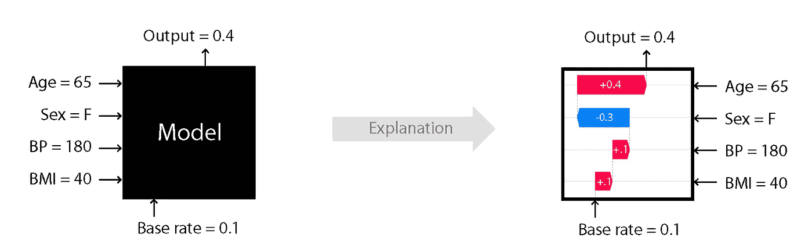

# 沙普利价值——或者为什么本尼在电视节目《幸存者》中是一个弱势选手？

> 原文：<https://medium.datadriveninvestor.com/coalitions-in-israeli-survivor-or-why-is-benny-a-weak-player-to-have-in-your-coalition-477e70d19e4e?source=collection_archive---------2----------------------->

## 通过电视节目“幸存者”了解沙普利价值、联盟和机器学习 SHAP 的重要性

在这篇文章中，你将了解联盟的博弈，尤其是沙普利值。沙普利价值是以劳埃德·沙普利的名字命名的，他因此获得了 2012 年诺贝尔经济学奖。Shapley 值很重要，不仅用于联盟，也用于任何合作博弈。此外，它可以用作 ML 模型的可解释性工具，指出特征的重要性。

为了理解 Shapley value，我们将使用**以色列幸存者** **贵宾**(简化)的例子来浏览一个有趣的例子。

Picture From Amazon.com

# **幸存者游戏作为联盟游戏**

对于那些不熟悉幸存者的人，规则如下。玩家的目标是成为*【最后的幸存者】*并留在游戏中。在每次迭代中，我们都有一个*“部落 Council״* 和一个*“豁免”*挑战。在每个*“部落 Council״* 中，得票最多的玩家将被踢出游戏。在*“部落 council״*,*“豁免”*挑战赛的获胜者不能被投票出局，而失败者将已经有一票反对他。

在我们的例子中，我们有五个幸存者(这不是剧透，我不知道会发生什么):

> {Yarden，Idan，Benny，Ella，Assi} = {Y，I，B，E，A}

假设雅登有豁免权，本尼输掉了挑战，有一票反对他。此外，简单来说，如果你有 3 票或更多反对你的票，就相当于有一个超过 3 票的联盟，你就退出游戏。每个继续下一次迭代的安全玩家的值为 1，不安全玩家的值为 0。

from רשת 13 Yarden

我们现在可以形式化这个问题:

V{I} = V{B} = V{E} = V{A} =0(联盟中只有玩家会出局)
V{Y} = 1(因为雅登有豁免权，所以即使在一人联盟中，她也会留在游戏中)

V{i，j} =2 对于每一个 I，j 除了 B(因为在这种情况下，该集团将投票 B and B 出局！V{i，B} =1(联盟将会失败，因此只有一个成员会幸存)

对于每个 I，j，k，V{i，j，k} =3(因为我们有多数票)

对于每个 I，j，k，l，m，V{i，j，k，l} =4(因为我们有多数票)

# **联盟定义**

1.  如果两个玩家总是向其他代理人的每个联盟贡献相同的金额，我们称他们为 *i* 和*j*可互换 。

> 对于所有既不含 I 也不含 j 的 S，v(S ∨{ I })= v(S ∨{ j })。

在我们的例子中，Benny 是不可互换的。因为如果 S = {I}，V{I，B}！= V{I，E}
除了雅登，不可互换。既然是 S = {}，V{Y}！= V{I}
其他球员:埃拉、艾丹、阿西可以互换。

*对称公理*声明可互换的代理人应该收到相同的报酬。

**2。虚拟玩家:****I I*s a***虚拟玩家*** 如果我对任何联盟贡献的金额正好是我一个人能够实现的金额。*

> *对于所有 s，使得 i ̸∈ S，v(s ∨{ I })—v(s)= v({ I })。*

*在我们的例子中，我们没有虚拟玩家。请注意，雅登是*而不是*虚拟玩家，尽管她有豁免权，但她可以帮助她的朋友，并使她的联盟价值更大。V{Y，I} — V{I} > V{Y}*

**虚拟玩家公理*声明虚拟玩家应该获得与他们自己完成的数量完全相等的报酬。*

***3。可加性公理:**可加性公理声明，如果我们将设置重新建模为一个单一的博弈，其中每个联盟 S 实现了 v1(S) + v2(S)的收益，那么每个联盟中的代理人的支付应该是他们在两个单独的博弈下为该联盟实现的支付的总和*

*在我们的例子中，幸存者是一个满足可加性公理的游戏。*

# ***沙普利值***

> **Shapley 理论:给定一个联盟博弈(N，v)，存在一个唯一的收益分割 x(v) = φ(N，v)分割大联盟的全部收益，并且满足对称、哑元玩家和可加性公理。**

*这个余数除法叫做***沙普利值。*** 沙普利值是这样计算的:*

**

*Shapley Value*

*Shapley 值捕捉玩家的边际贡献。*

*在我们的例子中:*

*雅登的沙普利值:1.33
本尼的沙普利值:0.66
其他球员(伊丹/埃拉/阿西)沙普利值:1*

**

*from רשת 13 Benny*

*由于亚登有豁免权，她的边际贡献更大，因为她不需要其他玩家留在游戏中。自从 Benny 输掉豁免赛后，他在联盟中就成了弱势玩家，他的边际贡献就更小了。不出所料，雅登这样的强势选手比本尼这样的弱势选手有更大的沙普利值。*

# *ML 模型可解释性的 Shapley 值*

*如果我们将每个特征视为一个参与者，将每个值视为子特征模型的性能，我们可以很容易地使用 Shapley 值来表示特征的重要性。这个想法很简单，特征将大的绝对 Shapley 值对于模型的预测很重要。请注意，在计算 Shapley 值时，有和没有特征(玩家)的两个子模型之间的差异将是我们总结的项，这正是我们在特征重要性中想要的。*

*实际上，检查所有排列的计算成本很高，这就是 SHAP(Shapley Additive explaints)开源库针对不同模型进行优化的地方。SHAP 是一个很好的解释工具，有很强的理论背景，但是它仍然被认为是一个很慢的框架。*

**

*SHAP — from [https://github.com/slundberg/shap](https://github.com/slundberg/shap)*

# *结论*

*Shapley 值有助于模拟大联盟的预期收益。该值指示玩家的边际贡献，并且可以用作解释机器学习模型特征重要性的工具。*

*让我知道你是否喜欢这篇文章，谁是你最喜欢的幸存者！一旦我们有了最终的三个，我们就可以讨论联盟中另一个有趣的主题，即 ***核心价值*** ，以了解谁应该赢得这场游戏。*

****“在这个游戏中，火代表你的生命，当你的火熄灭时，你也一样。”****

*诺阿。*