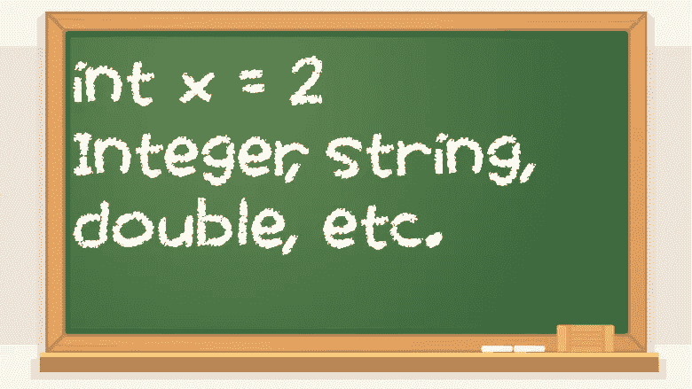

# 代码工厂-变量和数据类型

> 原文：<https://medium.datadriveninvestor.com/code-factory-variables-and-data-types-aa20cfccfe80?source=collection_archive---------26----------------------->



让我们想象一个工厂里的工人正在装配一件产品。为了组装，他需要螺丝。他拿了一些螺丝钉，把它们放在他旁边的一个盒子里。他在需要的时候拿走螺丝。他实际上是把螺丝存放在一个地方，在需要的时候使用。这就是变量的概念。

# 变量

在编程中，变量是我们可以存储值的地方。这里变量类似于盒子，值类似于螺丝钉。因此，使用变量，我们可以存储它们，并在以后需要时使用它们。

# 数据类型

即使工人可以在盒子里储存螺丝，他也不能在同一个盒子里储存其他材料，可能是像螺丝刀、电线、油、化学品或扳手这样的材料。他会有其他盒子来存放它们。变量也是如此。

为了存储不同类型的值，我们需要不同类型的变量，这就是变量的类型或数据类型。我们将需要一个变量来存储数字，另一个不同数据类型的变量来存储字母或字符。

# 整数

所以让我们创建一个变量来存储 C 中的一个数字:

```
int number; 
```

“int”是数据类型，“number”是变量。“int”表示整数。所以。这是一个存储整数的变量。使用上面的语句，我们创建了一个变量。我们称这个创建变量的过程为声明变量。现在，编译器在内存中为变量保留了一个空间。其他人将无法使用此空间。我们可以在这个空间的任何时候为变量 number 存储一个值。保留空间的大小取决于数据类型的容量。在这种情况下，保留空间将是存储整数所需的空间。**所以我们声明了一个整型变量 number。**

现在，在给变量命名时有一些特定的规则。你可以在这里找到他们:https://www.geeksforgeeks.org/variables-and-keywords-in-c/

存放螺钉的盒子与存放扳手的盒子不同。后者将具有更大的容量。您不能将扳手存放在螺丝盒中，但可以将螺丝存放在扳手盒中。同样，数据类型 int 也有容量。在 32 位编译器的情况下，它占用 2 位内存，在 64 位编译器的情况下，它占用 4 位内存。在 32 位和 64 位编译器中，可以存储在 int 中的值的范围分别是-32，768 到 32，767 和-2，147，483，648 到 2，147，483，647。你可以在这里获得 C 语言中不同数据类型的值的大小和范围的更多细节:[https://www . tutorialspoint . com/C programming/C _ data _ types . htm](https://www.tutorialspoint.com/cprogramming/c_data_types.htm)

如果我们需要存储更大的值，我们可以使用不同的数据类型，比如 long int，或者如果我们也需要十进制数，我们可以使用 float 和 doubles。我们可以根据自己的需要使用所有这些，并且声明它们都是相似的。以防你想声明一个浮点变量。就这么简单。

```
float number;
```

# 性格；角色；字母

现在，如果我们需要存储一个像“a”这样的字符呢？是的，我们将需要一个不同的数据类型，它被称为“字符”。在工厂场景中，如果工人需要储存易燃液体怎么办？为此，他将需要不同类型的存储。除非他计划制造某种小型爆炸，否则他不会把这些东西存放在加热箱或加热室里。类似地，我们可以在 char 中存储数值，但是当我们得到这些数字时，不会给出相同的数字。如果工人把汽油储存在一个加热的房间里会发生什么。当然，他可以把它储存起来，但是当他想得到它时，他却得不到汽油，汽油可能已经变成蒸气，也可能变成火。当我们在 char 中存储一个数字时，它会被转换成相应的 ASCII 码，这是一种用数字表示字符的代码。当您在 char 中存储数字“101”时，它将变成“e ”,因为 101 是“e”的 ASCII 值。我们不能在 int 中存储一个字符。

int 和 char 的主要区别在于，int 用于存储数字的值，而 char 用于存储字符本身。

```
int a;
int b;
```

假设我们在 a 中有 5 个，在 b 中有 6 个，当我们把它们相加，我们得到 11 个。

```
char a;
char b;
```

假设我们在 a 中有 5，在 b 中有 6，当我们把它们相加时，我们得不到 11。

在 int 的情况下，我们存储值 5 和 6，但在 char 中，我们存储字符“5”和“6”。

# 存储值

在编程中，我们说赋值是为了存储值。这更像是将值复制到变量中。那么如何给变量赋值呢？

```
int num; 
num = 6;
```

我们声明了一个变量，int 类型的 num。我们给 num 赋值 6。需要注意的是，赋值不是一个数学等式。“num=6”只是告诉编译器将 6 复制到 num。在方程的情况下，我们可以把它写成 num=6 或 6=num 两种形式。两者都表示它们相等。赋值就不是这样了。我们不能写 6=num。**赋值只能从右向左进行。**右侧的值将被赋给左侧的变量。

对于 char，它是:

```
char character;
character = 'a'; 
```

请注意，当我们分配数值时，我们按原样书写，比如 5 或 6。当我们给一个字符赋值时，我们应该把它写在引号之间，比如‘a’或‘b’或‘6’或‘7’。

我们也可以在声明的时候赋值。

```
int num = 6;
--------------------------------------------------------------------
int num;
num = 6;
```

以上两种方法都是正确的。

我们也可以连续赋值。

```
a = b = c = 10;
--------------------------------------------------------------------
a = 10;
b = 10;
c = 10;
```

这两个都是正确的

# 打印存储的值

我们已经知道了 printf() 是用来在屏幕上打印东西的。我们可以用它来打印我们的价值观。当打印变量中的值时，用法略有不同。我们需要使用格式说明符。格式说明符指定了我们打算使用 printf()打印的内容。

```
printf("%d", num);
```

在这里，我们告诉 printf()，我们必须打印 num 的值，打印它的格式是' %d '，这是一个 int 的格式说明符。给定格式说明符和变量的顺序应该相同，也就是说，应该先指定格式说明符，然后是逗号，最后是变量。

要打印字符，您可以编码:

```
printf("%c", character);
```

要了解更多格式说明符，点击这里:【https://www.tutorialspoint.com/format-specifiers-in-c[。](https://www.tutorialspoint.com/format-specifiers-in-c)

让我们写一个完整的程序来打印存储在变量中的值。

注意:程序中“//”后面的内容称为注释，用于在程序内部写注释。这两个斜杠后面的内容将不会被编译。

```
#include <stdio.h>   //we brought the stdio.h fileint main()    // This is where program execution starts
{
    int num;    // declare a variable
    num = 10;   // assign a value to the variable

    printf("%d", num);   //print the value onto the screen.return 0;
}
```

# 摘要

*   变量是内存中由编译器保留用来存储值的空间。
*   数据类型指定将存储在变量中的值的类型。
*   创建新变量的过程称为声明变量。
*   将值复制到变量的过程称为赋值。
*   分配只能从右向左进行。
*   在 char 中存储 int 时，C 编译器将 int 转换为相应的 ASCII 值。
*   格式说明符用于指示我们需要以什么格式打印变量值。

[Previous =>Code Factory—Hello World](https://medium.com/datadriveninvestor/codefactory-hello-world-f5ae4ed545d2)

[**Next = >代码工厂—算法**](https://shafisahal.medium.com/code-factory-algorithm-16502f8709b6)