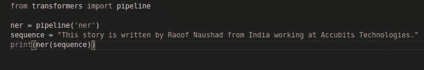
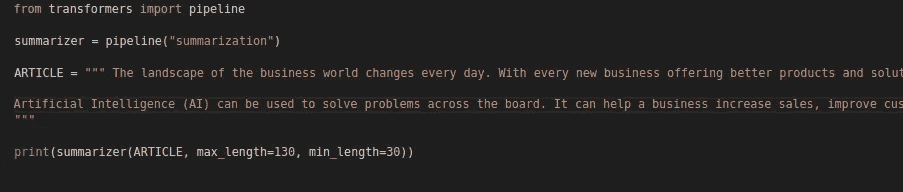
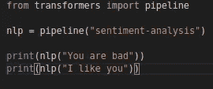
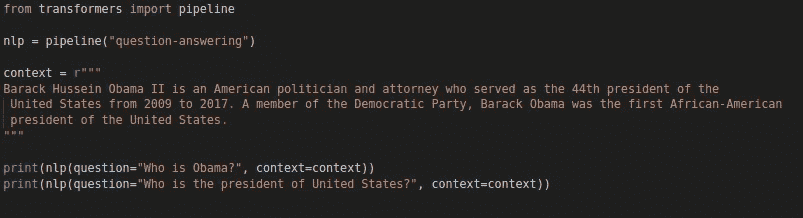
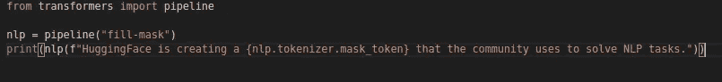
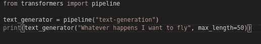

# 代码在几行自然语言处理-摘要，情感分析，质量保证，翻译和 NER 使用变压器。

> 原文：<https://medium.datadriveninvestor.com/code-in-few-lines-nlp-summarizer-sentiment-analysis-qa-translation-and-ner-using-transformers-2f13437d2605?source=collection_archive---------9----------------------->

在这个故事中，我们将讨论拥抱脸管道。这可以在许多情况下使用。你不需要输入代码或者理解代码背后的任何东西。拥抱面部管道是专用于几个任务的 API，如**命名实体识别、掩蔽语言建模、情感分析、特征提取和问题回答。**


[source](https://medium.com/tensorflow/using-tensorflow-2-for-state-of-the-art-natural-language-processing-102445cda54a)

正如文件中所述，管道分为两类。

1.  封装所有其他管道的最强大的对象
2.  特定于任务的管道

故事的过程描述了任务特定的管道，我们可以使用它来简化我们的工作。

有一个选项可以根据您的具体任务对进行**微调:**

> [信号源](https://huggingface.co/transformers/usage.html#sequence-classification)
> 
> 并非所有模型都在所有任务上得到了微调。如果您想要在一个特定的任务上微调一个模型，您可以利用 [examples](https://github.com/huggingface/transformers/tree/master/examples) 目录中的一个 run_$TASK.py 脚本。
> 
> 微调模型是在特定数据集上进行微调的。该数据集可能与您的用例及领域重叠，也可能不重叠。如前所述，您可以利用[示例](https://github.com/huggingface/transformers/tree/master/examples)脚本来微调您的模型，或者您可以创建自己的培训脚本。


[Thank you Hugging Face](https://tenor.com/search/hug-gifs)

因此，让我们看看我们将如何使事情工作。

首先你必须安装一些软件包:

你需要 Tensorflow 或者 Pytorch 来操作变形金刚。我会和 tensorflow 一起去。

```
pip install transformers
pip install tensorflow
```

我知道这需要时间，但我们安装了所需的软件包，所以让我们看看他们能为我们提供什么。

## 机器翻译

管道帮助我们将文本从一种语言翻译成另一种语言。让我们看看我们如何能做到这一点。

[](https://www.datadriveninvestor.com/2020/03/24/encoder-decoder-sequences-how-long-is-too-long/) [## 编码器解码器序列:多长是太长？数据驱动的投资者

### 在机器学习中，很多时候我们处理的输入是序列，输出也是序列。我们称这样的一个…

www.datadriveninvestor.com](https://www.datadriveninvestor.com/2020/03/24/encoder-decoder-sequences-how-long-is-too-long/) 

## NER 管道公司

命名实体识别管道将为您提供每个令牌的分类，如个人、组织、地点等。如果你是 NLP 从业者，你就知道这个任务有多重要。让我们看看如何实现这一点。



Generated by Author

输出:

`[{‘word’: ‘Rao’, ‘score’: 0.9993985891342163, ‘entity’: ‘I-PER’, ‘index’: 6}, {‘word’: ‘##of’, ‘score’: 0.9988340735435486, ‘entity’: ‘I-PER’, ‘index’: 7}, {‘word’: ‘Na’, ‘score’: 0.999722421169281, ‘entity’: ‘I-PER’, ‘index’: 8}, {‘word’: ‘##ush’, ‘score’: 0.8454579710960388, ‘entity’: ‘I-PER’, ‘index’: 9}, {‘word’: ‘##ad’, ‘score’: 0.9867969751358032, ‘entity’: ‘I-PER’, ‘index’: 10}, {‘word’: ‘India’, ‘score’: 0.9998118281364441, ‘entity’: ‘I-LOC’, ‘index’: 12}, {‘word’: ‘A’, ‘score’: 0.9994475245475769, ‘entity’: ‘I-ORG’, ‘index’: 15}, {‘word’: ‘##cc’, ‘score’: 0.9825183153152466, ‘entity’: ‘I-ORG’, ‘index’: 16}, {‘word’: ‘##ubi’, ‘score’: 0.9658650755882263, ‘entity’: ‘I-ORG’, ‘index’: 17}, {‘word’: ‘##ts’, ‘score’: 0.9948373436927795, ‘entity’: ‘I-ORG’, ‘index’: 18}, {‘word’: ‘Technologies’, ‘score’: 0.9976486563682556, ‘entity’: ‘I-ORG’, ‘index’: 19}]`

你一定在考虑如何散列代币。这就是伯特记号化的工作方式。如果你有兴趣的话，可以看看。

## 摘要

摘要是对文本进行总结的过程，只留下重要的内容并去除冗余。或者简单地使文本变短。



Generated by Author

输出:

`[{‘summary_text’: ‘Artificial Intelligence (AI) can be used to solve problems across the board. It can help a business increase sales, improve customer experience, automate work processes, provide predictive analysis etc. From conversational tools to driverless cars, AI is transforming industries.’}]`

## 情感分析

这是一个使用拥抱脸变压器管道使用情感分析的例子。



Generated by Author

输出:

`[{‘label’: ‘NEGATIVE’, ‘score’: 0.9998003244400024}] [{‘label’: ‘POSITIVE’, ‘score’: 0.9998695254325867}]`

## 问答

摘要问答是吸引我来这里的最有吸引力的管道之一。看看这个。



Generated by Author

输出:

`{‘score’: 0.4075762506042757, ‘start’: 28, ‘end’: 63, ‘answer’: ‘an American politician and attorney’} {‘score’: 0.8823080850088871, ‘start’: 1, ‘end’: 24, ‘answer’: ‘Barack Hussein Obama II’}`

## 语言建模(填充蒙版)

这是语言建模管道，您可以在其中创建一个将由管道生成的掩码。



Generated by Author

输出:

`[{‘sequence’: ‘<s> HuggingFace is creating a tool that the community uses to solve NLP tasks.</s>’, ‘score’: 0.15720787644386292, ‘token’: 3944}, {‘sequence’: ‘<s> HuggingFace is creating a framework that the community uses to solve NLP tasks.</s>’, ‘score’: 0.11565136909484863, ‘token’: 7208}, {‘sequence’: ‘<s> HuggingFace is creating a library that the community uses to solve NLP tasks.</s>’, ‘score’: 0.05949170142412186, ‘token’: 5560}, {‘sequence’: ‘<s> HuggingFace is creating a database that the community uses to solve NLP tasks.</s>’, ‘score’: 0.041478902101516724, ‘token’: 8503}, {‘sequence’: ‘<s> HuggingFace is creating a prototype that the community uses to solve NLP tasks.</s>’, ‘score’: 0.02582739293575287, ‘token’: 17715}]`

## 文本生成

生成文本是一项巨大的任务，在计算上是一个严重的问题。让我们看看管道是如何帮助我们的。



Generated by Author

输出:

`[{‘generated_text’: ‘Whatever happens I want to fly with one team, if the chance to win can come that easy I want to go out there and win and get a couple points, I want to be a winner and help to get that next year back in the building’}]`


[Source](https://www.google.com/search?q=like+a+boss+animmation&tbm=isch&ved=2ahUKEwiLp9G43PvpAhXNPCsKHZA4D8oQ2-cCegQIABAA#imgrc=B3TdB82XFCQCwM)

下面是 [**githublink**](https://github.com/raoofnaushad/huggingFace-NLP-pieplines) 供大家参考。其中还有一个**笔记本**。

你像老板一样完成了几乎每一个 NLP 任务。感谢拥抱的脸。

希望这对你有帮助。感谢阅读………。

参考资料:

1.  [https://hugging face . co/transformers/main _ classes/pipelines . html](https://huggingface.co/transformers/main_classes/pipelines.html)
2.  [https://hugging face . co/transformers/usage . html # named-entity-recognition](https://huggingface.co/transformers/usage.html#named-entity-recognition)
3.  [https://medium . com/analytics-vid hya/hugging-face-transformers-how-to-use-pipelines-10775 aa 3d B7 e](https://medium.com/analytics-vidhya/hugging-face-transformers-how-to-use-pipelines-10775aa3db7e)