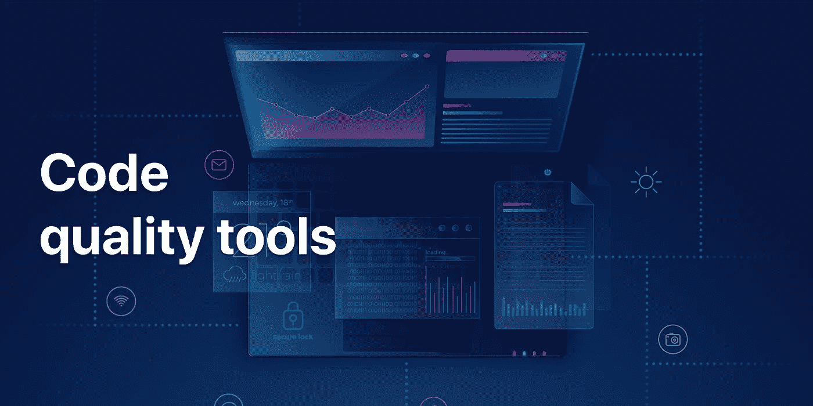
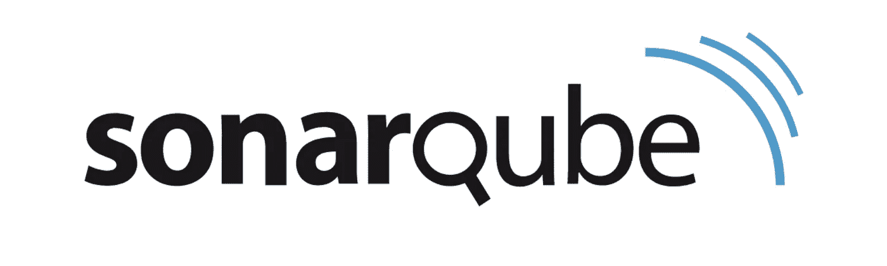
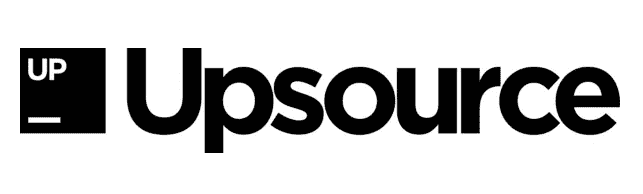

# 代码质量工具

> 原文：<https://medium.datadriveninvestor.com/code-quality-tools-504adc6711ea?source=collection_archive---------33----------------------->

# 代码质量工具

随着技术的进步，计算和开发行业正在急剧扩张。编程正在成为世界就业市场的主要股东。软件开发、web 开发和软件工程已经成为未来的领域。它们不仅保证了高端工作，还提供了巨大的发展空间。

代码质量一直是这些社区的一个主要问题。随着该行业的蓬勃发展，越来越多的人倾向于获得这些领域的学位。因此，导致大量低质量的程序员进入计算和开发领域。

为了迎合[代码质量](https://duecode.io/blog/code-quality/)问题，现在有几个在线工具可用。讨论市场上的一些最佳选择:

# 1.索纳库贝

[SonarQube](https://www.sonarqube.org/) 是一个在线代码审查工具，它可以确保你所有的编码模块都经过质量分析。它有一系列的特性，可以帮助你毫不费力地写出高质量的代码。

SonarQube 主要处理注释、错误、编码规则、重复和复杂性，确保您的代码始终保持最佳质量。它根据一组默认规则运行代码，改进新开发人员编写的代码，使其无错误且更高效。

# 2.上行资源

[Upsource](https://www.jetbrains.com/upsource/) 是另一个伟大的工具，你可以用它来检查你的[代码质量](https://duecode.io/blog/code-quality/)。这是“审查和项目分析”的绝佳选择它帮助您优化整体工作流程并跟踪您的进度。此外，它还可以发现系统中的设计缺陷，并轻松检测项目方面的问题。您还可以将 [Upsource](https://www.jetbrains.com/upsource/) 集成到您的环境中。

与市场上的一些替代产品相比，该平台的价格也相对低廉。它还提供免费试用，所以你在做出任何承诺之前对服务完全满意。还有大量的文档和演示可以帮助您解决可能遇到的任何问题。

# 3.严酷的考验

与上述平台类似， [Crucible](https://www.atlassian.com/software/crucible) 也包含了一系列特性，可以进行有效和高效的代码质量分析。它可以让你回顾代码，分享知识，讨论变化，并在 [Git](https://github.com/) 、CVS、 [Mercurial](https://www.mercurial-scm.org/) 、 [SVN](https://subversion.apache.org/) 和 [Perforce](https://www.perforce.com/) 中指出错误。你也可以将它与[吉拉](https://www.atlassian.com/software/jira)、[竹子](https://www.atlassian.com/software/bamboo)、[比特桶](https://bitbucket.org/product)以及其他数百种当今可用的开发工具集成在一起。

[Crucible](https://www.atlassian.com/software/crucible) 还允许协作评审，并提供一个直观的仪表盘，您可以从中跟踪团队的进度和评论。它还有一个时间跟踪功能，可以报告每个用户花了多少时间来审查代码——如果你是一个需要关注所有团队成员的团队领导，这是一个完美的工具！

# 4.Duecode.io

[Duecode.io](https://duecode.io/) 是一款出色的代码审查工具，可以作为所有编码项目的[分析仪表板](https://duecode.io/blog/code-quality-dashboard/)。它在像 [GitHub](https://github.com/) 这样的在线存储库上跟踪你的团队的进展和代码，并帮助你更好地理解你工作的整体动态。

它能够跟踪逐个用户的代码、票据活动、提交，以及团队成员对不同活动的反应。它汇总数据，让你深入了解你的团队及其工作，让你帮助他们做得更好。

Duecode.io 对于负责人来说特别方便，例如，企业主、技术领导、交付经理和软件开发人员。它有助于改善管理，并确保团队工作的效率和效果。

该平台还采用了一种称为[代码质量评级](https://duecode.io/code-quality)的新型评级系统，通过与超过 25 亿行代码的数据库进行比较来对代码进行评级。这有助于比较开发人员的编码技能，即使他们使用不同的编程语言。

# 5.造粒机

[Phabricator](https://www.phacility.com/phabricator/) 在一个平台上提供了多种高质量的功能。它允许您从一个地方审查、测试和讨论代码和项目。

它是为您的开发过程构建的完整工具。它包含可以帮助你完成任务和冲刺的应用程序。此外，它还允许您审查代码并托管 [SVN](https://subversion.apache.org/) 、 [Mercurial](https://www.mercurial-scm.org/) 或 [Git](https://github.com/) 库。

*   时间追踪工具一般
*   文件管理没那么好
*   不太灵活
*   可能不太符合预算

您还可以通过持续集成进行构建，在内部聊天渠道中进行对话，并审查设计，从而实现团队成员之间的有效协作。

Phabricator 也是可伸缩的、开源的，并且在代码审查方面非常高效。[仪表板](https://duecode.io/blog/code-quality-dashboard/)也非常直观，可以帮助您毫不费力地跟踪存储库中的一切。该界面用户友好，易于理解，因此您可以毫不费力地浏览该平台。

# 结论

代码质量评审工具可以帮助管理项目的整体进度，并帮助编写高效和有效的代码。选择最佳平台完全取决于您的需求和预算。总的来说， [Duecode.io](https://duecode.io/) 是一个常用的工具，有几个正面的评价，使它成为您的代码评审过程的最佳选择。

想了解更多关于代码质量的知识吗？看看[《完整代码质量指南》](https://duecode.io/blog/code-quality/)。

*原载于 2020 年 10 月 21 日*[*https://due code . io*](https://duecode.io/blog/code-quality-tools/)*。*

*[***编码、软件、移动开发***](https://app.ddichat.com/category/coding-software-mobile-development)***:****

* [## 专家-编码、软件和移动开发- DDIChat

### DDIChat 允许个人和企业直接与主题专家交流。它使咨询变得快速…

app.ddichat.com](https://app.ddichat.com/category/coding-software-mobile-development) 

***申请成为 DDIChat 专家*** [***此处***](https://app.ddichat.com/expertsignup) ***。****