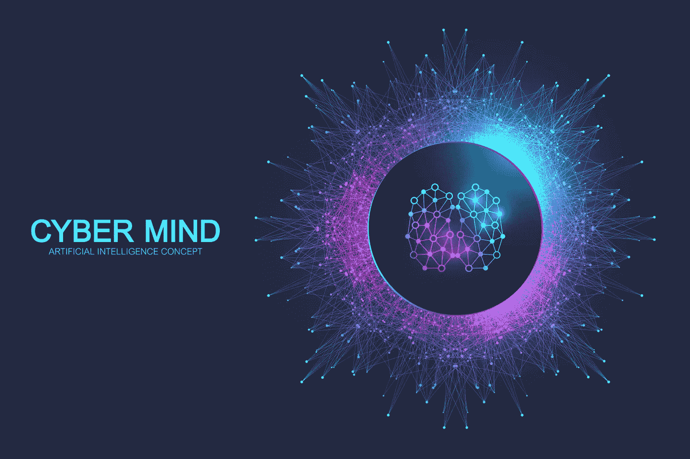
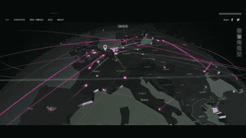
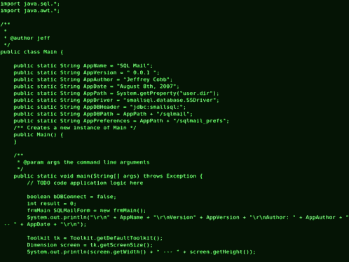

# 认知网络安全

> 原文：<https://medium.datadriveninvestor.com/cognitive-cyber-security-6cc19f2fc650?source=collection_archive---------16----------------------->

## 认知计算能够实时监控、分析模式、为大量警报提供上下文、采取行动和提出建议。公司使用机器学习来检测和识别受损帐户，并识别和响应可疑活动。

随着网络攻击的规模和复杂性增加，[人工智能](https://www.datadriveninvestor.com/glossary/artificial-intelligence/) ( [AI](https://www.datadriveninvestor.com/glossary/artificial-intelligence/) )帮助资源密集型安全行动和分析师保持领先于威胁。[人工智能](https://www.datadriveninvestor.com/glossary/artificial-intelligence/)正在通过分析大量风险数据来改变游戏规则，以加快响应时间并扩大资金不足的安全行动的能力。人工智能不仅有可能为组织的运营增加价值，也有可能为与监控、检测和应对威胁相关的人类功能增加价值。

认知计算能够实时监控、分析模式、为大量警报提供上下文、采取行动和提出建议。公司使用[机器学习](https://www.datadriveninvestor.com/glossary/machine-learning/)来检测和识别受损账户，并识别和应对可疑活动。

首先，更加高效和有效的自动化数据处理可以显著提高当前安全分析解决方案的效率，并提供额外的外部威胁信息。其次，认知安全可以为分析师提供强大的决策支持工具，简化和加快他们的工作，从而减少困扰当今安全行业的技能差距。第三，同样的认知技术可以应用于公司自己的数字资产，以确保更好的分析和信息保护。

 [## 为什么加密对日常生活至关重要？数据驱动的投资者

### 你几乎每天都要输入密码，这是你生活中最基本的加密方式。然而问题是…

www.datadriveninvestor.com](https://www.datadriveninvestor.com/2020/02/10/why-encryption-is-critical-to-everyday-life/) 

PatternEx 是一种人工智能网络安全工具，可以实时检测恶意行为模式。PatternEx 动态接受安全分析师的反馈，以创建预测模型，不断适应检测新的和现有的威胁。使用这种反馈模式，nEx 被持续训练以提高检测精度。就像一名新员工一样，该公司的虚拟分析师平台承担着研究公司网络安全协议的任务，以做出准确的评估。Aces 培训新一代系统，以了解不断演变的安全威胁并从中学习。

Vectra 的高级人工智能技术 Cognito 可以自动执行通常由安全分析师执行的任务，并显著减少进行威胁调查所需的工作量。Cognito AI 网络检测和响应平台捕获网络元数据，用机器学习衍生的安全智能丰富它，并将其应用于检测和响应用例。

通过 Watson，IBM 研究人员希望让安全分析师的生活变得更轻松。Watson 可以在在线安全公告中找到新出现的恶意软件形式的数据，开发新的补救策略，并建立连接以更好地阻止威胁。沃森网络安全(Watson Cyber Security)将是首批通过使用推理从人类生成的非结构化数据中学习来实现大规模检测安全数据的技术之一，而传统安全工具此前无法访问这些数据。

这是通过将 Watson 与 IBM 的新认知 SOC 平台集成来实现的，该平台使先进的认知技术更接近安全运营，并使您能够应对端点、网络、用户和云中的威胁。据 IBM 称，沃森超级计算机将满足所有网络安全需求，并为安全分析师和安全专家提供一系列新功能。Watson 平台的一个亮点将是 IBM QRadar Advisor，这是第一个利用 Watson 的网络安全见解的工具。

从技术上讲，沃森接受了网络安全语言的培训，旨在为认知安全运营中心(SOC)提供支持。因此，IBM 的沃森将成为第一台结合人工智能和复杂分析软件来阻止网络威胁的超级计算机。当然，它永远不会取代人类安全分析师，但这不是它的目标。

Versive 安全引擎(VSE)使用人工智能将关键风险从日常网络活动中分离出来，识别导致攻击的活动链，并帮助安全团队防止攻击。VSE 帮助公司和组织识别关键威胁，并帮助团队节省时间，否则可能会花费在调查不需要立即关注的警报上。

LogRhythm 的人工智能引擎为公司或组织提供了一个快速识别和应对网络安全威胁的平台。AI Engine 使组织能够预测、检测并快速响应入侵、内部威胁、欺诈、用户、网络和终端的行为异常、合规违规、IT 服务中断。

很明显，无论哪个行业，技术进步都需要更高水平的安全性和网络弹性。虽然恶意行为者可能想利用技术对自己造成损害，但该领域的专家正在努力用旨在做好事的技术压倒对手。这解放了安全专家，使他们能够更有效和高效地使用技术，更不用说更高效和有效地应对网络攻击和威胁了。

随着大量数据的不断堆积，及时获得正确的信息会给你的业务带来巨大的变化，而遗忘会导致严重的问题。

简而言之，认知计算可以定义为机器学习和人工智能使机器能够学习和理解数据，然后可以用来获得有意义的见解，以帮助企业和使系统更加智能。超过一半的数字消费者使用它们，即使他们并不完全了解这项技术。国际数据公司(IDC)发表的一项研究显示，到 2020 年，全球认知系统和人工智能的收入将超过 470 亿美元。

## 引用的来源

*   [https://aceits.net/cognitive-security-is-here/](https://aceits.net/cognitive-security-is-here/)
*   [https://www . risandresiliencehub . com/cyber-resilience-in-the-cognitive-age/](https://www.riskandresiliencehub.com/cyber-resilience-in-the-cognitive-age/)
*   [https://www . kuppingercole . com/blog/balaganski/cognitive-security-the-future-of-the-network security-is-now](https://www.kuppingercole.com/blog/balaganski/cognitive-security-the-future-of-cybersecurity-is-now)
*   [https://www.eteam.io/blog/design-thinking-win](https://www.eteam.io/blog/design-thinking-win)
*   [https://builtin . com/人工智能/人工智能-网络安全](https://builtin.com/artificial-intelligence/artificial-intelligence-cybersecurity)
*   [https://www . mindfireit . com/cyber-security/cognitive-security-ai-driven-cyber-security/](https://www.mindfireit.com/cyber-security/cognitive-security-ai-driven-cyber-security/)
*   [https://www . cyber security-insiders . com/IBM-Watson-super computer-to-be-use-for-cyber-security/](https://www.cybersecurity-insiders.com/ibm-watson-supercomputer-to-be-used-for-cyber-security/)

*原载于 2020 年 6 月 30 日*[*【https://www.datadriveninvestor.com】*](https://www.datadriveninvestor.com/2020/06/30/cognitive-cyber-security/)*。*

**访问专家视图—** [**订阅 DDI 英特尔**](https://datadriveninvestor.com/ddi-intel)