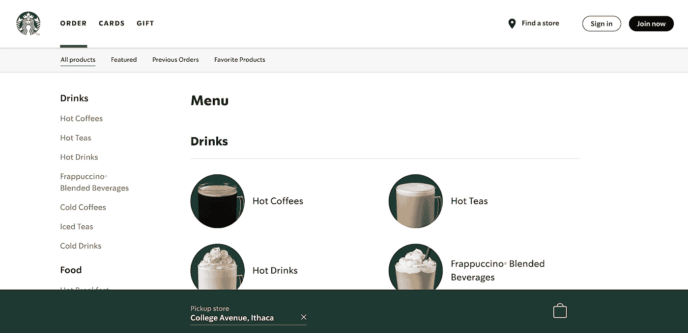
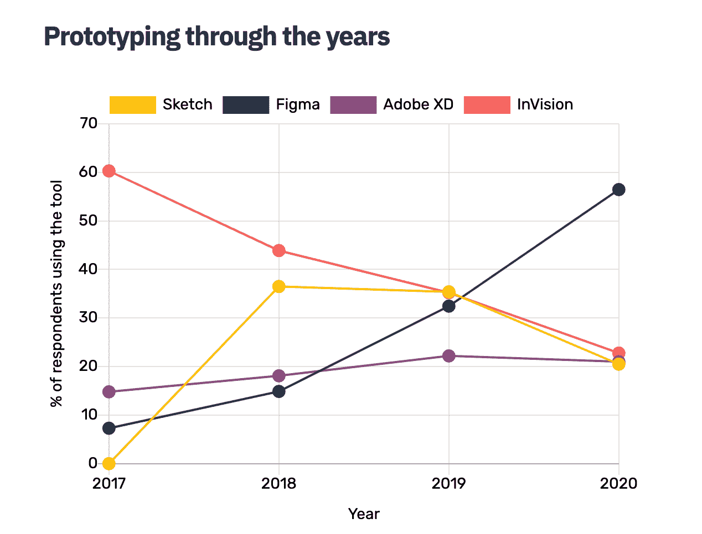
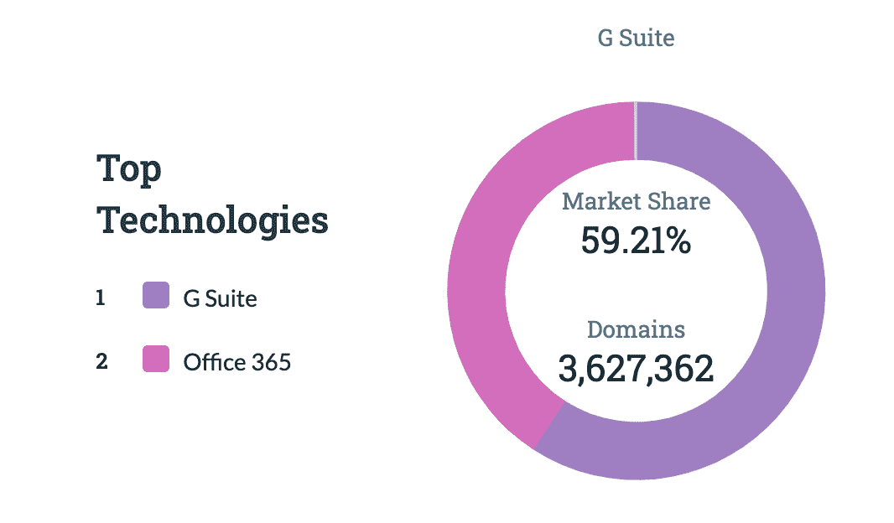

# 协作网络应用正在吞噬世界

> 原文：<https://medium.datadriveninvestor.com/collaborative-web-apps-are-eating-the-world-1bbe747f1459?source=collection_archive---------21----------------------->

## 无摩擦的协作、统一的平台体验和零重量应用正在成为现代软件的标准

Photo by [Sigmund](https://unsplash.com/@sigmund?utm_source=medium&utm_medium=referral) on [Unsplash](https://unsplash.com?utm_source=medium&utm_medium=referral)

# 什么是 Web 应用？

老实说，网络应用的定义有点模糊，这取决于你问的是谁，但一般来说，它们都是复杂的网站，功能类似于你桌面上的任何本地软件。Gmail、脸书甚至星巴克网站都是网络应用的常见例子。可能有许多 web 应用程序的子集，如渐进式 web 应用程序，它们通过添加离线功能和硬件访问来进一步推动 web 应用程序的功能。

The [Starbucks website](https://app.starbucks.com/) offers functionalities like customizing and ordering drinks, tracking points, and finding local stores, embodying the epitome of a useful web app.

为什么网络应用正在吞噬世界？人们发现 web 应用程序比传统软件提供了一些独特的优势，包括协作、可移植性和可维护性。许多趋势使得网络应用比以往任何时候都更受欢迎。云存储和计算正在不断改进，工作变得越来越[数字化、移动化和协作化](https://www.mckinsey.com/featured-insights/future-of-work/whats-next-for-remote-work-an-analysis-of-2000-tasks-800-jobs-and-nine-countries)。

# 为什么 Web 应用程序很棒？

以下是 web 应用相对于本地应用的一些主要优势:

*   **协作:**这是每个人都经历过的明显优势。Web 原生应用更容易围绕协作来构建，而新冠肺炎加速了这种应用的采用。像 Google Suite、Figma 和 Miro 这样的工具，由于其基于网络和协作的特性，在很大程度上得到了采用。
*   **可移植性:**网络应用不受操作系统或机器的限制，只要你有登录信息，它们就可以被任何人访问。想象一下，你在旅途中忘记了你的笔记本电脑，但突然需要做一些工作，你可以使用朋友的机器，而不用担心下载的数量或搞乱朋友的电脑。另一个个人例子是，我以前考虑过使用 PowerBI 作为仪表板，结果发现他们不提供 Mac 版本，考虑到 Windows 用户有免费版本，这很令人失望(是的，PowerBI 在线，但功能非常有限)。
*   **自动保存:**网络应用程序会自动保存你的工作，所以你不必担心不断保存(我敢肯定，我们都有过电脑在关键期限前崩溃的恐怖故事)。可移植性也是这里的关键；文件访问在所有平台上都是通用的(即桌面到移动设备、windows 到 macOS)，不像本地应用程序那样，默认情况下大多数文件存储在本地。因此，您可以随时随地获得最新版本的作品。
*   **轻量级/零重量级:**网络应用不会占用你电脑上的任何空间，最棒的是它们还会自动更新，所以你不会一直收到烦人的版本问题或通知。网络应用的“文件结构”仅限于你最喜欢的浏览器上的几个书签文件夹。共享工作也只是复制一个链接，而不是发送几兆的大文件。

让我们来看看三个非常成功的 web 应用程序产品的简短案例研究，看看它们是如何与更多的本地系统原生竞争对手相抗衡的。

# 个案研究

**图玛:**

Figma 是 2016 年推出的 UX 原型工具，当时与 Adobe XD、InVision 和 Sketch 等竞争对手一起进入了激烈的市场。其中，Figma 是唯一一家通过网络应用交付产品的公司。许多 UX 设计师最初嘲笑 Figma 宣传的“多人”优势，认为这款应用只会扰乱工作流程，增加复杂性。他们还认为，网络应用不如传统软件功能丰富、可靠。

然而，时间讲述了一个不同的故事。随着时间的推移，Figma 显著增加了市场份额，而其他工具通常保持不变或有所下降。协作、自动保存、链接共享和零本地存储等功能被证明是对现代 UX 工作流程的巨大增强，由于 2020 年远程工作的必要性，这一点再次变得尤为真实。

Figma climbs the ranks of market share in the most recent [UXTools survey](https://uxtools.co/survey-2020/). 2020 was a breakout year due to COVID necessities, but the underlying trend already existed.

**谷歌工作区:**

Google Workspace(以前称为 GSuite)是一个大型的生产力工具集合，现在包括 Gmail、Google Calendar、Google Docs suite 等等。它最初于 2006 年开始，在经历多次更名之前，名为 Google Apps for Your Domain。虽然所有这些应用程序都非常成功，但我们将重点放在谷歌文档套件上，主要是因为它与本地系统微软 Office 套件的最初对比。

谷歌文档套件(包括文档、表格和幻灯片)最初是一个轻量级的 web 应用程序，与微软 Office 相对应。学生成为该产品的早期采用者，该产品非常受欢迎，因为它具有团队项目的协作性质和自动保存功能，可以缓解对经常发生的文件崩溃的担忧。当时，微软 office 仍然是一个许可产品，你每隔几年就要更新一次，许多人讨厌支付昂贵的许可费，而是选择谷歌的免费服务，其中包括创建基本 Office 文件所需的所有功能。2010 年，微软最终发布了 Office 365，这是其基于云的 Office 版本，旨在与谷歌日益流行的产品竞争。如今，这两大巨头都有自己办公产品的网络应用版本，但谷歌在这个曾经基本上由微软垄断的领域的市场份额惊人地攀升。

G Suite and Office 365 now share a duopoly in the office productivity space, according to [Datanyze](https://www.datanyze.com/market-share/office-suites--370).

**看客:**

Looker 成立于 2012 年，是一款商业智能工具，可以更容易地从亚马逊 Redshift 和谷歌 BigQuery 等云原生数据库产品中获取和分析数据。它于 2019 年被谷歌云平台收购，以增强 GCP 的下游数据分析能力。像 Figma 和 Google Workplace 一样，Looker 也是基于网络的，可以非常容易地集成到 GCP 基于浏览器的其他体验中，并提供统一的平台体验，相比之下，Tableau 有多个程序来处理分析过程的不同部分(即 Tableau Prep、Tableau Desktop、Tableau Online)。

这些网络应用的优势无疑促成了收购前 Looker[70%的收入年增长率](https://techcrunch.com/2019/06/06/google-to-acquire-analytics-startup-looker-for-2-6-billion/)，远远超过了更广泛的细分市场的增长。这种惊人的增长可能只在 COVID 期间有所增加，因为协作在 web 应用程序产品上更加简单和轻量级。

# 不足之处

当然，没有什么好事是没有代价的。Web 应用仍然有一些关键的缺点，组织或个人在采用之前需要考虑。

*   安全:有些人可能(理所当然地)担心将他们所有的数据托付给第三方，尤其是在数据每隔一周就会泄露的时代。监管严格的公司通常会不断审查软件的新版本，也会对将工作负载转移到 100%基于网络的产品上感到紧张。
*   **始终在线:**顾名思义，网络应用程序需要连接到网络才能正常运行。当然，大多数 web 应用程序都创建了离线功能来缓解这种担忧，尽管并非所有功能都是可访问的。
*   **速度:**网络应用通常是资源密集型的，有时会很慢，因为必须同时支持浏览器和应用的运行。然而，随着渐进式网络应用程序(pwa)和网络组装等技术的出现，网络应用程序能够以接近本地速度的速度运行[并且还可以访问传感器等硬件项目，这些项目在以前对网络应用程序来说是一个挑战。](https://web.dev/what-are-pwas/)

我确实相信网络应用公司敏锐地意识到了这些缺点，并且已经取得了长足的进步来缩小与本地应用在这些问题上的差距。随着未来几年网络应用的采用继续加速，我们可能会看到更多的进展。

# 结论

顺畅的协作、统一的平台体验和混合的工作环境将持续存在。像 progressive web apps 这样复杂的 web 实现正在推动未来流行软件产品的更多基于 web 的替代品(例如，基于 web 的协作 Photoshop？).我预计这一趋势将持续到 2021 年及以后，我很高兴看到会出现什么新产品。目前看来，协作式网络应用程序将继续统治世界。