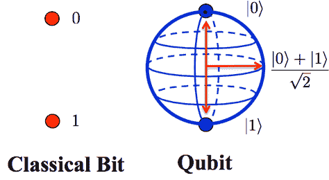
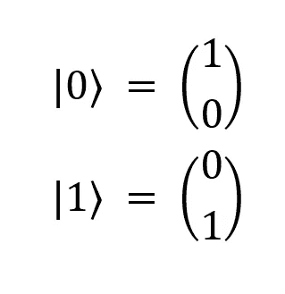
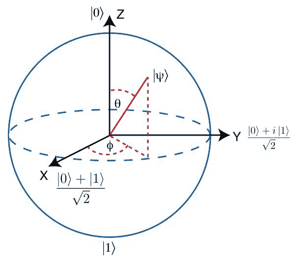
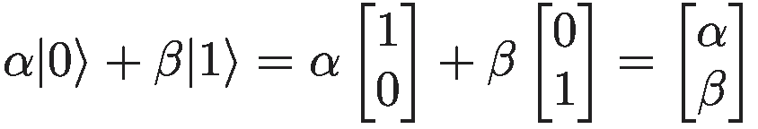
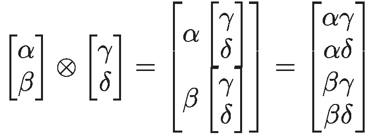

# 瓦解叠加态:量子计算的数学

> 原文：<https://medium.datadriveninvestor.com/collapsing-the-superposition-the-mathematics-of-quantum-computing-6c4679c6cf99?source=collection_archive---------2----------------------->

## 深入了解推动计算量飞跃的数学

量子计算是最令人兴奋的新兴技术之一，特别是谷歌的 Sycamore 量子处理器在 2019 年 10 月展示了[优势](http://ai.googleblog.com/2019/10/quantum-supremacy-using-programmable.html)。量子计算标志着计算模式的转变，有可能彻底改变数字安全并推动科学突破。但是，量子计算到底是什么？

让我们从经典计算开始。经典计算的核心是*计算机逻辑*的概念。计算机逻辑由*信息*和*信息处理*组成。信息只是由 1 和 0 组成的字符串。传统的计算机将一切——从文本到图像——表示为一串**位(二进制数字)**。你的电脑处理的都是 1 和 0。为什么？嗯，这些布尔值可以用晶体管的状态来表示，晶体管是集成电路的构建模块。在计算机中，这些位通常表示为电压:0V 表示 0；5V 表示 1。因此，有电流的导线表示位状态 1，没有电流的导线表示位状态 0。

信息处理可以分解成**布尔逻辑门**。有 7 个主要的门(非、与、或、与非、或非、异或、XNOR)，接受 1 或 2 位作为输入，并输出一位。每个门对这些位执行一个独特的操作，然后决定输出。当这些门被链接在一起时，你得到的电路实现了今天现代计算机的功能。

这些门由晶体管组成，而晶体管又由半导体(如硅)制成。有了晶体管，你就能储存和处理任何种类的信息。晶体管可以被认为是一个开关:如果它是“开”的，电流通过导线流动；如果是“关”，就没有电。现代的中央处理器有数十亿个晶体管，晶体管的数量大约每年翻一番(这就是众所周知的摩尔定律)。

Here’s a great video from Intel, showing the process of creating microchips

尽管在计算和信息处理方面发生了巨大的变革，但是仍然有一些问题是最快的超级计算机也无法解决的。这就是量子计算机的必要性所在。

量子计算不像经典计算那样是二进制的。正如我们所见，经典计算机操作和处理用电压表示的比特；在量子计算中，我们使用**量子比特(量子比特)**，用电子表示。量子计算使用量子力学的原理来处理和操纵信息，即**叠加**和**纠缠，**允许一些令人难以置信的能力。

我们将从量子计算而不是量子力学的角度来看待这些性质。量子力学背后的理论很复杂，理解它们在量子计算中的应用要容易得多。

 [## 瓦解叠加:量子计算的数学|数据驱动的投资者

### 量子计算不像经典计算那样是二进制的。正如我们所见，经典计算机…

www.datadriveninvestor.com](https://www.datadriveninvestor.com/2020/10/21/collapsing-the-superposition-the-mathematics-of-quantum-computing/) 

我们认为比特是 1 和 0。实际上，比特可以是任何有两种状态的东西:真/假；开/关；正面/反面。经典计算机只是将这些位量化为整数，因为这是计算机能够存储和处理的全部内容。然而，量子位是一种完全不同的动物:它们是载体。这是因为一个量子位真正代表了其位状态为 0 或 1 的*概率*；不是只有*为 0 或 1，而是它们可以以 0 和 1 之间的任何值存在，直到它们被测量(我们稍后会谈到这一点)。*

在量子力学中，我们使用**狄拉克符号**来表示向量，这使得量子计算更加清晰和简洁。 **|ψ⟩** 表示单位列向量 **⟨ψ|** 表示对应的行向量。⟨ψ| 是|ψ⟩的**埃尔米特转置**，是对|ψ⟩进行转置，取每一项的复共轭，表示为**ψ**。我们将传统的比特 0 和 1 表示为列向量|0⟩和|1⟩:

Notice how the 1 is in the 0th position for |0⟩ and in the 1st position for |1⟩

为什么量子位是矢量？在量子力学中，电子的性质，更准确地说是它的自旋，在我们实际测量它的状态之前是未知的。同样，在量子计算中，一个量子位的状态以所有可能状态的**叠加**形式存在，它的赋值概率为 0 或 1；在量子位被测量之前(见下文)，它既是 0 *又是* 1，但有一定的可能性坍缩为 0 对 1。处于叠加态的量子位是存在于 0 和 1 之间的无限状态的线性组合。这可以在*布洛赫球*上可视化。

The Bloch sphere enables us to visualize the qubit, which is a 2-dimensional complex vector as a 3-dimensional real-valued vector.

因此，当我们对一个量子位执行特定操作时，我们可以迫使它进入叠加态，在那里它不再是只有*的* 0 或只有*的*1；而是作为两者的某种概率而存在。这些操作可以被认为是在三维实向量空间中围绕布洛赫球旋转单位向量。向量空间就是向量所在的空间。一个简单的二维向量位于向量空间ℝ中。

当一个量子位被实际测量时，它的*总是为 0 或 1* 。测量量子位的行为导致量子叠加态**崩溃**，量子位的状态现在类似于经典位。非正式地说，我们可以认为测量一个量子位就是“观察”它。一旦量子位的叠加态被瓦解，它将无限期地保持在那个状态。它坍缩到的值取决于它的结构，这就是所谓的量子干涉。一个量子位可以通过一个*量子门*恢复到叠加态，量子门对一个或多个量子位进行操作。

更一般地，一个量子位的状态可以表示为|ψ⟩ = α|0⟩ + β|1⟩，其中α和β是复数(形式为 *a + bi* 的数)，表示量子位坍缩为 0 或 1 的相应概率。这些系数满足等式|α| +|β| = 1，因为系统中所有概率的总和必须为 1。因此，如果量子位有 50%的几率坍缩为 0，有 50%的几率坍缩为 1，则α =1/√2，β=1/√2。

正如在布洛赫球中看到的，|0⟩和|1⟩形成了描述量子位状态的向量空间的基本向量。因此，α和β可以被视为应用于复向量空间中的向量的旋转。我们通常将α和β排列在一个列向量中，称为**量子态向量**，如下所示:

一个量子位没有太多实际用途，现代计算器征服了它。量子计算的真正威力在于使用和操纵许多量子位。单个量子态的多个量子位被表示为张量积。如果我们让α|0⟩ + β|1⟩和γ|0⟩ + δ|1⟩是两个量子比特的状态，那么我们可以把它们系统的状态表示如下:

这个列向量的每一个元素所代表的，是量子系统坍缩到 0，1，2，或 3 值的概率。一般来说，如果我们有 n 个量子比特，我们可以代表 2ⁿ-1 态。虽然我们总是可以得到两个单量子位态的张量积，但并不是所有的双量子位态都可以表示为张量积。其实这样的系统据说是**纠缠**。

也许量子计算中一个更有趣的现象是纠缠。当两个量子比特纠缠时，一个量子比特的量子状态不能独立于另一个量子比特的状态来描述。在一个量子位上执行的任何操作也适用于另一个量子位。在现实中，纠缠的量子粒子即使相距光年也保持这种性质，爱因斯坦称之为“幽灵般的超距作用”。

当一个纠缠的量子比特被测量时，另一个量子比特的叠加态也立即坍缩。因此，测量一个量子位元的状态，可以立即提供纠缠量子位元的状态资讯，让这个特性变得非常有用。

所有这些属性和现象都很吸引人，但是它们能用来做什么呢？是什么让量子计算机如此具有革命性？有些特定的问题只有量子计算机才能解决。最相关的，也可以说是最值得注意的是，它们打破了现代密码学。1994 年，Peter Shor 展示了量子计算机可以破解全球使用的加密算法，如 RSA。RSA 是我们数字世界的基础，是 web 浏览器、messenger 应用程序、电子邮件、VPN 等不可或缺的一部分。

此外，量子计算机可以用于量子模拟，使我们能够可视化和再现分子和原子之间的量子相互作用。这在量子化学和微生物学领域产生了巨大的影响。它们可以提高机器学习问题的速度和性能，并可以快速计算经典计算机无法计算的优化算法。

对于大多数用户来说，当你浏览网页、给朋友发短信或看《网飞》时，使用量子芯片不会有明显的不同。但是在幕后，量子计算将开创一个新的计算时代。

量子计算正在为计算的未来开辟道路，有可能彻底改变从医疗保健到金融的一切。你可以成为这场革命的一部分。

## 获得专家视图— [订阅 DDI 英特尔](https://datadriveninvestor.com/ddi-intel)