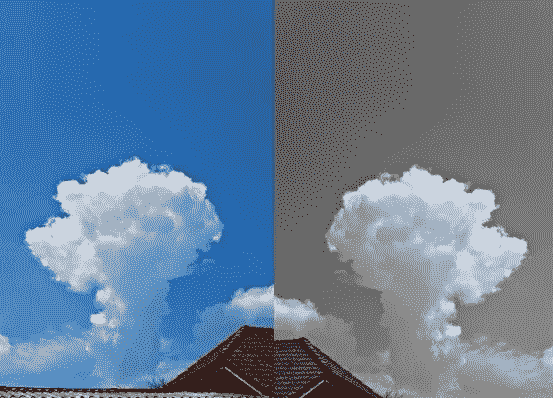
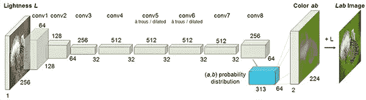
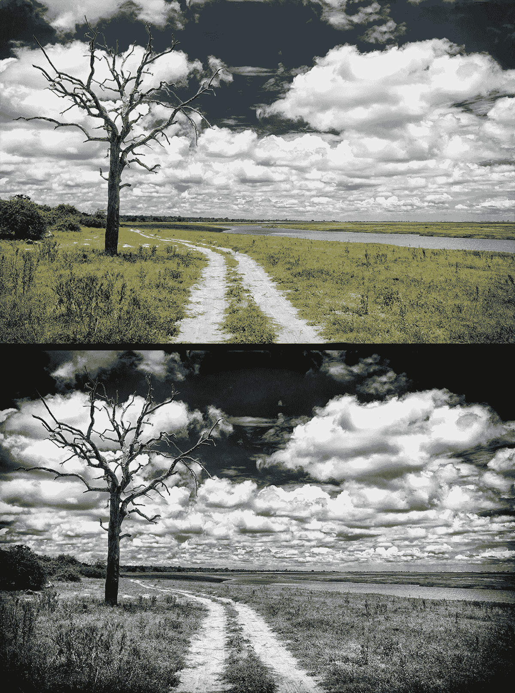
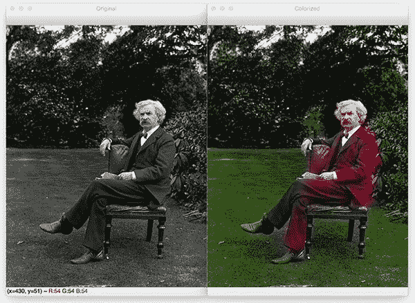
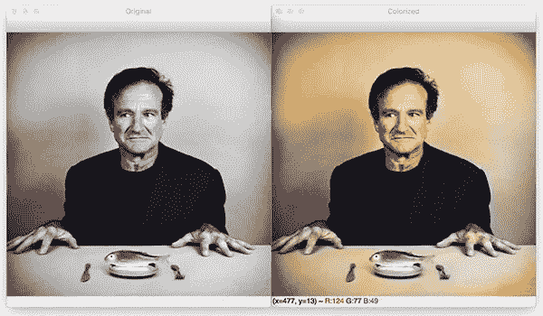

# 使用深度学习给黑白图像着色

> 原文：<https://medium.datadriveninvestor.com/coloring-black-white-images-using-deep-learning-984e6f4ddf14?source=collection_archive---------1----------------------->



你好，朋友们，

几天前，在寒假期间，我去了我祖父母家，在那里我看到了我母亲童年时的黑白照片，我突然有了一个想法，想知道我们如何将这张照片着色。于是，我开始在研究论文中搜索这个主题和相关的作品。

[](https://www.datadriveninvestor.com/2019/03/22/fixing-photography/) [## 修复摄影|数据驱动的投资者

### 汤姆·津伯洛夫在转向摄影之前曾在南加州大学学习音乐。作为一个…

www.datadriveninvestor.com](https://www.datadriveninvestor.com/2019/03/22/fixing-photography/) 

经过几个小时的搜索，我终于找到了给这些图像着色的方法，我立即开始了这个项目的工作，经过令人筋疲力尽的 6 个小时，我终于得到了一个工作模型，尽管结果不如我想象的那么完美。尽管如此，我还是想写一篇关于我的项目的博客。让我们看看如何给黑白图像上色:

# 概观

图像彩色化是获取**输入灰度(黑白)图像**然后生成**输出彩色图像**的过程，该图像表示输入的语义颜色和色调(例如，晴朗的晴天的海洋必须是貌似“蓝色”的——它不能被模型着色为“粉红”)。

以前的图像彩色化方法要么:

1.  依赖于重要的人类互动和注释
2.  产生的去饱和彩色化

相反，我们今天将在这里使用的新方法依赖于深度学习。我们将利用卷积神经网络能够彩色化黑白图像，其结果甚至可以“愚弄”人类！

# 我们开始吧



Model Proposed By Zhang et al

我们今天要介绍的技术来自张等人 2016 年的论文，*彩色图像着色* 。

以前的黑白图像彩色化方法依赖于*手动人工注释*，并且经常产生不像真实彩色化那样“可信”的去饱和结果。

张等人决定通过使用卷积神经网络来解决图像彩色化的问题，以“幻觉”输入灰度图像在彩色化时的样子。

现在，当我们得到强度作为输入，我们必须猜测颜色，我们不能使用 RGB 颜色空间，因为它没有关于照明的信息。因此，我们有两个选择:要么使用 YCbCr 色彩空间，要么使用 LAB 色彩空间，因为 Y 和 L 通道都编码关于照明的信息。

在本教程中，我们将使用 LAB 色彩空间，但你也可以尝试使用 YCbCr 空间。

类似于 RGB 颜色空间，Lab 颜色空间具有三个通道*。但是*与*RGB 颜色空间不同，Lab 对颜色信息的编码不同:*

*   ****L* 通道**仅对亮度进行编码*
*   ****a* 通道**编码绿-红。*
*   *并且 ***b* 通道**编码蓝黄色*

*更多信息可以参考[这篇维基百科文章](https://en.wikipedia.org/wiki/CIELAB_color_space)。*

*由于 *L* 通道仅编码强度，**我们可以使用 *L* 通道作为网络的灰度输入。***

*从那里，网络必须**学会预测 *a* 和 *b* 信道。**给定**输入 *L* 通道**和**预测 *ab* 通道**，我们就可以形成我们的**最终输出图像。***

***整个(简化)过程可以概括为:***

1.  *将所有训练图像从 RGB 颜色空间转换到 Lab 颜色空间。*
2.  *将 ***L* 通道**作为网络的输入，训练网络预测 ***ab* 通道。***
3.  *将输入 ***L* 通道**与预测 ***ab* 通道组合。***
4.  *将实验室图像转换回 RGB。*

*更多详细信息请参考张等[原文](http://richzhang.github.io/colorization/)*

# *用 OpenCV 给黑白图像着色*

*我们的 colorizer 脚本只需要三个导入:NumPy、OpenCV 和 argparse。*

*让我们继续，[使用](https://www.pyimagesearch.com/2018/03/12/python-argparse-command-line-arguments/) `[argparse](https://www.pyimagesearch.com/2018/03/12/python-argparse-command-line-arguments/)` [来解析命令行参数。](https://www.pyimagesearch.com/2018/03/12/python-argparse-command-line-arguments/)该脚本要求将这四个参数直接从终端传递给脚本:*

*   *— image:输入黑白图像的路径。*
*   *— prototxt:我们到 Caffe prototxt 文件的路径。*
*   *—模型。我们通向 Caffe 预训练模型的道路。*
*   *—点:NumPy 聚类中心点文件的路径。*

*有了上面的四个标志和相应的参数，脚本将能够在不改变任何代码的情况下运行不同的输入。*

```
*# import the necessary packagesimport numpy as np
import argparse
import cv2# construct the argument parser and parse the argumentsap = argparse.ArgumentParser()
ap.add_argument(“-i”, “ — image”, type=str, required=True,
help=”path to input black and white image”)
ap.add_argument(“-p”, “ — prototxt”, type=str, required=True,
help=”path to Caffe prototxt file”)
ap.add_argument(“-m”, “ — model”, type=str, required=True,
help=”path to Caffe pre-trained model”)
ap.add_argument(“-c”, “ — points”, type=str, required=True,
help=”path to cluster center points”)
args = vars(ap.parse_args())*
```

*让我们继续将我们的模型和聚类中心加载到内存中:*

*现在，我们直接从命令行参数值加载 Caffe 模型。OpenCV 可以通过 cv2.dnn.readNetFromCaffe 函数读取 Caffe 模型。然后，将聚类中心点直接从命令行参数路径加载到点文件中。*

*中间几行:*

*   *负载中心为 ***ab* 通道**用于再平衡的量化。*
*   *将每个点视为 *1×1* 卷积，并将它们添加到模型中。*

```
*# load our serialized black and white colorizer model and cluster
# center points from disk
print(“[INFO] loading model…”)
net = cv2.dnn.readNetFromCaffe(args[“prototxt”], args[“model”])
pts = np.load(args[“points”])# add the cluster centers as 1x1 convolutions to the model
class8 = net.getLayerId(“class8_ab”)
conv8 = net.getLayerId(“conv8_313_rh”)
pts = pts.transpose().reshape(2, 313, 1, 1)
net.getLayer(class8).blobs = [pts.astype(“float32”)]
net.getLayer(conv8).blobs = [np.full([1, 313], 2.606,dtype=”float32")]# load the input image from disk, scale the pixel intensities to the
# range [0, 1], and then convert the image from the BGR to Lab color
# space
image = cv2.imread(args[“image”])
scaled = image.astype(“float32”) / 255.0
lab = cv2.cvtColor(scaled, cv2.COLOR_BGR2LAB*
```

*现在我们可以通过网络把**输入 *L* 通道**传给**预测 *ab* 通道:***

*L 通道通过网络的前向传递发生在**第 48 行和第 49 行**(如果需要，这里是对 [OpenCV 的](https://www.pyimagesearch.com/2017/11/06/deep-learning-opencvs-blobfromimage-works/) `[blobFromImage](https://www.pyimagesearch.com/2017/11/06/deep-learning-opencvs-blobfromimage-works/)`的复习)。*

*注意，在我们调用 net.forward 之后，在同一行上，我们继续提取预测的 ab 体积。我在这里让它看起来很简单，但是如果你想了解更多细节，请参考 GitHub 上张等人的文档和演示。*

*之后是后处理部分，包括:*

*后处理包括:*

*   *从 ***原始*** 输入图像中抓取 L 通道(**第 58 行**)并将原始 L 通道和 ***预测*** ab 通道连接在一起形成彩色化*
*   *将彩色图像从 Lab 色彩空间转换为 RGB*
*   *剪裁任何超出范围*【0，1】*的像素亮度*
*   *使像素亮度回到范围*【0，255】*在预处理步骤中，我们除以 255，现在我们乘以 255。我还发现这种缩放和“uint8”转换并不是必需的，但它有助于代码在 **OpenCV 3.4.x** 和 **4.x** 版本之间工作。*

*最后，我们的原始图像和彩色图像都显示在屏幕上！*

```
*# resize the Lab image to 224x224 (the dimensions the colorization
# network accepts), split channels, extract the ‘L’ channel, and then
# perform mean centering
resized = cv2.resize(lab, (224, 224))
L = cv2.split(resized)[0]
L -= 50# pass the L channel through the network which will *predict* the ‘a’
# and ‘b’ channel values
‘print(“[INFO] colorizing image…”)’
net.setInput(cv2.dnn.blobFromImage(L))
ab = net.forward()[0, :, :, :].transpose((1, 2, 0))# resize the predicted ‘ab’ volume to the same dimensions as our
# input image
ab = cv2.resize(ab, (image.shape[1], image.shape[0])) # grab the ‘L’ channel from the *original* input image (not the
# resized one) and concatenate the original ‘L’ channel with the
# predicted ‘ab’ channels
L = cv2.split(lab)[0]
colorized = np.concatenate((L[:, :, np.newaxis], ab), axis=2)# convert the output image from the Lab color space to RGB, then
# clip any values that fall outside the range [0, 1]
colorized = cv2.cvtColor(colorized, cv2.COLOR_LAB2BGR)
colorized = np.clip(colorized, 0, 1)# the current colorized image is represented as a floating point
# data type in the range [0, 1] — let’s convert to an unsigned
# 8-bit integer representation in the range [0, 255]
colorized = (255 * colorized).astype(“uint8”)# show the original and output colorized images
cv2.imshow(“Original”, image)
cv2.imshow(“Colorized”, colorized)
cv2.waitKey(0)*
```

# *图像彩色化结果*

**

*不要惊慌。这是我们所期待的结果，但是我得到的结果与这种完美的结果有一点差距。*

**

*这是美国作家、幽默作家、企业家、出版商和讲师马克·吐温的肖像。他被誉为“这个国家产生的最伟大的幽默作家”，威廉·福克纳称他为“美国文学之父”。*

*在这里，我们可以看到草和树叶被正确地染成了绿色，尽管你可以看到这些绿色融入了吐温的鞋子和手。*

**

*在*左边*可以看到罗宾·威廉姆斯(Robin Williams)的原始输入图像，这位著名的演员和喜剧演员于~5 年前去世。*

*在*右边*，你可以看到黑白彩色化模型的输出。*

# *摘要*

*在今天的教程中，你学习了如何使用 OpenCV 和深度学习给黑白图像着色。*

*我们今天使用的图像彩色化模型是由张等人在他们 2016 年的出版物《【彩色图像彩色化】中首次提出的。*

*使用这个模型，我们能够彩色化黑白图像。*

*我们的结果虽然不完美，但证明了自动给黑白图像和视频着色的合理性。*

*根据张等人的研究，他们的方法能够“愚弄”人类 32%的时间！*