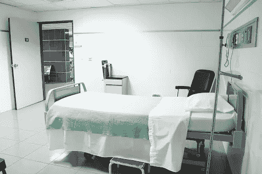
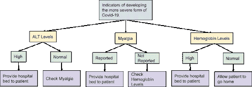
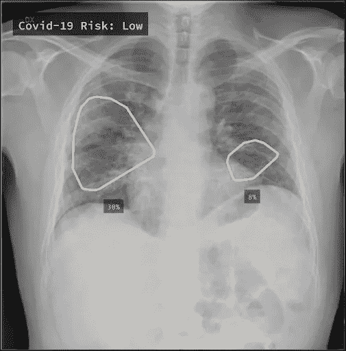

# 用人工智能对抗疫情

> 原文：<https://medium.datadriveninvestor.com/combatting-a-pandemic-with-ai-617bf3f7b0b0?source=collection_archive---------24----------------------->

在过去的六个月里，新冠肺炎疫情席卷了全世界，给生活的许多领域造成了巨大的破坏。然而，它也证明了技术在这种情况下是多么有用，以及它可以多么快地适应某些需求。具体而言，人工智能(AI)在通过预测模型抗击疫情、发现潜在治愈方法和处理医学成像方面发挥了重要作用。

# 预测模型

疫情期间使用的主要预测模型之一是预测模型，用于确定未来的热点、死亡人数和其他统计数据。

然而，在疫情期间创建的另一个有趣的人工智能模型能够**预测哪些新感染的患者将发展成与新冠肺炎相关的严重呼吸系统疾病**。这个模型的最初目的是根据疾病的严重程度，潜在地预测哪些病人需要病床，哪些不需要。

该模型用于预测的主要指标包括:

*   一种叫做丙氨酸氨基转移酶(ALT)的肝酶水平的变化。较高水平的 ALT 与更严重形式的新冠肺炎有关。
*   报告的肌痛(肌肉疼痛)。这与体内较高的炎症有关，炎症可由新冠肺炎在肺部引起。
*   血红蛋白水平(一种允许血细胞向组织运送氧气的蛋白质)。较高的血红蛋白水平与更严重的新冠肺炎有关。

**模型使用决策树来分析数据**。决策树是一种工具，可用于支持模型做出的最终决策。它们包括可能做出的决策，以及基于这些决策的结果。下图根据所使用的指标，显示了此预测模型所使用的决策树。

这种方法允许模型预测医生做出的哪些选择会导致不好的结果。使用医生做出的决定以及基于这些决定产生的结果来训练该模型。

 [## 人工智能和监督资本主义|数据驱动的投资者

### 大科技，总是现在:人工智能推动的大科技，已经使购物，搜索，在你的…

www.datadriveninvestor.com](https://www.datadriveninvestor.com/2020/03/04/on-artificial-intelligence-and-surveillance-capitalism/) 

随着这些指标与其他指标一起使用，该模型在预测哪些患者将因新冠肺炎而病情加重时，能够有 80%的准确率**。要了解关于这款车型的更多信息，请点击[此处](https://www.sciencedaily.com/releases/2020/03/200330152135.htm)阅读研究报告！**

# **发现治疗方法**

****

**自疫情开始以来，另一个一直困扰世界的话题是何时能找到治疗方法。人工智能最广为人知的用途之一包括药物发现，人工智能也被用于尝试发现新冠肺炎的治疗方法。如果你想了解更多关于人工智能和药物发现的知识，请点击这里查看我的文章。**

**用于发现新冠肺炎治疗方法的软件是由一家名为 [BenevolentAI](https://www.benevolent.com/) 的公司开发的。使用的算法类似于搜索引擎使用的算法。他们将制药行业的数据与部分研究论文结合起来，以发现潜在的治疗方法。使用机器学习从研究论文中提取部分，以确定哪些信息可能是有用的。此外，该算法能够从能够阻断病毒感染过程的批准药物中进行搜索。**该软件确定的一种潜在疗法是 Baricitinib，**用于治疗类风湿性关节炎。这种药也许能减轻新冠肺炎最严重的副作用。预计 Baricitinib 可以降低病毒感染肺细胞的能力。为了了解更多关于这种模型的信息，该公司已经发表了三篇关于这种药物的研究论文，可以在这里找到[，在这里](https://www.embopress.org/doi/full/10.15252/emmm.202012697)找到[，在这里](https://www.thelancet.com/journals/laninf/article/PIIS1473-3099(20)30132-8/fulltext)[找到](https://www.thelancet.com/journals/lancet/article/PIIS0140-6736(20)30304-4/fulltext?rss=yes#articleInformation)。**

# **医学成像**

****

**使用人工智能对抗疫情的另一个关键方面包括使用人工智能处理医学成像。一个很好的例子包括由 [Qure.ai](http://qure.ai/covid.html) 创建的名为 qXR 的人工智能工具，这是一家使用人工智能模型从肺部扫描中检测疾病迹象的初创公司。当疫情开始时，Qure.ai 能够使用患者的日常肺部扫描来调整 qXR，以监测新冠肺炎的进展。该模型能够**检测由疾病引起的肺炎的进展，并且能够估计受肺炎影响的肺部的百分比**。**

**模型使用的指标包括:**

*   ****毛玻璃混浊(GGO)****

**ggo 是一种模糊的不透明物，出现在扫描中，可以表明肺部充盈。**

*   ****合并****

**肺实变是指肺部通道充满液体而不是空气。**

*   ****肺实质中的病变定位****

**该模型能够在一分钟内定位由新冠肺炎(肺部圆形或椭圆形生长)引起的病变。**

**这项技术已经在全球 50 个地方使用，包括英国、印度、意大利、墨西哥和巴基斯坦。**

# **关键要点**

*   **人工智能已经能够通过预测建模、使用人工智能进行药物发现和处理医学成像来帮助抗击疫情。**
*   **人工智能已经被用来预测哪些新感染的病人将发展成更严重的新冠肺炎病毒。**
*   **BenevolentAI 创建了一个人工智能模型，以确定新冠肺炎的潜在治疗方法。**
*   **人工智能模型发现了一种叫做 Baricitinib 的药物，它可能能够减轻新冠肺炎的严重影响。**
*   **Qure.ai 使用人工智能处理肺部图像，以监测新冠肺炎引起的肺炎的进展。**

**总的来说，疫情突出了这样一个事实，即技术对于困难的情况是非常必要的，并且可以用来拯救生命。请在下面留下你对使用人工智能对抗新冠肺炎的看法！你听说过人工智能在对抗疫情方面的其他用途吗？**

***原载于 2020 年 7 月 1 日*[*【https://www.datadriveninvestor.com】*](https://www.datadriveninvestor.com/2020/07/01/combatting-a-pandemic-with-ai/)*。***

## **访问专家视图— [订阅 DDI 英特尔](https://datadriveninvestor.com/ddi-intel)**