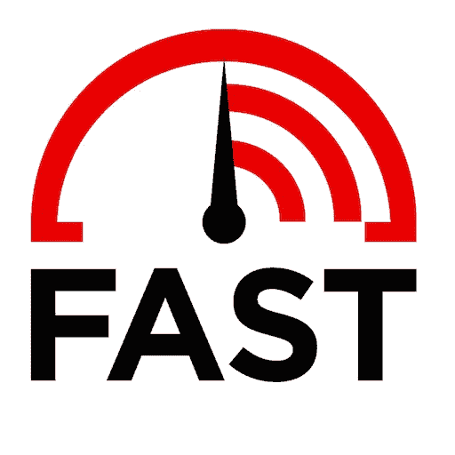
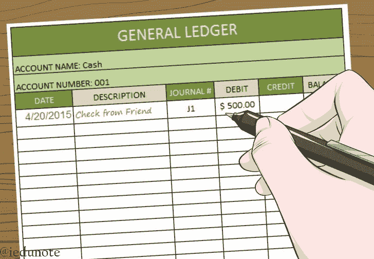
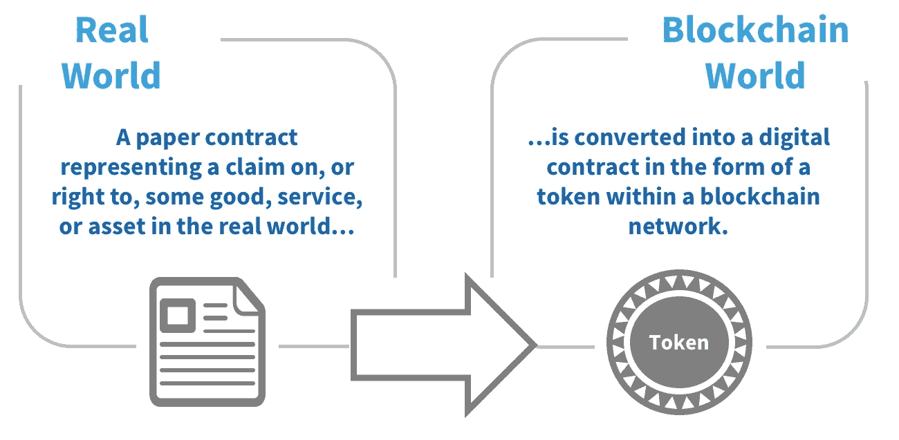

# 将法律法规与区块链技术相结合(带音频)

> 原文：<https://medium.datadriveninvestor.com/combining-law-and-regulations-with-blockchain-technology-f037b791e3b3?source=collection_archive---------12----------------------->

法律界一直不愿意现代化。区块链有助于为法律行业提供更好的可访问性、问责制、成本节约、速度、可靠性和数据完整性。如果我说的是我的国家印度，那么印度的司法系统被认为运行效率很低，因为需要数年时间才能做出判决。虽然司法系统通常被归咎于律师甚至法官，但它也经常因拒绝判决而受到指责。印度的司法系统被认为运行良好，但是决策非常非常缓慢。当需要几年才能做出决定时，速度很慢。虽然司法系统普遍受到批评，但检察官甚至法官也可以推迟判决。同样，亚洲的许多国家也是如此。如果我们谈论发达国家，他们可能很快，但病例太多了。
财产盗窃是印度最大的问题之一。花黑钱的主要来源之一是房地产交易。将房产保留在他人名下是最常见的做法。

需要一个更快的系统。

# **区块链将如何革新这个领域？**

对区块链赢得如此多赞赏的原因的解释是:

1.  它不属于一个单一的机构，因此是分散的。
2.  在中，数据以加密方式存储。
3.  区块链是永久的，所以没有人可以改变区块链内的信息。
4.  区块链是透明的，如果他们想监控细节

律师将使用区块链技术来简化、自动化和数字签署法律文件。法律协议可以保持不变。使用脚本文本、智能合同和电子合同管理减少了规划、个性化和保存传统法律文档所需的时间。客户赢得这些折扣。区块链还通过降低客户的复杂性和削减高昂的法律费用，实现了诉诸法院的民主化。

分布式分类帐基础结构为交易双方提供一个公共分类帐。没有悬念，没有曲解的空间，区块链相关的合同已经固化执行。相比之下，非技术人员最容易理解他们签订的合同以及智能合同所代表的内容。
许多行政活动可以电子化，大大减少了撰写和修改法律文件的时间。这种溢价一般会转嫁到消费者身上，消费者每小时向律师收取天文数字的费用。提高和降低交易双方的交易成本将会产生智能合约。例如，一个经济的算法可以自动和透明地处理一小部分人工费用的托管账户。对法律服务的总体需求和可获得性将提高较低的价格。

令牌化是将资产的权利转换为数字令牌的过程。感兴趣的各方可以在支持智能合约的平台上发行代币，智能合约允许在交易所购买和出售此类代币。这一点，加上知识产权和微交易，开启了一个创造者可以标记和合法出售其部分财产的世界。

***A DAO 是一个去中心化的自治机构，其电子决策通过代码或支持者投票的方式做出。***Dao 创建可扩展的、无边界的在线协作，并被用于组织赠款和资助公共产品。因此，为 Dao 提供适当的合法包装是必不可少的。

希望你喜欢。

希望得到积极的回应。

请关注我的@Medium 简介 [Yash Kamal Chaturvedi](https://yashkamalchaturvedi.medium.com/)