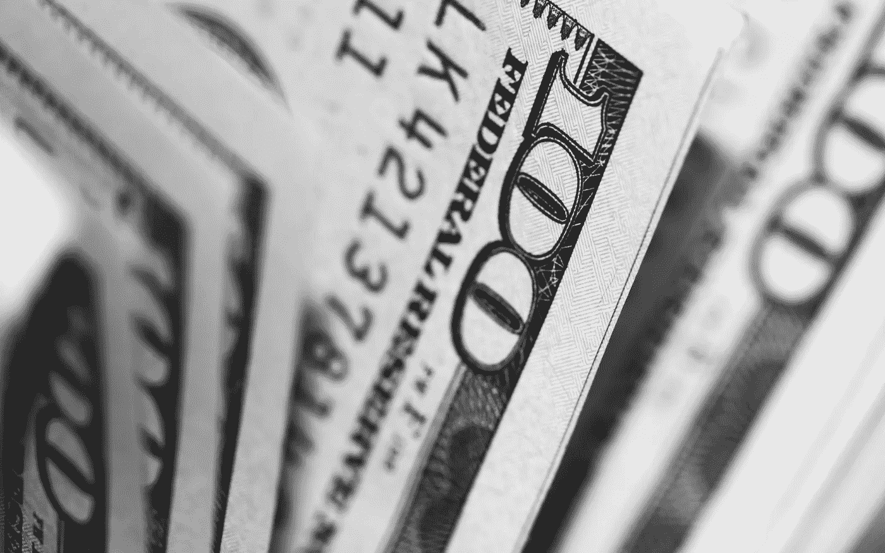
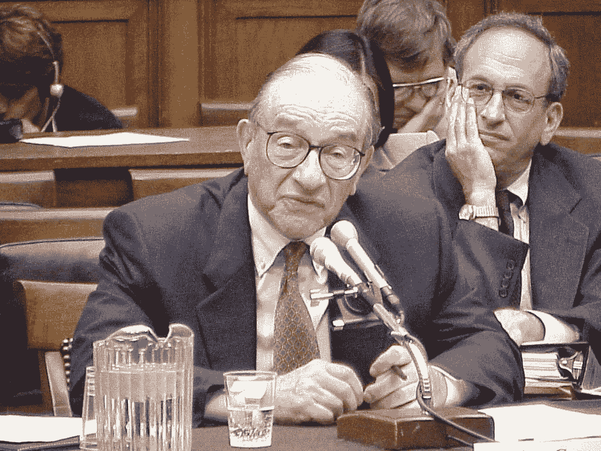

# 即将来到美国:令人难以置信的缩水储蓄账户

> 原文：<https://medium.datadriveninvestor.com/coming-soon-to-america-the-incredible-shrinking-savings-account-2b56c92f2f45?source=collection_archive---------6----------------------->

​Coming Soon To America: The​ Incredible Shrinking Savings Account

大多数地方的储户日子都不好过，但丹麦的情况更糟。

在这个斯堪的纳维亚国家，一些储户必须付钱给银行来保管他们的钱，而不是相反。更糟糕的是，这种奇怪的现象迟早会出现在美国。

以下是你需要知道的。

欧洲已经充斥着提供负利率的政府债券，包括德国和丹麦的政府债券。这意味着当你购买丹麦政府债券时，到期时你得到的回报比你支付的要少。

# 你的银行账户会吃掉你的存款

一只两年期丹麦债券最近向投资者提供了负 0.8%的年收益率。这意味着每年你持有的证券会损失 0.8%的资金。这相当于每年每 100 美元中有 80 美分。

显而易见的是抛弃债券，在存款账户中持有现金，对吗？即使零利率也不会让你付出代价。

根据最近的一份报告，丹麦银行决定，任何存款超过大约 100，000 美元的人将被收取费用，以将他们的钱留在银行[。](https://finance.yahoo.com/news/banks-just-changed-rules-negative-040000108.html?guccounter=1)

如果你不住在丹麦或者没有 10 万美元现金，那么到目前为止这可能不是问题。

但是现在还不要指望你的祝福。即使你住在美国，也有理由非常担心你现金的安全。

# 反向罗宾汉

首先，丹麦的门槛可能会进一步降低，这意味着即使是中等收入的人也会看到他们的储蓄每年都在缩水。简单来说，现金不足对你帮助不大。

请这样想:即使是英国强盗罗宾汉也只偷富人的东西。如果丹麦收取利息的门槛余额进一步下降，那就像罗宾汉抢劫穷人一样。

其次，没有任何迹象表明负利率最终不会降临美国。

Public domain

本月早些时候，美联储前主席艾伦·格林斯潘异常明确地表示，负利率迟早会降临美国。

“你在世界各地都能看到这种情况。这在美国只是时间问题，”他告诉[有线电视网美国消费者新闻与商业频道](https://www.cnbc.com/2019/09/04/alan-greenspan-says-its-only-a-matter-of-time-before-negative-rates-spread-to-the-us.html)。

这意味着你存下来的那些用于紧急情况下帮助你的便士会在你挣到的那一刻开始缩水。把它想象成试图爬上下行扶梯的金融版本。你必须跑得比平时更快才能取得任何进展。

至于储蓄，如果银行提供负利率，你的存款越多，你就越难阻止存款余额的减少。

第三，也许是最令人担忧的，负利率无助于经济。他们反其道而行之，伤害了它。

学者们研究了当瑞典央行(相当于美联储)使用负利率时，瑞典经济发生了什么。不太好。

我之前为《福布斯》写过这个。

教授们发表的报告的关键发现是，负利率损害了瑞典经济。这是我当时写的文章中的一个关键段落:

> “[……]我们表明，负政策利率充其量是无关紧要的，但由于对银行利润的负面影响，它可能具有收缩性，”这篇题为“负名义利率和银行贷款渠道”的论文由哈佛大学、布朗大学和挪威银行的研究人员撰写。作者包括劳伦斯·萨默斯，美国前财政部长，曾任哈佛大学校长。

换句话说，负利率不仅有可能让你的银行存款缩水，还可能让经济缩水。

因此，当中央银行(美联储或欧洲中央银行)将利率降至零以下，吃掉你的储蓄时，你也更有可能失业。

上面描述的场景看起来像一场噩梦，更糟糕的是它可能会发生。

*本文为* [*原载于 2019 年 9 月 24 日 Forbes.com*](https://www.forbes.com/sites/simonconstable/2019/09/24/coming-soon-to-america-the-incredible-shrinking-savings-account/#bb2e1ba375b2)*。*