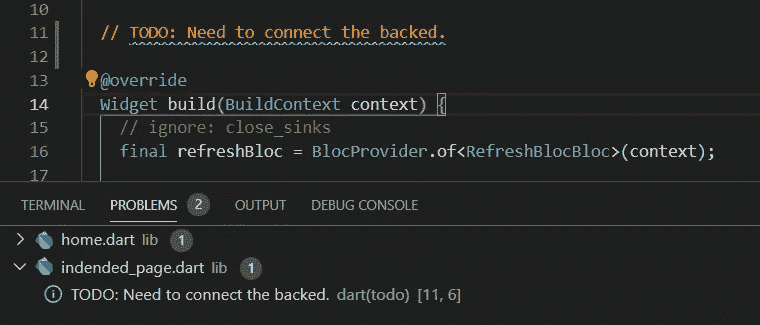

# /*评论，为什么要做？*/

> 原文：<https://medium.datadriveninvestor.com/commenting-why-should-we-do-it-8a3a0dee57fc?source=collection_archive---------22----------------------->

credit: unsplash.com

不管你是专家还是初学者，注释是每个程序员都应该遵循的好习惯👩‍💻👨‍💻。今天我们来讨论一下什么是评论，为什么要评论，怎么评论。在这篇文章的结尾，我有一个复活节彩蛋🥚你可能会觉得有趣和有用🤗。

# **//❓在评论什么🤷‍♀️**

根据犹他大学计算学院发表的一篇文章[1]，“**注释是用*高级*英语语句描述你的程序将要做什么的*艺术*。**“注释是程序中特别标注的不被求值的文本。

一般来说，有两种类型的评论。他们是，

**1。//单行注释**

顾名思义，这些评论只有一行。下面给出了单行注释的示例。

**2。/*块注释*/**

这些是跨越多行的注释。下面给出了块注释的示例。

# **//我们为什么要评论❓🤔**

现在，我想你已经对注释有了一个基本的了解，所以让我们继续理解注释的重要性，以及为什么我们在编码的时候应该这样做。

1.  注释的主要原因是它会使你的代码对别人和你自己来说更可读和更容易理解。如果你在一个团队项目中工作，或者在一家 IT 公司工作，许多其他开发人员也在同一个项目中工作。注释对于那些开发人员更好地理解你的代码及其背后的逻辑是非常有帮助的。
2.  给你的代码加注释可以帮助你或者其他开发人员更容易地理解程序，他们以后会调试或者编辑你的代码。如果你在 IT 公司工作，这一点很重要。此外，它可能有助于你在 GitHub 的公共库获得更多的克隆和明星。
3.  一些编程语言很难理解(例如。Glass 编程语言[2])，所以如果你使用这些神秘的编程语言中的一种进行开发，**注释你的代码会帮助你快速而容易地传达它的意思。**

 [## 我作为软件工程师学会的 4 个关键习惯|数据驱动的投资者

### 我从事软件工程已经快 3 年了。老实说，我不认为我擅长这个(我不知道我会不会…

www.datadriveninvestor.com](https://www.datadriveninvestor.com/2020/10/12/4-key-habits-i-learned-as-a-software-engineer/) 

# **//我们应该如何评价❓🧐**

现在我们知道了什么是注释，以及注释在软件项目中的重要性。让我们讨论一些我们在评论时应该遵循的最佳实践。

1.  永远保持你的评论简单易读。
2.  **一直以来，边编码边尝试注释。**因为在你完成编码后，仅仅为了评论就要回去做很多工作。但是如果你能在编码的时候发表评论，那么一切都会在你的脑海中记忆犹新。
3.  **如果你在某件事情上卡住了，或者你不能完成给你的程序添加一些特性，添加一个“*TODO”*评论。**它会显示在 IDE 的错误/问题部分，这样您就不会忘记它。稍后，您可以从您停止的地方轻松地继续。

# **//复活节彩蛋🥚🐇**

在结束之前，正如我在开始时所承诺的，我将与你们分享那个复活节彩蛋。这对开发者来说会更有用👨‍💻👩‍💻他们使用 VS 代码作为 IDE。在 VS 代码中，有一个插件叫做 ***更好的注释***【3】帮助开发者更轻松高效的注释。

# **//结论✌**

这是文章的结尾。如果我有任何错误，请在下面添加评论。如果你觉得这篇文章有用，请随意与你的朋友和同事分享😇。

谢谢大家，编码快乐！👩‍💻👨‍💻注意安全。👨‍⚕️👩‍⚕️

## //资源

[1][https://www . cs . Utah . edu/~ germain/PPS/Topics/Commenting . html #:~:text = Commenting % 20 涉及% 20 放置% 20 人% 20 可读，即% 20 其他% 20 人% 20 将% 20 使用](https://www.cs.utah.edu/~germain/PPS/Topics/commenting.html#:~:text=Commenting%20involves%20placing%20Human%20Readable,that%20other%20people%20will%20use)。

[2][https://esolangs.org/wiki/Glass](https://esolangs.org/wiki/Glass)

[3][https://marketplace.visualstudio.com/items?itemName = aaron-bond . better-comments](https://marketplace.visualstudio.com/items?itemName=aaron-bond.better-comments)

[4][https://www . c-sharp corner . com/blogs/why-comments-is-important-while-writing-a-code](https://www.c-sharpcorner.com/blogs/why-comments-are-important-while-writing-a-code)

[5][https://cacm . ACM . org/blogs/blog-cacm/225574-why-code-comments-still-matter/full text](https://cacm.acm.org/blogs/blog-cacm/225574-why-code-comments-still-matter/fulltext)

**访问专家视图—** [**订阅 DDI 英特尔**](https://datadriveninvestor.com/ddi-intel)